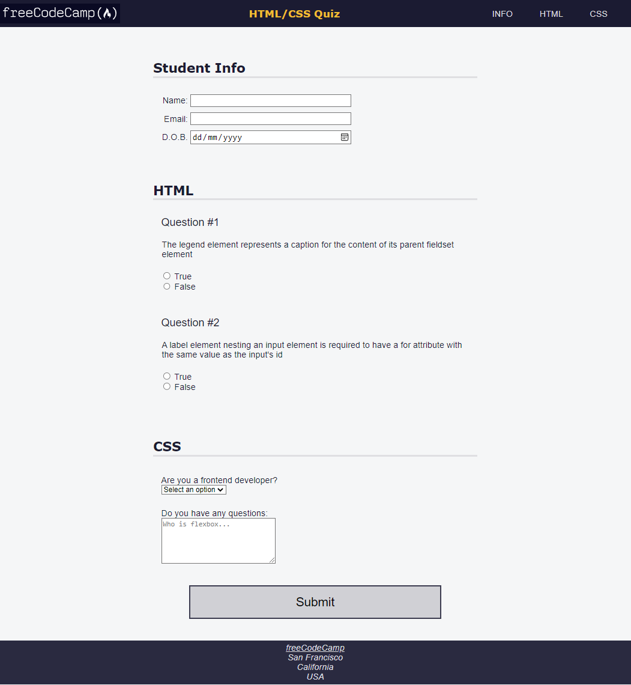

## Project 8: Learn Accessibility by Building a Quiz

In this project, I attempt to replicate the quiz which was part of freeCodeCamps Responsive Web Design Certification ([link](https://www.freecodecamp.org/learn/2022/responsive-web-design/learn-accessibility-by-building-a-quiz/step-67))

The logo used in this project is from: https://cdn.freecodecamp.org/platform/universal/fcc_primary.svg

You can preview the rendered HTML [here](https://htmlpreview.github.io/?https://github.com/shivkumar98/FreeCodeCamp-Projects/blob/main/01-Responsive%20Web%20Design/02-CSS%20Flexbox/04-Learning%20Accessibility%20by%20Building%20a%20Quiz/V1/HTML%20CSS%20Quiz.html)

I will attempt to replicate the HTML and CSS as seen below:

