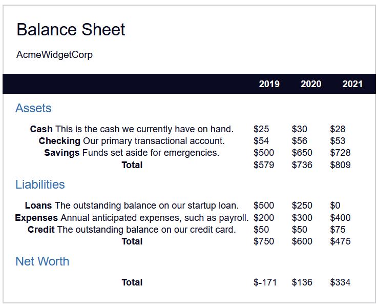

# Project 9: Learn More About CSS Pesudo Selectors By Building A Balance Sheet

This is the 9th tutotorial from FreeCodeCamp's (New) Responsive Web Design Certificate: (https://www.freecodecamp.org/learn/2022/responsive-web-design/learn-more-about-css-pseudo-selectors-by-building-a-balance-sheet/step-54)

In this tutorial, I will attempt to recreate the following:

## Notes:

1) The **aria-hidden** property removes an element from the accessibility tree

2) We can target elements which has a class assigned to it using class~="class-name", this targets elements whose class ATLEAST CONTAINS "class-name". 

     E.g. **span[class~="sr-only"]**

3) **span[class]** will target ANY span whos class is set

4) **:first-of-type** is a pseudo-selector which targets the first element prefixed by this selector

    E.g. span:first-of-type will target the first span element

5) **:last-of-type** targets the last element

6) **border-collapse** is a property whicdh determines whether borders are seperated (seperatet) or collapsed into itself (collapse)

### HTML Tables
A table in HTML is encapsulatred by the &lt;table>&lt;/table> tags 

The header portion of the table is wrapped within &lt;thead>&lt;/thead> tags