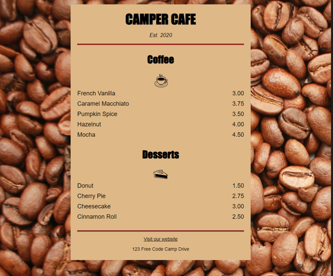

## Project 1: Building a Cafe Menu 

I will attempt to recreate the HTML that I generated for the second project of the (New) Responsive Web Design.

The images used for this project include:
* Coffee-beans: https://cdn.freecodecamp.org/curriculum/css-cafe/beans.jpg
* Coffee icon: https://cdn.freecodecamp.org/curriculum/css-cafe/coffee.jpg
* Pie icon: https://cdn.freecodecamp.org/curriculum/css-cafe/pie.jpg

The end-result of this project:  

