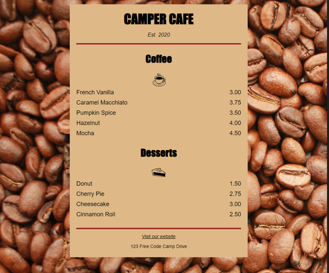

## Project 1: Building a Cafe Menu 

I will attempt to recreate the HTML that I generated for the Cafe Menu project of the Responsive Web Design freecodecamp certification (https://www.freecodecamp.org/learn/2022/responsive-web-design/learn-basic-css-by-building-a-cafe-menu/step-1). 

**The rendered HTML can be previewed [here](https://htmlpreview.github.io/?https://github.com/shivkumar98/FreeCodeCamp-Projects/blob/main/01-Responsive%20Web%20Design/01-HTML%20and%20CSS%20Basics/01-Building%20a%20Cafe%20Menu/V1/Cafe%20Menu.html):** 

The images used for this project include:
* Coffee-beans: https://cdn.freecodecamp.org/curriculum/css-cafe/beans.jpg
* Coffee icon: https://cdn.freecodecamp.org/curriculum/css-cafe/coffee.jpg
* Pie icon: https://cdn.freecodecamp.org/curriculum/css-cafe/pie.jpg

The intended result of this project is here:

