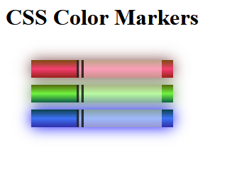

# Project 2: Building a Set of Coloured Markers

I will recreate the second project for [freeCodeCamp's Responsive Web Design Certifiicate](https://www.freecodecamp.org/learn/2022/responsive-web-design/learn-css-colors-by-building-a-set-of-colored-markers/)

**You can view pre-rendered HTML [here](https://htmlpreview.github.io/?https://github.com/shivkumar98/FreeCodeCamp-Projects/blob/main/01-Responsive%20Web%20Design/01-HTML%20and%20CSS%20Basics/02-Building%20a%20Set%20of%20Coloured%20Markers/V1/Colour%20Markers.html)**

The end-result I am trying to replicate is:

