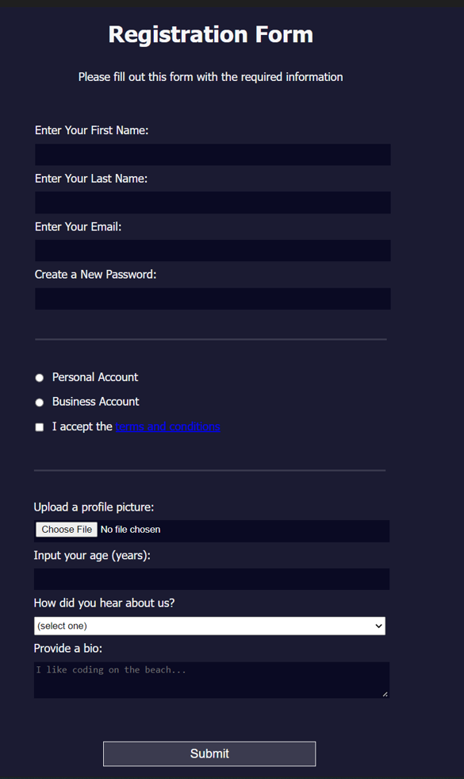

# Project 3: Building a Registration Form

I will attempt to recreate the end result of freecodeacdemy's third project (https://www.freecodecamp.org/learn/2022/responsive-web-design/learn-html-forms-by-building-a-registration-form/)

The page I am attempting to replicate is:

