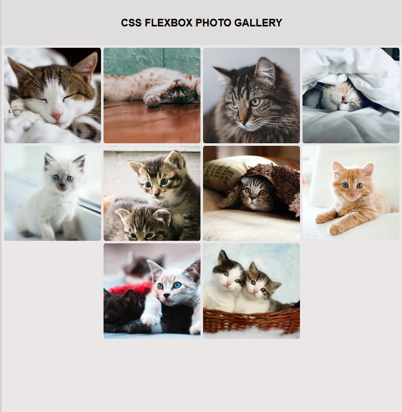
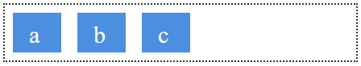
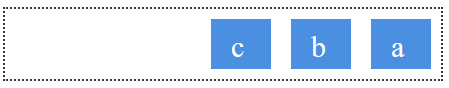
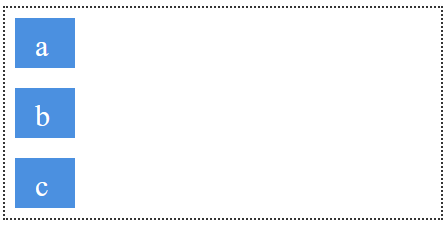
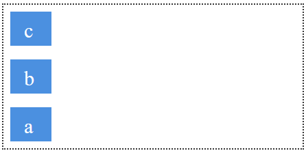
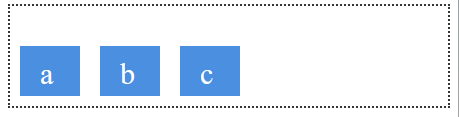
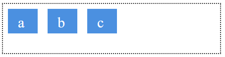

# Project 6: Learn CSS Flexbox Building a Photo Gallery

In this project, I will attempt to recreate the Rothko Painting project seen below:

---

## Notes:
- **box-sizing** property allows us to set total width to include both the padding and border when box-sizing is set to border-box

## Flexbox Notes:
### **What is Flexbox?**
Flexbox was designed as a one dimensional layout model, its a method which offers spaced distribution between items

### **The Two Axes of Flexbox**

There are 2-axes for flexbox, a main axis and cross axis

### **Flex-Direction**
The flex-direction property is the main direction of flexbox. This determines whether the items in the flexbox go horizontally (row) or vertically (column).

The **Flex-direction has 4 possible values**:

1) row (default)
2) row-reverse
3) column
4) column reverse

- row:

    

- row-reverse:

    

- column

    

- column-reverse

    

### **Cross Direction**
This is the **perpendicular direction of the Flex-direction**

### **Start and End Lines**
If the flex direction is row then the start line will be on the LHS and end line will be on RHS as shown below:

### The Flex Container

The div or element which used flexbox is called the **flex container**. A flex container has the display property set to "flex" or "inline-flex"

### **Allignment, Justification and Distribution of Space**

Flebox's key feature is the ability to align and justify content on thye main and cross axes. The following properties can be applied to the flex container

#### **align-items**
The align elements property lets us align elements on the **cross axis**

Suppose we wanted to align the items towards the end of the column direction, we would set the align-items propery to **flex-end**:

The align-items's default value is **flex-start**:

