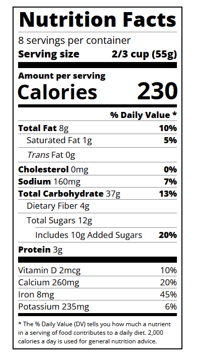

## Project 7: Building a Nutrition Label

View the prerendered HTML of my attempt [here](https://htmlpreview.github.io/?https://github.com/shivkumar98/FreeCodeCamp-Projects/blob/main/01-Responsive%20Web%20Design/02-CSS%20Flexbox/03-Building%20a%20Nutrition%20Label/V1/Nutrition%20Lable.html)

In this project, I will attempt to emulate the HTML/CCS seen below:

