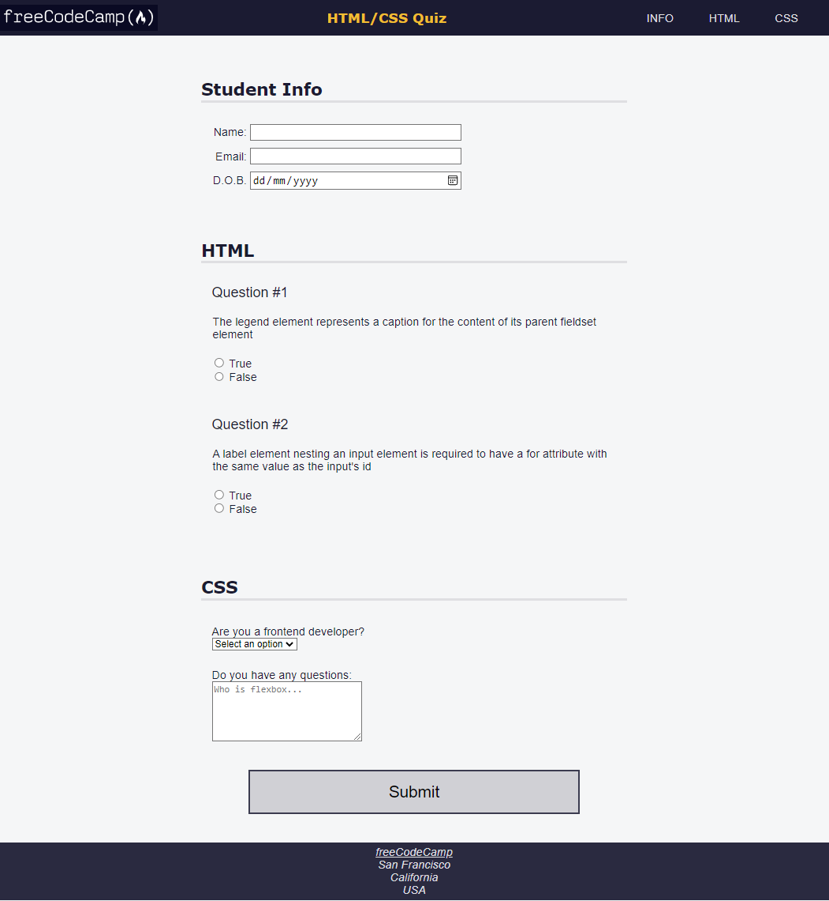

## Project 8: Learning Accessibility by Building a Quiz

The logo used in this project is from: https://cdn.freecodecamp.org/platform/universal/fcc_primary.svg

I will attempt to replicate the HTML and CSS as seen below:

