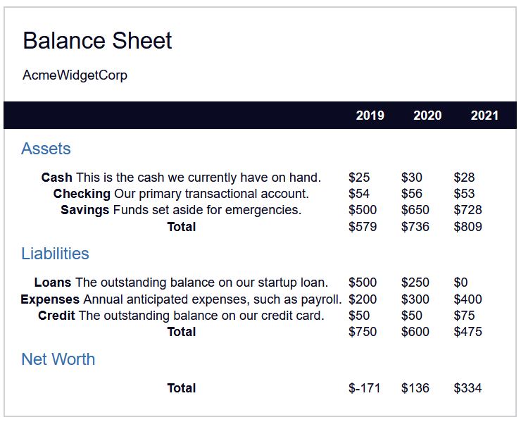

# Project 9: Learn More About CSS Pesudo Selectors By Building A Balance Sheet

This is the 9th tutotorial from FreeCodeCamp's (New) Responsive Web Design Certificate: (https://www.freecodecamp.org/learn/2022/responsive-web-design/learn-more-about-css-pseudo-selectors-by-building-a-balance-sheet/step-54)

In this tutorial, I will attempt to recreate the following:

