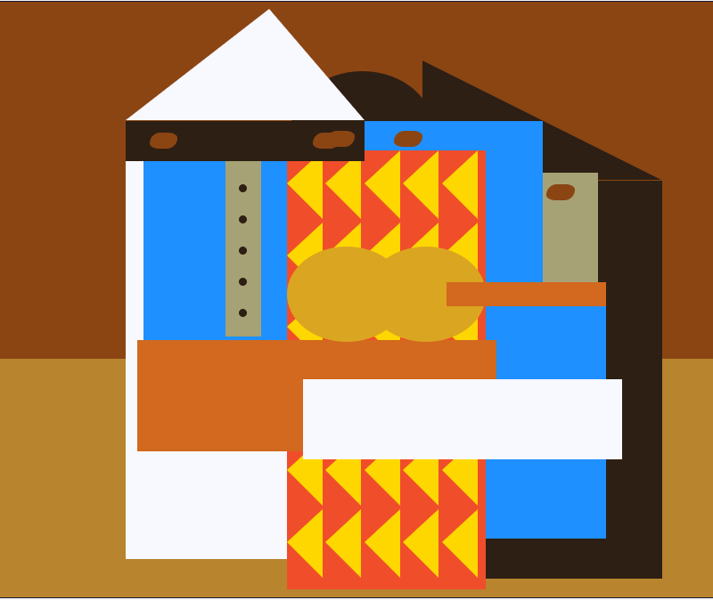

## Project 10: Learn Intermediate CSS by Building a Picasso Painting

This is the 10th project of freeCodeCamp's Responsive Web Design Certification:
https://www.freecodecamp.org/learn/2022/responsive-web-design/learn-intermediate-css-by-building-a-picasso-painting/step-1

I will attempt to recreate the HTML and CSS of the following:

