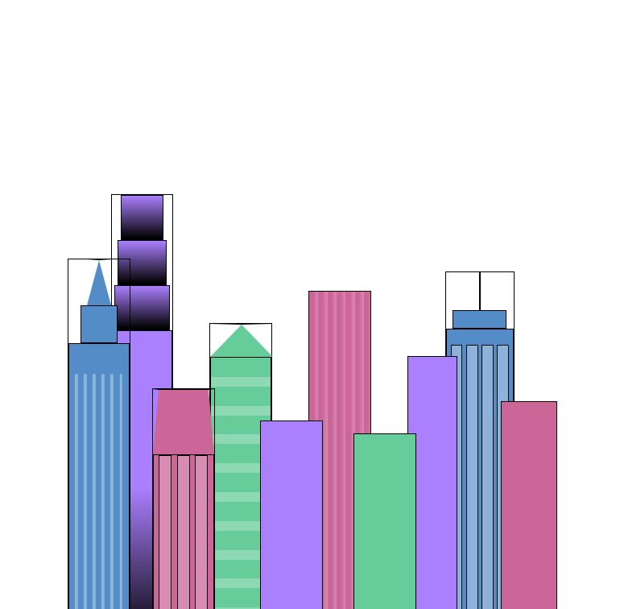

# Project 13: Learn CSS Variables by Building a Skyline
 
 In this project I will be replicating the following HTML and CSS:

 

 ## Note on CSS variables: 

- To declare a CSS variable, you need two dashes (--). E.g.:

        --buildingcolor: #999;

- To use a CSS variables as a property you write var() and insert the CSS variable name in the brackets, e.g.:

        background-color: var(--buildiing-color1);

- We can use setback values for the var function if there is a problem with getting the variable. E.g.:

        background-color: var(--buildiing-color1, green);

- In order to make CSS variables globally available we need to declare them in a :root selector which is the highest level of the style sheet

- You can applu gradients using the following syntax:

        background: linear-gradient(color1, color2);

        Note you can not use background-color with the linear gradient function

- You can use as many colours as you wish with linear-gradient, you can also specify where the transitions should start by specifying a percentage after the color

- We can get a solid colour change without transition by writing the following:
        
        linear-gradient(
                var(--first-color) 0%,
                var(--first-color) 40%,
                var(--second-color) 40%,
                var(--second-color) 80%
        );

- You can repeat a linear gradient pattern using repeating-linear-gradient(); E.g.:

        background: repeating-linear-gradient(
                var(--building-color2),
                var(--building-color2) 6%,
                var(--window-color2) 6%,
                var(--window-color2) 9%
        );

-- You can specify the direction of gradient by giving an angle as the first argument:

        gradient-type(
                direction,
                color1,
                color2
                );

      
---

## Progress of project

After completing step 45, the result of the HTML and CSS looked like:

 

After completing step 58:

 

After completing step 60:

After completing step 72:

After completing step 81:

After completing step 87:

After completing step 95:

