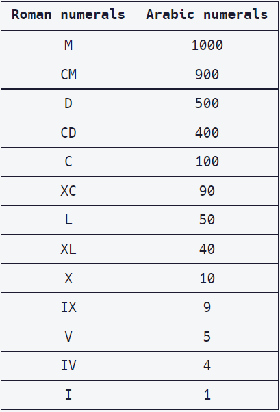

# Roman Numeral Converter

## Project Objectives:

* View my code [here](/02%20-%20Javascript%20Algorithms%20and%20Data%20Structures/10%20-%20JavaScript%20Algorithms%20and%20Data%20Structures%20Projects/2%20-%20Roman%20Numeral%20Converter/Roman%20Numeral%20Converter.js)

* Convert the given number into a roman numeral.

* All roman numerals answers should be provided in upper-case.

## Project Comments:

* This was a very challenging project which took several hours to complete

* I wrote several iterations to generalise majority of the code and use recursion