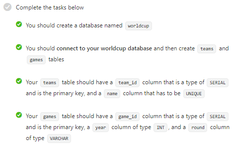

# 7: Build a World Cup Database [Certification Project]

- This is the second project which I need to complete in order to get the certification!

- I will create a Bash script which enters information from World Cup games into PostgreSQL and then squery the database for statistics.

## Instructions

- You are given a CSV file: games.csv which contains all games of final three rounds of World Cup since 2014. This file contains year, round, winner, opponent and number of goals each team scored.

- There are 3 parts to this project.

### Part 1: Create the Database

- Log in to psql and create database structure according to user stories below.

### Part 2: Insert the Data

- Complete the insert_data.sh script to insert all data from games.csv into the database.

- Tests have a 20s limit.

### Part 3: Query the Database

- Complete the empty echo commands in the queries.sh to produce results matching expected_output.txt

## User Stories:

* 1. Create a database named worldcup.
* 2. Connect to the wordlcup database and create the teams and games tables.
* 3. Teams table should have a team_id column that is SERIAL type and is primary key, and a name column which is UNIQUE.
* 4. Games table should have game_id column that is SERIAL type and is primary key, and a name column which is UNIQUE.
* 5. The games table should have winner_id and oppent_id foreign key columns which reference team_id from teams table.
* 6. The games table should have winner_goals and opponent_goals of type INT.
* 7. All columns should have NOT NULL constraint.
* 8. The  two .sh script files should have executeable permissions.
* 9. When you run your insert_data.sh script, it should add unique to the teams table. There should be 24 rows.
* 10. When you run insert_data.sh script, it should insert a row for each line in the games.csv file. There should be 32 rows filled with appropiate information.
* 11. Correctly complete the queries in queries.sh file. The output should match what is in the expected_output.txt file exactly.

## Project Commentary.

### Part 1: Create the Database

- Logged into postgreSQL:

        ~/project$ psql --username=freecodecamp --dbname=postgres

- Created worldcup database:

        postgres=> CREATE DATABASE worldcup;
        CREATE DATABASE

- Connected to database:

        postgres=> \c worldcup
        You are now connected to database "worldcup" as user "freecodecamp".#

- Created teams table:

        worldcup=> CREATE TABLE teams(team_id SERIAL PRIMARY KEY NOT NULL, name VARCHAR(50) UNIQUE);
        CREATE TABLE

- Created games table:

        worldcup=> CREATE TABLE games(game_id SERIAL PRIMARY KEY NOT NULL, year INT NOT NULL, round VARCHAR NOT NULL);
        CREATE TABLE

- Now the first 4 tests pass:

    

- Added foreign key columns to games table:

        worldcup=> ALTER TABLE games ADD COLUMN winner_id INT references teams(team_id);
        ALTER TABLE
        worldcup=> ALTER TABLE games ADD COLUMN opponent_id INT references teams(team_id);
        ALTER TABLE

- Fifth test now passes:

    
    
- Added winner_goals and opponent_goals to the games table:

        worldcup=> ALTER TABLE games ADD COLUMN winner_goals INT NOT NULL;
        ALTER TABLE
        worldcup=> ALTER TABLE games ADD COLUMN opponent_goals INT NOT NULL;
        ALTER TABLE

- The 6th test now passes:

    

- I forgot the non-null requirement for all columns so altered the games and teams tables:

        worldcup=> ALTER TABLE games ALTER COLUMN winner_id SET NOT NULL;
        ALTER TABLE   
        worldcup=> ALTER TABLE games ALTER COLUMN opponent_id SET NOT NULL;
        ALTER TABLE
        worldcup=> ALTER TABLE teams ALTER COLUMN name SET NOT NULL;
        ALTER TABLE

- The seventh test now passes:

    

