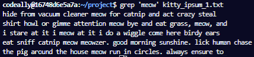
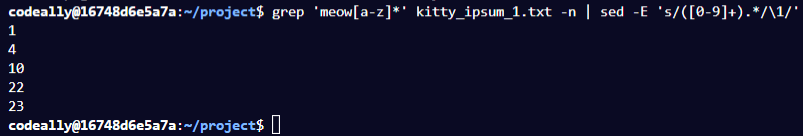

# 8: Learn Advanced Bash by Building a Kitty Ipsum Translator

 

## 1 Standard Output and Standard Error

- You can redirect the output of a command to a file using >

- I printed hello bash to a file:

        ~/project$ echo hello bash > stdout.txt

- Using a single > will create and overwrite the file with the command, a double >> will append to a file.

        ~/project$ echo hello bash >> stdout.txt

- The stdout.txt file looks like:

    

- If I execute this command:

        ~/project$ echo hello bash > stdout.txt

- Then the file is overwritten:

    

- We can empty the file by redirecting no command:

        ~/project$ > stdout.txt

  ### **Redirecting Unsuccessful Commands to File**

- If you try to redirect an incorrect command to a file, nothing is printed:

        ~/project$ bad_command > stderr.txt
        bash: bad_command: command not found

  ### **stdout and stderr**

- There are 2 types of outputs for a command:

1) stdout - Successful Output 
2) stderr - Unsuccessful Output 

- Both of these will print to the terminal by default

  ### **Printing stderr Output**

- In order to print the output of an unsuccessful command, you must prepend the redirect symbol with 2:

~/project$ bad_command 2> stderr.txt

- The stderr.txt file looks like:

- You can use 1> to redirect stdout which is used by default:

~/project$ echo hello bash 1> stdout.txt 

 

## **2 Standard in: stdin**

- stdin is used to read information, usually from the keyboard.

- In order to read input from the keyboard, you use the READ keyword:

        ~/project$ read NAME
            shiv

  ### **Redirection: Reading input from a File**

- We can use redirection to read data from a file.

- E.g, if we wanted to READ a name variable using name.txt which contains the text "freeCodeCamp", then we execute the following:

        ~/project$ read NAME < name.txt 

- If we echo the NAME variable, it prints:

        ~/project$ echo $NAME
            freeCodeCamp

  ### **Pipe Command**

- The pipe symbol instructs to use the output from one command as the input of another

- E.g., we can echo a command into a read command:

    ~/project$ echo Shiv | read NAME

- If I echo the name variable, it prints freeCodeCamp:

        ~/project$ echo $NAME
            freeCodeCamp

- When using the pipe, it is using another terminal instance. Hence the commands are being executed in isolation!

  ### Cat Command

- The cat command is used to display the contents of a file:

        ~/project$ cat name.txt
            freeCodeCamp

 

## **3 Example Script**

- I created a script which reads name and prints it out, along with a unsuccessful command:

    

- Instead of giving the stdin after executing the scipt, we can use pipe to set it beforehand:

        ~/project$ echo Shiv | ./script.sh
            Hello Shiv
            ./script.sh: line 4: bad_command: command not found

- We can redirect the stdout and stderr to files in one command:

        ~/project$ echo Shiv | ./script.sh 2> stderr.txt > stdout.txt 

- The stdout.txt and stderr.txt files look like

    

- We can use redirection to give the stdin from a text file:

        ~/project$ ./script.sh < name.txt 2> stderr.txt 
            Hello freeCodeCamp

 

## 4 Kitty Ipsum Translator:

- I will write a small script to translate 2 text files into doggy ipsum.
- I have 2 kitty_ipsum files:

1. kitty_ipsum_1.txt:

    

2. kitty_ipsum_2.txt:

    

   ### Wordcount Command: wc

- The wc keyword can be used to get wordcount of a file

- I display the manual for wc:

    

- I display number of lines using -l flag:

        ~/project$ wc kitty_ipsum_1.txt -l
            27 kitty_ipsum_1.txt

- Number of words, using -w flag:

        ~/project$ wc kitty_ipsum_1.txt -w
            332 kitty_ipsum_1.txt

- Number of chracters using -m flag:

        ~/project$ wc kitty_ipsum_1.txt -m
            1738 kitty_ipsum_1.txt

- Using no flags:

        ~/project$ wc kitty_ipsum_1.txt
            27  332 1744 kitty_ipsum_1.txt

- The last value is byte count, and is larger than character count as a character can have multiple bytes.

  ### **sed Command**

- The sed command is used to replace text. By default it will output stdout.

        sed 's/<pattern_to_replace>/<text_to_replace_it_with>/' <filename>

- E.g., replaceing 'r' with 2 in name.txt:

        ~/project$ sed 's/r/2/' name.txt
            f2eeCodeCamp

- Replacing the word Free with f233:

        ~/project$ sed 's/free/f233/' name.txt
            f233CodeCamp

- Replacing freecodecamp with f233C0d3C@mp:

        ~/project$ sed 's/freecodecamp/f233C0d3C@mp/' name.txt
            freeCodeCamp

- It did not replace anything due to casing. We can use the ig to make the match global and case insentive:

        ~/project$ sed 's/freecodecamp/f233C0d3C@mp/i' name.txt
            f233C0d3C@mp

- We can redirect the input without affecting the file:

        ~/project$ sed 's/freecodecamp/f233C0d3C@mp/i' < name.txt
            f233C0d3C@mp

  ### **grep command**

- The grep command is used for searching patterns in text. 

- E.g., executing grep with parameter 'meow', it will display all lines containing the word 'meow':

    

- We can use the --color flag, to highlight the matches:

    

- The -n flag can be used to display line number:

    

- We can also use grep with regex! E.g., here is all the sentences which contain a word beginning with meow:

    

- We can count number of line matches of a regx, using ther -c flag:

        ~/project$ grep 'meow[a-z]*' kitty_ipsum_1.txt -c
            5

- The -o flag will place matches on their own lines:

    

- We can then pipe that into a wc command for number of lines:

        ~/project$ grep 'meow[a-z]*' kitty_ipsum_1.txt -o | wc -l
            7

 

## **5 Information about kitty_ipsum_1.txt**

- I first get infromation about kitty_ipsum_1.txt

  ### **Title, number of lines, words and characters:**

- Add title:

        ~/project$ echo "~~ kitty_ipsum_1.txt info ~~" > kitty_info.txt

- Number of lines:

      mkitty_info.txt 

        ~/project$ cat kitty_ipsum_1.txt | wc -l >> kitty_info.txt

- Number of words:

        ~/project$ echo -e "\nNumber of words:" >> kitty_info.txt 

        ~/project$ cat kitty_ipsum_1.txt | wc -w >> kitty_info.txt

- Number of characters:

        ~/project$ echo -e "\nNumber of characters:" >> kitty_info.txt

        ~/project$ wc -m < kitty_ipsum_1.txt >> kitty_info.txt

  ### **Number of times meow or meower appears and their lines:**

- Number of times meow or meower appears:

        ~/project$ echo -e "\nNumber of times meow or meowzer appears:" >> kitty_info.txt

        ~/project$ grep 'meow[a-z]*' kitty_ipsum_1.txt -o | wc -l >> kitty_info.txt 

- Lines that they appear on

        ~/project$ echo -e "\nLines that they appear on:"  >> kitty_info.txt

- I will display the lines in which the matches appear on:

    

- In order to work out how to target the numbers, I use a replacement to find all the line numbers:

    

- I surround the line numbers in a capture group:

    

- I isolate the line numbers:

    

- I append the line numbers to kitty_info.txt:

        ~/project$ grep 'meow[a-z]*' kitty_ipsum_1.txt -n | sed -E 's/([0-9]+).*/\1/' >> kitty_info.txt

- The kitty_info.txt file looks like:

    

    ### **Number of Times cat, cats or catnips appear and line numbers**

- Number of times cat, cats or catnip appears:

        ~/project$ echo -e "\nNumber of times cat, cats, or catnip appears:" >> kitty_info.txt

- I display all matches on their own line:

    

- Finally I count each line of the above and append it to the kitty_info file:

        ~/project$ grep -o 'cat[a-z]*' kitty_ipsum_1.txt | wc -l >> kitty_info.txt

- The Lines they appear on:

        ~/project$ echo -e "\nLines that they appear on:" >> kitty_info.txt

- I follow the same process as before. I display lines which match:

        

- Capturing and isolating line numbers:

    

- Appended the above to the kitty_info file:

        ~/project$ grep -n 'cat[a-z]*' kitty_ipsum_1.txt | sed -E 's/([0-9]+).*/\1/' >> kitty_info.txt

- I will now do the same for kitty_ipsum_2.txt

 

## **6 Information about kitty_ipsum_1.txt**

- I now get information for kitty_ipsum_2.txt

  ### **Title, number of lines, words and characters:** 

        ~/project$ echo -e "\n\n~~ kitty_ipsum_2.txt info ~~" >> kitty_info.txt

        ~/project$ echo -e "\nNumber of lines:" >> kitty_info.txt

        ~/project$ cat kitty_ipsum_2.txt | wc -l >> kitty_info.txt

        ~/project$ echo -e "\nNumber of words:" >> kitty_info.txt

        ~/project$ wc -w < kitty_ipsum_2.txt >> kitty_info.txt

        ~/project$ echo -e "\nNumber of characters:" >> kitty_info.txt

        ~/project$ wc -m < kitty_ipsum_2.txt >> kitty_info.txt

- Search for words beginning with 'meow':

    

    
- Number of appearences of words beginning with 'meow':

        ~/project$ echo -e "\nNumber of times meow or meowzer appears:" >> kitty_info.txt

        ~/project$ grep --color -o 'meow[a-z]*' kitty_ipsum_2.txt | wc -l >> kitty_info.txt

- Lines they appear on:

        ~/project$ echo -e "\nLines that they appear on:" >> kitty_info.txt

        ~/project$ grep -n 'meow[a-z]*' kitty_ipsum_2.txt | sed -E 's/([0-9]+).*/\1/' >> kitty_info.txt

- Number of appearences of words beginning with 'cat':

        ~/project$ echo -e "\nNumber of times cat, cats, or catnip appears:" >> kitty_info.txt

- Lines they appear on:

        ~/project$ echo -e "\nLines that they appear on:" >> kitty_info.txt

        ~/project$ grep -n 'cat[a-z]*' kitty_ipsum_2.txt | sed -E 's/([0-9]+).*/\1/' >> kitty_info.txt

- The kitty_info file is complete!

## Finished kitty_info File:

    - The finished file looks like:

    ~~ kitty_ipsum_1.txt info ~~

    Number of lines:
    27

    Number of words:
    332

    Number of characters:
    1738

    Number of times meow or meowzer appears:
    7

    Lines that they appear on:
    1
    4
    10
    22
    23

    Number of times cat, cats, or catnip appears:
    7

    Lines that they appear on:
    1
    3
    7
    17
    21
    22
    26

    ~~ kitty_ipsum_2.txt info ~~

    Number of lines:
    28

    Number of words:
    307

    Number of characters:
    1678

    Number of times meow or meowzer appears:
    9

    Lines that they appear on:
    4
    8
    12
    20
    24
    25
    28

    Number of times cat, cats, or catnip appears:
    8

    Lines that they appear on:
    10
    14
    19
    20
    25
    26
    28

## Kitty Ispum Translator:

- I will create a script to translate the Kitty Ipsum text files into Doggy Ipsum. I will replace all cat references with words for dogs

- I created the translate script:

~/project$ touch translate.sh
~/project$ chmod +x translate.sh

- The script will accept an argument or read from stdin.

- I can see the argument passed into the script using $1:

        cat $1

- I replace 'catnip' with 'dogchow' to begin with:

    

- Executing the script and searching for dogchow:

    

- We can replace many patterns with sed using the following syntax:

        sed 's/<pattern_1>/<replacement_1>/; s/<pattern_2>/<replacement_2>/'
        
- I update the script so it replaces cat with dog:

    

- Running the script and finding words beginning with dog:

    

- Running the script and finding words containing cat yields no results!

- Replacing 'meow' with 'woof':

    

- Executing the script and searching for words beginning with dog or woof:

- Note how the extended flag (-E) was required for the above!

    

- The result of the script contains the word meowzer so I add ther global flag to the regex:

    

- Running the script again:

    

- The output contains woofzer which is not ideal. I update the script so meow and meowzer are just replaced with woof:

    

- The script is now finished!

  ### **Kitty Ipsum Translator Finished Script:**

- The finished script is:

    
    

## diff command

- The diff command is used to compare 2 files.

- I used diff to compare the output of the translate script with the input:

        ~/project$ diff kitty_ipsum_1.txt doggy_ipsum_1.txt

- This outputs to the terminal:

    