# Learn Bash and SQL by Building a Bike Rental Shop

- I logged into postgres:

~/project$ psql --username=freecodecamp --dbname=postgres

- Created a database:

postgres=> CREATE DATABASE bikes;
CREATE DATABASE

- Connected to bikes database:

postgres=> \c bikes
You are now connected to database "bikes" as user "freecodecamp".

## Creating Bikes Table:

- Created bikes table:

bikes=> CREATE TABLE bikes();
CREATE TABLE

- Added biuke_id column

bikes=> ALTER TABLE bikes ADD COLUMN bike_id SERIAL PRIMARY KEY;
ALTER TABLE

- Added type column:

bikes=> ALTER TABLE bikes ADD COLUMN type VARCHAR(50) NOT NULL;
ALTER TABLE

- Added size column:

bikes=> ALTER TABLE bikes ADD COLUMN size INT NOT NULL;
ALTER TABLE

- Added available column with a default value of TRUE:

bikes=> ALTER TABLE bikes ADD COLUMN available boolean NOT NULL DEFAULT TRUE;
bikes=> ALTER TABLE

- The bikes table information:

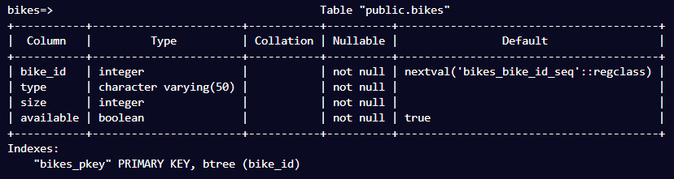

## Creating Customers table

- Created customers table:

bikes=> CREATE TABLE customers();
CREATE TABLE

- Added customer_id column:

bikes=> ALTER TABLE customers ADD COLUMN customer_id SERIAL PRIMARY KEY;
bikes=> ALTER TABLE

- Added phone column:

bikes=> ALTER TABLE customers ADD COLUMN phone VARCHAR(15) NOT NULL UNIQUE;
bikes=> ALTER TABLE

- Added name column:

bikes=> ALTER TABLE customers ADD COLUMN name VARCHAR(40) NOT NULL;
ALTER TABLE

- The customers table information:

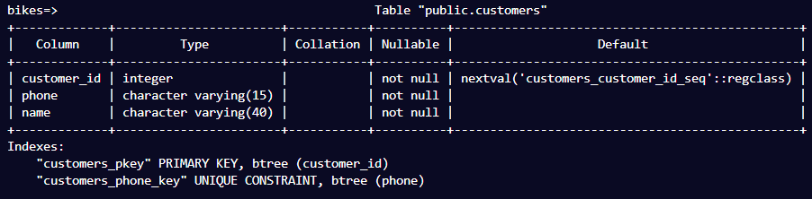

## Creating Rentals Table:

- I created a rentals table:

bikes=> CREATE TABLE rentals();
CREATE TABLE

- Added rental_id column:

bikes=> ALTER TABLE rentals ADD COLUMN rental_id SERIAL PRIMARY KEY;
ALTER TABLE

- Added customer_id column which will reference customers table:

bikes=> ALTER TABLE rentals ADD COLUMN customer_id INT NOT NULL;
bikes=> ALTER TABLE

- Adding foreign key constraint:

bikes=> ALTER TABLE rentals ADD FOREIGN KEY(customer_id) REFERENCES customers(customer_id);
ALTER TABLE

- Added bike_id column which will reference bikes table:

bikes=> ALTER TABLE rentals ADD COLUMN bike_id INT NOT NULL;
bikes=> ALTER TABLE

- Adding foreign key constraint:

bikes=> ALTER TABLE rentals ADD FOREIGN KEY(bike_id) REFERENCES bikes(bike_id);
bikes=> ALTER TABLE

- Adding date_rented column which has a default value of NOW():

bikes=> ALTER TABLE rentals ADD COLUMN date_rented DATE NOT NULL DEFAULT NOW();
ALTER TABLE

- Adding date_returned column:

bikes=> ALTER TABLE rentals ADD COLUMN date_returned DATE;
ALTER TABLE

- Information about rentals table:

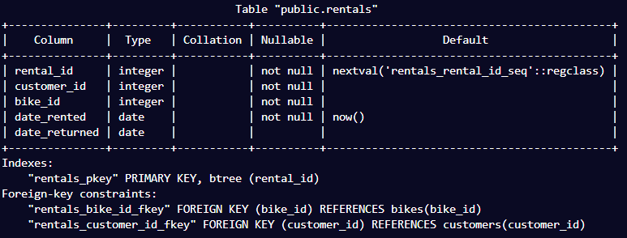

## Adding bikes to inventory

- There are 9 bikes in inventory. I add the first one to the bikes table with type of Mountain and size of 27:

bikes=> INSERT INTO bikes(type, size) VALUES ('Mountain', 27);
INSERT 0 1

- This adds the following row in the table:

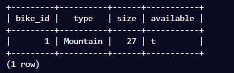

- Adding another Mountain bike with size of 28:

bikes=> INSERT INTO bikes(type, size) VALUES ('Mountain', 28);
INSERT 0 1

- Adding another Mountain bike of size 29:

bikes=> INSERT INTO bikes(type, size) VALUES ('Mountain', 29);
bikes=> INSERT 0 1

- Adding 27 inch Road bike:

bikes=> INSERT INTO bikes(type, size) VALUES ('Road', 27);
bikes=> INSERT 0 1

- All rows in bikes table:

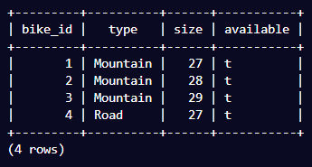

- Adding 2 Road bikes with size 28 and 29:

bikes=> INSERT INTO bikes(type, size) VALUES ('Road', 28), ('Road', 29);
bikes=> INSERT 0 2

- Adding 3 BMX bikes of sizes 19, 20 and 21:

bikes=> INSERT INTO bikes(type, size) VALUES ('BMX', 19), ('BMX', 20), ('BMX', 21);
INSERT 0 3

- Viewing all bikes in table:

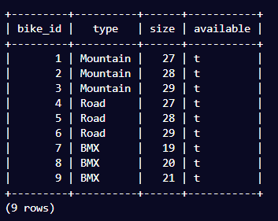

## Creating Bike Shop Script:

- I create a bash script in project folder:

~/project$ touch bike-shop.sh
~/project$ chmod +x bike-shop.sh

- I add a title to print in terminal in bike-shop.sh:

~/project$ chmod +x bike-shop.sh

- I add a MAIN_MENU function which asks the user a question, I call the method at the bottom of the script:

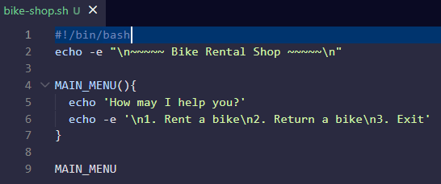

- Executing the script:

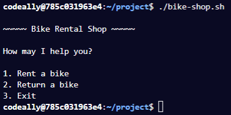

- I add a read command to the bottom of the MAIN_MENU function:

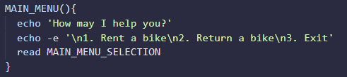

- I then defined RENT_MENU, RETURN_MENU, EXIT functions with placeholder text:

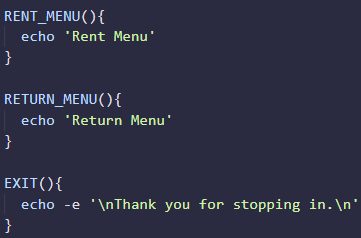

- I update the MAIN_MENU() function:

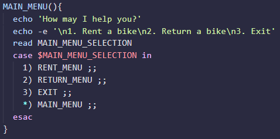

- The case statement was updates so that an argument is passed into the MAIN_MENU function:

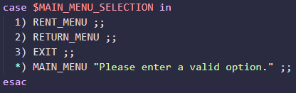

- I updated the MAIN_MENU fuinction which check if an argumenmt is passed, if it is the argument is printed:

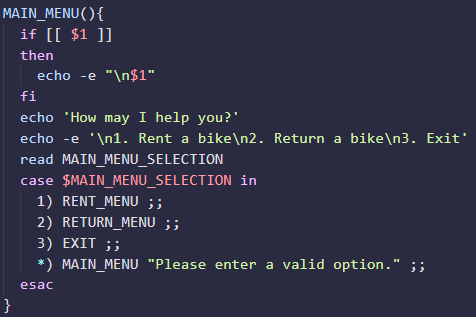

- Testing the script:

## Script at This Point:

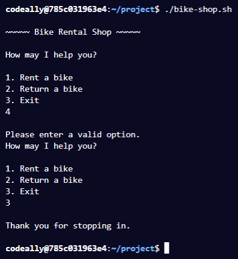

