# Learn Bash and SQL by Building a Bike Rental Shop

## Table of Contents:

[**1 Creating Tables and Populating Data**](#--1-creating-tables-and-populating-data--)
+ [Logging In and Connecting to Database](#--logging-in-and-connecting-to-database--)
+ [Creating Bikes Table](#--creating-bikes-table--)
+ [Creating Customers table](#--creating-customers-table--)
+ [Creating Rentals Table](#--creating-rentals-table--)
+ [Adding bikes to inventory](#--adding-bikes-to-inventory--)

[**2 Creating Bike Shop Script**](#--2-creating-bike-shop-script--)
+ [Script at This Point](#--script-at-this-point--)

[**3 Implementing Rent Menu Function**](#--3-implementing-rent-menu-function--)
+ [Get Available Bikes](#--get-available-bikes--)
+ [If No Bikes are Available](#--if-no-bikes-are-available--)
+ [Script at This Point](#--script-at-this-point---1)
+ [Displaying Available Bikes](#displaying-available-bikes)
+ [Ask Bike to Rent](#--ask-bike-to-rent--)
+ [Get Bike Availability](#--get-bike-availability--)
+ [If Bike is Not Available](#--if-bike-is-not-available--)
+ [Script Up To This Point](#--script-up-to-this-point--)
+ [Bike is Available](#--bike-is-available--)
+ [Get Customer Information](#--get-customer-information--)
+ [If Customer Doesn't Exist](#--if-customer-doesn-t-exist--)
+ [Getting New Customer Name](#--getting-new-customer-name--)
+ [Insert New Customer](#--insert-new-customer--)
+ [Script Up To This Point](#--script-up-to-this-point---1)
+ [Inserting data into rentals table](#--inserting-data-into-rentals-table--)
+ [Getting Customer ID](#--getting-customer-id--)
+ [Insert Bike Rental](#--insert-bike-rental--)
+ [Set Bike Availability to False](#--set-bike-availability-to-false--)
+ [Script up to this point](#--script-up-to-this-point--)
+ [Get Bike Information](#--get-bike-information--)
+ [Script up to this point](#--script-up-to-this-point---1)

[**4 Implementing Return Menu**](#--4-implementing-return-menu--)
+ [Get Customer Information](#--get-customer-information---1)
+ [If Customer is Not Found](#--if-customer-is-not-found--)
+ [Get Customer's Rentals](#--get-customer-s-rentals--)
+ [Return Menu Function At This Point](#--return-menu-function-at-this-point--)
+ [If The Customer Has No Rentals](#--if-the-customer-has-no-rentals--)
+ [If Customer Does Have Rentals](#--if-customer-does-have-rentals--)
+ [Display Rented Bikes](#--display-rented-bikes--)
+ [Ask bike for return](#--ask-bike-for-return--)
+ [If Input is not a Number](#--if-input-is-not-a-number--)
+ [Check If Input ID is Rented](#--check-if-input-id-is-rented--)
+ [If Input ID is not Rented](#--if-input-id-is-not-rented--)
+ [RETURN_MENU At This Point](#--return-menu-at-this-point---)
+ [Update Date Returned Column](#--update-date-returned-column--)
+ [Set Bike Availability to True](#--set-bike-availability-to-true--)
+ [Send to Main Menu](#--send-to-main-menu--)

## **1 Creating Tables and Populating Data**

### **Logging In and Connecting to Database**

- I logged into postgres:

        ~/project$ psql --username=freecodecamp --dbname=postgres

- Created a database:

        postgres=> CREATE DATABASE bikes;
        CREATE DATABASE

- Connected to bikes database:

        postgres=> \c bikes
        You are now connected to database "bikes" as user "freecodecamp".

### **Creating Bikes Table**

- Created bikes table:

        bikes=> CREATE TABLE bikes();
        CREATE TABLE

- Added biuke_id column

        bikes=> ALTER TABLE bikes ADD COLUMN bike_id SERIAL PRIMARY KEY;
        ALTER TABLE

- Added type column:

        bikes=> ALTER TABLE bikes ADD COLUMN type VARCHAR(50) NOT NULL;
        ALTER TABLE

- Added size column:

        bikes=> ALTER TABLE bikes ADD COLUMN size INT NOT NULL;
        ALTER TABLE

- Added available column with a default value of TRUE:

        bikes=> ALTER TABLE bikes ADD COLUMN available boolean NOT NULL DEFAULT TRUE;
        bikes=> ALTER TABLE

- The bikes table information:

    

### **Creating Customers table**

- Created customers table:

        bikes=> CREATE TABLE customers();
        CREATE TABLE

- Added customer_id column:

        bikes=> ALTER TABLE customers ADD COLUMN customer_id SERIAL PRIMARY KEY;
        bikes=> ALTER TABLE

- Added phone column:

        bikes=> ALTER TABLE customers ADD COLUMN phone VARCHAR(15) NOT NULL UNIQUE;
        bikes=> ALTER TABLE

- Added name column:

        bikes=> ALTER TABLE customers ADD COLUMN name VARCHAR(40) NOT NULL;
        ALTER TABLE

- The customers table information:

    

### **Creating Rentals Table**

- I created a rentals table:

        bikes=> CREATE TABLE rentals();
        CREATE TABLE

- Added rental_id column:

        bikes=> ALTER TABLE rentals ADD COLUMN rental_id SERIAL PRIMARY KEY;
        ALTER TABLE

- Added customer_id column which will reference customers table:

        bikes=> ALTER TABLE rentals ADD COLUMN customer_id INT NOT NULL;
        bikes=> ALTER TABLE

- Adding foreign key constraint:

        bikes=> ALTER TABLE rentals ADD FOREIGN KEY(customer_id) REFERENCES customers(customer_id);
        ALTER TABLE

- Added bike_id column which will reference bikes table:

        bikes=> ALTER TABLE rentals ADD COLUMN bike_id INT NOT NULL;
        bikes=> ALTER TABLE

- Adding foreign key constraint:

        bikes=> ALTER TABLE rentals ADD FOREIGN KEY(bike_id) REFERENCES bikes(bike_id);
        bikes=> ALTER TABLE

- Adding date_rented column which has a default value of NOW():

        bikes=> ALTER TABLE rentals ADD COLUMN date_rented DATE NOT NULL DEFAULT NOW();
        ALTER TABLE

- Adding date_returned column:

        bikes=> ALTER TABLE rentals ADD COLUMN date_returned DATE;
        ALTER TABLE

- Information about rentals table:

    

### **Adding bikes to inventory**

- There are 9 bikes in inventory. I add the first one to the bikes table with type of Mountain and size of 27:

        bikes=> INSERT INTO bikes(type, size) VALUES ('Mountain', 27);
        INSERT 0 1

- This adds the following row in the table:

    

- Adding another Mountain bike with size of 28:

        bikes=> INSERT INTO bikes(type, size) VALUES ('Mountain', 28);
        INSERT 0 1

- Adding another Mountain bike of size 29:

        bikes=> INSERT INTO bikes(type, size) VALUES ('Mountain', 29);
        bikes=> INSERT 0 1

- Adding 27 inch Road bike:

        bikes=> INSERT INTO bikes(type, size) VALUES ('Road', 27);
        bikes=> INSERT 0 1

- All rows in bikes table:

    

- Adding 2 Road bikes with size 28 and 29:

        bikes=> INSERT INTO bikes(type, size) VALUES ('Road', 28), ('Road', 29);
        bikes=> INSERT 0 2

- Adding 3 BMX bikes of sizes 19, 20 and 21:

        bikes=> INSERT INTO bikes(type, size) VALUES ('BMX', 19), ('BMX', 20), ('BMX', 21);
        INSERT 0 3

- Viewing all bikes in table:

    

 

## **2 Creating Bike Shop Script**

- I create a bash script in project folder:

        ~/project$ touch bike-shop.sh
        ~/project$ chmod +x bike-shop.sh

- I add a title to print in terminal in bike-shop.sh.

- I add a MAIN_MENU function which asks the user a question, I call the method at the bottom of the script:

    

- Executing the script:

    

- I add a read command to the bottom of the MAIN_MENU function:

    

- I then defined RENT_MENU, RETURN_MENU, EXIT functions with placeholder text:

    

- I update the MAIN_MENU() function:

    

- The case statement was updates so that an argument is passed into the MAIN_MENU function:

    

- I updated the MAIN_MENU fuinction which check if an argumenmt is passed, if it is the argument is printed:

    

- Testing the script:

    

### **Script at This Point**

- The entire script at this point looks like:

    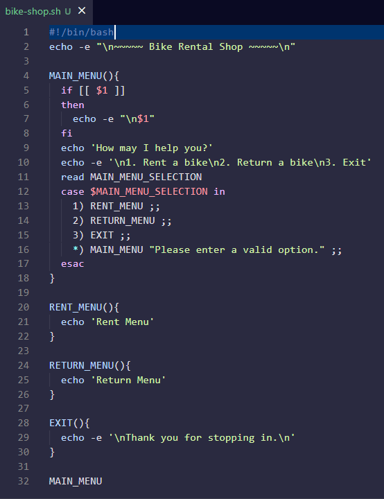

 

## **3 Implementing Rent Menu Function**

- I delete the placeholder and add the following comments:

    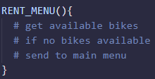

- I add a postgreSQL command to the top of my script to format the results of queries:

        PSQL="psql -X --username=freecodecamp --dbname=bikes --tuples-only -c"

### **Get Available Bikes**

- Below the get available bikes commend, I initialise the AVAILABLE_BIKES variable with a query. I print it on next line:

    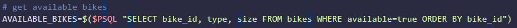

- I execute the script:

    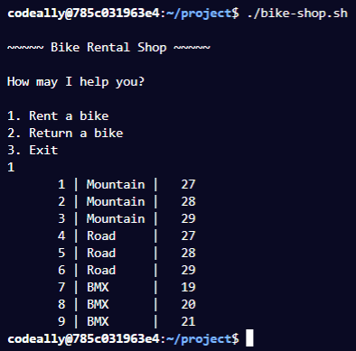

- For testing purposes, I set all bikes to unavailable in PSQL prompt:

        bikes=> UPDATE bikes SET available=false;
        UPDATE 9

- Running the script shows no available bikes in the rent menu

### **If No Bikes are Available**

- Below the 'if no bikes available' comment, I add check if the query is empty and call MAIN_MENU function:

    

- I add an else statement, with the following comments:

    

### **Script at This Point**

- The entire script at this point looks like:

    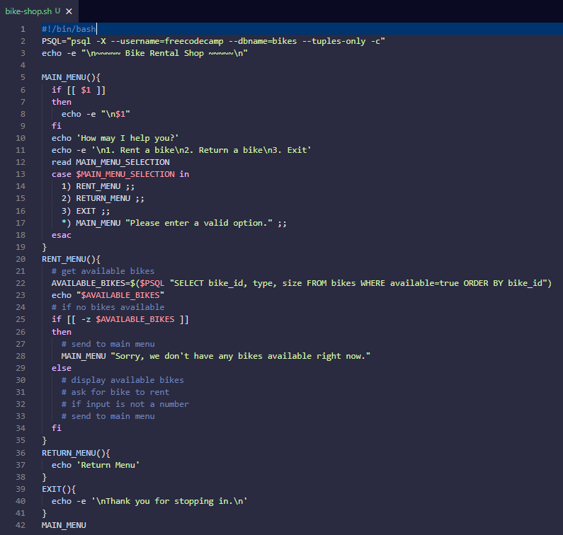

### Displaying Available Bikes

- I add the following statements to print to terminal:

    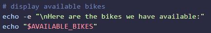

- I update all bikes to available except the BMX bikes in the PSQL prompt:

        bikes=> UPDATE bikes SET available=true WHERE type!='BMX';
        UPDATE 6

- Running the script:

    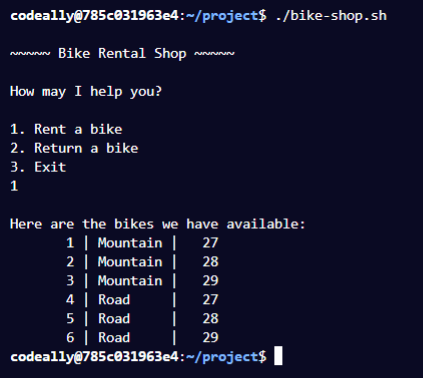

- I add a while loop to read the results and echo:

    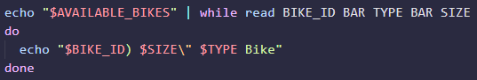

- Running the script:

    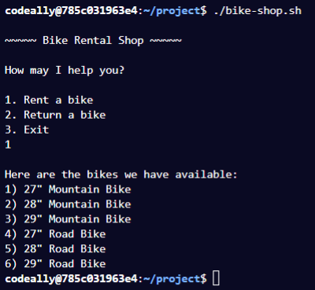

### **Ask Bike to Rent**

- I add the following echo and read statement:

    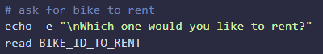

- I check if the input is not a number using regex and returns to main menu:

    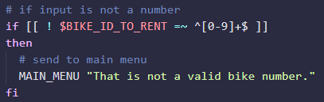

- Running the script:

    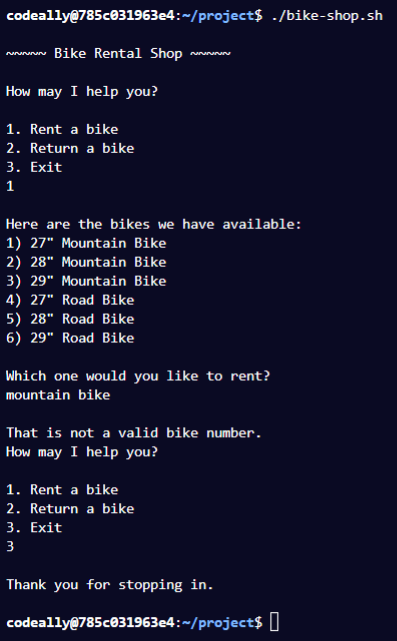

- I add an else statement wehich checks if user input is not a number, with the following comments:

    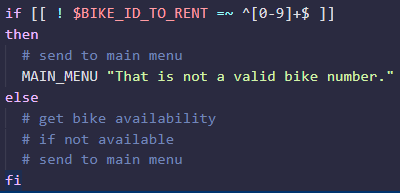

### **Get Bike Availability**

- I add the following comment below the 'get bike abailabilityu' comment:

    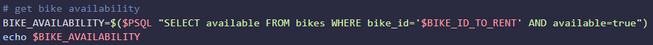

- Running the script:

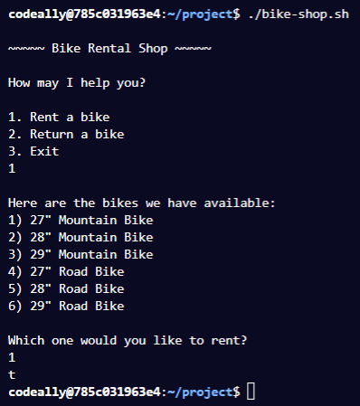

### **If Bike is Not Available**

- Below the 'if not available' comment, I check if the query is empty and call the MAIN_MENU function:

    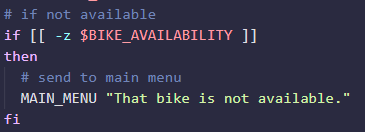

### **Script Up To This Point**

- The entire script looks like:

    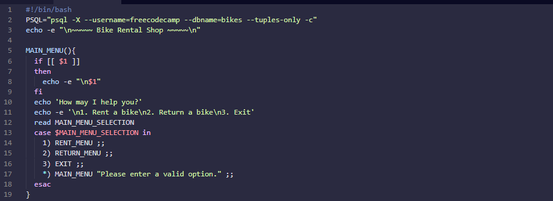
    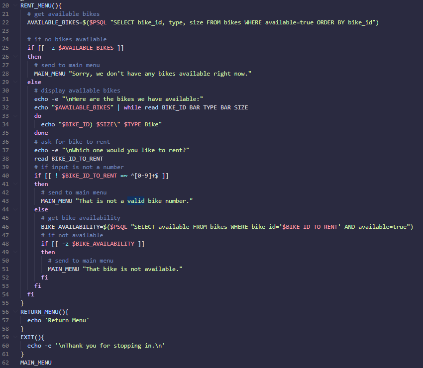

- Executing the script:

    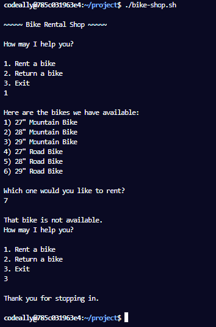

### **Bike is Available**

- I set all bikes availability to true:

        bikes=> UPDATE bikes SET available=true;
        UPDATE 9

- I add an else statement to the check if the BIKE_AVAILABILITY variable is empty and I added some comments:

    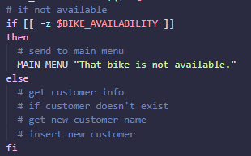

### **Get Customer Information**

- Below the 'get customer info' comment, I add the following:

    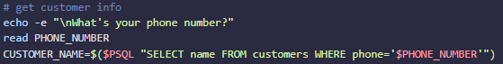

- Since the phone number is unique, we can use it to see if the customer is already in the database!

### **If Customer Doesn't Exist**

- Below the 'if customer doesn't exist' comment, I check if the CUSTOMER_NAME variable is empty:

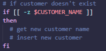

### **Getting New Customer Name**

- I get the customer's name:

    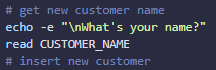

### **Insert New Customer**

- I add the following statement:

    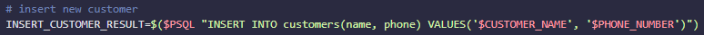

### **Script Up To This Point**

- The RENT_MENU function at this point is defined as:

    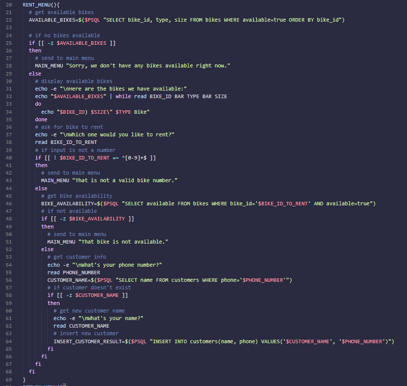

- Running the script:

    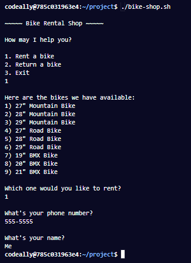

- Displaying the customers and rentals tables:

    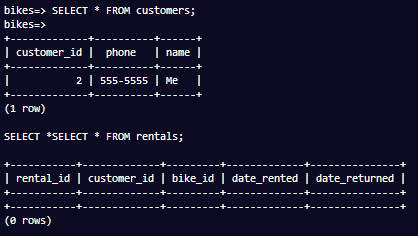 

- The rentals is still empty!

### **Inserting data into rentals table**

- Below the if statementg for inserting the customer details, I add the following comments:

    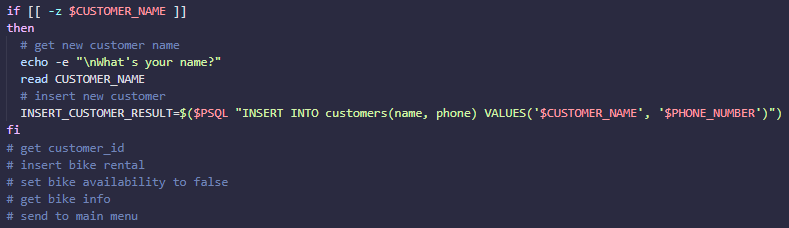

### **Getting Customer ID**

- I get the customer ID usiong the phone number:

    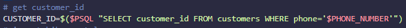

### **Insert Bike Rental**

- I inserted the customer ID and bike ID into the rentals table:

    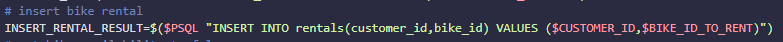

### **Set Bike Availability to False**

- Updated bikes table and set available to false:

    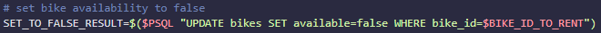

### **Script up to this point**

- The RENT_MENU() function at this point looks like:

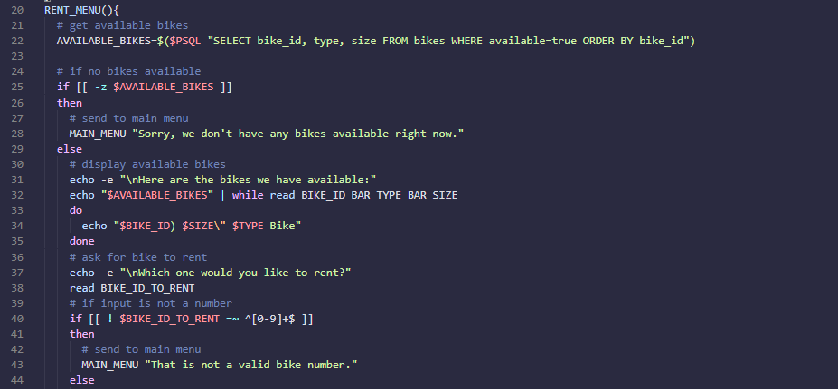
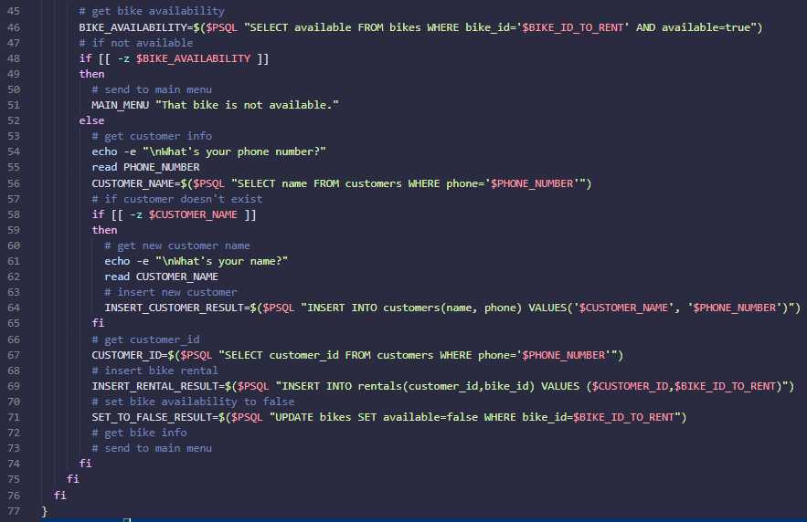

- Running the script:

    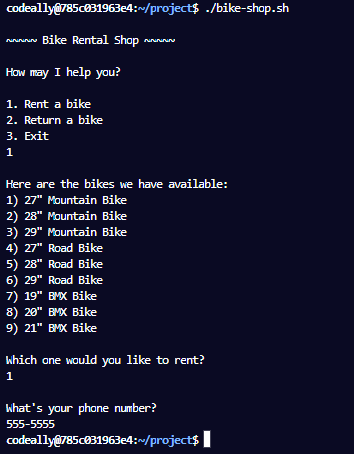

- As we can see, the name of the customer was not asked!

- Displaying the rentals table, shows a row was added:

    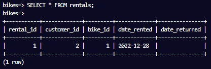

- The bikes table also has the availability to false:

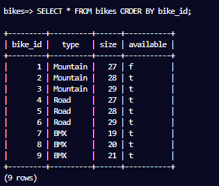

### **Get Bike Information**

- Below the 'get bike info' comment, I create the following variable:

    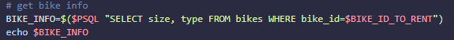

- Running the script shows the following:

    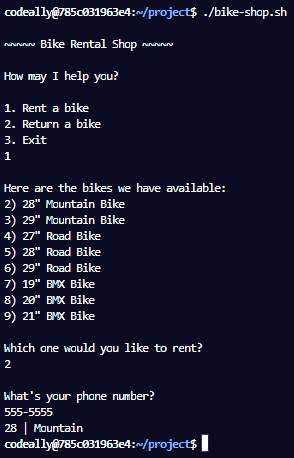

- I will use the sed command so it will print: I have put you down for the 28" Mountain Bike, Me.

- Using sed, I printed "29" Mountain" to the terminal:

    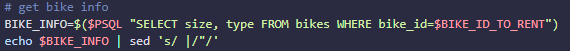

- I used a sub-shell to place the above in a variable:

    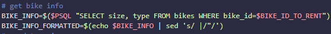

- I use the above to print a message when returning to main menu:

    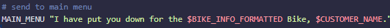

- When executing the script there is an extra space before the name! We can fix this by using regex in a sub shell:

    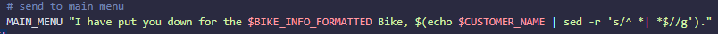

### **Script up to this point**

- The RENT_MENU() function up to this point is defined as:

    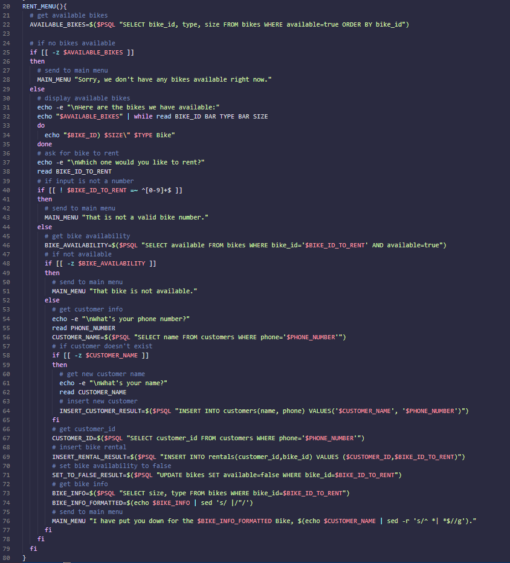

## **4 Implementing Return Menu**

- I add the following comments to the Return Menu function

    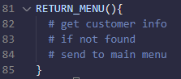

### **Get Customer Information**

- Below the 'get customer info' comment, I add the following:

    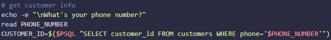

### **If Customer is Not Found**

- Below the 'if no found' comment, I wrote:

    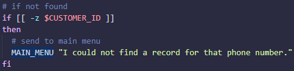

- I add an else statement to the condition which checks if the CUSTOMER_ID variable is empty:

    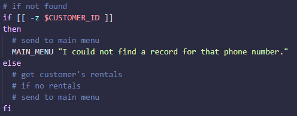

### **Get Customer's Rentals**

- I want to find what rentals are booked for a customer using their phone number.

- I use an INNER JOIN on the bikes and rentals table:

    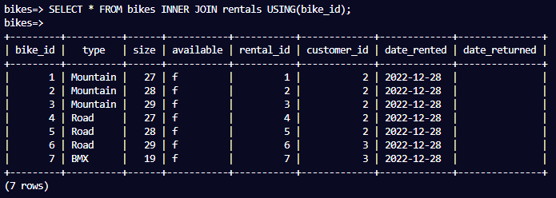

- I then do another INNER JOIN on the customers table:

    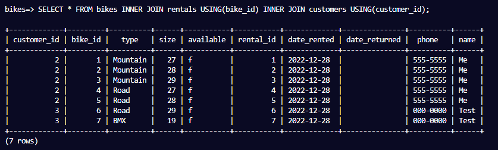

- I narrow the above results based on phone number and date_returned:

    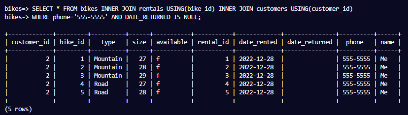

- Now I need to display bike information:

    

- I add the following query to my script:

   

### **Return Menu Function At This Point**

- The entire RETURN_MENU function is defined as:

    

- Executing this script:

    

### **If The Customer Has No Rentals**

- Below the 'if no rentals' comment, I add the following check:

    

### **If Customer Does Have Rentals**

- I add an else statement to the check for customer rentals:

    

### **Display Rented Bikes**

- I add the following below the 'display rented bikes' comment:

    

- Executing the script displays:

    

### **Ask bike for return**

- I read the input for the bike to be returned below:

    

### **If Input is not a Number**

- Just like before, I first check if the input is a number:

    

- I create an else statement:

    

### **Check If Input ID is Rented**

- In order to see if the bike is rented, I need to JOIN the rentals and customers table:

    

- We can narrow it to just the rental_id and I add the following to my script:

    

### **If Input ID is not Rented**

- I added the following check to see if the RENTAL_ID is empty and to call the MAIN_MENU function:

    

- I add an else statement:

    

### **RETURN_MENU At This Point:**

- The definition of the RETURN_MENU function entirely is:

    

- Executing the script:

    

- I delete the echo in the else statement and replace them with 3 comments:

    

### **Update Date Returned Column**

- I update the rentals table for the returned bike:

    

### **Set Bike Availability to True**

- I updated the bikes table:

    

### **Send to Main Menu**

- I call the MAIN_MENU function:

    

- The RETURN_MENU function is now finished!

- Executing the script:

    