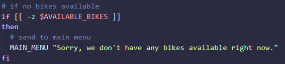
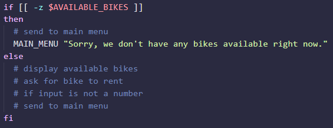
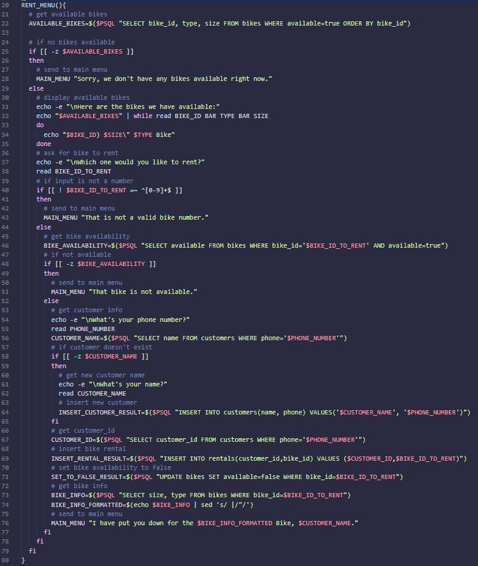

# Learn Bash and SQL by Building a Bike Rental Shop

## 1 Creating Tables and Populating Data:

- I logged into postgres:

        ~/project$ psql --username=freecodecamp --dbname=postgres

- Created a database:

        postgres=> CREATE DATABASE bikes;
        CREATE DATABASE

- Connected to bikes database:

        postgres=> \c bikes
        You are now connected to database "bikes" as user "freecodecamp".

### Creating Bikes Table:

- Created bikes table:

        bikes=> CREATE TABLE bikes();
        CREATE TABLE

- Added biuke_id column

        bikes=> ALTER TABLE bikes ADD COLUMN bike_id SERIAL PRIMARY KEY;
        ALTER TABLE

- Added type column:

        bikes=> ALTER TABLE bikes ADD COLUMN type VARCHAR(50) NOT NULL;
        ALTER TABLE

- Added size column:

        bikes=> ALTER TABLE bikes ADD COLUMN size INT NOT NULL;
        ALTER TABLE

- Added available column with a default value of TRUE:

        bikes=> ALTER TABLE bikes ADD COLUMN available boolean NOT NULL DEFAULT TRUE;
        bikes=> ALTER TABLE

- The bikes table information:

    

### Creating Customers table

- Created customers table:

        bikes=> CREATE TABLE customers();
        CREATE TABLE

- Added customer_id column:

        bikes=> ALTER TABLE customers ADD COLUMN customer_id SERIAL PRIMARY KEY;
        bikes=> ALTER TABLE

- Added phone column:

        bikes=> ALTER TABLE customers ADD COLUMN phone VARCHAR(15) NOT NULL UNIQUE;
        bikes=> ALTER TABLE

- Added name column:

        bikes=> ALTER TABLE customers ADD COLUMN name VARCHAR(40) NOT NULL;
        ALTER TABLE

- The customers table information:

    

### Creating Rentals Table:

- I created a rentals table:

        bikes=> CREATE TABLE rentals();
        CREATE TABLE

- Added rental_id column:

        bikes=> ALTER TABLE rentals ADD COLUMN rental_id SERIAL PRIMARY KEY;
        ALTER TABLE

- Added customer_id column which will reference customers table:

        bikes=> ALTER TABLE rentals ADD COLUMN customer_id INT NOT NULL;
        bikes=> ALTER TABLE

- Adding foreign key constraint:

        bikes=> ALTER TABLE rentals ADD FOREIGN KEY(customer_id) REFERENCES customers(customer_id);
        ALTER TABLE

- Added bike_id column which will reference bikes table:

        bikes=> ALTER TABLE rentals ADD COLUMN bike_id INT NOT NULL;
        bikes=> ALTER TABLE

- Adding foreign key constraint:

        bikes=> ALTER TABLE rentals ADD FOREIGN KEY(bike_id) REFERENCES bikes(bike_id);
        bikes=> ALTER TABLE

- Adding date_rented column which has a default value of NOW():

        bikes=> ALTER TABLE rentals ADD COLUMN date_rented DATE NOT NULL DEFAULT NOW();
        ALTER TABLE

- Adding date_returned column:

        bikes=> ALTER TABLE rentals ADD COLUMN date_returned DATE;
        ALTER TABLE

- Information about rentals table:

    

### Adding bikes to inventory

- There are 9 bikes in inventory. I add the first one to the bikes table with type of Mountain and size of 27:

        bikes=> INSERT INTO bikes(type, size) VALUES ('Mountain', 27);
        INSERT 0 1

- This adds the following row in the table:

    

- Adding another Mountain bike with size of 28:

        bikes=> INSERT INTO bikes(type, size) VALUES ('Mountain', 28);
        INSERT 0 1

- Adding another Mountain bike of size 29:

        bikes=> INSERT INTO bikes(type, size) VALUES ('Mountain', 29);
        bikes=> INSERT 0 1

- Adding 27 inch Road bike:

        bikes=> INSERT INTO bikes(type, size) VALUES ('Road', 27);
        bikes=> INSERT 0 1

- All rows in bikes table:

    

- Adding 2 Road bikes with size 28 and 29:

        bikes=> INSERT INTO bikes(type, size) VALUES ('Road', 28), ('Road', 29);
        bikes=> INSERT 0 2

- Adding 3 BMX bikes of sizes 19, 20 and 21:

        bikes=> INSERT INTO bikes(type, size) VALUES ('BMX', 19), ('BMX', 20), ('BMX', 21);
        INSERT 0 3

- Viewing all bikes in table:

    

 

## 2 Creating Bike Shop Script:

- I create a bash script in project folder:

        ~/project$ touch bike-shop.sh
        ~/project$ chmod +x bike-shop.sh

- I add a title to print in terminal in bike-shop.sh.

- I add a MAIN_MENU function which asks the user a question, I call the method at the bottom of the script:

    

- Executing the script:

    

- I add a read command to the bottom of the MAIN_MENU function:

    

- I then defined RENT_MENU, RETURN_MENU, EXIT functions with placeholder text:

    

- I update the MAIN_MENU() function:

    

- The case statement was updates so that an argument is passed into the MAIN_MENU function:

    

- I updated the MAIN_MENU fuinction which check if an argumenmt is passed, if it is the argument is printed:

    

- Testing the script:

    

### Script at This Point:

    

### Updating RENT_MENU Function

- I delete the placeholder and add the following comments:

    

- I add a postgreSQL command to the top of my script to format the results of queries:

        PSQL="psql -X --username=freecodecamp --dbname=bikes --tuples-only -c"

### Get Available Bikes

- Below the get available bikes commend, I initialise the AVAILABLE_BIKES variable with a query. I print it on next line:

    

- I execute the script:

    

- For testing purposes, I set all bikes to unavailable in PSQL prompt:

        bikes=> UPDATE bikes SET available=false;
        UPDATE 9

- Running the script shows no available bikes in the rent menu

### If No Bikes are Available

- Below the 'if no bikes available' comment, I add check if the query is empty and call MAIN_MENU function:

    

- I add an else statement, with the following comments:

    

### Script at This Point:

- The entire script at this point looks like:

    

### Displaying Available Bikes

- I add the following statements to print to terminal:

    

- I update all bikes to available except the BMX bikes in the PSQL prompt:

        bikes=> UPDATE bikes SET available=true WHERE type!='BMX';
        UPDATE 6

- Running the script:

    

- I add a while loop to read the results and echo:

    

- Running the script:

    

### Ask Bike to Rent

- I add the following echo and read statement:

    

- I check if the input is not a number using regex and returns to main menu:

    

- Running the script:

    

- I add an else statement wehich checks if user input is not a number, with the following comments:

    

### Get Bike Availability

- I add the following comment below the 'get bike abailabilityu' comment:

    

- Running the script:

### If Bike is Not Available

- Below the 'if not available' comment, I check if the query is empty and call the MAIN_MENU function:

    

### Script Up To This Point

- The entire script looks like:

    
    

- Executing the script:

    

### Bike is Available

- I set all bikes availability to true:

        bikes=> UPDATE bikes SET available=true;
        UPDATE 9

- I add an else statement to the check if the BIKE_AVAILABILITY variable is empty and I added some comments:

    

### Get Customer Information

- Below the 'get customer info' comment, I add the following:

    

- Since the phone number is unique, we can use it to see if the customer is already in the database!

### If Customer Doesn't Exist

- Below the 'if customer doesn't exist' comment, I check if the CUSTOMER_NAME variable is empty:

### Getting New Customer Name

- I get the customer's name:

    

### Insert New Customer

- I add the following statement:

    

### Script Up To This Point

- The RENT_MENU function at this point is defined as:

    

- Running the script:

    

- Displaying the customers and rentals tables:

     

- The rentals is still empty!

### Inserting data into rentals table

- Below the if statementg for inserting the customer details, I add the following comments:

    

### Getting Customer ID

- I get the customer ID usiong the phone number:

    

### Insert Bike Rental

- I inserted the customer ID and bike ID into the rentals table:

    

### Set Bike Availability to False

- Updated bikes table and set available to false:

    

### Script up to this point

- The RENT_MENU() function at this point looks like:

- Running the script:

    

- As we can see, the name of the customer was not asked!

- Displaying the rentals table, shows a row was added:

    

- The bikes table also has the availability to false:

### Get Bike Information

- Below the 'get bike info' comment, I create the following variable:

    

- Running the script shows the following:

    

- I will use the sed command so it will print: I have put you down for the 28" Mountain Bike, Me.

- Using sed, I printed "29" Mountain" to the terminal:

    

- I used a sub-shell to place the above in a variable:

    

- I use the above to print a message when returning to main menu:

    

### Script up to this point

- There was an extra space before the name! We can fix this by using regex in a sub shell:

    