# 1 Use Responsive Design with BootStrap Fluid Containers

In the HTML and CSS section we built a Cat Photo App

We shall remake this with Bootstrap responsive CSS framework.

Bootstrap will figure out how wide the screen is and resize HTML elements.

We can add this frameword by adding the following link to the top of the code:

    <link rel="stylesheet" href="https://maxcdn.bootstrapcdn.com/bootstrap/3.3.7/css/bootstrap.min.css" integrity="sha384-BVYiiSIFeK1dGmJRAkycuHAHRg32OmUcww7on3RYdg4Va+PmSTsz/K68vbdEjh4u" crossorigin="anonymous"/>

 

# Starting HTML/CSS and App

The Cat Photo App has the following HTML:

    <link href="https://fonts.googleapis.com/css?family=Lobster" rel="stylesheet" type="text/css">
    

    <h2 class="red-text">CatPhotoApp</h2>

    
Click here for <a href="#">cat photos</a>.

    

    
Things cats love:

    <ul>
    <li>cat nip</li>
    <li>laser pointers</li>
    <li>lasagna</li>
    </ul>
    
Top 3 things cats hate:

    <ol>
    <li>flea treatment</li>
    <li>thunder</li>
    <li>other cats</li>
    </ol>
    <form action="https://freecatphotoapp.com/submit-cat-photo">
    <label><input type="radio" name="indoor-outdoor"> Indoor</label>
    <label><input type="radio" name="indoor-outdoor"> Outdoor</label>
    <label><input type="checkbox" name="personality"> Loving</label>
    <label><input type="checkbox" name="personality"> Lazy</label>
    <label><input type="checkbox" name="personality"> Crazy</label>
    <input type="text" placeholder="cat photo URL" required>
    <button type="submit">Submit</button>
    </form>

And the app looks like:

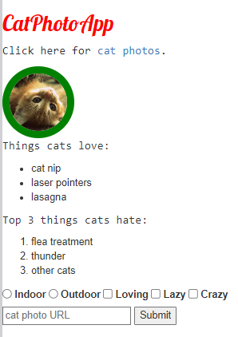

 

# Tutorial Commentary

## Step 1: Nesting all elements into a container-fluid div

The **container-fluid** is a container class which takes width of entire viewport

The code now looks like:

    <link href="https://fonts.googleapis.com/css?family=Lobster" rel="stylesheet" type="text/css">
    
    

    
    <h2 class="red-text">CatPhotoApp</h2>

    
Click here for <a href="#">cat photos</a>.

    

    
Things cats love:

    <ul>
    <li>cat nip</li>
    <li>laser pointers</li>
    <li>lasagna</li>
    </ul>
    
Top 3 things cats hate:

    <ol>
    <li>flea treatment</li>
    <li>thunder</li>
    <li>other cats</li>
    </ol>
    <form action="https://freecatphotoapp.com/submit-cat-photo">
    <label><input type="radio" name="indoor-outdoor"> Indoor</label>
    <label><input type="radio" name="indoor-outdoor"> Outdoor</label>
    <label><input type="checkbox" name="personality"> Loving</label>
    <label><input type="checkbox" name="personality"> Lazy</label>
    <label><input type="checkbox" name="personality"> Crazy</label>
    <input type="text" placeholder="cat photo URL" required>
    <button type="submit">Submit</button>
    </form>
    

## Step 2: Make Images Mobile Responsive

We shall add a new image below the existing one with a link: https://cdn.freecodecamp.org/curriculum/cat-photo-app/running-cats.jpg

Bootstrap has a class which makes the image the exact width of screen: **img-responsive**

I add a new image below the pre-existing one:

    
    

The app now looks like:
    
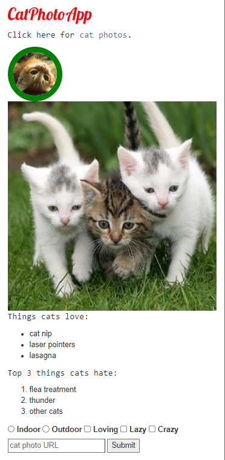

## Step 3: Center Text With Bootstrap

Bootstrap has a **text-center** class which centers text.

I center the heading using the above class:

    <h2 class="red-text text-center">CatPhotoApp</h2>

The app now looks like:

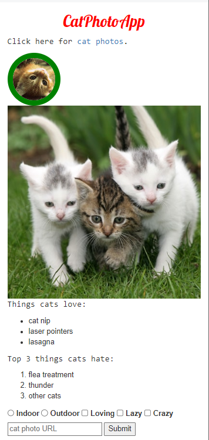

## Step 4: Create a Bootstrap Button

We can create multiple types of buttons as shown in the documentation:

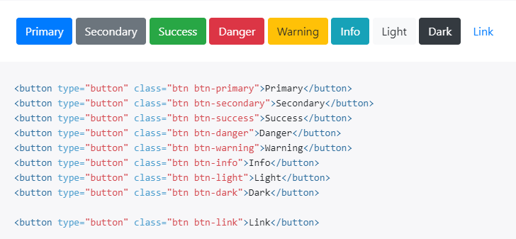

I create a new button below the large kitten photo with default styling:

    <button class="btn btn-default">Like</button>

The app now looks like:

## Step 5: Create a Block Element Bootstrap Button

Buttons with btn and btn-default classes will only be as wide as the text.

We can use **btn-block** so butoton will take up full horizontal space.

I add this class to the button:

    <button class="btn btn-default btn-block">Like</button>

The app now looks like:

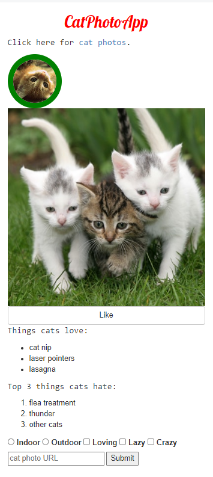

## Step 6: Taste the Bootstrap Button Color Rainbow

The **btn-primary** is often used as the main color for highlighting actions.

I replace the btn-default class with btn-primary:

    <button class="btn btn-primary btn-block">Like</button>

The app now looks like:

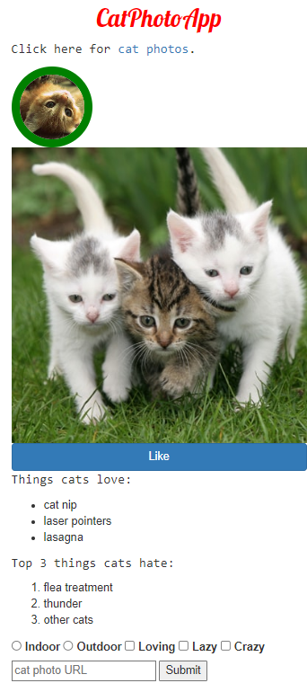

## Step 7: Call out Optional Actions with btn-info

The **btn-info** class is used for optional actions which user can take.

I create a new button below like button:

    <button class="btn btn-block btn-primary">Like</button>

The app now looks like:

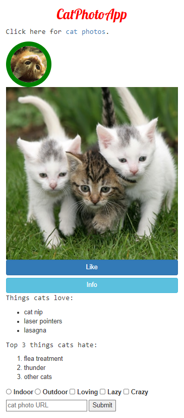

## Step 8: Warn Your Users of a Dangerous Action

The **btn-danger** class is often using for actions which are destructive such as deleting a photo.

I add a delete button belo the info button:

    <button class="btn btn-block btn-danger">Delete</button>

The app now looks like:

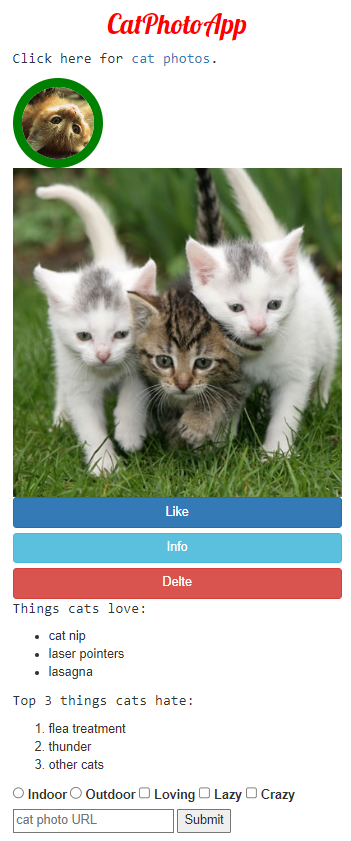

## Step 9: Use the Bootstrap Grid to Put Elements Side By Side

Put the Like, Info and Delete buttons side-by-side by nesting all three of them within one &lt;div class="row"> element, then each of them within a &lt;div class="col-xs-4"> element.

Bootstrap uses a 12-column grid system. We can specify positioning of elements within this grid by specifying a ratio of 12. So if we want an element to take half of the grid using 6.

For this step, I need to make a grid for a small screen so I use col-xs-* where * is replaced by a proportion of 12

I first create a row div:

    

    

I surround each of the buttons with a div with class col-xs-4 and inserted them in the row div:

    

        

            <button class="btn btn-block btn-primary">Like</button>
        

        

            <button class="btn btn-block btn-info">Info</button>
        

        

            <button class="btn btn-block btn-danger">Delete</button>
        
  
    

The app now looks like:

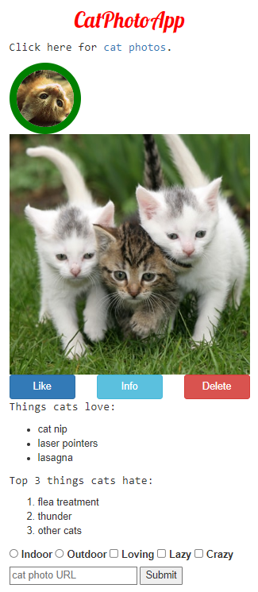

## Step 10: Ditch Custom CSS for BootStrap

### Task:

Delete the .red-text, p, and .smaller-image CSS declarations from your style element so that the only declarations left in your style element are h2 and thick-green-border.

Then delete the p element that contains a dead link. Then remove the red-text class from your h2 element and replace it with the text-primary Bootstrap class.

Finally, remove the smaller-image class from your first img element and replace it with the img-responsive class.

Currently there is CSS defined as:

    

It now looks like:

    

### Changes:

Removed red-text class and added text-primary class to h2:

    <h2 class="text-primary text-center">CatPhotoApp</h2>

I removed smaller-image class from top image and added img-responsive:

    

The app now looks like:

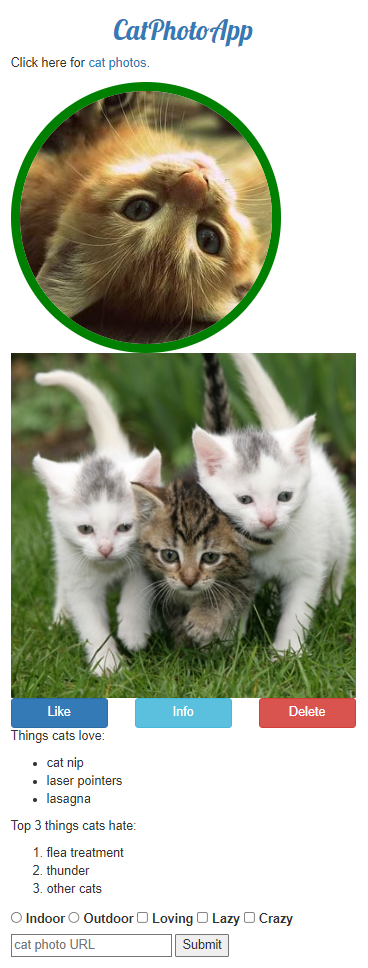

## Step 11: Use a span to Target Inline Elements

Using a span element, nest the word love inside the p element that currently has the text Things cats love. Then give the span the class text-danger to make the text red.

## Difference between inline and block

Previously, we used btn-block class so that an element takes the whole width of container. This illustrates inline elements:

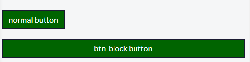

I update the p element with an inline span:

    
Things cats love

## Step 12: Create a Custom Heading

Nest your first image and your h2 element within a single &lt;div class="row"> element. Nest your h2 element within a &lt;div class="col-xs-8"> and your image in a &lt;div class="col-xs-4"> so that they are on the same line.

Solution:

    

        

            
        

        

            <h2 class="text-primary text-center">CatPhotoApp</h2>
        

    

The app now looks like:

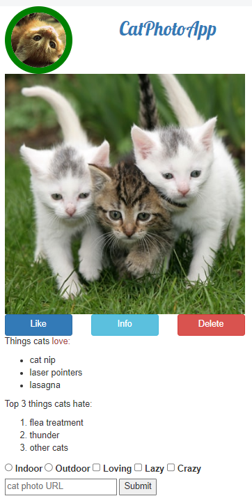

## Step 13: Add Font Awesome Icons to outr Buttons

### Task

Use Font Awesome to add a thumbs-up icon to your like button by giving it an i element with the classes fas and fa-thumbs-up. Make sure to keep the text Like next to the icon.

### What is Font Awesome?

Font Awesome is a convienent library of icons which are treated just like fonts.

We can add Font Awesome by adding the following link to the top of HTML: 

    <link rel="stylesheet" href="https://use.fontawesome.com/releases/v5.8.1/css/all.css" integrity="sha384-50oBUHEmvpQ+1lW4y57PTFmhCaXp0ML5d60M1M7uH2+nqUivzIebhndOJK28anvf" crossorigin="anonymous">

The i tag was originally made to make text italic but is now used for icons. E.g.:

    <i class="fas fa-info-circle"></i>

I update the Like button:

    <button class="btn btn-block btn-primary"><i class="fas fa-thumbs-up"></i>Like</button>