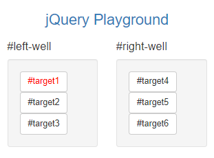
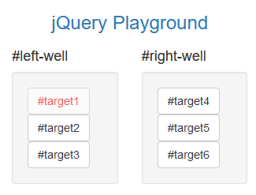
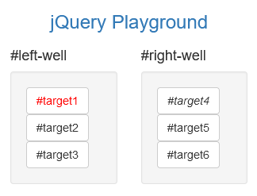
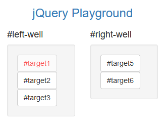
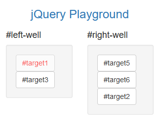
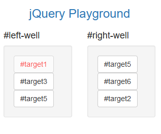
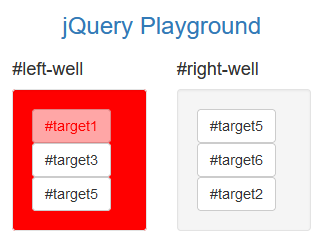
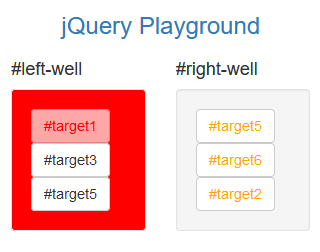

# 2 jQuery

# Introduction

jQuery is the most widely used JavaScript libraries, it simplifies client-side JavaScript so it outputs consistently for all browsers.

In this section, I will learn how to select, remove, clone and modify different elements using jQuery

 

# 2.1 Tutorial Commentary

## Step 1: Learn How Script Tags and Documents Ready Work

Before starting this tutorial we need to add a script element to our HTML.  This is where the browser will run any JavaScript code. We shall add a function which prevents code running before HTML is rendered.

*Inside your script element, add this code: $(document).ready(function() { to your script. Then close it on the following line (still inside your script element) with: });*

I add the following above the comment of the HTML from Bootstrap tutorial:

    

 

## Step 2: Target HTML Elements with Selectors Using jQuery

All jQuery functions start with $ - dollar sign operator

Using jQuery to apply the Animate.css bounce class to your button elements.

*Inside the ready function, I use the addClass functiont to add animated and bounce classes:*

    

Now the elements are animated:

 

## Step 3: Target Elements by Class Using jQuery

 *To the Well elements, add the classes animated and shake.*

 We can target classes the same way as in CSS, by using the .classname targeter:

    $(document).ready(function() {
        $("button").addClass("animated bounce");
        $(".well").addClass("animated shake");
    });

The App now looks like:

 

## Step 4: Target Elements by id using jQuery

We can also target elements by their id by using #id

Use jQuery's .addClass() function to add the classes animated and fadeOut to the buttons with id target3

    $(document).ready(function() {
        $("button").addClass("animated bounce");
        $(".well").addClass("animated shake");
        $("#target3").addClass("animated fadeout")
    });

The App now looks like:

 

# Step 5: Delete your jQuery Functions

*Delete all three of these jQuery functions from your document ready function, but leave your document ready function itself intact.*

    

The App now looks like:

 

### Step 6: Target the same Element with Multiple jQuery Selectors

*Using .addClass(), add only one class at a time to the same element, three different ways:*

*Add the animated class to all elements with type button.*

*Add the shake class to all the buttons with class .btn.*

*Add the btn-primary class to the button with id #target1.*

    

The App now looks like:

 

## Step 7: Remove Classes from an Element with jQuery

jQuery has a **removeClass()** function!

*Remove the btn-default class from all of our button elements.*

    

The App now looks like:

 

## Step 8: Change the CSS of an Element Using jQuery

The jQuery **.css()** function allows you to change the CSS of an element

*Delete your jQuery selectors, leaving an empty document ready function.*

*Select target1 and change its color to red.*

    

The App now looks like:

 

## Step 9: Disable an Element Using jQuery

We can modify other properties of elements using the **.prop()** function.

We can disable a button so it greys out after being clicked with the following syntax:

    $("button").prop("disabled", true);

*Disable only the target1 button.*

    

The App now looks like:

 

## Step 10: Change Text Inside an Element Using jQuery

jQuery has a **.html()** function which lets you modify the contents within an element - everything will be completely replaced!

*Change the button with id target4 by emphasizing its text.*

    

The App now looks like:

 

## Step 11: Remove an Element Using jQuery

jQuery has the **.remove()** function which removes an HTML element entirely

*Remove the #target4 element from the page*

    

The App now looks like:

 

## Step 12: Use appendTo to Move Elements with jQuery

The **appendTo()** function allows you to select HTML elements and append them to another element.

*Move your target2 element from your left well to your right well*

    

The App now looks like:

 

## Step 13: Clone an Element Using jQuery

The **clone()** function makes a copy of an element.

For example, if we wanted to copy target2 from our left-well to our right well, we would write:

    $("#target2").clone().appendTo("#right-well");

*Clone your target5 element and append it to your left well*

    

The App now looks like:

 

## Step 14: Target the Parent of an Element using jQuery

Every HTML element has a parent which it **inherits** its properties from.

The jQuery function **parent()** allows you to access the parent of whichever element is selected.

*Give the parent of the #target1 element a background-color of red*

    

The App now looks like:

 

## Step 15: Target the Children of an Element Using jQuery

HTML elements which are one level belone of another are called **children** of the element.

The jQuery function **children()** lets you access the children of selected element.

*Give all the children of your right-well elements the color orange*

    

The App now looks like:

 

## Step 16: Target a Specific Child of an Element Using jQuery

jQuery can use CSS selectors to target specific elements. E.g. target:nth-child(n) lets you target nth element with the target class of element or type.

For example, if we wanted to give the third element in each well the bounce class:

    $(".target:nth-child(3)").addClass("animated bounce");

*Make the second child in each of your well elements bounce*

    

The App now looks like:

