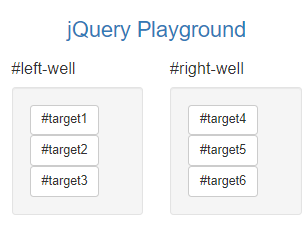

# 2 jQuery

# Introduction

jQuery is the most widely used JavaScript libraries, it simplifies client-side JavaScript so it outputs consistently for all browsers.

In this section, I will learn how to select, remove, clone and modify different elements using jQuery

 

# 2.1 Tutorial Commentary

## Step 1: Learn How Script Tags and Documents Ready Work

Before starting this tutorial we need to add a script element to our HTML.  This is where the browser will run any JavaScript code. We shall add a function which prevents code running before HTML is rendered.

*Inside your script element, add this code: $(document).ready(function() { to your script. Then close it on the following line (still inside your script element) with: });*

I add the following above the comment of the HTML from Bootstrap tutorial:

    

 

## Step 2: Target HTML Elements with Selectors Using jQuery

All jQuery functions start with $ - dollar sign operator

Using jQuery to apply the Animate.css bounce class to your button elements.

*Inside the ready function, I use the addClass functiont to add animated and bounce classes:*

    

Now the elements are animated:

 

## Step 3: Target Elements by Class Using jQuery

 *To the Well elements, add the classes animated and shake.*

 We can target classes the same way as in CSS, by using the .classname targeter:

    $(document).ready(function() {
        $("button").addClass("animated bounce");
        $(".well").addClass("animated shake");
    });

The App now looks like:

 

## Step 4: Target Elements by id using jQuery

We can also target elements by their id by using #id

Use jQuery's .addClass() function to add the classes animated and fadeOut to the buttons with id target3

    $(document).ready(function() {
        $("button").addClass("animated bounce");
        $(".well").addClass("animated shake");
        $("#target3").addClass("animated fadeout")
    });

The App now looks like:

 

# Step 5: Delete your jQuery Functions

*Delete all three of these jQuery functions from your document ready function, but leave your document ready function itself intact.*

    

The App now looks like:

