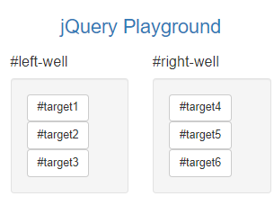
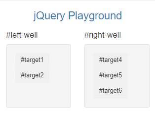
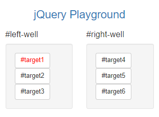
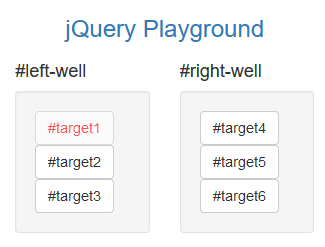
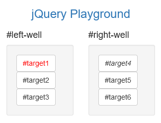
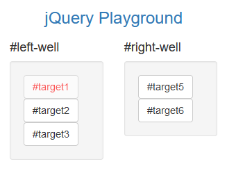
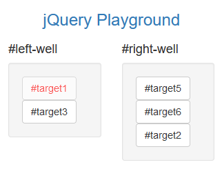
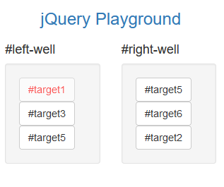
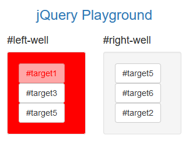
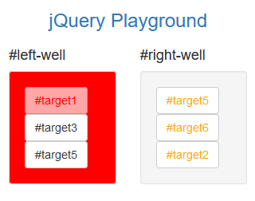

# 2: jQuery

## Summary

1. We need a **script tag** to write jQuery:

        

2. **readyFunction()** on the document lets the code runs *after* HTML renders

        
3. We can target elements using element name, class or ID:

        $("button")
        $(".btn-primary")
        $("#target")

4. **addClass()** function lets you add classes to elements:

        $("button").addClass("animated bounce");

5. **removeClass()** function lets you remove classes from elements:

        $("button").removeClass("btn-default")

6. **css()** function lets you set CSS attributes:

        $("button").css("color", "red")

7. **prop()** function lets set a property of an element. E.g. we can disable button upon click:

         $("#target1").prop("disabled", true);

8. **html()** function lets you update the contents of an element, it replaces everything:

        "#target4").html("<em>#target4</em>");

9. **remove()** functions lets you completely remove an element from document:

        $("#target").remove();

10. **appendTo()** function lets you select an element and append it to another:

        $("#target1").appendTo("#right-well")

11. **clone()** function lets you copy an element

        $("#target2").clone().appendTo("#right-well");

12. **parent()** function lets you select element which is contained by the one specified:

        $("#target1").parent().css("background-color", "red")

13. **children()** function lets you select element one level below. This is useful for selecting multiple elements:

         $("#right-well").children().css("color", "orange");

14. **:nth-child(n)** lets you target the nth child. E.g. targeting the 2nd child of target class:

         $(".target:nth-child(2)").addClass("animated bounce");

15. **Odd and even elements are targeted using zero-index**. The :odd selector target elements on lines 2,4,6... and :even selector target elements on lines 1,3,5...:

        $(".class:odd")
        $(".class:even")

## Table of Contents:

  * [Step 1: Learn How Script Tags and Documents Ready Work](#step-1--learn-how-script-tags-and-documents-ready-work)
  * [Step 2: Target HTML Elements with Selectors Using jQuery](#step-2--target-html-elements-with-selectors-using-jquery)
  * [Step 3: Target Elements by Class Using jQuery](#step-3--target-elements-by-class-using-jquery)
  * [Step 4: Target Elements by id using jQuery](#step-4--target-elements-by-id-using-jquery)
  * [Step 5: Delete your jQuery Functions](#step-5--delete-your-jquery-functions)
  * [Step 6: Target the same Element with Multiple jQuery Selectors](#step-6--target-the-same-element-with-multiple-jquery-selectors)
  * [Step 7: Remove Classes from an Element with jQuery](#step-7--remove-classes-from-an-element-with-jquery)
  * [Step 8: Change the CSS of an Element Using jQuery](#step-8--change-the-css-of-an-element-using-jquery)
  * [Step 9: Disable an Element Using jQuery](#step-9--disable-an-element-using-jquery)
  * [Step 10: Change Text Inside an Element Using jQuery](#step-10--change-text-inside-an-element-using-jquery)
  * [Step 11: Remove an Element Using jQuery](#step-11--remove-an-element-using-jquery)
  * [Step 12: Use appendTo to Move Elements with jQuery](#step-12--use-appendto-to-move-elements-with-jquery)
  * [Step 13: Clone an Element Using jQuery](#step-13--clone-an-element-using-jquery)
  * [Step 14: Target the Parent of an Element using jQuery](#step-14--target-the-parent-of-an-element-using-jquery)
  * [Step 15: Target the Children of an Element Using jQuery](#step-15--target-the-children-of-an-element-using-jquery)
  * [Step 16: Target a Specific Child of an Element Using jQuery](#step-16--target-a-specific-child-of-an-element-using-jquery)
  * [Step 17: Target Even Elements Using jQuery](#step-17--target-even-elements-using-jquery)
  * [Step 18: Use jQuery to Modify the Entire Page](#step-18--use-jquery-to-modify-the-entire-page)
  * [Finished File](#finished-file-)

# Introduction

## What is jQuery?

jQuery is the most widely used JavaScript libraries, it simplifies client-side JavaScript so it outputs consistently for all browsers.

In this section, I will learn how to select, remove, clone and modify different elements using jQuery

# Tutorial Commentary

## Step 1: Learn How Script Tags and Documents Ready Work

Before starting this tutorial we need to add a script element to our HTML.  This is where the browser will run any JavaScript code. We shall add a function which prevents code running before HTML is rendered.

*Inside your script element, add this code: $(document).ready(function() { to your script. Then close it on the following line (still inside your script element) with: });*

I add the following above the comment of the HTML from Bootstrap tutorial:

    

## Step 2: Target HTML Elements with Selectors Using jQuery

All jQuery functions start with $ - dollar sign operator

Using jQuery to apply the Animate.css bounce class to your button elements.

*Inside the ready function, I use the addClass functiont to add animated and bounce classes:*

    

Now the elements are animated:

## Step 3: Target Elements by Class Using jQuery

 *To the Well elements, add the classes animated and shake.*

 We can target classes the same way as in CSS, by using the .classname targeter:

    $(document).ready(function() {
        $("button").addClass("animated bounce");
        $(".well").addClass("animated shake");
    });

The App now looks like:

## Step 4: Target Elements by id using jQuery

We can also target elements by their id by using #id

Use jQuery's .addClass() function to add the classes animated and fadeOut to the buttons with id target3

    $(document).ready(function() {
        $("button").addClass("animated bounce");
        $(".well").addClass("animated shake");
        $("#target3").addClass("animated fadeout")
    });

The App now looks like:

## Step 5: Delete your jQuery Functions

*Delete all three of these jQuery functions from your document ready function, but leave your document ready function itself intact.*

    

The App now looks like:

## Step 6: Target the same Element with Multiple jQuery Selectors

*Using .addClass(), add only one class at a time to the same element, three different ways:*

*Add the animated class to all elements with type button.*

*Add the shake class to all the buttons with class .btn.*

*Add the btn-primary class to the button with id #target1.*

    

The App now looks like:

## Step 7: Remove Classes from an Element with jQuery

jQuery has a **removeClass()** function!

*Remove the btn-default class from all of our button elements.*

    

The App now looks like:

## Step 8: Change the CSS of an Element Using jQuery

The jQuery **.css()** function allows you to change the CSS of an element

*Delete your jQuery selectors, leaving an empty document ready function.*

*Select target1 and change its color to red.*

    

The App now looks like:

## Step 9: Disable an Element Using jQuery

We can modify other properties of elements using the **.prop()** function.

We can disable a button so it greys out after being clicked with the following syntax:

    $("button").prop("disabled", true);

*Disable only the target1 button.*

    

The App now looks like:

## Step 10: Change Text Inside an Element Using jQuery

jQuery has a **.html()** function which lets you modify the contents within an element - everything will be completely replaced!

*Change the button with id target4 by emphasizing its text.*

    

The App now looks like:

## Step 11: Remove an Element Using jQuery

jQuery has the **.remove()** function which removes an HTML element entirely

*Remove the #target4 element from the page*

    

The App now looks like:

## Step 12: Use appendTo to Move Elements with jQuery

The **appendTo()** function allows you to select HTML elements and append them to another element.

*Move your target2 element from your left well to your right well*

    

The App now looks like:

## Step 13: Clone an Element Using jQuery

The **clone()** function makes a copy of an element.

For example, if we wanted to copy target2 from our left-well to our right well, we would write:

    $("#target2").clone().appendTo("#right-well");

*Clone your target5 element and append it to your left well*

    

The App now looks like:

## Step 14: Target the Parent of an Element using jQuery

Every HTML element has a parent which it **inherits** its properties from.

The jQuery function **parent()** allows you to access the parent of whichever element is selected.

*Give the parent of the #target1 element a background-color of red*

    

The App now looks like:

## Step 15: Target the Children of an Element Using jQuery

HTML elements which are one level belone of another are called **children** of the element.

The jQuery function **children()** lets you access the children of selected element.

*Give all the children of your right-well elements the color orange*

    

The App now looks like:

## Step 16: Target a Specific Child of an Element Using jQuery

jQuery can use CSS selectors to target specific elements. E.g. target:nth-child(n) lets you target nth element with the target class of element or type.

For example, if we wanted to give the third element in each well the bounce class:

    $(".target:nth-child(3)").addClass("animated bounce");

*Make the second child in each of your well elements bounce*

    

The App now looks like:

## Step 17: Target Even Elements Using jQuery

jQuery is zero-indexed, meaning targeting even elements targets elements with position (0, 2, 4...) and odd targets elements with position (1, 3, 5...).

We target odd and even elements with

    $(".class:odd")
    $(".class:even")

*Select all even target elements and give them class animated and shake*

    

The App now looks like:

## Step 18: Use jQuery to Modify the Entire Page

We shall tear down our playgound!

Add the classes animated and hinge to your body element

    

The App now looks like:

## Finished File:

  <!-- Only change code above this line -->
  
        
        
        <!-- Only change code above this line -->
        
        

            <h3 class="text-primary text-center">jQuery Playground</h3>
            

            

                <h4>#left-well</h4>
                

                <button class="btn btn-default target" id="target1">#target1</button>
                <button class="btn btn-default target" id="target2">#target2</button>
                <button class="btn btn-default target" id="target3">#target3</button>
                

            

            

                <h4>#right-well</h4>
                

                <button class="btn btn-default target" id="target4">#target4</button>
                <button class="btn btn-default target" id="target5">#target5</button>
                <button class="btn btn-default target" id="target6">#target6</button>
                

            

            

        
