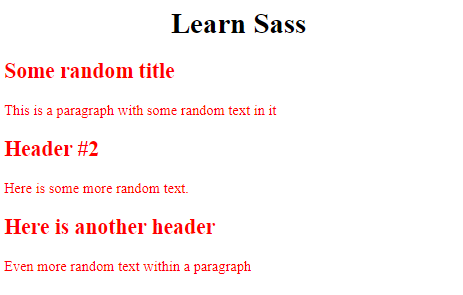
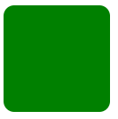
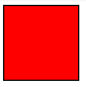
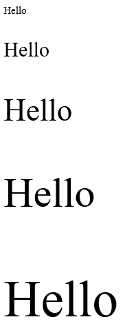

 # SASS

 # Summary

 # Introduction

 Sass (Syntactically Awesome StyleSheets) is a language extension of CSS. It adds features which aren't available in basic CSS

 # Tutorial Commentary

 ## 1: Store Data With Sass Variables

  The code for this step was initialised as:

    

    <h1 class="header">Learn Sass</h1>
    

        <h2>Some random title</h2>
        
This is a paragraph with some random text in it

    

    

        <h2>Header #2</h2>
        
Here is some more random text.

    

    

        <h2>Here is another header</h2>
        
Even more random text within a paragraph

    

And the page looks like:

 Sass allows you to declare and store variables using $ before variable name

 *Create a variable for the text color and apply it to the properties of .blog-post*

    

## 2: Nest CSS with Sass

The code was initialised as:

    

    

        <h1>Blog Title</h1>
        
This is a paragraph

    

Sass allows for nesting of CSS rules!

*Re-organize the CSS rules for both children of .blog-post element*

    

## 3: Create Usable CSS Mixins

A mixin is a group of CSS declarations which can be reused

Suppose we had a div with the following properties:

    div {
        -webkit-box-shadow: 0px 0px 4px #fff;
        -moz-box-shadow: 0px 0px 4px #fff;
        -ms-box-shadow: 0px 0px 4px #fff;
        box-shadow: 0px 0px 4px #fff;
    }

We can abstract out the repetition:

    @mixin box-shadow($x, $y, $blur, $c){
        -webkit-box-shadow: $x $y $blur $c;
        -moz-box-shadow: $x $y $blur $c;
        -ms-box-shadow: $x $y $blur $c;
    }

We can then add the mixin with specified parameters using @include:

    div {
        @include box-shadow(0px, 0px, 4px, #fff);
    }

*Write a mixin for border-radius with $radius parameter. Then givde the #awesome element a border of 15px;*

    

    

Output:

## 4: Use @if and @else to Add Logic To Your Styles

*Create a mixin called border-stroke that takes a parameter $val. The mixinwill check for the following conditions:*

- *light - 1px solid black*
- *medium - 3px solid black*
- *heavy* - 6px solid black*
- *otherwise set border to none*

        

        

Output:

## 5: Use @for to Create a Sass Loop

There are two types of for-loops which can be created:

1. "start through end" - includes the end number
2. "start to end" - excludes end number

E.g.:

    @for $i from 1 through 12 {
        .col-#{$i} { width: 100%/12 * $i; }
    }

*Write @for directive that takes a variable $j that goes from 1 to 6 and creates 5 classs called .text-1, ... text-5 with font-size of 15px times index*

    

    
Hello

    
Hello

    
Hello

    
Hello

    
Hello

Output:

