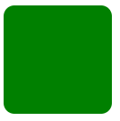
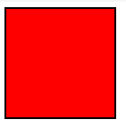
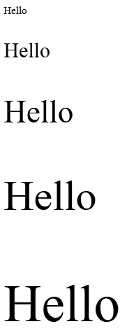
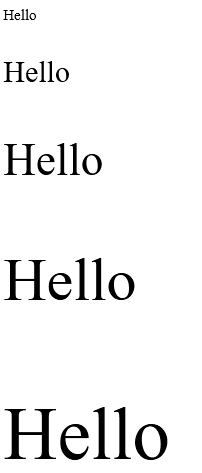
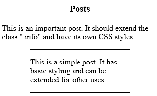
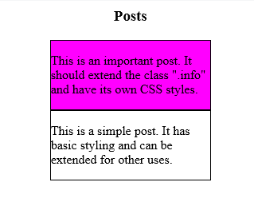

<link href="style.css" rel="stylesheet"></link>

# 3: SASS Tutorial

# ⭕ Table of Contents

[Summary](#%EF%B8%8F-summary)

[Introduction](#-introduction)

[Tutorial Commentary](#-tutorial-commentary)

- [1: Store Data With Sass Variables](#-1-store-data-with-sass-variables)
- [2: Nest CSS with Sass](#-2-nest-css-with-sass)
- [3: Create Usable CSS Mixins](#-3-create-usable-css-mixins)
- [4: Use @if and @else to Add Logic To Your Styles](#-4-use-if-and-else-to-add-logic-to-your-styles)
- [5: Use @for to Create a Sass Loop](#-5-use-for-to-create-a-sass-loop)
- [6:  Use @each to Map Over Items in a List](#-6--use-each-to-map-over-items-in-a-list)
- [7:  Using @while Apply a Style Until a Condition is Met](#-7--using-while-apply-a-style-until-a-condition-is-met)
- [8:  Use Partials to Split Styles to Smaller Chunks](#-8--use-partials-to-split-styles-to-smaller-chunks)
- [9: Using Extend to](#-9-using-extend-to)

# ✏️ Summary

<span style="font-size:20px; font-weight:bold">

### ✅   Sass is not understood by browsers, we use the Sass software to generate a CSS file from a SCSS file

### ✅ We can declare Sass code within a style tag:

```html
<style type='text/scss'>
</style>
```


### ✅ We can create variables using **$** notation:

```html
<style type='text/scss'>
    $x: red;
</style>
```

### ✅ We can then use the value of the variable by calling the variable:

```html
<style type='text/scss'>
    $text-color: red;
    h2 {
        color: $text-color;
    }
</style>
```

### ✅ Sass allows for nesting of rules which improves code readability:

```html
<style type='text/scss'>
    .blog-post {
        h1 {
            color: blue;
        }
        p {
            font-size: 20px;
        }
    }        
</style>
```

### ✅ We can define mixins using @mixin

```css
@mixin box-shadow($x, $y, $blur, $c){
        -webkit-box-shadow: $x $y $blur $c;
        -moz-box-shadow: $x $y $blur $c;
        -ms-box-shadow: $x $y $blur $c;
}
```

### ✅ We use mixins using @include:

```css
div {
    @include box-shadow(0px, 0px, 4px, #fff);
}
```

### ✅ We can apply conditional logic based off variables using @if and @else:

```css
@if $val == light {
    border: 1px solid black;
} @else if $val == medium {
    border: 3px solid black;
} @else {
    border: none;
}
```

### ✅ Create for loops with @for

- We can iterate *through* a loop where the final iteration is included or *to* which excludes final iteration  

```css
@for $i from 1 to 12 { /* loops from 1-11*/
    .col-#{$i} { width: 100%/12 * $i; }
}
@for $i from 1 through 12 { /* loops from 1-12*/
    .col-#{$i} { width: 100%/12 * $i; }
}
```

### ✅ Use @each to iterate over list/map

- To iterate through a list:

```css
@each $color in red, green blue {
    .#{$color}-text {
        color: $color;
    }
}
```

- To iterate through a map:

```css
$colors: (color1:red, color2: blue, color3: green)
@each $key, $color in $colors{
    .#{$color}-text {
        color: $color;
    }
}
```

### ✅ Create While Loops using @while

```css
$x: 1,
@while $x < 13 {
    .cok-#{$x} {
        width: 100%/12 * $x;
    }
    $x: $x+1;
}
```

### ✅ We can use Partials to split up CSS

- Partials must begin with an underscore, e.g. _variables.scss

- To use the partial we must import:

```html
<!-- The main.scss file -->
@import 'variables'
```

### ✅ We can extend CSS rules of another Class using @extend

- Suppose we have a "parent" class defined, we can use its rules using @extend:

```css
.child {
    @extend .parent;
    font-color:red
}
```

</span>

<br>


# ⭕ Introduction

 Sass (Syntactically Awesome StyleSheets) is a language extension of CSS. It adds features which aren't available in basic CSS

>

# ⭕ Tutorial Commentary

## 🟨 1: Store Data With Sass Variables

<h3 class="intro">  ⚪ Intro </h3>

  The code for this step was initialised as:

```html
    <style type='text/scss'>

        .header{
            text-align: center;
        }
        .blog-post, h2 {
            color: red;
        }
        </style>

    <h1 class="header">Learn Sass</h1>
    <div class="blog-post">
        <h2>Some random title</h2>
        <p>This is a paragraph with some random text in it</p>
    </div>
    <div class="blog-post">
        <h2>Header #2</h2>
        <p>Here is some more random text.</p>
    </div>
    <div class="blog-post">
        <h2>Here is another header</h2>
        <p>Even more random text within a paragraph</p>
    </div>
```

And the page looks like:


 Sass allows you to declare and store variables using $ before variable name

<h3 class="task">  🔴 Task </h3>

 *Create a variable for the text color and apply it to the properties of .blog-post*

<h3 class="solution"> 🟢 Solution </h3>


```html
    <style type='text/scss'>
        $text-color: red;
        .header{
            text-align: center;
        }
        .blog-post, h2 {
            color: $text-color;
        }
    </style>
```

<hr>

## 🟨 2: Nest CSS with Sass

<h3 class="intro">  ⚪ Intro </h3>

**The code was initialised as:**

```html
    <style type='text/scss'>
        .blog-post {

        }
        h1 {
            text-align: center;
            color: blue;
        }
        p {
            font-size: 20px;
        }
    </style>

    <div class="blog-post">
        <h1>Blog Title</h1>
        <p>This is a paragraph</p>
    </div>
```

Sass allows for nesting of CSS rules!

<h3 class="task">  🔴 Task </h3>

*Re-organize the CSS rules for both children of .blog-post element*

<h3 class="solution"> 🟢 Solution </h3>

```html
    <style type='text/scss'>
        .blog-post {
            h1 {
            text-align: center;
            color: blue;
            }
            p {
                font-size: 20px;
            }
        }        
    </style>
```

## 🟨 3: Create Usable CSS Mixins

<h3 class="intro">  ⚪ Intro </h3>

A mixin is a group of CSS declarations which can be reused

Suppose we had a div with the following properties:

```css
    div {
        -webkit-box-shadow: 0px 0px 4px #fff;
        -moz-box-shadow: 0px 0px 4px #fff;
        -ms-box-shadow: 0px 0px 4px #fff;
        box-shadow: 0px 0px 4px #fff;
    }
```

We can abstract out the repetition:

```css
    @mixin box-shadow($x, $y, $blur, $c){
        -webkit-box-shadow: $x $y $blur $c;
        -moz-box-shadow: $x $y $blur $c;
        -ms-box-shadow: $x $y $blur $c;
    }
```

We can then add the mixin with specified parameters using @include:

```css
    div {
        @include box-shadow(0px, 0px, 4px, #fff);
    }
```

<h3 class="task">  🔴 Task </h3>

*Write a mixin for border-radius with $radius parameter. Then givde the #awesome element a border of 15px;*

<h3 class="solution"> 🟢 Solution </h3>

```html
<style type='text/scss'>
    @mixin border-radius($radius){
        -webkit-border-radius: $radius;
        -moz-border-radius: $radius;
        -ms-border-radius: $radius;
        border-radius: $radius;
    }

    #awesome {
        width: 150px;
        height: 150px;
        background-color: green;
        @include border-radius(15px);
    }
</style>

<div id="awesome"></div>
```
<h3 class="result">🔵 Result</h3>



<hr>

## 🟨 4: Use @if and @else to Add Logic To Your Styles

<h3 class="task">  🔴 Task </h3>

*Create a mixin called border-stroke that takes a parameter $val. The mixinwill check for the following conditions:*

- *light - 1px solid black*
- *medium - 3px solid black*
- *heavy* - 6px solid black*
- *otherwise set border to none*

<h3 class="solution"> 🟢 Solution </h3>

```html
<style type='text/scss'>

@mixin border-stroke($val){
    @if $val == light {
    border: 1px solid black;
    } @else if $val == medium {
    border: 3px solid black;
    } @else if $val == heavy {
    border: 6px solid black;
    } @else {
    border: none;
    }
}


#box {
    width: 150px;
    height: 150px;
    background-color: red;
    @include border-stroke(medium);
}
</style>

<div id="box"></div>
```

<h3 class="result">🔵 Result</h3>



<hr>

## 🟨 5: Use @for to Create a Sass Loop

There are two types of for-loops which can be created:

1. "start through end" - includes the end number
2. "start to end" - excludes end number

E.g.:

```css
@for $i from 1 through 12 {
    .col-#{$i} { width: 100%/12 * $i; }
}
```

*Write @for directive that takes a variable $j that goes from 1 to 6 and creates 5 classs called .text-1, ... text-5 with font-size of 15px times index*

```html
<style type='text/scss'>

@for $j from 1 to 6{
    .text-#{$j}{
    font-size: 15px * $j;
    }
}

</style>

<p class="text-1">Hello</p>
<p class="text-2">Hello</p>
<p class="text-3">Hello</p>
<p class="text-4">Hello</p>
<p class="text-5">Hello</p>
```

<h3 class="result">🔵 Result</h3>



<hr>

## 🟨 6:  Use @each to Map Over Items in a List

<h3 class="intro">  ⚪ Intro </h3>

The @each directive iterates over a list or map

**The syntax for a list is:**

```css
@each $color in red, green blue {
    .#{$color}-text {
        color: $color;
    }
}
```

**The syntax for a map is:**

```css
$colors: (color1:red, color2: blue, color3: green)
@each $key, $color in $colors{
    .#{$color}-text {
        color: $color;
    }
}
```

Both of the above examples generate the following CSS:

```css
.red-text{ color:red; }
.green-text { color:green; }
.blue-text { color:blue; }
```

<h3 class="task">  🔴 Task </h3>

*Write an @each directive which goes through a list: blue, black, red and assigns each variable to a .color-bg class which sets the background color to their respective colors
*

<h3 class="solution"> 🟢 Solution </h3>

```css
<style type='text/scss'>


  @each $color in blue, black, red{
    .#{$color}-bg{
      background-color: $color;
    }
  }


  div {
    height: 200px;
    width: 200px;
  }
</style>

<div class="blue-bg"></div>
<div class="black-bg"></div>
<div class="red-bg"></div>
```


<h3 class="result">🔵 Result</h3>


<hr>

## 🟨 7:  Using @while Apply a Style Until a Condition is Met

<h3 class="intro">  ⚪ Intro </h3>

We can use the @while directive to apply a rule until a condition is met. E.g.:

```css
$x: 1,
@while $x < 13 {
    .cok-#{$x} {
        width: 100%/12 * $x;
    }
    $x: $x+1;
}
```

<h3 class="task">  🔴 Task </h3>

*Use @while to create a series of classes with different font-sizes. There should be classes text-1, ... , text-5 whhere the font-size is a multiple of 15px
*

<h3 class="solution"> 🟢 Solution </h3>

```html
<style type='text/scss'>

$x: 1;
@while $x < 6{
  .text-#{$x} {
    font-size: 15px * $x;
  }
  $x: $x+1;
}

</style>

<p class="text-1">Hello</p>
<p class="text-2">Hello</p>
<p class="text-3">Hello</p>
<p class="text-4">Hello</p>
<p class="text-5">Hello</p>
```


<h3 class="result">🔵 Result</h3>



<hr>

## 🟨 8:  Use Partials to Split Styles to Smaller Chunks

<h3 class="intro">  ⚪ What is a Partial? </h3>

A Partial is a seperate file which holds a segment of CSS code. These are importged into other Sass files. 

Names for partials begin with an underscore _. These also have a different extension of .scss 

To import a partial you use the @import directive

<h3 class="example"> 🟠 Example </h3>

We can create a Partial for a mixin and store it into a file called _mixins.scss

We can then use them within a main file:

```css
@import 'mixins'
```

<h3 class="task">  🔴 Task </h3>

*Write an @import statement to import a partial _variables.scss into the main.scss file*

<h3 class="solution"> 🟢 Solution </h3>

```html
<!-- The main.scss file -->
@import 'variables'
```

<hr>

## 🟨 9: Using Extend to

<h3 class="intro">  ⚪ Intro </h3>

Sass allows you to take rules from one element and extend it using the @extend directive

<h3 class="example"> 🟠 Example </h3>

Suppose we have a panel class:

```css
.panel{
    background-color: red;
    height: 70px;
    border: 2px solid green;
}
```

We want another panel class which has the same properties as above but more rules for width and font-size, we use the @extend directive:

```css
.big-panel{
    @extend .panel;
    width: 150px;
    font-size: 2em;
}
```


<h3 class="task">  🔴 Task </h3>

*Make a ckass .info-important which extends .info and has a background-color of magenta.*

We have the following HTML:

```html
<style type='text/scss'>
  h3{
    text-align: center;
  }
  .info{
    width: 200px;
    border: 1px solid black;
    margin: 0 auto;
  }

</style>
<h3>Posts</h3>
<div class="info-important">
  <p>This is an important post. It should extend the class ".info" and have its own CSS styles.</p>
</div>

<div class="info">
  <p>This is a simple post. It has basic styling and can be extended for other uses.</p>
</div>

```

Which generates:



<h3 class="solution"> 🟢 Solution </h3>

```css
.info-important{
    @extend .info;
    background-color: magenta;
  }
```


<h3 class="result">🔵 Result</h3>


