<link href="style.css" rel="stylesheet"></link>

# 4 React Tutorial

# ⭕ Table of Contents


# ✏️ Summary

<span style="font-size:20px; font-weight:bold">

### ✅   Sass is not understood by browsers, we use the Sass software to generate a CSS file from a SCSS file


</span>

<br>


# ⭕ Introduction

- React is a library for building modular, component-driven componets for web interfaces.

- React uses its own language called JSX which is a combination of HTML and JavaScript.

- In this tutorial, I will create difference React components, manage data in form of state properties and use different lifecycle methods

# ⭕ Tutorial Commentary

## 🟨 1: Create a Simple JSX element

<h3 class="intro"> ⚪ What is React? </h3>

- React is an open-source library maintained by FaceBook which allows us to render UI of webapps.

- It users an extension of JavaScript called JSX which lets your write JavaScript directly in HTML.

- JSX is an extension of JavaScript allowing us to write JavaScript in JSX. We write JavaScript code in curly braces:

```jsx
{ 'this is JavaScript Code' }
```

- JSX is compiled into JavaScript code, Babel is a popular transpiler.

<h3 class="task"> 🔴 Task </h3>

*The current code uses JSX to assign a div element to a constant JSX.*

*Replace dic with a h1 element and add the text "Hello to JSX!" inside it*

The code is initalised as:

```jsx
const JSX = <div></div>;
```

<h3 class="solution"> 🟢 Solution </h3>

The solution is:

```jsx
const JSX = <h1>Hello JSX!</h1>;
```

<h3 class="result"> 🔵 Result</h3>

The output is:


<hr>

## 🟨 2: Create a Complex JSX element

<h3 class="intro"> ⚪ Complex JSX Elements </h3>

- A valid JSX element must return a single element, hence multiple elements must be nested inside one parent element!

- **Valid JSX:**

```jsx
<div>
  <p>Paragraph One</p>
  <p>Paragraph Two</p>
  <p>Paragraph Three</p>
</div>
```

- **Invalid JSX**

```jsx
<p>Paragraph One</p>
<p>Paragraph Two</p>
<p>Paragraph Three</p>
```

<h3 class="task"> 🔴 Task </h3>

*Define a new constant JSX which renders a div which contains the following elements in order:*

* A h1, a p, and an unordered list with three elements.*

<h3 class="solution"> 🟢 Solution </h3>

The solution is:

```jsx
const JSX = <div><h1>Shiv Kumar</h1>
  <p>I like to code in:</p>
  <ul>
    <li>Java</li>
    <li>JavaScript</li>
    <li>SQL</li>
  </ul>
</div>
```

<h3 class="result"> 🔵 Result</h3>

The output is:

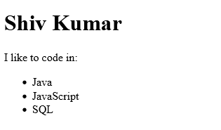

<hr>

## 🟨 3: Add Comments in JSX

<h3 class="intro"> ⚪ JSX Comments </h3>

- The syntax for comments in JSX is:

```jsx
{/*this is a comment */}
```

<hr>

## 🟨 4: Render HTML Elements to the DOM

<h3 class="intro"> ⚪ What is DOM? </h3>

- DOM is the data reperesentation of the object which compise the structure and content of a web document.

- The DOMis a programming interface for a web document, it can be modified by a language like JavaScript

<h3 class="intro"> ⚪ What is ReactDOM? </h3>

- ReactDOM offers a simple method to render React elements to the DOM.

- It has the following syntax:

```jsx
ReactDOM.render(componentToRender, targetNode)
```

- The .render() method must be called after JSC element declarations

<h3 class="task"> 🔴 Task </h3>

The code editor has a simple JSX component, use the .render() method to rend the component to the page.

Use document.getElementById() to select the DOM node to render them to.

There is a div with id='challenge-node' available for you to use. 

The code is initialised as:

```jsx
const JSX = (
  <div>
    <h1>Hello World</h1>
    <p>Lets render this to the DOM</p>
  </div>
);
// Change code below this line
```

<h3 class="solution"> 🟢 Solution </h3>

The solution is:

```jsx
const JSX = (
  <div>
    <h1>Hello World</h1>
    <p>Lets render this to the DOM</p>
  </div>
);
// Change code below this line
ReactDOM.render(JSX, document.getElementById('challenge-node'))
```

<h3 class="result"> 🔵 Result</h3>

The output is:


<hr>

## 🟨 5: Define a HTML Class in JSX

<h3 class="intro"> ⚪ HTML Classes </h3>

- HTML classes are defined using className, as class is a reserved keyword in JavaScript.

<h3 class="task"> 🔴 Task </h3>

*Apply a class of myDiv to the div in the below code.*

The code is initialised as:

```jsx
const JSX  = (
    <div>
        <h1>Add a class to this div</h1>
    </div>
);
```

<h3 class="solution"> 🟢 Solution </h3>

The solution is:

```jsx
const JSX = (
  <div className="myDiv">
    <h1>Add a class to this div</h1>
  </div>
);
```

<h3 class="result"> 🔵 Result</h3>

The output is:

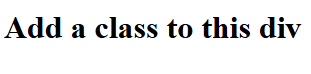

<hr>

## 🟨 6: Learn about Self-Closing JSX Tags

- In JSX, any element can be written as a self-closing tag ( like &lt;br /> in HTML)

- E.g. &lt;div>&lt;/div> can be written as &lt;div /> or &lt;div>&lt;/div> but not as &lt;div> alone!

- Self closing tags like &lt;br> must be closed!

<h3 class="task"> 🔴 Task </h3>

Fix the errors in the code below so that it is valid JSX and successfully transpiles.

```jsx
const JSX = (
  <div>
    <h2>Welcome to React!</h2> <br >
    <p>Be sure to close all tags!</p>
    <hr >
  </div>
);
```

<h3 class="solution"> 🟢 Solution </h3>

The solution is:

```jsx
const JSX = (
  <div>
    <h2>Welcome to React!</h2> <br />
    <p>Be sure to close all tags!</p>
    <hr />
  </div>
);
```

<h3 class="result"> 🔵 Result</h3>

The output is:

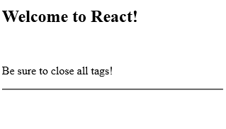

<hr>

## 🟨 7: Create a Stateless Functional Component

- We shall learn how to create components as these are the key building blocks of react

- We can create a React component in two ways, one ways is to write a JavaScript function which returns either JSX or null

- ⚠️ JavaScript function must begin with captial letter ⚠️

<h3 class="example"> 🟠 Example </h3>

- Here is a stateless functional component which assigns a HTML class in JSX:

```jsx
const DemoComponent = function(){
  return (
    <div className='customClass' />
  );
};
```

<h3 class="task"> 🔴 Task </h3>

The code editor defines an emptry function called MyFunction:

```jsx
const MyComponent = function(){

}
```

Complete the function so that is returns a single div which contains some text

<h3 class="solution"> 🟢 Solution </h3>

The solution is:

```jsx
const MyComponent = function() {
  return (
    <div>Hello World!</div>
  );
}
```

<h3 class="result"> 🔵 Result</h3>

The output is:

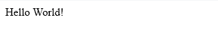

<hr>

## 🟨 8: Creating a React Component Using class Syntax

- The other way to create a React component is to use the ES6 class syntax.

<h3 class="example"> 🟠 Example </h3>

- Here is a Kitten class which extends React.Component:

```jsx
class Kitten extends React.Component {
  constructor(props){
    super(props);
  }

  render() {
    return (
      <h1>Hi</h1>
    );
  }
}
```

- It is best practice to call the component's constructor with super and pass both properties.

<h3 class="task"> 🔴 Task </h3>

Finish writing the render method so it returns a div with a h1 element with the text Hello React!

The code is initialised as:

```jsx
class MyComponent extends React.Component {
  constructor(props){
    super(props);
  }
  render(){

  }
}
```

<h3 class="solution"> 🟢 Solution </h3>

The solution is:

```jsx
class MyComponent extends React.Component {
  constructor(props) {
    super(props);
  }
  render() {
    return (
      <div>
        <h1>Hello React!</h1>
      </div>
    );
  }
};
```

<h3 class="result"> 🔵 Result</h3>

The output is:


<hr>

## 🟨 9: Using Composition within Components

<h3 class="example"> 🟠 Example </h3>

- Suppose we want to build an app with three components: a Navbar, Dashboard and Footer

- To compose these components together, you can create an App conponent which renders each of the three child components.

- You write each of the child components as custom tags wrapped with &lt; and &gt; symbols.

- E.g. the render method would contain:

```jsx
return (
  <App>
    <Navbar />
    <Dashboard />
    <Footer />
  </App>
)
```

<h3 class="task"> 🔴 Task </h3>

- The code below defines a simple functional component called ChildComponent and a class called ParentComponent.

- Compose the two together by rendering ChildComponent within the ParentComponent.

```jsx
const ChildComponent = () => {
  rerutn (
    <div>
      <p>I am the child</p>
    </div>
  );
};

class ParentComponent extends React.Component {
  constructor(props){
    super(props);
  }
  render() {
    return (
      <div>
        <h1>I am the parent</h1>
        {/* change code below this line*/}

        {/* change code above this line*/}
      </div>
    );
  }
};
```

The above code generates:


<h3 class="solution"> 🟢 Solution </h3>

The solution is:

```jsx
const ChildComponent = () => {
  return (
    <div>
      <p>I am the child</p>
    </div>
  );
};

class ParentComponent extends React.Component {
  constructor(props) {
    super(props);
  }
  render() {
    return (
      <div>
        <h1>I am the parent</h1>
        { /* Change code below this line */ }
        <ChildComponent />
        { /* Change code above this line */ }
      </div>
    );
  }
};
```

<h3 class="result"> 🔵 Result</h3>

The output is:

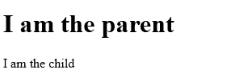

<hr>

## 🟨 10: Use React to Render Nested Components

<h3 class="task"> 🔴 Task </h3>

- There are two functional components: TypeosOfFruit and Fruits.

- Take the TypesOfFruit component and compose it within the Fruits component. 

- Then take the Fruits component and compose it within the TypseOfFood component.

- The initialised code looks like:

```jsx
const TypesOfFruit = () => {
  return (
    <div>
      <h2>Fruits:</h2>
      <ul>
        <li>Apples</li>
        <li>Blueberries</li>
        <li>Strawberries</li>
        <li>Bananas</li>
      </ul>
  );
};

const Fruits = () => {
  return (
    <div>
      {/* change code below this line*/}

      {/* change code above this line*/}
  );
};

class TypesOfFood extends React.Component {
  constructor(props){ super(props); }
  render {
    return (
      <div>
        <h1>Types of Food:</h1>
        {/* change code below this line*/}

        {/* change code above this line*/}
      </div>
    );
  }
};
```

- The code currently outputs:


<h3 class="solution"> 🟢 Solution </h3>

The solution is:

```jsx
const TypesOfFruit = () => {
  return (
    <div>
      <h2>Fruits:</h2>
      <ul>
        <li>Apples</li>
        <li>Blueberries</li>
        <li>Strawberries</li>
        <li>Bananas</li>
      </ul>
    </div>
  );
};

const Fruits = () => {
  return (
    <div>
      { /* change code below this line */ }
      <TypesOfFruit />
      { /* change code above this line */ }
    </div>
  );
};

class TypesOfFood extends React.Component {
  constructor(props) { super(props); }
  render() {
    return (
      <div>
        <h1>Types of Food:</h1>
        { /* change code below this line */ }
        <Fruits />
        { /* change code above this line */ }
      </div>
    );
  }
};
```

<h3 class="result"> 🔵 Result</h3>

The output is:

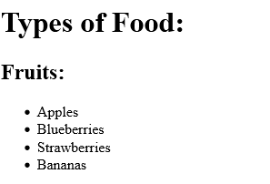

<hr>

## 🟨 11: Compose React Components

<h3 class="task"> 🔴 Task </h3>

- The code below has a TypesOfFood component is always rendering a Vegetable componet.

- There is also a Fruits component, nest two components inside of Fruits, first NonCitrus then Citrus.

- Nest the Fruits component into the TypesOfFood component below the h1 heading

- The code is initialised as:

```jsx
class Fruit extends React.Component {
  constructor(props){ super(props); }
  render() {
    return (
      <div>
        <h2>Fruits:</h2>
        {/* change code below this line*/}

        {/* change code above this line*/}
      </div>
    );
  }
};

class TypesOfFood extend React.component {
  constructor(props) { super(props); }
  render() {
    return (
      <div>
        <h1>Types of Food:</h1>
        { /* Change code below this line */ }

        { /* Change code above this line */ }
        <Vegetables />
      </div>
    );
  }
};
```

- This outputs:

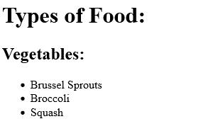


<h3 class="solution"> 🟢 Solution </h3>

The solution is:

```jsx
class Fruits extends React.Component {
  constructor(props) {
    super(props);
  }
  render() {
    return (
      <div>
        <h2>Fruits:</h2>
        { /* Change code below this line */ }
        <NonCitrus />
        <Citrus />
        { /* Change code above this line */ }
      </div>
    );
  }
};

class TypesOfFood extends React.Component {
  constructor(props) {
     super(props);
  }
  render() {
    return (
      <div>
        <h1>Types of Food:</h1>
        { /* Change code below this line */ }
        <Fruits />
        { /* Change code above this line */ }
        <Vegetables />
      </div>
    );
  }
};
```


<h3 class="result"> 🔵 Result</h3>

The output is:

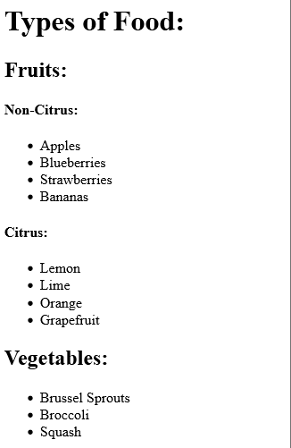

<hr>

## 🟨 12: Render a Class Component to the DOM

<h3 class="intro"> ⚪ Introduction </h3>

- In order to render code you write to the DOM, you must make a call to the ReactDOM APO.

- The syntax is:

```jsx
ReactDOM.render(componentToRender, targetNode);
```

<h3 class="task"> 🔴 Task </h3>

- We have Fruits and Vegetables components are defined behind the scenese.

- Render both of these components into a TypoOfFood component, then render TypoOfFood to the DOM

- There is a div with id='challenge-node' available to use

- The code is initialised as:

```jsx
class TypesOfFood extends React.Component {
  constructor(props){ super(props); }
  render(){
    return (
      <div>
        <h1>Type of Food:</h1>
        {/* change code below this line*/}
        {/* change code above this line*/}
      </div>
    );
  }
};
// change code below this line
```

<h3 class="solution"> 🟢 Solution </h3>

The solution is:

```jsx
class TypesOfFood extends React.Component {
  constructor(props){ super(props); }
  render(){
    return (
      <div>
        <h1>Type of Food:</h1>
        {/* change code below this line*/}
        <Fruits />
        <Vegetables />
        {/* change code above this line*/}
      </div>
    );
  }
};
// change code below this line
ReactDOM.render(<TypesOfFood />, document.getElementById('challenge-node'));
```

<h3 class="result"> 🔵 Result</h3>

The output is:

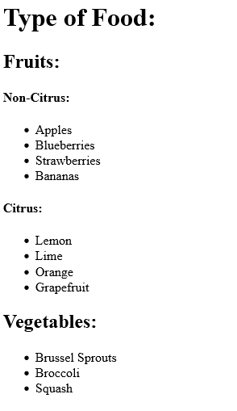

<hr>

## 🟨 13: Writing a React Component from Scratch

<h3 class="intro"> ⚪ Intro </h3>

- A react componment extends React.Component and has a .render() method which returns HTML (JSX) or null

<h3 class="task"> 🔴 Task </h3>

- Define a MyComponent class with a return method which returns a div which contains h1 tag with the text: My First React Component

- Render this component to DOM to a node with id='challenge-node'

<h3 class="solution"> 🟢 Solution </h3>

The solution is:


```jsx
class MyComponent extends React.Component {
  constructor(props) {
    super(props);
  }
  render() {
    return (
      <div>
        <h1>My First React Component!</h1>
      </div>
    );
  }
};
ReactDOM.render(<MyComponent />,document.getElementById('challenge-node'));
```

<h3 class="result"> 🔵 Result</h3>

The output is:

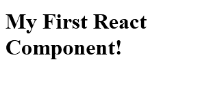

<hr>


## 🟨 14: Pass Props to a Stateless Functional Component

<h3 class="intro"> ⚪ Intro </h3>

- React allows you to pass properties into child components

<h3 class="example"> 🟠 Example </h3>

- Suppose you have an App component which renders a child component called Welcome which is a stateless functional component. You can pass Welcome a user property by writing:

```jsx
<App>
  <Welcome user='Mark' />
</App>
```

- You can use custom HTML attributes created by you! Since Welcome is stateless, it can access the user variable by:

```jsx
const Welcome = (props) => <h1>Hello. {props.user}!</h1>
```

<h3 class="task"> 🔴 Task </h3>

- When rendering CurrentDate from the Calendar component, pass in a property of date assigned to the current date from JavaScript's Date object.


- Thew code is initialised as:

```jsx
const CurrentDate = (prop) => {
  return (
    <div>
      { /* Change code below this line */ }
      <p>The current date is: </p>
      { /* Change code above this line */ }
  );
};

class Calendar extends React.Component {
  constructor(props){ super(props); }
  render() {
    return (
      <div>
      <h3>What date is it?</h3>
        { /* Change code below this line */ }
        <CurrentDate />
        { /* Change code above this line */ }
      </div>
    );
  }
};
```

<h3 class="solution"> 🟢 Solution </h3>

- I updated the CurrentDate component so it calls the date from the props object:

```jsx
const CurrentDate = (props) => {
  return (
    <div>
      { /* Change code below this line */ }
      <p>The current date is: {props.date}</p>
      { /* Change code above this line */ }
    </div>
  );
};
```

- I then passed a property to the CurrentDate declaration in the Calendar component:

```jsx
class Calendar extends React.Component {
  constructor(props) {
    super(props);
  }
  render() {
    return (
      <div>
        <h3>What date is it?</h3>
        { /* Change code below this line */ }
        <CurrentDate date={Date()} />
        { /* Change code above this line */ }
      </div>
    );
  }
};
```

<h3 class="result"> 🔵 Result</h3>

The output is:

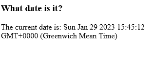

<hr>


## 🟨 15: Pass an Array as Props

- We can pass an array by wrapping it with curly braces

<h3 class="example"> 🟠 Example </h3>

- E.g., we can pass a colors array:

```jsx
<ParentComponent>
  <ChildComponent colors={["green", "blue", "red"]} />
</ParentComponent>
```

- We can then access it using a call to props.colors

<h3 class="task"> 🔴 Task </h3>

- When rendering each List from ToDo component, pass a tasks property to an array of tasks

- Then access the tasks array in the List component, showing its value within the p element as a comma seperated list.

- Todays list should have atleast 2 tasks

- Tomorrows list should have atleast 3 tasks

- The code was initialised as:

```jsx
const List = (props) => {
  { /* Change code below this line */ }
  return <p></p>
  { /* Change code above this line */ }
};

class ToDo extends React.Component {
  constructor(props) {
    super(props);
  }
  render() {
    return (
      <div>
        <h1>To Do Lists</h1>
        <h2>Today</h2>
        { /* Change code below this line */ }
        <List />
        <h2>Tomorrow</h2>
        <List />
        { /* Change code above this line */ }
      </div>
    );
  }
};
```


<h3 class="solution"> 🟢 Solution </h3>

- The solution is:

```jsx
const List = (props) => {
  { /* Change code below this line */ }
  return <p>{props.tasks.join(", ")}</p>
  { /* Change code above this line */ }
};

class ToDo extends React.Component {
  constructor(props) {
    super(props);
  }
  render() {
    return (
      <div>
        <h1>To Do Lists</h1>
        <h2>Today</h2>
        { /* Change code below this line */ }
        <List tasks={['finish this course', 'eat food']}/>
        <h2>Tomorrow</h2>
        <List tasks={['go work', 'squat', 'cook']}/>
        { /* Change code above this line */ }
      </div>
    );
  }
};
``` 

<h3 class="result"> 🔵 Result</h3>

The output is:

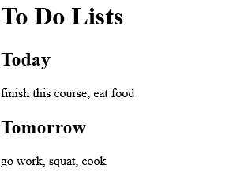

<hr>


## 🟨 16: Use Default Props

- React has an option to set default properties.

- We can do this using the defaultProps property.

<h3 class="task"> 🔴 Task </h3>

- Define default props on the ShoppingCart component of items with value of 0.

- The code is initialised as:

```jsx
const ShoppingCart = (props) => {
  return (
    <div>
      <h1>Shopping Cart Component</h1>
    </div>
  );
};
```

<h3 class="solution"> 🟢 Solution </h3>

- The solution is:

```jsx
const ShoppingCart = (props) => {
  return (
    <div>
      <h1>Shopping Cart Component</h1>
    </div>
  )
};
ShoppingCart.defaultProps = {items:0};
```

<hr>


## 🟨 17: Override Default Props

- We can explicitly override the default props of a component.

<h3 class="task"> 🔴 Task </h3>

- The ShoppingCart component now renders a child component Items.

- The Items component has a default prop quantity set to 0

- Override the default prop by passing it with a value of 10 for quantity.

- The code is initialised as:

```jsx
const Items = (props) => {
  return <h1>Current Quantity of Items in Cart: {propse.quantity}</h1>
}
Items.defaultProps= { quantity: 0}

class ShoppingQuantity extends React.Component {
  constructor(props){ super(props);}
  render(){
    { /* Change code below this line */ }
    return <Items />
    { /* Change code above this line */}
  }
};
```

<h3 class="solution"> 🟢 Solution </h3>

- The ShoppingCart class has been updated to:

```jsx
class ShoppingCart extends React.Component {
  constructor(props) {
    super(props);
  }
  render() {
    { /* Change code below this line */ }
    return <Items quantity={10} />
    { /* Change code above this line */ }
  }
};
```

<h3 class="result"> 🔵 Result</h3>

The output is:

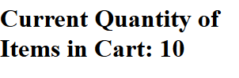

<hr>


## 🟨 18: Use PropTypes to Define Props You Expect

<h3 class="intro"> ⚪ Intro </h3>

- React offers type-checking features to verify components receive correct props.

- E.g., we can set propTypes to require an array.

- We define propTypes by setting the .propTypes property of the component and using the key to specify the name of the property

<h3 class="example"> 🟠 Example </h3>

- Here we specify the onClick prop must be a function and is required.

```jsx
MyComponent.propTypes = { handleClick: PropTypes.func.isRequired }
```

<h3 class="task"> 🔴 Task </h3>

- Define propTypes for the Items component to require quantity as a prop and verify it is of type number

- The code is initialised as:

```jsx
const Items = (props) => {
  return <h1>Current Quantity of Items in Cart: {props.quantity}</h1>
};

// Change code below this line

// Change code above this line

Items.defaultProps = { quantity: 0};

class ShoppingCart extends React.Component {
  constructor(props) { super(props); }
  render() { return <Items />}
};
```

<h3 class="solution"> 🟢 Solution </h3>

- I add the following line:

```jsx
// Change code below this line
Items.propTypes = {quantity:PropTypes.number.isRequired }
// Change code above this line
```

<h3 class="result"> 🔵 Result</h3>

The output is:

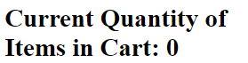

<hr>


## 🟨 19: Access Props Using this.props

- To refer to a class component within itself you must use *this* keyword

- E.g, to access a data prop within a class, you write:

```jsx
{this.props.data}
```

<h3 class="task"> 🔴 Task </h3>

- Render an instance of the Welcome component in teh parent component App.

- Give Welcome a prop of name and assign it a value of a string

- Within the Welcome element, access the name prop within the strong tags.

- The code is initialised as:

```jsx
class App extends React.Component {
  constructor(props) { super(props); }
  render(){
    return (
      <div>
        {/* change the code below this line */}
        <Welcome />
        { /* Change code above this line */ }
    );
  }
};

class Welcome extends React.Component {
  constructor(props){ super(props); }
  render() {
    return (
      <div>
        { /* Change code below this line */ }
        <p>Hello, <strong></strong>!</p>
        { /* Change code below this line */ }
      </div>
    );
  }
};
```

<h3 class="solution"> 🟢 Solution </h3>

- I added a property to the Welcome Tag in the App component:

```jsx
<Welcome name="Shiv"/>
```

- I then updated the &lt;p> tag in the Welcome component declaration:

```jsx
<p>Hello, <strong>{this.props.name}</strong>!</p>
```

<h3 class="result"> 🔵 Result</h3>

The output is:


<hr>


## 🟨 20: Review Using Props with Stateless Functional Components

- So far we have been passing props to stateless functional components - these components are acting as pure functions.

- A **stateless functional component** is any function which accepts props and returns JSX.

- A **stateless component** is a class which extends React.Component, but does not use internal state

- A **stateful component** is a class component which does maintain its own internal state.

<h3 class="task"> 🔴 Task </h3>

- There is a CampSite component which renders a Camper component as a child

- Define the Camper component and assign it default props of { name: 'CamperBot' }

- Inside the Camper component, make sure to have one p element whidh only the name value that is passed in as a prop

- Define a propTypes on the Camper to require name which is of type string

- The code is intialised as:

```jsx
class CampSite extends React.Component {
  constructor(props){ super(props); }
  render() {
    return (
      <div>
        <Camper />
      </div>
    );
  }
};
// Change code below this line
```

<h3 class="solution"> 🟢 Solution </h3>

- I add the following below the CampSite component:

```jsx
class Camper extends React.Component {
  constructor(props) { super(props); }
  render(){
    return (
      <div>
        <p>{this.props.name}</p>
      </div>
    )
  }
};
Camper.defaultProps = {name:"CamperBot"}
Camper.propTypes = {name:PropTypes.string.isRequired}
```

<h3 class="result"> 🔵 Result</h3>

This outputs:

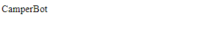

<hr>


## 🟨 21: Createful a Statefut Component

<h3 class="intro"> ⚪ Creating States </h3>

- State consists of any data your application needs to know about

- You want your app to respond to state changes, React offers a nice solution for state management!

- You create state by declaring state property on the component class in its constructor - this initialises it

- The state must be set to a JavaScript object, we can declare it using:

```jsx
this.state = { }
```

- You have access to state throughout the life of your component.

<h3 class="task"> 🔴 Task </h3>

- There is a StatefulCompoment defined below which is trying to render firstName property from the state

- Initialise the state in the constructor!

- The code is initialised as:

```jsx
class StatefulComponent extends React.Component {
  constructor(props){
    super(props);
    // Only change code below this line

    // Only change code above this line
  }
  render(){
    return (
      <div>
        <h1>{this.state.firstName}</h1>
      </div>
    );
  }
};
```

<h3 class="solution"> 🟢 Solution </h3>

- I add the following line to my constructor:

```jsx
this.state = { firstName: "Shiv" }
```

<h3 class="result"> 🔵 Result</h3>

The output is:


<hr>


## 🟨 22: Render State in the User Interface

- State can be accessed via this.state within the render() method.

- State should be encapsulated!

<h3 class="task"> 🔴 Task </h3>

- The MyComponent defined is stateful!

- Define a h1 tag in the component's render method which renders the value of name from the component's state.

- The code is intialised as:

```jsx
class MyComponent extends React.Component {
  constructor(props) {
    super(props);
    this.state = {
      name: 'freeCodeCamp'
    }
  }
  render() {
    return (
      <div>
        { /* Change code below this line */ }
        
        { /* Change code above this line */ }
      </div>
    );
  }
};
```

<h3 class="solution"> 🟢 Solution </h3>

- I add the following line between the comments:

```jsx
<h1>{this.state.name}</h1>
```

<h3 class="result"> 🔵 Result</h3>

The output is:


<hr>


## 🟨 23: Render State in UI in another way

- We can also access statw within the render() method within JavaScript code.

<h3 class="task"> 🔴 Task </h3>

- Within the render() method, define a const called name and set it equal to the name value in the component's state.

- The code is initialised as:

```jsx
class MyComponent extends React.Component {
  constructor(props){ 
    super(props);
    this.state = { name: 'FreeCodeCamp' }
  }
  render() {
    // change code below this line

    // change code above this line
    return(
      <div>
        { /* Change code below this line */ }

        { /* Change code above this line */ }
      </div>
    );
  }
}
```

<h3 class="solution"> 🟢 Solution </h3>

- Within the render() method, I initialise a name constant:

```javascript
const name = this.state.name;
```

- I then use this variable in the div:

```jsx
<h1>{name}</h1>
```

<h3 class="result"> 🔵 Result</h3>

The output is:


<hr>


## 🟨 24: Set State using this.setState()

- Previously, we initialisewd state in the constructor.

- React offers another way to set state using the setState method.

- We can call this method within the class via this.setState(). We pass it an object with key-value pair.

- React does not expect you to modify the state directly insteady to use setState()

<h3 class="task"> 🔴 Task </h3>

- The code below defines aa button with a onClick() handler.

- The handler is trigger when the buttom receieves a click event.

- Within the handleClick method, update the handleClick method, update the state using setState.

- Set the name property to "React Rocks!"

- The code is initialised as:

```jsx
class MyComponent extends React.Component {
  constructor(props){
    super(props);
    this.state = { name: 'Initial State' };
    this.handleClick = this.handleClick.bind(this);
    handleClick() {
    // Change code below this line

    // Change code above this line
    }
    render() {
      return (
        <div>
          <button onClick={this.handleClick}>Click Me</button>
            <h1>{this.state.name}</h1>
          </button>
        </div>
      );
    }
  }
}
```

<h3 class="solution"> 🟢 Solution </h3>

- I add the following line:

```jsx
this.setState({name:'React Rocks!'})
```

<h3 class="result"> 🔵 Result</h3>

The page is initialised as:

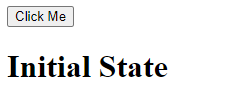

Clicking on the page:

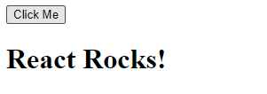

<hr>


## 🟨 25: Bind 'this' to a Class Method

- We need to allow a method to use the "this" keyword.

- One way is to bind "this" in the constructor

- In the previous example we used:

```jsx
this.handleClick = this.handleClick.bind(this)
```

<h3 class="task"> 🔴 Task </h3>

- Fix the MyComponent class so that by explicitly binding this to the handleClick method

- Add an onClick handler to the button, so that the text is update in the h1 tags

- The code is initialised as:

```jsx
class MyComponent extends React.Component {
  constructor(props) {
    super(props);
    this.state = {
      text: "Hello"
    };
    // Change code below this line

    // Change code above this line
  }
  handleClick() {
    this.setState({
      text: "You clicked!"
    });
  }
  render() {
    return (
      <div>
        { /* Change code below this line */ }
        <button >Click Me</button>
        { /* Change code above this line */ }
        <h1>{this.state.text}</h1>
      </div>
    );
  }
};
```

<h3 class="solution"> 🟢 Solution </h3>

I update the code to:

```jsx
class MyComponent extends React.Component {
  constructor(props) {
    super(props);
    this.state = {
      text: "Hello"
    };
    // Change code below this line
    this.handleClick = this.handleClick.bind(this);
    // Change code above this line
  }
  handleClick() {
    this.setState({
      text: "You clicked!"
    });
  }
  render() {
    return (
      <div>
        { /* Change code below this line */ }
        <button onClick={this.handleClick}>Click Me</button>
        { /* Change code above this line */ }
        <h1>{this.state.text}</h1>
      </div>
    );
  }
};
```

<h3 class="result"> 🔵 Result</h3>

The page initialises as:


After clicking:

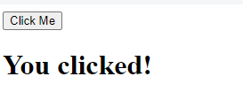


<hr>


## 🟨 26: Use State to Toggle an Element

- React may batch multiple setState() calls to a single update, meaning we can not rely on the previous value of this.states or this.props when calculating the next value.

- We can not write code like this:

```jsx
this.setState({counter: this.state.counter + this.props.incrmement })
```

- Instead, we should pass a function to the setState to access state and props which guarantees you are working with the most current  values of state and props. Hence, the above should be written as:

```jsx
this.setState((state, propa) => ({
  counter: state.counter + props.increment
}));
```

<h3 class="task"> 🔴 Task </h3>

- MyComponent has a visibility property initialised to false.

- The render methodf reutrns a view dependent on visibility.

- Currently, there is no way to update visibility in components state.

- Pass a function setState to define a method so the visbility toggles

- The code is initialised as:

```jsx
class MyComponent extends React.Component {
  constructor(props){ 
    super(props);
    this.state = {
      visibility: false
    };
    // Change code below this line

    // Change code above this line
  }
  // Change code below this line

  // Change code abov
  render() {
    if (this.state.visibility){
      return (
        <div>
          <button onClick={this.toggleVisibility}>Click Me</button>
          <h1>Now you see me!<h1>
        </div>
      )
    } else {
      return (
        <div>
          <button onClick={this.toggleVisibility}>Click Me</button>
        </div>
      );
    }
  }
}
```
<h3 class="solution"> 🟢 Solution </h3>

```jsx
class MyComponent extends React.Component {
  constructor(props) {
    super(props);
    this.state = {
      visibility: false
    };
    // change code below this line
    this.toggleVisibility = this.toggleVisibility.bind(this);
    // change code above this line
  }
  // change code below this line
  toggleVisibility() {
    this.setState(state => {
      if (state.visibility === true) {
         return { visibility: false };
       } else {
         return { visibility: true };
      }
    });
  }
  // change code above this line
  render() {
    if (this.state.visibility) {
      return (
        <div>
          <button onClick={this.toggleVisibility}>Click Me</button>
          <h1>Now you see me!</h1>
        </div>
      );
    } else {
      return (
        <div>
          <button onClick={this.toggleVisibility}>Click Me</button>
        </div>
      );
    }
  }
};
```

<h3 class="result"> 🔵 Result</h3>


<hr>


## 🟨 27: Write a Simple Counter


<h3 class="task"> 🔴 Task </h3>

- The Counter component keeps track of a count value in state

- There are two buttons which call increment() and decrement() methods.

- Write these methods so the counter value is incremented/decremented by 1

- Create a reset() method which sets the value to 0

<h3 class="solution"> 🟢 Solution </h3>

```jsx
class Counter extends React.Component {
  constructor(props) {
    super(props);
    this.state = {
      count: 0
    };
    // Change code below this line
    this.increment = this.increment.bind(this);
     this.decrement = this.decrement.bind(this);
     this.reset = this.reset.bind(this);
    // Change code above this line
  }
  // Change code below this line
    increment() {
      this.setState(state=>{
        const incremented = state.count + 1;
        return {count:incremented};
      });
    };
        decrement() {
      this.setState(state=>{
        return {count:state.count-1};
      });
    };
        reset(){
      this.setState(state=>{
        return {count:0};
      });
    };
  // Change code above this line
  render() {
    return (
      <div>
        <button className='inc' onClick={this.increment}>Increment!</button>
        <button className='dec' onClick={this.decrement}>Decrement!</button>
        <button className='reset' onClick={this.reset}>Reset</button>
        <h1>Current Count: {this.state.count}</h1>
      </div>
    );
  }
};
```

<h3 class="result"> 🔵 Result</h3>


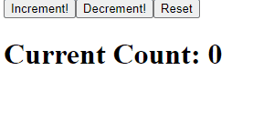


<hr>


## 🟨 28: Write a Controlled Input

<h3 class="task"> 🔴 Task </h3>

- The below code has the skeleton of a component called ControlledInput to create a controlled "input" element

- The components state is already initialised with an input property that holds an empty string.

1. Create a method called handleChange() that has a parameter called event. When the method receives an event, it receives an event object which contains a string of text from input element.

2. In the render method, create the input element above the h4 tag. Add a value attribute equal to input property from state. Then add an onChange() even handler set to handleChange() method

- When yout type in input box, thge text should be processed by handleChange() method set as the input property in local state.

- The code is initialised as:

```jsx
class ControlledInput extends React.Component {
  constructor(props){ 
    super(props);
    this.state = { input: '' };
    // change code below this line

    // change code above this line
    }
    // change code below this line

    // change code above this line
  render(){
    return(
      <div>
        {/* change code below this line */ }
        
        {/* change code above this line */ }
        <h4>Controlled Input:</h4>
        <p>{this.state.onput}</p>
      </div>
    );
  }
};
```


- The output currently looks like:

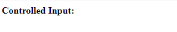

<h3 class="solution"> 🟢 Solution </h3>

- I first define the handleChange() method as:

```jsx
handleChange(event){
  this.setState({input:event.target.value});
}
```

- I then add the binding of the handleChange() method:

```jsx 
this.handleChange = this.handleChange.bind(this);
```

- I add the input element to the render() method whose value is set to the input of the state. I also set the onChange attribute to call the handleChange() method:


```jsx
<input value={this.state.value} onChange = {this.handleChange}>
```

- **The final code looks like:**

```jsx
class ControlledInput extends React.Component {
  constructor(props) {
    super(props);
    this.state = {
      input: ''
    };
    // Change code below this line
    this.handleChange = this.handleChange.bind(this);
    // Change code above this line
  }
  // Change code below this line
  handleChange(event) {
    this.setState({
      input: event.target.value
    });
}
  // Change code above this line
  render() {
    return (
      <div>
        { /* Change code below this line */}
        <input value={this.state.input} onChange={this.handleChange}></input>
        { /* Change code above this line */}
        <h4>Controlled Input:</h4>
        <p>{this.state.input}</p>
      </div>
    );
  }
};
```

<h3 class="result"> 🔵 Result</h3>

The output looks like:

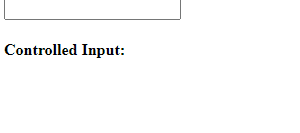

<hr>


## 🟨 29: Create a Controlled Form

- Controlled elements are elements whose internal state is controlled by React!

<h3 class="task"> 🔴 Task </h3>

- The code below has a MyForm component set up with an empty form with a submit handler. Thye submit handle will be called when the form is submitted.

- A submit button is included.

- Add the input element and set iuts value and onChange() attributes

- Complete the hanleSubmit method so that it set the component state property submit to the current input value in the local state.

- Finally, create a h1 tag after the form which renders the submit value from the component's state.

- **The code is initialised as:**

```jsx
class MyForm extends React.Component {
  constructor(props){
    super(props);
    this.state = {
      input: '', submit: ''
    }
    this.handleChange = this.handleChange.bind(this);
    this.handleSubmit = this.handlSubmit.bind(this);
    handleChange(event){
      this.setState({
        input: event.target.value
      });
    }
    handleSubmit(){
      // Change code below this line

      // Change code above this line
    }
    render(){
      return (
        <div>
          <form onSubmit={this.handleSubmit}>
            {/* Change code below this line */}

            {/* Change code above this line */}
            <button type='submit'>Submit!</button>
          </form>
          {/* Change code below this line */}

          {/* Change code above this line */}
        </div>
      );
    }
  }
}
```

The current output looks like:

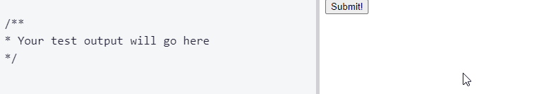


<h3 class="solution"> 🟢 Solution </h3>


- I first add the input element in the form and set its value and onChange attribute

```jsx
<input value={this.state.input} onChange={this.handleChange}></input>
```

- I start implementing the handleSubmit() method by first calling event. I then update the submit value of the state:

```jsx
handleSubmit(event) {
  // Change code below this line
  event.preventDefault();
  this.setState({
    submit: this.state.input
  })
  // Change code above this line
}
```

- I then create a h1 tag below the form which displays what was submitted by ther form:

```jsx
<h1>{this.state.submit}</h1>
```


- **The final code looks like:**

```jsx
class MyForm extends React.Component {
  constructor(props) {
    super(props);
    this.state = {
      input: '',
      submit: ''
    };
    this.handleChange = this.handleChange.bind(this);
    this.handleSubmit = this.handleSubmit.bind(this);
  }
  handleChange(event) {
    this.setState({
      input: event.target.value
    });
  }
  handleSubmit(event) {
    // Change code below this line
    event.preventDefault()
    this.setState({
      submit:this.state.input
    })
    // Change code above this line
  }
  render() {
    return (
      <div>
        <form onSubmit={this.handleSubmit}>
          {/* Change code below this line */}
          <input value={this.state.input} onChange={this.handleChange}></input>
          {/* Change code above this line */}
          <button type='submit'>Submit!</button>
        </form>
        {/* Change code below this line */}
        <h1>{this.state.submit}</h1>
        {/* Change code above this line */}
      </div>
    );
  }
}
```

<h3 class="result"> 🔵 Result</h3>

The output of the above code is:

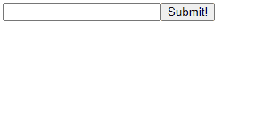

<hr>


## 🟨 30: Pass State as Props to Child Components

- A common pattern is to have a stateful component that then renders child components. You want these componnets to have access to some pieces of that statem which are passed in as props.

<h3 class="example"> 🟠 Example </h3>

- You may have an App component which renders a Navbar

- In your App, you have a state which contains useful information, but the Navbar only needs access to the user's username. You pass that as a prop to the Navbar component.


<h3 class="task"> 🔴 Task </h3>

- The MyApp component is stateful and renders a Navbar component as a child.

- Pass the name property in its state down to the child componentm then show the name in the h1 tag as part of the Navbar's render() method.

- The name should appear after the text: "Hello, my name is:"

- The code is initialised as:

```jsx
class MyApp extends React.Component {
  constructor(props){}
}
```

<h3 class="solution"> 🟢 Solution </h3>

```jsx
class MyApp extends React.Component {
  constructor(props) {
    super(props);
    this.state = {
      name: 'CamperBot'
    }
  }
  render() {
    return (
       <div>
         {/* Change code below this line */}
         <Navbar name={this.state.name}/>
         {/* Change code above this line */}
       </div>
    );
  }
};

class Navbar extends React.Component {
  constructor(props) {
    super(props);
  }
  render() {
    return (
    <div>
      {/* Change code below this line */}
      <h1>Hello, my name is: {this.props.name}</h1>
      {/* Change code above this line */}
    </div>
    );
  }
};
```

<h3 class="result"> 🔵 Result</h3>

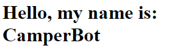


<hr>


## 🟨 31: Pass a Callback as Props

- You can pass state as props to child components.

- We can also pass handler functions or any method that's defined on a React Componentr

- You can pass methods to a child just like a regular prop.

<h3 class="task"> 🔴 Task </h3>r

- There are three components defined in the code below

- The MyApp component is the parent that will render the GetInput and RenderInputr child components.

1. Add the GetInput component to render, then pass it a prop called input assigned to inputValue from MyApp's state

- The code is initialised as:

```jsx
class MyApp extends React.Component {
  constructor(props){
    super(props);
    this.state={ inputValue: ''}
    this.handleChange = this.handleChange.bind(this);
  }
  handleChange(eventt) {
    this.setState({ inputValue: event.target.value });
  }
  render(){
    return (
      <div>
        {/*  change code below this line */}

        {/*  change code above this line */}
    );
  }
};

class GetInput extends React.Component {
  constructor(props) {
    super(props);
  }
  render(){
    return (
      <div>
        <h3>Get Input</h3>
        <input value={this.props.input} onChange={this.props.handleChange} />
      </div>
    );
  }
}

class RenderInput extends React.Component {
  constructor(props){
    super(props);
  }
  render() {
    return (
      <div>
        <h3>Input Render:</h3>
        <p>{this.props.input}</p>
      </div>
    );
  }
};
```

<h3 class="solution"> 🟢 Solution </h3>

- I first declare the GetInput component and set its props to the handleChange method!

```jsx
<GetInput input={this.state.inputValue} props={this.handleChange} />
```

- I then declare the RenderInput component:

```jsx
<RenderInput input={this.state.inputValue}>

```

- The final code looks like:

```jsx
class MyApp extends React.Component {
  constructor(props){
    super(props);
    this.state={inputValue: ''}
    this.handleChange = this.handleChange.bind(this);
  }
  handleChange(event){
    this.setState({inputValue: event.target.value});
  }
  render() {
    return (
      <div>
        {/* change code below this line*/}

        {/* change code above this line */}
      </div>
    );
  }
};

class GetInput extends React.Component {
  constructor(props){
    super(props);
  }
  render(){
    return (
      <div>
        <h3>Get Input</h3>
        <input value={this.props.input} onChange={this.props.handleChange} />
      </div>
    );
  }
};

class RenderInput extends React.Component {
  constructor(props){
    super(props);
  }
  render() {
    return (
      <div>
        <h3>Input Render:</h3>
        <p>{this.props.input}</p>
      </div>
    );
  }
};
```

<h3 class="result"> 🔵 Result</h3>

The output is:

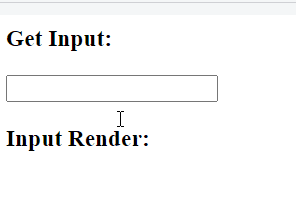

<hr>


## 🟨 32: Use Lifecycle Method componentWillMount

<h3 class="intro"> ⚪ Lifecycle Methods </h3>

- React offers methods which allow you to perform actions in the lifecycle of a component

- These are also known as lifecycle methods or lifecycle hooks.

- These methods can be before they are rendered, before they update, before they recieve props, before the unmount.

- Here is a list of main lifecycle methods:

1. componentWillMount()
2. componentDidMount()
3. shouldComponentUpdate()
4. componentDidUpdate()
5. componentWillUnmount()

<h3 class="task"> 🔴 Task </h3>

- The componentWillMount() method is called before the render() methodf when a component is mounted to the DOM

- Log something to console with componentWillMount()

<h3 class="solution"> 🟢 Solution </h3>

```jsx
class MyComponent extends React.Component {
  constructor(props){
    super(props);
  }
  componentWillMount(){
    console.log("component will mount")
  }
  render(){
    return <div>hello</div>
  }
}
```

<h3 class="result"> 🔵 Result</h3>

The output is:

```console
component will mount
in render
```

<hr>


## 🟨 33: Use componentDidMount Method

- The componentDidMount method is called after the component is mounted to the DOM

- Its best practice to place API calls or any calls to your server in the componentDidMount() method.=

- Any calls to setState() here will trigger re-rendering of component.

- Hence, when an API call is made, and the state is set with data from API, an update will trigger when data is returned.

<h3 class="task"> 🔴 Task </h3>

- There is a mock API call in componentDidMount().

- It sets state after 2.5 seconds to simulate calling sa serverr to retrieve data.

- This example requests the current total active users for a site.

- In the render method, render the values of activeUsers in the h1 after the text "Active Users:"

<h3 class="solution"> 🟢 Solution </h3>

```jsx
class MyComponent extends React.Component {
  constructor(props){
    super(props);
    this.state = { activeUsers:null };
  }
  componentDidMount() {
    setTimeout(() => {
      this.setState({
        activeUsers: 1273
      });
    }, 2500);
  }
  render(){
    return (
        <div>
          {/* change code below this line */}
          <h1>Active Users: {this.state.activeUsers}
          {/* change code above this line */}
        </div>
    );
  }
}
```

<h3 class="result"> 🔵 Result</h3>

The output is:


<hr>


## 🟨 34: Add Event Listeners

<h3 class="intro"> ⚪ Intro </h3>

- The componentDidMount() method is the best place to attach any event listeners you need to add for specific functionality.

- React has a synthetic wrapper event system which wraps native event system in browserrs. Hence the synthetic system behaves exactly the same regardless of user's browser.

- We have seen event handlers such as onClick, React offers most event handlers needed.

<h3 class="task"> 🔴 Task </h3>

1. Attach an event listener in the componentDidMount() method for keydown events and have these event trigger the callback handleKeyPress(). You can use document.addEventListener() which takes the event as the first argument, and the callback as the second argument.

2. In componentWillMount() remove the same event listener using document.removeEventListener() with same arguments

- Cleaning up components before they are destroyed is good practice


<h3 class="solution"> 🟢 Solution </h3>

```jsx
class MyComponent extends React.Component {
  constructor(props) {
    super(props);
    this.state = {
      message: ''
    };
    this.handleEnter = this.handleEnter.bind(this);
    this.handleKeyPress = this.handleKeyPress.bind(this);
  }
  // Change code below this line
  componentDidMount() {
    document.addEventListener("keydown",this.handleKeyPress);
  }
  componentWillUnmount() {
    document.removeEventListener("keydown", this.handleKeyPress);
  }
  // Change code above this line
  handleEnter() {
    this.setState((state) => ({
      message: state.message + 'You pressed the enter key! '
    }));
  }
  handleKeyPress(event) {
    if (event.keyCode === 13) {
      this.handleEnter();
    }
  }
  render() {
    return (
      <div>
        <h1>{this.state.message}</h1>
      </div>
    );
  }
};
```


<hr>


## 🟨 35: Optimise Re-Renders with shouldComponentUpdate

- So far, if any component receives new state or props, it re-renders itself and all its children.

- React provides a lifecycle method you can call when chilkd components receive new state or props, and eclare whether the component should update or not.

- The method is shouldComponentUpdate(), and it takes nextProps and nextState as parameters.

<h3 class="task"> 🔴 Task </h3>

- The shouldComponentUpdate() method is added in a component called OnlyEvens

- Currently this method returns true so OnlyEvens re-render every time it receives new props.

1. Modify the method so OnlyEvens udpates only if the value of its new peops is even.

2. Click the Add button and watch the order of events in your browser's console as the lifecycle hooks are triggered.

- The code currently functions like below:

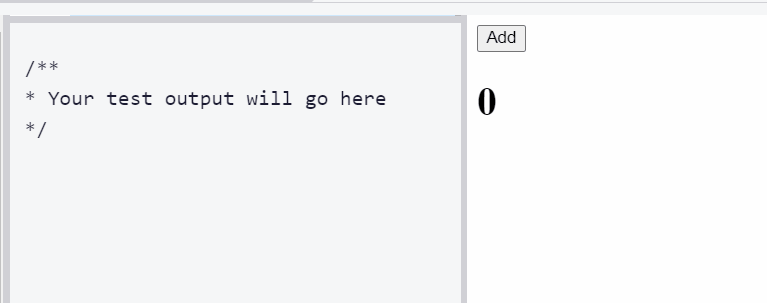


<h3 class="solution"> 🟢 Solution </h3>

```jsx
class OnlyEvens extends React.Component {
  constructor(props) {
    super(props);
  }
  shouldComponentUpdate(nextProps, nextState) {
    console.log('Should I update?');
    // Change code below this line
    if (nextProps.value%2==0)  
    {
      return true;
    }
    return false;
    // Change code above this line
  }
  componentDidUpdate() {
    console.log('Component re-rendered.');
  }
  render() {
    return <h1>{this.props.value}</h1>;
  }
}

class Controller extends React.Component {
  constructor(props) {
    super(props);
    this.state = {
      value: 0
    };
    this.addValue = this.addValue.bind(this);
  }
  addValue() {
    this.setState(state => ({
      value: state.value + 1
    }));
  }
  render() {
    return (
      <div>
        <button onClick={this.addValue}>Add</button>
        <OnlyEvens value={this.state.value} />
      </div>
    );
  }
}
```

<h3 class="result"> 🔵 Result</h3>

The output is:


<hr>


## 🟨 36: Introducing Inline Styles

- React allows you style elements using inline styles the a similar way as HTML

- E.g. to style a div in HTML

```html
<div style="color:yellow; font-size: 16px">Mellow Yellow</div>
```

- In react, we use camelCasing and the units for fontSize are optional:

```jsx
<div style={{color: "yellow", fontSize:16}}>Mellow Yellow</div>
```

<h3 class="task"> 🔴 Task </h3>

- Add a style attribute to div to the give the text a color of red and font-size of 72px

- **The code is initialised as:**

```jsx
class Colorful extends React.Component {
  render() {
    return (
      <div>Big Red</div>
    );
  }
}
```

This displays the following:


<h3 class="solution"> 🟢 Solution </h3>

The final code solution is:

```jsx
class Colorful extends React.Component {
  render() {
    return (
      <div style={{color:"red", fontSize:"72"}}>Big Red</div>
    );
  }
};
```

<h3 class="result"> 🔵 Result</h3>

The output is:


<hr>


## 🟨 37: Add Inline Styles in React

- All property value length units are assumed to be in px unless specified

- If you have a large set of styles, you can assign a style object to a constant


<h3 class="task"> 🔴 Task </h3>


- Declare your styles as a global variable

- Initialise styles constant and assign it to an object with three style properties and their values.

- Give the div a colour of purple, a font-size of 40, a border of 2px solid purple.

- Then set the style attribute equal to the styles constant.

- The code is initialised as:

```jsx
// Change code above this line
class Colorful extends React.Component {
  render() {
    // Change code below this line
    return (
      <div style={{color: "yellow", fontSize: 24}}>Style Me!</div>
    );
    // Change code above this line
  }
}
```

This outputs:


<h3 class="solution"> 🟢 Solution </h3>

The solution is:

```jsx
const styles = {
  color: "purple",
  fontSize: 40,
  border: "2px solid purple"
}
// Change code above this line
class Colorful extends React.Component {
  render() {
    // Change code below this line
    return (
      <div style={styles}>Style Me!</div>
    );
    // Change code above this line
  }
}
```

<h3 class="result"> 🔵 Result</h3>

The output is:


<hr>


## 🟨 38: Use Advanced JavaScript in React Render Method

- Previously, we have use curly braces to inject JavaScript code into JSX for things like accessing props, state, inserting comment, and styling components.

- We can use JavaScript directly in your render methods, before the return statement,  without inserting in curly braces.

<h3 class="task"> 🔴 Task </h3>

- In the code below, the render() method has an array that contains 20 phrases to represent the answers found in the classic Magic Eight Ball

- The button click even is bound to the ask method, so each time it is clicked a random number will be generated and stored as the randomIndex in state.

1. On line 52, reassign the answer const so your code randomly access a different index of the possibleAnswers array each time the component updates.

2. Finally, insert the answer const inside the p tags.

- The code is initialised as:

```jsx
const inputStyle = {
  width: 235,
  margin: 5
}

class MagicEightBall extends React.Component {
  constructor(props) {
    super(props);
    this.state = { userInput: '', randomIndex: ''};
    this.ask = this.ask.bind(this);
    this.handleChange = this.handleChange.bind(this);
  }
  ask() {
    if (this.state.userInput) {
      this.setState({
        randomIndex: Math.floor(Math.random()*20),
        userInput: ''
      });
    }
  }
  handleChange(event){
    this.setState({
      userInput: event.target.value
    });
  }
  render() {
    const possibleAnswers = [
      'It is certain',
      'It is decidely so',
      'Without a doubt',
      'Yes, definitely',
      'You may rely on it'
      'As I see it, yes',
      'Outlook good',
      'Yes',
      'Signs point to yes',
      'Reply hazy try again',
      'Ask again later',
      'Better not tell you now',
      'Cannot predict now',
      'Concentrate and ask again',
      "Don't count on it",
      'My reply is no',
      'My sources say no',
      'Most likely',
      'Outlook not so good',
      'Very doubtful'
    ];
    const answer = 'change me!'; // Change this line
    return (
      <div>
        <input 
          type='text'
          value={this.state.userInput}
          onChange={this.handleChange}
          style={inputStyle} 
        />
        <br />
        <button onClick={this.ask}>Ask the Magic Eight Ball!</button>
        <br />
        <h3>Answer:</h3>
        <p>
          {/* change code below this line */}

          {/* change code above this line */}
        </p>
      </div>
    );
  }
}
```

The app currently has no function:

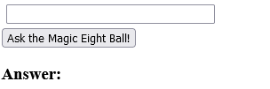

<h3 class="solution"> 🟢 Solution </h3>

The solution is:

```jsx
const inputStyle = {
  width: 235,
  margin: 5
};

class MagicEightBall extends React.Component {
  constructor(props) {
    super(props);
    this.state = {
      userInput: '',
      randomIndex: ''
    };
    this.ask = this.ask.bind(this);
    this.handleChange = this.handleChange.bind(this);
  }
  ask() {
    if (this.state.userInput) {
      this.setState({
        randomIndex: Math.floor(Math.random() * 20),
        userInput: ''
      });
    }
  }
  handleChange(event) {
    this.setState({
      userInput: event.target.value
    });
  }
  render() {
    const possibleAnswers = [
      'It is certain',
      'It is decidedly so',
      'Without a doubt',
      'Yes, definitely',
      'You may rely on it',
      'As I see it, yes',
      'Outlook good',
      'Yes',
      'Signs point to yes',
      'Reply hazy try again',
      'Ask again later',
      'Better not tell you now',
      'Cannot predict now',
      'Concentrate and ask again',
      "Don't count on it",
      'My reply is no',
      'My sources say no',
      'Most likely',
      'Outlook not so good',
      'Very doubtful'
    ];
    const answer = possibleAnswers[this.state.randomIndex]
    return (
      <div>
        <input
          type='text'
          value={this.state.userInput}
          onChange={this.handleChange}
          style={inputStyle}
        />
        <br />
        <button onClick={this.ask}>Ask the Magic Eight Ball!</button>
        <br />
        <h3>Answer:</h3>
        <p>
          {/* Change code below this line */}
          {answer}
          {/* Change code above this line */}
        </p>
      </div>
    );
  }
}
```

<h3 class="result"> 🔵 Result</h3>

The output is:

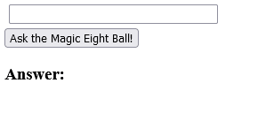

<hr>


## 🟨 39: Render with an If-Else Condition

- Another application of using JavaScript is to control rendered view to tie elements which are rendered to a condition.


<h3 class="task"> 🔴 Task </h3>

- MyComponent contains a boolean in its state which tracks whether you want to display some UI or not.

- The button toggles the state of this value.

1. Rewrite the render() method with an if/else statement so if "display" is true, you return the current markup otherwise return markupo without h1 element

- The code is initialised as:

```jsx
class MyComponent extends React.Component {
  constructor(props) {
    super(props);
    this.state = {
      display: true
    }
    this.toggleDisplay = this.toggleDisplay.bind(this);
  }
  toggleDisplay() {
    this.setState((state) => ({
      display: !state.display
    }));
  }
  render(){
    // Change code below this line

    return (
      <div>
        <button onClick={this.toggleDisplay}></button>
        <h1>Displayed!</h1>
      </div>
    );
  }
};
```

- Currently the app has no function:

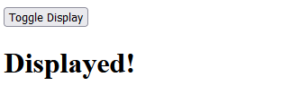

<h3 class="solution"> 🟢 Solution </h3>

- The solution is:

```jsx
class MyComponent extends React.Component {
  constructor(props) {
    super(props);
    this.state = {
      display: true
    }
    this.toggleDisplay = this.toggleDisplay.bind(this);
  }
  toggleDisplay() {
    this.setState((state) => ({
      display: !state.display
    }));
  }
  render() {
   if (this.state.props==true){
    return (
      <div>
        <button onClick={this.toggleDisplay}>Toggle Display</button>
        <h1>Displayed!</h1>
      </div>
    );
   } else {
    return (
      <div>
        <button onClick={this.toggleDisplay}>Toggle Display</button>
      </div>
    );
   }
  }
};
```

<h3 class="result"> 🔵 Result</h3>

The output is:


<hr>

## 🟨 40: Use && for a More Concise Conditional

- We can use && instead of using if/else structure.

- E.g., the markup in the &lt;p&gt; will render if condition is true otherwise does not render:

```jsx
{condition && <p>markup</p>}
```

<h3 class="task"> 🔴 Task </h3>

- Solve the previous example again, so h1 only render if "display" is true.

<h3 class="solution"> 🟢 Solution </h3>

- The solution is:

```jsx
class MyComponent extends React.Component {
  constructor(props){
    super(props);
    this.state = {
      display: true
    }
    this.toggleDisplay = this.toggleDisplay.bind(this);
  }
  toggleDisplay() {
    this.setState( state => ({
      display: !state.display
    }));
  }
  render() {
    // Change code below this line
    return (
      <div>
        <button onClick={this.toggleDisplay}>Toggle Display</button>
        {this.state.display && <h1>Displayed!</h1>}
      </div>
    );
  }
}
```

<h3 class="result"> 🔵 Result</h3>

The output is:


<hr>

## 🟨 41: Use a Ternary Expression for Conditional Rendering

- Ternary operators are popular because of the way JSX is compiled, if/else can't be inserted directly into JSX code.

<h3 class="task"> 🔴 Task </h3>

- The code below has three constants defined within thed CheckUserAge component's render() method: "buttonOne", "buttonTwo", and "buttonThree". Each is assigned to a JSX expression representing a button element.

1. Initialise the state of "CheckUserAge", "input", and "userAge" both set to values of an empty string.

- Once the component is rendering information to the page, users should have a way to interact with it.

2. Within the component's return statement, set up a ternary expression that implements the following:

- When the page first loads, render the submit button "buttonOne" to page

- Then, when a user enters their age and clicks the button, render a different button based on the age.

- If a user enters a number < 18, render buttonThree

- If a user enters a number >= 18, render buttonTwo

- The code is initialised as:

```jsx
const inputStyle = {
  width: 235,
  margin: 5
};

class CheckUserAge extends React.Component {
  constructor(props) {
    super(props);
    // Change code below this line

    // Change code above this line
    this.submit = this.submit.bind(this);
    this.handleChange = this.handleChange.bind(this);
  }
  handleChange(e) {
    this.setState({
      input: e.target.value,
      userAge: ''
    });
  }
  submit() {
    this.setState(state => ({
      userAge: state.input
    }));
  }
  render() {
    const buttonOne = <button onClick={this.submit}>Submit</button>;
    const buttonTwo = <button>You May Enter</button>;
    const buttonThree = <button>You Shall Not Pass</button>;
    return (
      <div>
        <h3>Enter Your Age to Continue</h3>
        <input
          style={inputStyle}
          type='number'
          value={this.state.input}
          onChange={this.handleChange}
        />
        <br />
        {/* Change code below this line*/}

        {/* Change code above this line*/}
      </div>
    );
  }
}
```

<h3 class="solution"> 🟢 Solution </h3>

- My solution is:

```jsx
const inputStyle = {
  width: 235,
  margin: 5
};

class CheckUserAge extends React.Component {
  constructor(props) {
    super(props);
    // Change code below this line
     this.state = {
      userAge: '',
      input: ''
    }
    // Change code above this line
    this.submit = this.submit.bind(this);
    this.handleChange = this.handleChange.bind(this);
  }
  handleChange(e) {
    this.setState({
      input: e.target.value,
      userAge: ''
    });
  }
  submit() {
    this.setState(state => ({
      userAge: state.input
    }));
  }
  render() {
    const buttonOne = <button onClick={this.submit}>Submit</button>;
    const buttonTwo = <button>You May Enter</button>;
    const buttonThree = <button>You Shall Not Pass</button>;
    return (
      <div>
        <h3>Enter Your Age to Continue</h3>
        <input
          style={inputStyle}
          type='number'
          value={this.state.input}
          onChange={this.handleChange}
        />
        <br />
        {/* Change code below this line */}
        {this.state.input=='' && buttonOne}
        
        {this.state.input<18?buttonThree:buttonTwo}
        {/* Change code above this line */}
      </div>
    );
  }
}
```

- My solution does not pass requirements! It behaves as such:

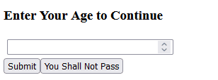

- The solution from FreeCodeCamp uses double ternary operator:

```jsx
const inputStyle = {
  width: 235,
  margin: 5
};

class CheckUserAge extends React.Component {
  constructor(props) {
    super(props);
    // Change code below this line
     this.state = {
      userAge: '',
      input: ''
    }
    // Change code above this line
    this.submit = this.submit.bind(this);
    this.handleChange = this.handleChange.bind(this);
  }
  handleChange(e) {
    this.setState({
      input: e.target.value,
      userAge: ''
    });
  }
  submit() {
    this.setState(state => ({
      userAge: state.input
    }));
  }
  render() {
    const buttonOne = <button onClick={this.submit}>Submit</button>;
    const buttonTwo = <button>You May Enter</button>;
    const buttonThree = <button>You Shall Not Pass</button>;
    return (
      <div>
        <h3>Enter Your Age to Continue</h3>
        <input
          style={inputStyle}
          type='number'
          value={this.state.input}
          onChange={this.handleChange}
        />
        <br />
        {/* Change code below this line */}
        {
          this.state.userAge===''?buttonOne: this.state.userAge>=18 ? buttonTwo : buttonThree
        }
        {/* Change code above this line */}
      </div>
    );
  }
};
```

<h3 class="result"> 🔵 Result</h3>

The output is:

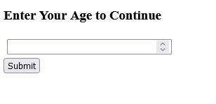

<hr>

## 🟨 42: Render Conditionally from Props

- Use props to conditionally render code is a popular paradigm.

<h3 class="task"> 🔴 Task </h3>

- The code below has two components that are partially defined for you a parent called "GameOfChance" and a child called "Results".

- They are used to create a simple game where the user presses a button to see if they win or lose.

1. Update the expression in the render() method of GameOfChance so that it randomly generates true or false

2. Render the "Results" component as a child of GameOfChance. Pass the expression as a prop called fiftyFifty.

3. In the "Results" component, write a ternary operator to render the h1 element with "You Win!" or "You Lose!" based on fiftyFifty

4. Make sure the handleClick() method is correctly counting the number of times played

- The code was initialised as:

```jsx
class Results extends React.Component {
  constructor(props){
    super(props);
  }
  render() {
    {/* change code below this line */}
    return <h1></h1>
    {/* change code above this line */}
  }
}

class GameOfChance extends React.Component {
  constructor(props) {
    super(props);
    this.state = {
      counter: 1
    };
    this.handleClick = this.handleClick.bind(this);
  }
  handleClick() {
    this.setState(prevState => {
      // Complete the return statement:
      return {
        counter: prevState
      }
    });
  }
  render() {
    const expression = null; // Change this line
    return (
      <div>
        <button onClick={this.handleClick}>Play Again</button>
        {/* Change code below this line */}

        {/* Change code above this line */}
        <p>{'Turn: '+this.state.counter}</p>
      </div>
    );
  }
}
```

- The current behaviour of the app is:

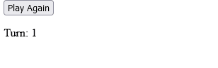

- I first update the expression in GameOfChance component:

```jsx
const expression = Math.random()>=0.5 ? true : false; // Change this 
```

- I then added the Results component in the render method of GameOfLifeL

```jsx
<Results fiftyFifty={expression} />
```

- I update the render() method in the Results component:

```jsx
return <h1>{this.props.fiftyFifty?"You Win!":"You Lose!"}</h1>;
```

- Finally, I upadte the counter on the handleClick() method:

```jsx
handleClick() {
  this.setState(prevState => {
    // Complete the return statement:
    return {
      counter: prevState.counter+1
    }
  });
}
```


<h3 class="solution"> 🟢 Solution </h3>

The final solution is:

```jsx
class Results extends React.Component {
  constructor(props) {
    super(props);
  }
  
  render() {
    {/* Change code below this line */}
    return <h1>{this.props.fiftyFifty?"You Win!":"You Lose!"}</h1>;
    {/* Change code above this line */}
  }
}

class GameOfChance extends React.Component {
  constructor(props) {
    super(props);
    this.state = {
      counter: 1
    };
    this.handleClick = this.handleClick.bind(this);
  }
  handleClick() {
    this.setState(prevState => {
      // Complete the return statement:
      return {
        counter: prevState.counter+1
      }
    });
  }
  render() {
    const expression = Math.random()>=0.5?true:false; // Change this line
    return (
      <div>
        <button onClick={this.handleClick}>Play Again</button>
        {/* Change code below this line */}
        <Results fiftyFifty={expression} />
        {/* Change code above this line */}
        <p>{'Turn: ' + this.state.counter}</p>
      </div>
    );
  }
}
```

<h3 class="result"> 🔵 Result</h3>

The output is:


<hr>


## 🟨  43: Change Inline CSS Conditionally Based on Component State

- You can render CSS conditionally based on state of a React component.

- We check for a condition, if it is met then you modify the styles object assigned to the JSX elements in render().

- This contrasrs the traditional approach of applying styles by modifying DOM elements directly.

<h3 class="task"> 🔴 Task </h3>

- The cobe below hass a simple controller input component with a styled border.

- The border should be red if the user types more than 15 characters in input box. Apply a condition so that the border style is set to 3px solid red.

- The code is initialised as:

```jsx
class GateKeeper extends React.Component {
  constructor(props){
    super(props);
    this.state = {
      input: ''
    };
    this.handleChange = this.handleChange.bind(this);
  }
  handleChange(event) {
    this.setState( { input: event.target.value })
  }
  render() {
    let inputStyle = {
       border: '1px solid black'
    };
    // Change code below this line

    // Change code above this line
    return (
      <div>
        <h3>Don't Type Too Much:</h3>
        <input 
          type="text"
          style={inputStyle}
          value={this.state.input}
          onChange={this.handleChange} />
      </div>
    );
  }
};
```


- The current behaviour of the app is:

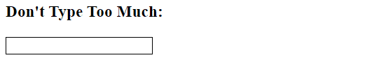

- I add the following condition:

```jsx
if (this.state.input.length>15){
  inputStyle = {border:'3px solid red'}
}
```

<h3 class="result"> 🔵 Result</h3>

The output is:


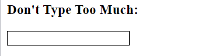


<hr>

## 🟨 Step 44: Use Array.map() to Dynamically Render Elements

- We often do not know the state of the application until it's being used! For example, we can not predict how many notes a user makes on a to-do app.


<h3 class="task"> 🔴 Task </h3>

- The code below shows the MyToDoList component.

- Inside the constructor, create a this.state object and define two states: userInput should be initialised as an empty string, and toDoList show be initialised as an empty array.

- Nextm delete the null value in the render(), map over the toDoList array stored in the component's internal state and dynamically render a "li" for each item.

- Try entering the string eat, code, sleep, repeat into textarea.


```jsx
const textAreaStyles = {
  width: 235,
  margin: 5
};

class MyToDoList extends React.Component {
  constructor(props) {
    super(props);
    // Change code below this line

    // Change code above this 
    this.handleSubmit = this.handleSubmit.bind(this);
    this.handleChange = this.handleChange.bind(this);
  }
  handleSubmit() {
    const itemsArray = this.state.userInput.split(',');
    this.setState({
      toDoList: itemsArray
    });
  }
  handleChange(e) {
    this.setState({
      userInput: e.target.value
    });
  }
  render() {
    const items = null; // change this line
    return(
      <div>
        <textArea
          onChange={this.handleChange}
          value={this.state.userInput}
          style={textAreaStyles}
          placeholder='Seperate Items with Commas' 
        />
        <br />
        <button onClick={this.handleSubmit}>Create List</button>
        <h1>My "To Do" List:</h1>
        <ul>{items}</ul>
      </div>
    );
  }
}
```

- I first initialise the state of the MyToDoList component:

```jsx
    this.state = {
      userInput: '',
      toDoList: []
    };
```

- I then use the map() function to create an array of list items:

```jsx
const items = this.state.toDoList.map(i=> <li>{i}</li>); // Change this line
```


<h3 class="solution"> 🟢 Solution </h3>

The final solution is:

```jsx

class GateKeeper extends React.Component {
  constructor(props) {
    super(props);
    this.state = {
      input: ''
    };
    this.handleChange = this.handleChange.bind(this);
  }
  handleChange(event) {
    this.setState({ input: event.target.value })
  }
  render() {
    let inputStyle = {
      border: '1px solid black'
    };
    // Change code below this line
    if (this.state.input.length>15){
      inputStyle = {border:'3px solid red'}    
    }
    // Change code above this line
    return (
      <div>
        <h3>Don't Type Too Much:</h3>
        <input
          type="text"
          style={inputStyle}
          value={this.state.input}
          onChange={this.handleChange} />
      </div>
    );
  }
};

const textAreaStyles = {
  width: 235,
  margin: 5
};

class MyToDoList extends React.Component {
  constructor(props) {
    super(props);
    // Change code below this line
    this.state = {
      userInput: '',
      toDoList: []
    };
    // Change code above this line
    this.handleSubmit = this.handleSubmit.bind(this);
    this.handleChange = this.handleChange.bind(this);
  }
  handleSubmit() {
    const itemsArray = this.state.userInput.split(',');
    this.setState({
      toDoList: itemsArray
    });
  }
  handleChange(e) {
    this.setState({
      userInput: e.target.value
    });
  }
  render() {
   
    const items = this.state.toDoList.map(i=> <li>{i}</li>); // Change this line
    return (
      <div>
        <textarea
          onChange={this.handleChange}
          value={this.state.userInput}
          style={textAreaStyles}
          placeholder='Separate Items With Commas'
        />
        <br />
        <button onClick={this.handleSubmit}>Create List</button>
        <h1>My "To Do" List:</h1>
        <ul>{items}</ul>
      </div>
    );
  }
}
```

<h3 class="result"> 🔵 Result</h3>

The output is:


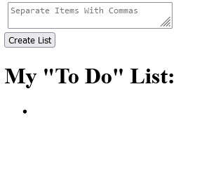

<hr>


## 🟨  45: Give Sibling Elements a Unique Key Attribute

- In the previous step, we used the map() method to dynamically render a number of elements based on user input.

- When you create an array of elements, each one needa key attribute set to a unique value.

<h3 class="task"> 🔴 Task </h3>

- The code below has an array with front-end libraries and a stateless functional component named Frameworks().

- Frameworks() needs to map the array to an unordered list.

- Finish writing the map callback to return an li element for each framework in the frontEndFrameworks array.

- Make sure to give each li a key attribute, set to a unique value.

- The li elements should also contain text from frontEndFrameworks.

- The code is initialised as:

```jsx
 const frontEndFrameworks = [
  'React',
  'Angular',
  'Ember',
  'Knockout',
  'Backbone',
  'Vue'
 ];

function Frameworks() {
  const renderFrameworks = null // Change this line
  return (
    <div>
      <h1>Popular Front End JavaScript Frameworks</h1>
      <ul>
        {renderFrameworks}
      </ul>
    </div>
  );
};
```

- Currently, the output is:

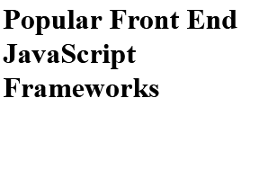


<h3 class="solution"> 🟢 Solution </h3>

- I modify the line to:

```jsx
const renderFrameworks = frontEndFrameworks.map((k,v)=><li key={v}>{k}</li>); // Change this line
```


<h3 class="result"> 🔵 Result</h3>

The output is:

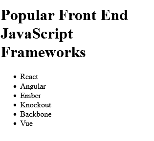


<hr>


## 🟨  46: Use Array.filter() to Dynamically Filter an Array

<h3 class="task"> 🔴 Task </h3>

- The code below defines the MyComponent component with a state initialised as an array of users.

- Filter the array to so we ony see users which are online

- In the renderOnline variable, map over the filtered array and return a li element which contains text of their username. Invluse unique key as well

<h3 class="solution"> 🟢 Solution </h3>

The solution is:

```jsx
class MyComponent extends React.Component {
  constructor(props) {
    super(props);
    this.state = {
          users: [{username: 'Jeff', online: true}, {username: 'Alan', online: false}, {username: 'Mary',online: true}, {username: 'Jim', online: false}, {username: 'Sara', online: true}, {username: 'Laura',online: true}]
    }
  };
  render() {
    const usersOnline = this.state.users.filter(i=> i.online==true); // change this line
    const renderOnline = usersOnline.map((k,v)=> <li key={v}>{k.username}</li>)
    return (
      <div>
        <h1>Current Online Users:</h1>
        <ul>{renderOnline}</ul>
      </div>
    );
  }
}
```

<h3 class="result"> 🔵 Result</h3>

The output is:

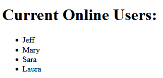

<hr>


## 🟨  47: Render React on the Server with renderToString

- So far we have been rendering React components on client-side. This is the go to way, but we can also render on server.

- React has a renderToString() method, we may want to use server because client-side is not good for SEO and first time load will be faster.

<h3 class="task"> 🔴 Task </h3>

- the renderToString method is provided on ReactDOMServer which is available as a global object

- It takes one argument which is the React element.

- Use the renderToString method to render App in the code below:

```jsx
class App extends React.Component {
  constructor(props) {
    super(props);
  }
  render() {
    return </div>
  }
};

// change the code below this line
```

<h3 class="solution"> 🟢 Solution </h3>

- I add the following:

```jsx
ReactDOMServer.renderToString(<App />)
```


