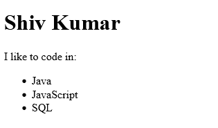
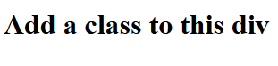

<link href="style.css" rel="stylesheet"></link>

# 4 React Tutorial

# ⭕ Table of Contents


# ✏️ Summary

<span style="font-size:20px; font-weight:bold">

### ✅   Sass is not understood by browsers, we use the Sass software to generate a CSS file from a SCSS file


</span>

<br>


# ⭕ Introduction

- React is a library for building modular, component-driven componets for web interfaces.

- React uses its own language called JSX which is a combination of HTML and JavaScript.

- In this tutorial, I will create difference React components, manage data in form of state properties and use different lifecycle methods

# ⭕ Tutorial Commentary

## 🟨 1: Create a Simple JSX element

<h3 class="intro"> ⚪ What is React? </h3>

- React is an open-source library maintained by FaceBook which allows us to render UI of webapps.

- It users an extension of JavaScript called JSX which lets your write JavaScript directly in HTML.

- JSX is an extension of JavaScript allowing us to write JavaScript in JSX. We write JavaScript code in curly braces:

```jsx
{ 'this is JavaScript Code' }
```

- JSX is compiled into JavaScript code, Babel is a popular transpiler.

<h3 class="task"> 🔴 Task </h3>

*The current code uses JSX to assign a div element to a constant JSX.*

*Replace dic with a h1 element and add the text "Hello to JSX!" inside it*

The code is initalised as:

```jsx
const JSX = <div></div>;
```

<h3 class="solution"> 🟢 Solution </h3>

```jsx
const JSX = <h1>Hello JSX!</h1>;
```

<h3 class="result"> 🔵 Result</h3>


<hr>

## 🟨 2: Create a Complex JSX element

<h3 class="intro"> ⚪ Complex JSX Elements </h3>

- A valid JSX element must return a single element, hence multiple elements must be nested inside one parent element!

- **Valid JSX:**

```jsx
<div>
  <p>Paragraph One</p>
  <p>Paragraph Two</p>
  <p>Paragraph Three</p>
</div>
```

- **Invalid JSX**

```jsx
<p>Paragraph One</p>
<p>Paragraph Two</p>
<p>Paragraph Three</p>
```

<h3 class="task"> 🔴 Task </h3>

*Define a new constant JSX which renders a div which contains the following elements in order:*

* A h1, a p, and an unordered list with three elements.*

<h3 class="solution"> 🟢 Solution </h3>

```jsx
const JSX = <div><h1>Shiv Kumar</h1>
  <p>I like to code in:</p>
  <ul>
    <li>Java</li>
    <li>JavaScript</li>
    <li>SQL</li>
  </ul>
</div>
```

<h3 class="result"> 🔵 Result</h3>



<hr>

## 🟨 3: Add Comments in JSX

<h3 class="intro"> ⚪ JSX Comments </h3>

- The syntax for comments in JSX is:

```jsx
{/*this is a comment */}
```

<hr>

## 🟨 4: Render HTML Elements to the DOM

<h3 class="intro"> ⚪ What is DOM? </h3>

- DOM is the data reperesentation of the object which compise the structure and content of a web document.

- The DOMis a programming interface for a web document, it can be modified by a language like JavaScript

<h3 class="intro"> ⚪ What is ReactDOM? </h3>

- ReactDOM offers a simple method to render React elements to the DOM.

- It has the following syntax:

```jsx
ReactDOM.render(componentToRender, targetNode)
```

- The .render() method must be called after JSC element declarations

<h3 class="task"> 🔴 Task </h3>

The code editor has a simple JSX component, use the .render() method to rend the component to the page.

Use document.getElementById() to select the DOM node to render them to.

There is a div with id='challenge-node' available for you to use. 

The code is initialised as:

```jsx
const JSX = (
  <div>
    <h1>Hello World</h1>
    <p>Lets render this to the DOM</p>
  </div>
);
// Change code below this line
```

<h3 class="solution"> 🟢 Solution </h3>

```jsx
const JSX = (
  <div>
    <h1>Hello World</h1>
    <p>Lets render this to the DOM</p>
  </div>
);
// Change code below this line
ReactDOM.render(JSX, document.getElementById('challenge-node'))
```

<h3 class="result"> 🔵 Result</h3>


<hr>

## 🟨 5: Define a HTML Class in JSX

<h3 class="intro"> ⚪ HTML Classes </h3>

- HTML classes are defined using className, as class is a reserved keyword in JavaScript.

<h3 class="task"> 🔴 Task </h3>

*Apply a class of myDiv to the div in the below code.*

The code is initialised as:

```jsx
const JSX  = (
    <div>
        <h1>Add a class to this div</h1>
    </div>
);
```

<h3 class="solution"> 🟢 Solution </h3>

```jsx
const JSX = (
  <div className="myDiv">
    <h1>Add a class to this div</h1>
  </div>
);
```

<h3 class="result"> 🔵 Result</h3>



<hr>

## 🟨 6: Learn about Self-Closing JSX Tags

- In JSX, any element can be written as a self-closing tag ( like &lt;br /> in HTML)

- E.g. &lt;div>&lt;/div> can be written as &lt;div /> or &lt;div>&lt;/div> but not as &lt;div> alone!

- Self closing tags like &lt;br> must be closed!

<h3 class="task"> 🔴 Task </h3>

Fix the errors in the code below so that it is valid JSX and successfully transpiles.

```jsx
const JSX = (
  <div>
    <h2>Welcome to React!</h2> <br >
    <p>Be sure to close all tags!</p>
    <hr >
  </div>
);
```

<h3 class="solution"> 🟢 Solution </h3>

```jsx
const JSX = (
  <div>
    <h2>Welcome to React!</h2> <br />
    <p>Be sure to close all tags!</p>
    <hr />
  </div>
);
```

<h3 class="result"> 🔵 Result</h3>


<hr>

## 🟨 7: Create a Stateless Functional Component

- We shall learn how to create components as these are the key building blocks of react

- We can create a React component in two ways, one ways is to write a JavaScript function which returns either JSX or null

- ⚠️ JavaScript function must begin with captial letter ⚠️

<h3 class="example"> 🟠 Example </h3>

- Here is a stateless functional component which assigns a HTML class in JSX:

```jsx
const DemoComponent = function(){
  return (
    <div className='customClass' />
  );
};
```

<h3 class="task"> 🔴 Task </h3>

The code editor defines an emptry function called MyFunction:

```jsx
const MyComponent = function(){

}
```

Complete the function so that is returns a single div which contains some text

<h3 class="solution"> 🟢 Solution </h3>

```jsx
const MyComponent = function() {
  return (
    <div>Hello World!</div>
  );
}
```

<h3 class="result"> 🔵 Result</h3>


<hr>

## 🟨 8: Creating a React Component Using class Syntax

- The other way to create a React component is to use the ES6 class syntax.

<h3 class="example"> 🟠 Example </h3>

- Here is a Kitten class which extends React.Component:

```jsx
class Kitten extends React.Component {
  constructor(props){
    super(props);
  }

  render() {
    return (
      <h1>Hi</h1>
    );
  }
}
```

- It is best practice to call the component's constructor with super and pass both properties.

<h3 class="task"> 🔴 Task </h3>

Finish writing the render method so it returns a div with a h1 element with the text Hello React!

The code is initialised as:

```jsx
class MyComponent extends React.Component {
  constructor(props){
    super(props);
  }
  render(){

  }
}
```

<h3 class="solution"> 🟢 Solution </h3>

```jsx
class MyComponent extends React.Component {
  constructor(props) {
    super(props);
  }
  render() {
    return (
      <div>
        <h1>Hello React!</h1>
      </div>
    );
  }
};
```

<h3 class="result"> 🔵 Result</h3>


## 🟨  PLACEHOLDER

<h3 class="intro"> ⚪ What is React? </h3>

<h3 class="task"> 🔴 Task </h3>

<h3 class="solution"> 🟢 Solution </h3>

<h3 class="result"> 🔵 Result</h3>

<h3 class="example"> 🟠 Example </h3>
