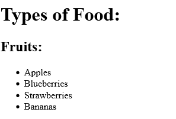
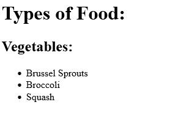
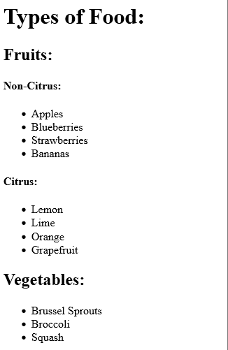
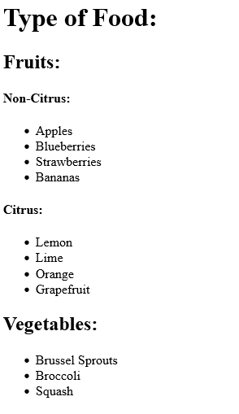
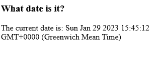
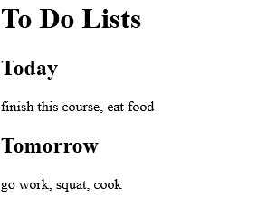

<link href="style.css" rel="stylesheet"></link>

# 4 React Tutorial

# ⭕ Table of Contents


# ✏️ Summary

<span style="font-size:20px; font-weight:bold">

### ✅   Sass is not understood by browsers, we use the Sass software to generate a CSS file from a SCSS file


</span>

<br>


# ⭕ Introduction

- React is a library for building modular, component-driven componets for web interfaces.

- React uses its own language called JSX which is a combination of HTML and JavaScript.

- In this tutorial, I will create difference React components, manage data in form of state properties and use different lifecycle methods

# ⭕ Tutorial Commentary

## 🟨 1: Create a Simple JSX element

<h3 class="intro"> ⚪ What is React? </h3>

- React is an open-source library maintained by FaceBook which allows us to render UI of webapps.

- It users an extension of JavaScript called JSX which lets your write JavaScript directly in HTML.

- JSX is an extension of JavaScript allowing us to write JavaScript in JSX. We write JavaScript code in curly braces:

```jsx
{ 'this is JavaScript Code' }
```

- JSX is compiled into JavaScript code, Babel is a popular transpiler.

<h3 class="task"> 🔴 Task </h3>

*The current code uses JSX to assign a div element to a constant JSX.*

*Replace dic with a h1 element and add the text "Hello to JSX!" inside it*

The code is initalised as:

```jsx
const JSX = <div></div>;
```

<h3 class="solution"> 🟢 Solution </h3>

The solution is:

```jsx
const JSX = <h1>Hello JSX!</h1>;
```

<h3 class="result"> 🔵 Result</h3>

The output is:


<hr>

## 🟨 2: Create a Complex JSX element

<h3 class="intro"> ⚪ Complex JSX Elements </h3>

- A valid JSX element must return a single element, hence multiple elements must be nested inside one parent element!

- **Valid JSX:**

```jsx
<div>
  <p>Paragraph One</p>
  <p>Paragraph Two</p>
  <p>Paragraph Three</p>
</div>
```

- **Invalid JSX**

```jsx
<p>Paragraph One</p>
<p>Paragraph Two</p>
<p>Paragraph Three</p>
```

<h3 class="task"> 🔴 Task </h3>

*Define a new constant JSX which renders a div which contains the following elements in order:*

* A h1, a p, and an unordered list with three elements.*

<h3 class="solution"> 🟢 Solution </h3>

The solution is:

```jsx
const JSX = <div><h1>Shiv Kumar</h1>
  <p>I like to code in:</p>
  <ul>
    <li>Java</li>
    <li>JavaScript</li>
    <li>SQL</li>
  </ul>
</div>
```

<h3 class="result"> 🔵 Result</h3>

The output is:


<hr>

## 🟨 3: Add Comments in JSX

<h3 class="intro"> ⚪ JSX Comments </h3>

- The syntax for comments in JSX is:

```jsx
{/*this is a comment */}
```

<hr>

## 🟨 4: Render HTML Elements to the DOM

<h3 class="intro"> ⚪ What is DOM? </h3>

- DOM is the data reperesentation of the object which compise the structure and content of a web document.

- The DOMis a programming interface for a web document, it can be modified by a language like JavaScript

<h3 class="intro"> ⚪ What is ReactDOM? </h3>

- ReactDOM offers a simple method to render React elements to the DOM.

- It has the following syntax:

```jsx
ReactDOM.render(componentToRender, targetNode)
```

- The .render() method must be called after JSC element declarations

<h3 class="task"> 🔴 Task </h3>

The code editor has a simple JSX component, use the .render() method to rend the component to the page.

Use document.getElementById() to select the DOM node to render them to.

There is a div with id='challenge-node' available for you to use. 

The code is initialised as:

```jsx
const JSX = (
  <div>
    <h1>Hello World</h1>
    <p>Lets render this to the DOM</p>
  </div>
);
// Change code below this line
```

<h3 class="solution"> 🟢 Solution </h3>

The solution is:

```jsx
const JSX = (
  <div>
    <h1>Hello World</h1>
    <p>Lets render this to the DOM</p>
  </div>
);
// Change code below this line
ReactDOM.render(JSX, document.getElementById('challenge-node'))
```

<h3 class="result"> 🔵 Result</h3>

The output is:


<hr>

## 🟨 5: Define a HTML Class in JSX

<h3 class="intro"> ⚪ HTML Classes </h3>

- HTML classes are defined using className, as class is a reserved keyword in JavaScript.

<h3 class="task"> 🔴 Task </h3>

*Apply a class of myDiv to the div in the below code.*

The code is initialised as:

```jsx
const JSX  = (
    <div>
        <h1>Add a class to this div</h1>
    </div>
);
```

<h3 class="solution"> 🟢 Solution </h3>

The solution is:

```jsx
const JSX = (
  <div className="myDiv">
    <h1>Add a class to this div</h1>
  </div>
);
```

<h3 class="result"> 🔵 Result</h3>

The output is:


<hr>

## 🟨 6: Learn about Self-Closing JSX Tags

- In JSX, any element can be written as a self-closing tag ( like &lt;br /> in HTML)

- E.g. &lt;div>&lt;/div> can be written as &lt;div /> or &lt;div>&lt;/div> but not as &lt;div> alone!

- Self closing tags like &lt;br> must be closed!

<h3 class="task"> 🔴 Task </h3>

Fix the errors in the code below so that it is valid JSX and successfully transpiles.

```jsx
const JSX = (
  <div>
    <h2>Welcome to React!</h2> <br >
    <p>Be sure to close all tags!</p>
    <hr >
  </div>
);
```

<h3 class="solution"> 🟢 Solution </h3>

The solution is:

```jsx
const JSX = (
  <div>
    <h2>Welcome to React!</h2> <br />
    <p>Be sure to close all tags!</p>
    <hr />
  </div>
);
```

<h3 class="result"> 🔵 Result</h3>

The output is:


<hr>

## 🟨 7: Create a Stateless Functional Component

- We shall learn how to create components as these are the key building blocks of react

- We can create a React component in two ways, one ways is to write a JavaScript function which returns either JSX or null

- ⚠️ JavaScript function must begin with captial letter ⚠️

<h3 class="example"> 🟠 Example </h3>

- Here is a stateless functional component which assigns a HTML class in JSX:

```jsx
const DemoComponent = function(){
  return (
    <div className='customClass' />
  );
};
```

<h3 class="task"> 🔴 Task </h3>

The code editor defines an emptry function called MyFunction:

```jsx
const MyComponent = function(){

}
```

Complete the function so that is returns a single div which contains some text

<h3 class="solution"> 🟢 Solution </h3>

The solution is:

```jsx
const MyComponent = function() {
  return (
    <div>Hello World!</div>
  );
}
```

<h3 class="result"> 🔵 Result</h3>

The output is:


<hr>

## 🟨 8: Creating a React Component Using class Syntax

- The other way to create a React component is to use the ES6 class syntax.

<h3 class="example"> 🟠 Example </h3>

- Here is a Kitten class which extends React.Component:

```jsx
class Kitten extends React.Component {
  constructor(props){
    super(props);
  }

  render() {
    return (
      <h1>Hi</h1>
    );
  }
}
```

- It is best practice to call the component's constructor with super and pass both properties.

<h3 class="task"> 🔴 Task </h3>

Finish writing the render method so it returns a div with a h1 element with the text Hello React!

The code is initialised as:

```jsx
class MyComponent extends React.Component {
  constructor(props){
    super(props);
  }
  render(){

  }
}
```

<h3 class="solution"> 🟢 Solution </h3>

The solution is:

```jsx
class MyComponent extends React.Component {
  constructor(props) {
    super(props);
  }
  render() {
    return (
      <div>
        <h1>Hello React!</h1>
      </div>
    );
  }
};
```

<h3 class="result"> 🔵 Result</h3>

The output is:


<hr>

## 🟨 9: Using Composition within Components

<h3 class="example"> 🟠 Example </h3>

- Suppose we want to build an app with three components: a Navbar, Dashboard and Footer

- To compose these components together, you can create an App conponent which renders each of the three child components.

- You write each of the child components as custom tags wrapped with &lt; and &gt; symbols.

- E.g. the render method would contain:

```jsx
return (
  <App>
    <Navbar />
    <Dashboard />
    <Footer />
  </App>
)
```

<h3 class="task"> 🔴 Task </h3>

- The code below defines a simple functional component called ChildComponent and a class called ParentComponent.

- Compose the two together by rendering ChildComponent within the ParentComponent.

```jsx
const ChildComponent = () => {
  rerutn (
    <div>
      <p>I am the child</p>
    </div>
  );
};

class ParentComponent extends React.Component {
  constructor(props){
    super(props);
  }
  render() {
    return (
      <div>
        <h1>I am the parent</h1>
        {/* change code below this line*/}

        {/* change code above this line*/}
      </div>
    );
  }
};
```

The above code generates:


<h3 class="solution"> 🟢 Solution </h3>

The solution is:

```jsx
const ChildComponent = () => {
  return (
    <div>
      <p>I am the child</p>
    </div>
  );
};

class ParentComponent extends React.Component {
  constructor(props) {
    super(props);
  }
  render() {
    return (
      <div>
        <h1>I am the parent</h1>
        { /* Change code below this line */ }
        <ChildComponent />
        { /* Change code above this line */ }
      </div>
    );
  }
};
```

<h3 class="result"> 🔵 Result</h3>

The output is:


<hr>

## 🟨 10: Use React to Render Nested Components

<h3 class="task"> 🔴 Task </h3>

- There are two functional components: TypeosOfFruit and Fruits.

- Take the TypesOfFruit component and compose it within the Fruits component. 

- Then take the Fruits component and compose it within the TypseOfFood component.

- The initialised code looks like:

```jsx
const TypesOfFruit = () => {
  return (
    <div>
      <h2>Fruits:</h2>
      <ul>
        <li>Apples</li>
        <li>Blueberries</li>
        <li>Strawberries</li>
        <li>Bananas</li>
      </ul>
  );
};

const Fruits = () => {
  return (
    <div>
      {/* change code below this line*/}

      {/* change code above this line*/}
  );
};

class TypesOfFood extends React.Component {
  constructor(props){ super(props); }
  render {
    return (
      <div>
        <h1>Types of Food:</h1>
        {/* change code below this line*/}

        {/* change code above this line*/}
      </div>
    );
  }
};
```

- The code currently outputs:


<h3 class="solution"> 🟢 Solution </h3>

The solution is:

```jsx
const TypesOfFruit = () => {
  return (
    <div>
      <h2>Fruits:</h2>
      <ul>
        <li>Apples</li>
        <li>Blueberries</li>
        <li>Strawberries</li>
        <li>Bananas</li>
      </ul>
    </div>
  );
};

const Fruits = () => {
  return (
    <div>
      { /* change code below this line */ }
      <TypesOfFruit />
      { /* change code above this line */ }
    </div>
  );
};

class TypesOfFood extends React.Component {
  constructor(props) { super(props); }
  render() {
    return (
      <div>
        <h1>Types of Food:</h1>
        { /* change code below this line */ }
        <Fruits />
        { /* change code above this line */ }
      </div>
    );
  }
};
```

<h3 class="result"> 🔵 Result</h3>

The output is:



<hr>

## 🟨 11: Compose React Components

<h3 class="task"> 🔴 Task </h3>

- The code below has a TypesOfFood component is always rendering a Vegetable componet.

- There is also a Fruits component, nest two components inside of Fruits, first NonCitrus then Citrus.

- Nest the Fruits component into the TypesOfFood component below the h1 heading

- The code is initialised as:

```jsx
class Fruit extends React.Component {
  constructor(props){ super(props); }
  render() {
    return (
      <div>
        <h2>Fruits:</h2>
        {/* change code below this line*/}

        {/* change code above this line*/}
      </div>
    );
  }
};

class TypesOfFood extend React.component {
  constructor(props) { super(props); }
  render() {
    return (
      <div>
        <h1>Types of Food:</h1>
        { /* Change code below this line */ }

        { /* Change code above this line */ }
        <Vegetables />
      </div>
    );
  }
};
```

- This outputs:




<h3 class="solution"> 🟢 Solution </h3>

The solution is:

```jsx
class Fruits extends React.Component {
  constructor(props) {
    super(props);
  }
  render() {
    return (
      <div>
        <h2>Fruits:</h2>
        { /* Change code below this line */ }
        <NonCitrus />
        <Citrus />
        { /* Change code above this line */ }
      </div>
    );
  }
};

class TypesOfFood extends React.Component {
  constructor(props) {
     super(props);
  }
  render() {
    return (
      <div>
        <h1>Types of Food:</h1>
        { /* Change code below this line */ }
        <Fruits />
        { /* Change code above this line */ }
        <Vegetables />
      </div>
    );
  }
};
```


<h3 class="result"> 🔵 Result</h3>

The output is:



<hr>

## 🟨 12: Render a Class Component to the DOM

<h3 class="intro"> ⚪ Introduction </h3>

- In order to render code you write to the DOM, you must make a call to the ReactDOM APO.

- The syntax is:

```jsx
ReactDOM.render(componentToRender, targetNode);
```

<h3 class="task"> 🔴 Task </h3>

- We have Fruits and Vegetables components are defined behind the scenese.

- Render both of these components into a TypoOfFood component, then render TypoOfFood to the DOM

- There is a div with id='challenge-node' available to use

- The code is initialised as:

```jsx
class TypesOfFood extends React.Component {
  constructor(props){ super(props); }
  render(){
    return (
      <div>
        <h1>Type of Food:</h1>
        {/* change code below this line*/}
        {/* change code above this line*/}
      </div>
    );
  }
};
// change code below this line
```

<h3 class="solution"> 🟢 Solution </h3>

The solution is:

```jsx
class TypesOfFood extends React.Component {
  constructor(props){ super(props); }
  render(){
    return (
      <div>
        <h1>Type of Food:</h1>
        {/* change code below this line*/}
        <Fruits />
        <Vegetables />
        {/* change code above this line*/}
      </div>
    );
  }
};
// change code below this line
ReactDOM.render(<TypesOfFood />, document.getElementById('challenge-node'));
```

<h3 class="result"> 🔵 Result</h3>

The output is:



<hr>

## 🟨 13: Writing a React Component from Scratch

<h3 class="intro"> ⚪ Intro </h3>

- A react componment extends React.Component and has a .render() method which returns HTML (JSX) or null

<h3 class="task"> 🔴 Task </h3>

- Define a MyComponent class with a return method which returns a div which contains h1 tag with the text: My First React Component

- Render this component to DOM to a node with id='challenge-node'

<h3 class="solution"> 🟢 Solution </h3>

The solution is:


```jsx
class MyComponent extends React.Component {
  constructor(props) {
    super(props);
  }
  render() {
    return (
      <div>
        <h1>My First React Component!</h1>
      </div>
    );
  }
};
ReactDOM.render(<MyComponent />,document.getElementById('challenge-node'));
```

<h3 class="result"> 🔵 Result</h3>

The output is:


<hr>


## 🟨 14: Pass Props to a Stateless Functional Component

<h3 class="intro"> ⚪ Intro </h3>

- React allows you to pass properties into child components

<h3 class="example"> 🟠 Example </h3>

- Suppose you have an App component which renders a child component called Welcome which is a stateless functional component. You can pass Welcome a user property by writing:

```jsx
<App>
  <Welcome user='Mark' />
</App>
```

- You can use custom HTML attributes created by you! Since Welcome is stateless, it can access the user variable by:

```jsx
const Welcome = (props) => <h1>Hello. {props.user}!</h1>
```

<h3 class="task"> 🔴 Task </h3>

- When rendering CurrentDate from the Calendar component, pass in a property of date assigned to the current date from JavaScript's Date object.


- Thew code is initialised as:

```jsx
const CurrentDate = (prop) => {
  return (
    <div>
      { /* Change code below this line */ }
      <p>The current date is: </p>
      { /* Change code above this line */ }
  );
};

class Calendar extends React.Component {
  constructor(props){ super(props); }
  render() {
    return (
      <div>
      <h3>What date is it?</h3>
        { /* Change code below this line */ }
        <CurrentDate />
        { /* Change code above this line */ }
      </div>
    );
  }
};
```

<h3 class="solution"> 🟢 Solution </h3>

- I updated the CurrentDate component so it calls the date from the props object:

```jsx
const CurrentDate = (props) => {
  return (
    <div>
      { /* Change code below this line */ }
      <p>The current date is: {props.date}</p>
      { /* Change code above this line */ }
    </div>
  );
};
```

- I then passed a property to the CurrentDate declaration in the Calendar component:

```jsx
class Calendar extends React.Component {
  constructor(props) {
    super(props);
  }
  render() {
    return (
      <div>
        <h3>What date is it?</h3>
        { /* Change code below this line */ }
        <CurrentDate date={Date()} />
        { /* Change code above this line */ }
      </div>
    );
  }
};
```

<h3 class="result"> 🔵 Result</h3>

The output is:



<hr>


## 🟨 15: Pass an Array as Props

- We can pass an array by wrapping it with curly braces

<h3 class="example"> 🟠 Example </h3>

- E.g., we can pass a colors array:

```jsx
<ParentComponent>
  <ChildComponent colors={["green", "blue", "red"]} />
</ParentComponent>
```

- We can then access it using a call to props.colors

<h3 class="task"> 🔴 Task </h3>

- When rendering each List from ToDo component, pass a tasks property to an array of tasks

- Then access the tasks array in the List component, showing its value within the p element as a comma seperated list.

- Todays list should have atleast 2 tasks

- Tomorrows list should have atleast 3 tasks

- The code was initialised as:

```jsx
const List = (props) => {
  { /* Change code below this line */ }
  return <p></p>
  { /* Change code above this line */ }
};

class ToDo extends React.Component {
  constructor(props) {
    super(props);
  }
  render() {
    return (
      <div>
        <h1>To Do Lists</h1>
        <h2>Today</h2>
        { /* Change code below this line */ }
        <List />
        <h2>Tomorrow</h2>
        <List />
        { /* Change code above this line */ }
      </div>
    );
  }
};
```


<h3 class="solution"> 🟢 Solution </h3>

- The solution is:

```jsx
const List = (props) => {
  { /* Change code below this line */ }
  return <p>{props.tasks.join(", ")}</p>
  { /* Change code above this line */ }
};

class ToDo extends React.Component {
  constructor(props) {
    super(props);
  }
  render() {
    return (
      <div>
        <h1>To Do Lists</h1>
        <h2>Today</h2>
        { /* Change code below this line */ }
        <List tasks={['finish this course', 'eat food']}/>
        <h2>Tomorrow</h2>
        <List tasks={['go work', 'squat', 'cook']}/>
        { /* Change code above this line */ }
      </div>
    );
  }
};
``` 

<h3 class="result"> 🔵 Result</h3>

The output is:



<hr>


## 🟨 16: Use Default Props

- React has an option to set default properties.

- We can do this using the defaultProps property.

<h3 class="task"> 🔴 Task </h3>

- Define default props on the ShoppingCart component of items with value of 0.

- The code is initialised as:

```jsx
const ShoppingCart = (props) => {
  return (
    <div>
      <h1>Shopping Cart Component</h1>
    </div>
  );
};
```

<h3 class="solution"> 🟢 Solution </h3>

- The solution is:

```jsx
const ShoppingCart = (props) => {
  return (
    <div>
      <h1>Shopping Cart Component</h1>
    </div>
  )
};
ShoppingCart.defaultProps = {items:0};
```

<hr>


## 🟨 17: Override Default Props

- We can explicitly override the default props of a component.

<h3 class="task"> 🔴 Task </h3>

- The ShoppingCart component now renders a child component Items.

- The Items component has a default prop quantity set to 0

- Override the default prop by passing it with a value of 10 for quantity.

- The code is initialised as:

```jsx
const Items = (props) => {
  return <h1>Current Quantity of Items in Cart: {propse.quantity}</h1>
}
Items.defaultProps= { quantity: 0}

class ShoppingQuantity extends React.Component {
  constructor(props){ super(props);}
  render(){
    { /* Change code below this line */ }
    return <Items />
    { /* Change code above this line */}
  }
};
```

<h3 class="solution"> 🟢 Solution </h3>

- The ShoppingCart class has been updated to:

```jsx
class ShoppingCart extends React.Component {
  constructor(props) {
    super(props);
  }
  render() {
    { /* Change code below this line */ }
    return <Items quantity={10} />
    { /* Change code above this line */ }
  }
};
```

<h3 class="result"> 🔵 Result</h3>

The output is:


<hr>


## 🟨 18: Use PropTypes to Define Props You Expect

<h3 class="intro"> ⚪ Intro </h3>

- React offers type-checking features to verify components receive correct props.

- E.g., we can set propTypes to require an array.

- We define propTypes by setting the .propTypes property of the component and using the key to specify the name of the property

<h3 class="example"> 🟠 Example </h3>

- Here we specify the onClick prop must be a function and is required.

```jsx
MyComponent.propTypes = { handleClick: PropTypes.func.isRequired }
```

<h3 class="task"> 🔴 Task </h3>

- Define propTypes for the Items component to require quantity as a prop and verify it is of type number

- The code is initialised as:

```jsx
const Items = (props) => {
  return <h1>Current Quantity of Items in Cart: {props.quantity}</h1>
};

// Change code below this line

// Change code above this line

Items.defaultProps = { quantity: 0};

class ShoppingCart extends React.Component {
  constructor(props) { super(props); }
  render() { return <Items />}
};
```

<h3 class="solution"> 🟢 Solution </h3>

- I add the following line:

```jsx
// Change code below this line
Items.propTypes = {quantity:PropTypes.number.isRequired }
// Change code above this line
```

<h3 class="result"> 🔵 Result</h3>

The output is:


<hr>


## 🟨 19: Access Props Using this.props

- To refer to a class component within itself you must use *this* keyword

- E.g, to access a data prop within a class, you write:

```jsx
{this.props.data}
```

<h3 class="task"> 🔴 Task </h3>

- Render an instance of the Welcome component in teh parent component App.

- Give Welcome a prop of name and assign it a value of a string

- Within the Welcome element, access the name prop within the strong tags.

- The code is initialised as:

```jsx
class App extends React.Component {
  constructor(props) { super(props); }
  render(){
    return (
      <div>
        {/* change the code below this line */}
        <Welcome />
        { /* Change code above this line */ }
    );
  }
};

class Welcome extends React.Component {
  constructor(props){ super(props); }
  render() {
    return (
      <div>
        { /* Change code below this line */ }
        <p>Hello, <strong></strong>!</p>
        { /* Change code below this line */ }
      </div>
    );
  }
};
```

<h3 class="solution"> 🟢 Solution </h3>

- I added a property to the Welcome Tag in the App component:

```jsx
<Welcome name="Shiv"/>
```

- I then updated the &lt;p> tag in the Welcome component declaration:

```jsx
<p>Hello, <strong>{this.props.name}</strong>!</p>
```

<h3 class="result"> 🔵 Result</h3>

The output is:


<hr>


## 🟨 20: Review Using Props with Stateless Functional Components

- So far we have been passing props to stateless functional components - these components are acting as pure functions.

- A **stateless functional component** is any function which accepts props and returns JSX.

- A **stateless component** is a class which extends React.Component, but does not use internal state

- A **stateful component** is a class component which does maintain its own internal state.

<h3 class="task"> 🔴 Task </h3>

- There is a CampSite component which renders a Camper component as a child

- Define the Camper component and assign it default props of { name: 'CamperBot' }

- Inside the Camper component, make sure to have one p element whidh only the name value that is passed in as a prop

- Define a propTypes on the Camper to require name which is of type string

- The code is intialised as:

```jsx
class CampSite extends React.Component {
  constructor(props){ super(props); }
  render() {
    return (
      <div>
        <Camper />
      </div>
    );
  }
};
// Change code below this line
```

<h3 class="solution"> 🟢 Solution </h3>

- I add the following below the CampSite component:

```jsx
class Camper extends React.Component {
  constructor(props) { super(props); }
  render(){
    return (
      <div>
        <p>{this.props.name}</p>
      </div>
    )
  }
};
Camper.defaultProps = {name:"CamperBot"}
Camper.propTypes = {name:PropTypes.string.isRequired}
```

<h3 class="result"> 🔵 Result</h3>

This outputs:


## 🟨  PLACEHOLDER

<h3 class="intro"> ⚪ What is React? </h3>

<h3 class="task"> 🔴 Task </h3>

<h3 class="solution"> 🟢 Solution </h3>

<h3 class="result"> 🔵 Result</h3>

<h3 class="example"> 🟠 Example </h3>
