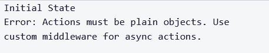

# <link href="style.css" rel="stylesheet"></link>

# 5 Redux Tutorial

# 📜 Table of Contents

# ✏️ Summary

# ⭕ Introduction

- Redux is defined as a predictable state container for JavaScript apps

- Redux can be used with any view library but we shall use it with React

# ⭕ Tutorial Commentary

## 🟨 1: Create a Redux Store

<h3 class="intro"> ⚪ What is Redux </h3>

- Redux is a state management framework which can be usd with many different web technologies including React.

- In Redux, there is a single state object used for entire state of application - this is the Redux store.

- Redux has a createStore() which lets you create the Redux Store

<h3 class="task"> 🔴 Task </h3>

- Declare a store variable and assign it to the createStore() method, passing the reducer as argument.

- The reducer here is defined as:

```javascript
const reducer = (state = 5) => {
    return state;
}
```

<h3 class="solution"> 🟢 Solution </h3>

The solution is:

```javascript
const store = Redux.createStore(reducer)
```

<hr>

## 🟨 2: Get State from Redux store

- In order to get the state from store, we use the getState() method

<h3 class="task"> 🔴 Task </h3>

- Use the getState() method to retrieve from the store, and assign this to a new variable "currentState"

<h3 class="solution"> 🟢 Solution </h3>

The solution is:

```javascript
const store = Redux.createStore(
    (state = 5) => state;
);
// Change code below this line
var currentState = store.getState();
```
<hr>

## 🟨 3: Define a Redux Action

- In Redux, all state updates are triggered by dispatching actions.

- An action is a JavaScript object which contains informations about an action event which has occured.

- Sometimes a Redux action also carries a username afer a user logs in. Actions must contain a type property which specifies the type of action that occured.

<h3 class="task"> 🔴 Task </h3>

- Declare an object "action" and give it a property type set to the String 'LOGIN'

<h3 class="solution"> 🟢 Solution </h3>

The solution is:

```javascript
// Define an action here:
const action = {
  type: 'LOGIN'
}
```

<hr>

## 🟨 4: Define an Action Creator

- After creating an action, next step is sending the action to redux store so the state can be updated

- Action creators are used to achieve this

- Action creator is a function which returns an action.

<h3 class="task"> 🔴 Task </h3>

- Define a function named actionCreator() which returns an action when defined

<h3 class="solution"> 🟢 Solution </h3>

The solution is:

```javascript
const action = {
    type: 'LOGIN'
}
// define action creator here
function actionCreator(){
    return action;
}
```

<hr>

## 🟨 5: Dispatch an Action Event

- We call store.dispatch() to dispatch actions from Redux store.

- Passing the value from an action creator will send an actin to the store.

<h3 class="task"> 🔴 Task </h3>

- The Redux store in the code below is initialised with an object containing "login: false"

- There is a loginAction which returns an object of type LOGIN

- Dispatch the LOGIN action to the Redux store by calling the dispatch method, and pass in the action created by loginAction()

<h3 class="solution"> 🟢 Solution </h3>

The solution is:

```javascript
const store = Redux.createStore(
    (state={login:false}) => state
)

const loginAction = () => {
    return {
        type: 'LOGIN'
    }
};

// dispatch the action here

store.dispatch(loginAction())
```

<hr>

## 🟨 6: Handle an Action in the Store

- After an action is created and dispatched, the Redux store needs to know how to handle the exception. This is the job for the Reducer function

- Reducers in Redux are responsible for state modifications in response to actions

- A reducer takes state and action, then returns new state.

- state is read-only in Redux, hence reducer can only return a NEW state.


<h3 class="task"> 🔴 Task </h3>

- The code below follows the previous step, as well as start of "reducer" function.

- Fill the reducer function so that IF it recieves an action of type 'LOGIN' it returns a state with "login" set to true. OTHERWISE return current state.

- The code is initialised as:

```jsx
const defaultState = {
    login: true;
};

const reducer = ( state = defaultState, action ) => {
    // Change code below this line

    // Change code above this line
};

const store = Redux.createStore(reducer);

const loginAction = () => {
    return {
        type: 'LOGIN'
    }
};
```

<h3 class="solution"> 🟢 Solution </h3>

- I implement the reducer function as:

```javascript
const reducer = ( state = defaultState, action ) => {
    // Change code below this line
    if (action.type == 'LOGIN'){
        return {
            login: true
        }
    } else {
        return defaultState
    }
}
```

- The entire code is:

```javascript
const defaultState = {
  login: false
};

const reducer = (state = defaultState, action) => {
  // Change code below this line
  console.log(action.type)
  if (action.type=='LOGIN'){
    return {
      login: true
    }
  } else {
    return defaultState
  }
  // Change code above this line
};

const store = Redux.createStore(reducer);

const loginAction = () => {
  return {
    type: 'LOGIN'
  }
};
```

<hr>

## 🟨 7: Use a Switch Statement to Handle Multiple Actions

- You can instruct Redux store how to handle different types of actions.

- E.g., suppose you are managing user authentication, you want to a state representation for users which are logged in and when they logout. You can represent this with an "authenticated" object. You need action creators corresponding to user login/logout.

<h3 class="task"> 🔴 Task </h3>

- The code below has store, actions and action creators set up for you.

- Fill in the reducer function so it can handle multiple authentication actions.

- Use a switch statement to respond to different action events in the reducer.

- The code is initialised as:

```javascript
const defaultState = {
    authenticated: false
};

const authReducer = ( state = defaultState, action ) =>
{
    // Change code below this line

    // Change code above this line
};

const store = Redux.createStore(authReducer);

const loginUser = () => {
    return { type: 'LOGIN' }
}

const logoutUser = () => {
    return { type: 'LOGOUT' }
}
```

<h3 class="solution"> 🟢 Solution </h3>

- I struggled to get a solution! So this is FreeCodeCamp's solution!

- The reducer function is implemented as:

```javascript
const authReducer = ( state=defaultState, action ) =>
{
    switch (action.type) {
        case "LOGIN": 
            return { authenticated: true };
        case "LOGOUT":
            return { authenticated: false };
        default: return defaultState;
    }
}
```

- The entire code is:

```javascript
const defaultState = {
  authenticated: false
};

const authReducer = (state = defaultState, action) => {
 switch (action.type) {
    case "LOGIN":
      return {
        authenticated: true
      };

    case "LOGOUT":
      return {
        authenticated: false
      };

    default:
      return defaultState;
  }
};

const store = Redux.createStore(authReducer);

const loginUser = () => {
  return {
    type: 'LOGIN'
  }
};

const logoutUser = () => {
  return {
    type: 'LOGOUT'
  }
};
```

<hr>

## 🟨 8: Use const for Action Types

- A common practice is to assign action types as read-only, then reference these constants elsewhere in code.

<h3 class="task"> 🔴 Task </h3>

- Declare "LOGIN" and "LOGOUT" as const values and assign them to the strings 'LOGIN' and 'LOGOUT'.

- Then edit the authReducer() and the action creators to reference the constant values.

- The code is initialised as:

```javascript

const defaultState = { authenticated: false };

const authReducer = (state=defaultState, action) => {
    
    switch (action.type) {
        case 'LOGIN': {
            return { authenticated: true }
        }
        case 'LOGOUT': {
            return { authenticated: false }
        }

        default:
          return state
    }
};

const store = Redux.createStore(authReducer);

const loginUser = () => {
  return {
    type: 'LOGIN'
  }
};

const logoutUser = () => {
  return {
    type: 'LOGOUT'
  }
}
```

<h3 class="solution"> 🟢 Solution </h3>

- The solution is:

```javascript
const LOGIN = 'LOGIN'
const LOGOUT = 'LOGOUT'

const defaultState = {
  authenticated: false
};

const authReducer = (state = defaultState, action) => {

  switch (action.type) {
    case LOGIN: 
      return {
        authenticated: true
      }
    case LOGOUT: 
      return {
        authenticated: false
      }

    default:
      return state;

  }

};

const store = Redux.createStore(authReducer);

const loginUser = () => {
  return {
    type: LOGIN
  }
};

const logoutUser = () => {
  return {
    type: LOGOUT
      }
};
```

<hr>

## 🟨 9: Register a Store Listener

- The Redux store has another method: redux.subscribe(). This let's you subscribe listener functions to the store, which are called when an action is dispatched against store.

- One use of the subscribe method is to add a function which logs a message every time an action is received.

<h3 class="task"> 🔴 Task </h3>

- Write a callback function which increments a global "count" variable and pass to the subscribe method 

- You will see tthat dispatch is called 3 times in a row, test the count is equal to 3!

- The code is initialised as:

```javascript
const ADD = 'ADD';

const reducer = ( state = 0, action ) => {
  switch(action.type) {
    case ADD: {
      return state+1;
    }
    default: return state;
  }
};

const store = Store.redux(reducer);

// Global count variable
let count = 0;

// Change code below this line

// Change code above this line

store.dispatch({type:ADD});
console.log(count);
store.dispatch({type:ADD});
console.log(count);
store.dispatch({type:ADD});
console.log(count);
```

- I add the following lines:

```javascript
const increment = () =>{
  count++;
}
store.subscribe(increment())
```

<h3 class="solution"> 🟢 Solution </h3>

The solution is:

```javascript
const ADD = 'ADD';

const reducer = (state = 0, action) => {
  switch(action.type) {
    case ADD:
      return state + 1;
    default:
      return state;
  }
};

const store = Redux.createStore(reducer);

// Global count variable:
let count = 0;

// Change code below this line
const increment = () =>{
  count++;
}
store.subscribe(increment())
// Change code above this line

store.dispatch({type: ADD});
console.log(count);
store.dispatch({type: ADD});
console.log(count);
store.dispatch({type: ADD});
console.log(count);
```

<hr>

## 🟨 10: Combine Multiple Reducers

- Redux provides reducer composition as a solution for complex applications

- You define multiple reducers to handle different pieces of your application's state. We can compose these reducers together to one root reducer. This root reducer is passed into redux.createStore() method

- Redux provides a combineReducers() method. This method accepts an object.

- You should create a reducer for each distinct piece of application state.

- E.g., in a note-taking app, one reducer could handle authentication and another for handling text user submits. We may write a combineReducer method like:

```javascript
const rootReducer = Redux.combineReducers({
  auth: authenticationReducer,
  notes: notesReducer
});
```

<h3 class="task"> 🔴 Task </h3>

- There are counterReducer() and authReducer() functions provided in the code editor, along with a Redux store.

- The code is initialised as:

```javascript
const counterReducer = (state=0. action) => {
    switch(action.type) {
        case INCREMENT:
            return state + 1;
        case DECREMENTR:
            return state - 1;
        default:
            return state;
    }
}

const LOGIN = 'LOGIN'
const LOGOTUT = 'LOGOUT';

const authReducer = (state={authenticated:false}, action) => {
    switch (action.type){
        case LOGIN: return {authentication:true}
        case LOGIN: return {authentication:false}
        default:
            return state
    }
};

const rootReducer = // define reducer here

const store = Redux.createStore(rootReducer)
```

- I define the rootReducer as:

```javascript
const authReducer = Redux.combineReducers({
    count: counterReducer,
    auth: authReducer
})
```

<h3 class="solution"> 🟢 Solution </h3>

The solution is:

```javascript
const INCREMENT = 'INCREMENT';
const DECREMENT = 'DECREMENT';

const counterReducer = (state = 0, action) => {
  switch(action.type) {
    case INCREMENT:
      return state + 1;
    case DECREMENT:
      return state - 1;
    default:
      return state;
  }
};

const LOGIN = 'LOGIN';
const LOGOUT = 'LOGOUT';

const authReducer = (state = {authenticated: false}, action) => {
  switch(action.type) {
    case LOGIN:
      return {
        authenticated: true
      }
    case LOGOUT:
      return {
        authenticated: false
      }
    default:
      return state;
  }
};

const rootReducer = Redux.combineReducers({
  count: counterReducer,
  auth: authReducer
});

const store = Redux.createStore(rootReducer);
```


<hr>

## 🟨 11: Send Action Data to the Store

- So far the actions we dispatched only contained "type" information. We can also send specified data with our actions.


<h3 class="task"> 🔴 Task </h3>

- The code below defines notesReducer() and addNoteText() action creator.

- Finish the addNotText so it returns an action object. The object should have "type" of value ADD_NOTE, and also a "text" property set to "note" data

- When you call the addNoteText() creator, you'll pass specific note data.

- Secondly, finish the switch statement in notesReducer. When ADD_NOTE case is triggered, it should return the text property on the incoming action as new state

```javascript
const ADD_NOTE = 'ADD_NOTE';

const notesReducer = (state='Initial State', action) => {
    switch (action.type) {
        // Change code below this line

        // Change code above this line
        default:
            return state;
    }
};

const addNoteText = (note) => {
    // Change code below this line

    // Change code above this line
};

const store = Redux.createStore(notesReducer);

console.log(store.getData());
store.dispatch(addNoteText('Hello'));
console.log(store.getState());
```

- The console initially displays:



- I first implement the addNoteText() function:

```javascript
const addNoteText = (note) => {
  // Change code below this line
  return {
    type: ADD_NOTE,
    text: note
  }
  // Change code above this line
};
```

- I then implement the notesReducer:

```javascript
const noteReducer = (state='Initial State', action) => {
    switch (action.type) {
        // Change code below this line
        case ADD_NOTE:
            return action.text
        // Change coee above this line
        default:
            return state;
    }
};
```

<h3 class="solution"> 🟢 Solution </h3>

The solution is:

``` javascript
const ADD_NOTE = 'ADD_NOTE';

const notesReducer = (state = 'Initial State', action) => {
  switch(action.type) {
    // Change code below this line
      case ADD_NOTE:
      return action.text;
    // Change code above this line
    default:
      return state;
  }
};

const addNoteText = (note) => {
  // Change code below this line
  return {
    type: ADD_NOTE,
    text: note
  }
  // Change code above this line
};

const store = Redux.createStore(notesReducer);

console.log(store.getState());
store.dispatch(addNoteText('Hello!'));
console.log(store.getState());
```

The result is:


<hr>

## 🟨 12: Use Middleware to Handle Asynchrous Actions

- Eventually, you will call asynchrous actions in your app! Redux provides middleware for this purpose called Redux Thunk middleware.

- In order to include this in the app, you pass an argument to Redux.applyMiddleware() which is then passed in whole to Redux.createStore()'s second parameter. E.g.:

```javascript
const store = Redux.createStore(
  asyncDataReducer,
  Redux.applyMiddleware(ReduxThunk.default)
);
```

- The below code simulates an asynchrous request with setTimeout() call.

<h3 class="task"> 🔴 Task </h3>

- Write both dispatches in the handleAsync() action creator. Dispatch requestingData() before the setTimeout(). Then after receiving the data, dispatch

- The code is initialised as:

```javascript
const REQUESTING_DATA = 'REQUESTING_DATA'
const RECEIVEDE_DATA = 'RECIEVED_DATA'

const requestingData = () => { return { type: REQUESTING_DATA } }
const receivedData = (data) => { return { type: RECEIVED_DATA, users: data.users} }

const handleAsync = () => {
    return function(dispatch){
        // Dispatch request action here

        setTimeout(function(){
            let data = {
                users = ['Jeff', 'William', 'Alice']
            }
            // Dispatch received data action here
        }, 2500);
    }
};

const defaultState = {
    fetching: false,
    users: []
};

const asyncDataReducer = (state=defaultState, action) => {
    switch(action.type){
        case REQUESTING_DATA:
            return {
                fetching: false,
                users: action.users
            }
        default:
            return state;
    }
};

const store = Redux.createStore(
    asyncDataReducer,
    Redux.applyMiddleware(ReduxThunk.default)
);
```

<h3 class="solution"> 🟢 Solution </h3>

The solution is:

```javascript
const REQUESTING_DATA = 'REQUESTING_DATA'
const RECEIVED_DATA = 'RECEIVED_DATA'

const requestingData = () => { return {type: REQUESTING_DATA} }
const receivedData = (data) => { return {type: RECEIVED_DATA, users: data.users} }

const handleAsync = () => {
  return function(dispatch) {
    // Dispatch request action here
  dispatch(requestingData())
    setTimeout(function() {
      let data = {
        users: ['Jeff', 'William', 'Alice']
      }
      // Dispatch received data action here
      dispatch(receivedData(data));
    }, 2500);
  }
};

const defaultState = {
  fetching: false,
  users: []
};

const asyncDataReducer = (state = defaultState, action) => {
  switch(action.type) {
    case REQUESTING_DATA:
      return {
        fetching: true,
        users: []
      }
    case RECEIVED_DATA:
      return {
        fetching: false,
        users: action.users
      }
    default:
      return state;
  }
};

const store = Redux.createStore(
  asyncDataReducer,
  Redux.applyMiddleware(ReduxThunk.default)
);
```

<hr>

## 🟨 13: Write a Counter with Redux

- We have learnt all the core principles of Redux. We've seen how to create actions and action creators, create a Reduc store, dispatch actions against the store, design state updates wwith pure reducers. We also saw how to compose reducers and handle asynchrous actions.

- The next challenge will be about state immutability

<h3 class="task"> 🔴 Task </h3>

- In this lesson, I will implement a counter from scratch using Redux.


- The code is initialised as:

```javascript
const INCREMENT = null; // define a constant for increment action types
const DECREMENT = null; // define a constant for decrement action types

const counterReducer = null; // Define the counter reducer which will increment/decrement the state based on the action it receives.

const incAction = null; // Define an action creator for incrementing

const decAction = null; // Define an action creator for decrementing

const store = null; // Define the Redux store here. passing in your reducers
```

<h3 class="solution"> 🟢 Solution </h3>

The solution is:

```javascript
const INCREMENT = 'INCREMENT'
const DECREMENT = 'DECREMENT'

const counterReducer = (state=0, action) => {
    switch (action.type) {
        case INCREMENT: return state + 1;
        case DECREMENT: return state - 1;
        default: return state
    }
}

const incAction = () => {
    return { type: INCREMENT }
}
const decAction = () => {
    return { type: DECREMENT }
}

const store = Redux.createStore(counterReducer);
```


<hr>

## 🟨 14: Never Mutate State

- The key principle of Redux is never to mutate state, instead to return a new copy of state.

- If we took a snapshot of the state over time (State1, State2, ...), the states will change iteratively. This immutability allows  **time-travel debugging**.

- Redux does **NOT** enforce immutability on state in its store or reducers - this responsibility is on you! 😠

- Fortunantely, JavaScript has built in immutability on main of its types 😅 - including strings, numbers. Arrays and Objects, however, are mutable! 😰

<h3 class="task"> 🔴 Task </h3>

- The store and reducer in the code below are for managing to-do items. 

1. Finish writing the ADD_TO_DO case in the reducer to append a new to-do to the state.

- The code is initialised as:

```javascript
const ADD_TO_DO = 'ADD_TO_DO';

// A list of strings representing tasks to do:
const todos = [
    'Go to the store',
    'Clean the house',
    'Learn to code',
]

const immutableReducer = (state=todos, action) => {
    switch(action.type){
        case ADD_TO_DO:
            // Don't Mutate state here or the tests will fail
            return
        default:
            return state;
    }
};

const addToDo = (todo) => {
    return {
        type: ADD_TO_DO,
        todo
    }
};

const addToDo = (todo) => {
    return {
        type: ADD_TO_DO,
        todo
    }
}

const store = Redux.createStore(ikmmutableReducer);
```

- I concatenate the toDo property of the action object to the state:

```javascript
console.log(state)
return state.concat(action.toDo)
```

<h3 class="solution"> 🟢 Solution </h3>

The solution is:

```javascript
const ADD_TO_DO = 'ADD_TO_DO';

// A list of strings representing tasks to do:
const todos = [
    'Go to the store',
    'Clean the house',
    'Cook dinner',
    'Learn to code',
]

const immutableReducers = (state=todos, action) => {
    switch(action.type){
        case ADD_TO_DO:
            console.log(action) // { type: 'ADD_TO_DO', todo: '__TEST__TO__DO__' }
            return state.concat(action.todo)
        default return state
    }
}

const addToDo = (todo) => {
    return { type: ADD_TO_DO, todo }
}

const store = Redux.createStore(immutableReducer);
```

<h3 class="task"> 🔴 Task </h3>

- Use the spread operator to return a new copy of state when a to-do is added

<h3 class="solution"> 🟢 Solution </h3>

The solution is:

<hr>

## 🟨 15: Use the Spread Operator on Arrays

- The spread operator enumerates the values of an array into a new instance. We can then convert it back to an array by enclosing with square brackets. This is now a clone 👯 of the original array.


<h3 class="task"> 🔴 Task </h3>

- Use the spread operator to return a new copy of the state

- The code is initialised as:

```jsx
const immutableReducer = (state = ['Do not mutate state!'], action) => {
    switch(action.type) {
        case 'ADD_TO_DO':
            // Don't mutate state here or the test will fail
            return
        default:
            return state
    }
};

const addToDo = (todo) => {
    return {
        type: 'ADD_TO_DO',
        todo
    }
}

const store = Redux.createStore(immutableReducer)
```

- I add the following line:

```javascript
case 'ADD_TO_DO':
    return [...state].concat(action.todo)
```

<h3 class="solution"> 🟢 Solution </h3>

The solution is:

```jsx
const immutableReducer = (state = ['Do not mutate state!'], action) => {
  switch(action.type) {
    case 'ADD_TO_DO':
      // Don't mutate state here or the tests will fail
      return [...state].concat(action.todo)
    default:
      return state;
  }
};

const addToDo = (todo) => {
  return {
    type: 'ADD_TO_DO',
    todo
  }
}

const store = Redux.createStore(immutableReducer);
```


## 🟨 Placeholder

<h3 class="intro"> ⚪ Introduction </h3>

<h3 class="example"> 🟠 Example </h3>

<h3 class="task"> 🔴 Task </h3>

<h3 class="solution"> 🟢 Solution </h3>

The solution is:

<h3 class="result"> 🔵 Result</h3>

The output is:
