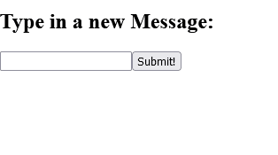

# <link href="style.css" rel="stylesheet"></link>

# 6 React and Redux Tutorial

# 📜 Table of Contents


  <br>

# ✏️ Summary


# ⭕ Introduction

- Redux is defined as a predictable state container for JavaScript apps

- Redux can be used with any view library but we shall use it with React

# ⭕ Tutorial Commentary

## 🟨 1: Getting Started with React Redux

- React is a view library that you provide with data, which then renders the view in a predictable fashion.

- Redux is a statement management framework.

- In a typical React Redux application, you create a single Redux store.

- The react components subsribe to relevant pieces of data. You then dispatch actions directly from React components which then trigger store updates.

- React components can manage their own state locally, its better to keep the app state in a single location in Redux.

- Redux is not designed to work with React out the box, you need to use the react-redux package. It provides you with a way to pass Redux state and dispatch to your React components as props.

- In the next couple of challenges, I will create a simple React component which allows you to add new text messages. These will be added to an array that's displayed in the view.

- Next, you'll create a Redux store and actions which manages state of the messages array.

- Finally, you'll use react-redux to connect the Redux store with your component which will extract local state into the Redux store.

<h3 class="task"> 🔴 Task </h3>

- Add a constructor to the DisplayMessages component and initialise it with a state with and input and messages properties. Initialise with empty string and array.

- The code is initialised as:

```jsx
class DisplayMessages extends React.Component {
    // Change code below this line

    // Change code above this line
    render(){
        return <div />
    }
}
```

- I declare a constructor and initialise the state to:

```jsx
constructor(props){
    super(props);
    this.state = { input: '',messages: [] }
}
```

<h3 class="solution"> 🟢 Solution </h3>

The solution is:

```jsx
class DisplayMessages extends React.Component {
  // Change code below this line
  constructor(props){
    super(props);
    this.state = { input: '',messages: [] }
  }
  // Change code above this line
  render() {
    return <div />
  }
};
```


<hr>

## 🟨 2: Manage State Locally First

- We shall finish creatinf DisplayMessages component

<h3 class="task"> 🔴 Task </h3>

1. Firstly:

    - In the render method, render the input, button and ul elements

    - When the input element changes, trigger the handleChange() method

    - The input element should render the value of input which is in component's state

    - The button should trigger submitMessage() method when clicked.

2. Secondly:

    - Write the handleChange() method which should update the input when user is typing

    - The submitMessage() should concatenate the current message in input to the messages array, and clear the value of the input

3. Finally, use the ul to map over the array of messages and render to the screen as a list of li elements.

- The code is initialised as:

```jsx
class DisplayMessages extends React.Component {
    constructor(props){
        super(props);
        this.state = { input: '', messages: [] }
    }

    // Add handleChange() and submitMessage() methods here
    
    render() {
        return (
            <div>
                <h2>Type in a new Message:</h2>
                {/* Render an input, button, and ul below this line */}

                {/* Change the code above this line */}
            </div>
        )
    }

}
```

- The output currently looks like:


<h3 class="intro"> ⚪ Solution Steps</h3>

- I first binded the handleChange and submitMessage to the this keyword:

```jsx
this.handleChange = this.handleChange.bind(this)
this.submitMessage = this.submitMessage.bind(this)
```
 
- I add the input, submit and ul elements in the render() method:

```jsx
<input />
<button>Submit!</button>
<ul></ul>
```

- I then define my handleChange and subnmitChange methods:

```jsx
  handleChange(event) {
  }

  submitMessage(){
  }
```
      
- I add the onChange and value attribute to the input elements:

```jsx
<input value={this.input} onChange={this.handleChange} />
```

- I add the submitMessage() method to the onClick event of the button:

```jsx
<button type='submit' onClick={this.submitMessage}>Submit!</button>
```

- I implement the handleChange() method so the input property of state is updated:

```jsx
handleChange() {
    this.setState({
        input: event.target.value
    })
}
```

- I implement the submitMessage method, so the input property from state is added to the messages array and input is reinitialised:

```jsx
submitMessage(){
    this.setState({
        input: '',
        messages: this.state.messages.concat(this.state.input);
    })
}
```

- I then map the messages to li elements in the ul element:

```jsx
<ul>{this.state.messages.map(i=><li>{i}</li>)}</ul>
```


<h3 class="solution"> 🟢 Solution </h3>

The solution is:

```jsx
class DisplayMessages extends React.Component {
  constructor(props) {
    super(props);
    this.state = {
      input: '',
      messages: []
    }
    this.handleChange = this.handleChange.bind(this)
    this.submitMessage = this.submitMessage.bind(this)
  }
  // Add handleChange() and submitMessage() methods here
  handleChange(event) {
    this.setState({
      input: event.target.value
    });
  }

  submitMessage(){
    this.setState({
      input: '',
      messages: this.state.messages.concat(this.state.input)
    })
  }

  render() {
    return (
      <div>
        <h2>Type in a new Message:</h2>
        { /* Render an input, button, and ul below this line */ }
        <input value={this.state.input} onChange={this.handleChange}/>
        <button type='submit' onClick={this.submitMessage}>Submit!</button>
        <ul>{this.state.messages.map(i=><li>{i}</li>)}</ul>
        { /* Change code above this line */ }
      </div>
    );
  }
};
```

<h3 class="result"> 🔵 Result</h3>

The output is:




<hr>

## 🟨 3: Extract State Logic to Redux

- We finished the React component, we need to move its logic to the Redux state. This is the first step to connect a React app to Reduc.

- We shall look at a simple example first, to see how React and Redux work together

<h3 class="task"> 🔴 Task </h3>

- We define an actin type ADD, then create an action creator addMessage() which create the action to add a message. I will passs a meesage to the action creator and include the message in the returned action.

- Then create messageReducer which handles state for messages. The initial state should be an empty array. The redycer should add the message to the array stored in state, or return current state.

- Finally, create the Redux store using the reducer!

- The code is initialised as:

```jsx
// Define ADD, addMessage(), messageReducer(), and store here:
```

- I create a constant for ADD:

```jsx
const ADD = 'ADD'
```

- I define the addMessage() action creator:

```jsx
const addMessage = (message) => {
    return { type: ADD, message: message}
}
```

- I define a defaultState of an empty array and the reducer:

```jsx
const defaultState = []
const messageReducer = (state=defaultState, action) => {
    case (action.type) {
        case ADD: return [...state].concat(action.message)
        default: return state
    }
}
```

- I then create the store with the reducer:

```jsx
const store = Redux.createStore(messageReducer);
```

<h3 class="solution"> 🟢 Solution </h3>

The solution is:

```jsx
// Define ADD, addMessage(), messageReducer(), and store here:

const ADD = 'ADD'

const addMessage = (message) => {
  return { type: ADD, message: message}
}

const defaultState = []

const messageReducer = (state=defaultState, action) => {
  switch (action.type){
    case ADD: return [...state].concat(action.message)
    default: return state
  }
}

const store = Redux.createStore(messageReducer)
```


<hr>

## 🟨 4: Use Provider to Connect Redux to React

- In the previous step, we created a Redux store to handle messages array and created an action for adding new messages.

- The next step is to provide React access to the Redux store and the actions it needsto dispatch updates. React provides react-redux package to help accomplish these tasks.

<br>

- React Redux propvides a small API with two key featuresL: Provider and Connect.

- The Provider is a wrapper component for the React app.

- This wrapper allows you to access the Redux store and dispatch functions.

- The Provider component takes two props: Redux store and the child components of your app.

- Defining the Provider for an App component might look like this:

```jsx
<Provider store={store}>
    <App/>
</Provider>
```
<br>

<h3 class="task"> 🔴 Task </h3>

- The code editor shows all your Redux and React code from the previous challenges. This includes the Redux store, actions annd the DisplayMessages component.

- There is a new AppWrapper component which acts as a top-level component to render the Provider from ReactRedux, and pass the Redux store as a prop.

- Then, render the DisplayMessages component as a child.

- The code is initialised as:

```jsx
// Redux:
const ADD = 'ADD';

const addMessage = (message) => {
    return {
        type: ADD,
        message
    }
};

const messageReducer = (state=[], action) => {
    switch (action.type){
        case ADD:
            return [
                ...state,
                action.message
            ];
        default:
            return state
    }
};

const store = Redux.createStore(messageReducer);

// React:

class DisplayMessages extends React.Component {
    constructor(props){
        super(props);
        this.state = { input: '', messages: [] }
        this.handleChange=this.handleChange.bind(this);
        this.submitMessage=this.submitMessage.bind(this);
    }
    handleChange(event){
        this.setState({
            input: event.target.value
        });
    }
    submitMessage(event){
        this.setState({
            const currentMessage = state.input;
            return {
                input: '',
                messages: state.messages.concat(currentMessage)
            }
        });
    }
    render() {
        return (
            <div>
                <h2>Type in a new Message:</h2>
                <input
                    value={this.state.input}
                    onChange={this.handleChange}/><br>
                <button onClick={this.submitMessage}>Submit</button>
                <ul>
                    {this.state.message.map( (message, idx) => {
                        return(
                            <li key={idx}>{message}</li>
                        )
                    })
                    }
                </ul>
            </div>
        )
    }
};

const Provider = ReactRedux.Provider

class AppWrapper extends React.Component {
    // Render the Provider below this line

    // Change code above this line
}
```

- I implement the render() method for AppWrapper:

```jsx
class AppWrapper extends React.Component {
  // Render the Provider below this line
  render(){
    return (
      <Provider store={store}>
        <DisplayMessages />
      </Provider>
    )
  }
  // Change code above this line
};
```

<h3 class="solution"> 🟢 Solution </h3>

The solution is:

```jsx
// Redux:
const ADD = 'ADD';

const addMessage = (message) => {
  return {
    type: ADD,
    message
  }
};

const messageReducer = (state = [], action) => {
  switch (action.type) {
    case ADD:
      return [
        ...state,
        action.message
      ];
    default:
      return state;
  }
};


const store = Redux.createStore(messageReducer);

// React:

class DisplayMessages extends React.Component {
  constructor(props) {
    super(props);
    this.state = {
      input: '',
      messages: []
    }
    this.handleChange = this.handleChange.bind(this);
    this.submitMessage = this.submitMessage.bind(this);
  }
  handleChange(event) {
    this.setState({
      input: event.target.value
    });
  }
  submitMessage() {  
    this.setState((state) => {
      const currentMessage = state.input;
      return {
        input: '',
        messages: state.messages.concat(currentMessage)
      };
    });
  }
  render() {
    return (
      <div>
        <h2>Type in a new Message:</h2>
        <input
          value={this.state.input}
          onChange={this.handleChange}/><br/>
        <button onClick={this.submitMessage}>Submit</button>
        <ul>
          {this.state.messages.map( (message, idx) => {
              return (
                 <li key={idx}>{message}</li>
              )
            })
          }
        </ul>
      </div>
    );
  }
};

const Provider = ReactRedux.Provider;

class AppWrapper extends React.Component {
  // Render the Provider below this line
render(){
    return (
      <Provider store={store}>
        <DisplayMessages />
      </Provider>
    )
  }
  // Change code above this line
};
```


<h3 class="result"> 🔵 Result</h3>

The output is:


<hr>

## 🟨 5: Map State to Props

- The Provider component allows you to provide state and dispatch to your React components, but you must specify exactly what state and actions you want.

- This way, you make sure that each component only has access to the state it needs

## 🟨 Placeholder

<h3 class="task"> 🔴 Task </h3>

<h3 class="solution"> 🟢 Solution </h3>

The solution is:

<h3 class="result"> 🔵 Result</h3>

The output is: