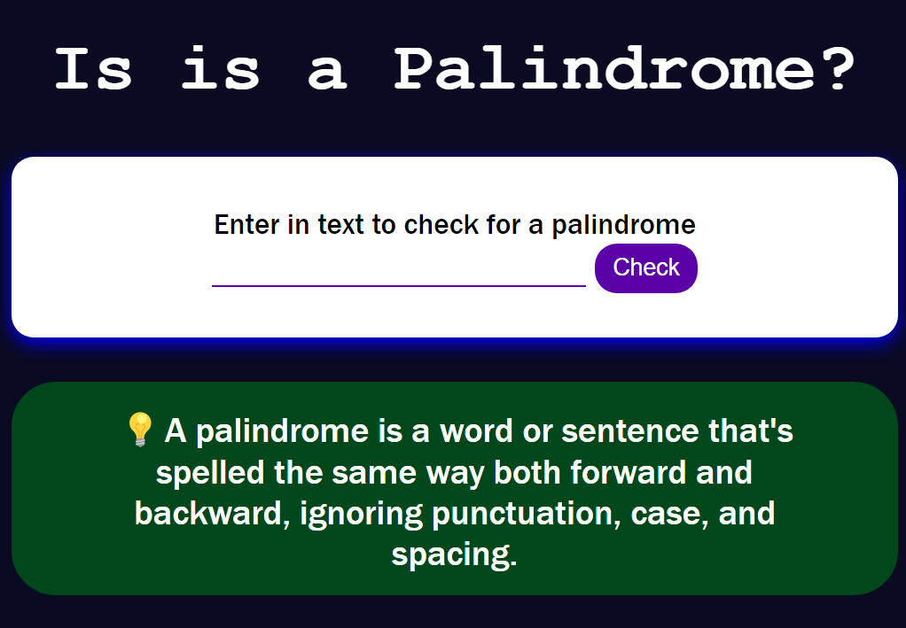

# 🚧 1 Build a Palindrome Checker Project

* **Objective**: Build an app that is functionally similar to [https://palindrome-checker.freecodecamp.rocks/](https://palindrome-checker.freecodecamp.rocks/)

## 📜 Instructions 📜

* A palindrome is a word or phrase that can be read the same way forwards and backwards, ignoring punctuation, case, and spacing.
* Note: You'll need to remove all non-alphanumeric characters (punctuation, spaces and symbols) and turn everything into the same case (lower or upper case) in order to check for palindromes.

## 📖 User Stories 📖 

1. You should have an `input` element with an id of `"text-input"`
2. You should have a button element with an `id` of `"check-btn"`
3. You should have a `div`, `span`, or `p` element with an `id` of `"result"`
4. When you click on the `"#check-btn"` element without entering a value into the `#text-input` element, an alert should appear with the text `"Please input a value"`
5. When the `#text-input` element ony contains the letter `A` and the `#check-tn` element is clicked, the `#result` element should contain the text `"A is a palindrome"`
6. When the `#text-input` element contains the text `eye` and the `#check-btn` element is clicked, the `#result` should contain thhe text `"eye is a palindrome"`

<details>
<summary>More user stories</summary>

7. When the `#text-input` element contains the text `_eye` and the `#check-btn` element is clicked, the `#result` element should contain the text `"_eye is a palindrome"`
8. When the `#text-input` element contains the text `race car` and the `#check-btn` element is clicked, the `#result` element should contain the text `"race car is a palindrome"`
9.  When the `#text-input` element contains the text not a palindrome and the `#check-btn` element is clicked, the `#result` element should contain the text `"not a palindrome is not a palindrome"`
10. When the `#text-input` element contains the text `A man, a plan, a canal. Panama` and the `#check-btn` element is clicked, the `#result` element should contain the text `"A man, a plan, a canal. Panama is a palindrome"`
11. When the `#text-input` element contains the text `never odd or even` and the `#check-btn element` is clicked, the `#result` element should contain the text `"never odd or even is a palindrome"`
12. When the `#text-input` element contains the text `nope ` and the `#check-btn element` is clicked, the `#result` element should contain the text `"nope is not a palindrome"`
13. When the `#text-input` element contains the text `almostomla` and the `#check-btn element` is clicked, the `#result` element should contain the text `"almostomla is not a palindrome"`
14. When the `#text-input` element contains the text `My age is 0, 0 si ega ym.` and the `#check-btn element` is clicked, the `#result` element should contain the text `"My age is 0, 0 si ega ym. is a palindrome"`
15. When the `#text-input` element contains the text ` 1 eye for of 1 eye.` and the `#check-btn element` is clicked, the `#result` element should contain the text `"1 eye for of 1 eye. is not a palindrome"`
16. When the `#text-input` element contains the text `0_0 (: /-\ :) 0-0` and the `#check-btn element` is clicked, the `#result` element should contain the text `"0_0 (: /-\ :) 0-0 is a palindrome"`
17. When the `#text-input` element contains the text `five|\_/|four` and the `#check-btn element` is clicked, the `#result` element should contain the text `"five|\_/|four is not a palindrome"`
</details>

## Project Commentary
* I began with the HTML and CSS to make my app look similar to the one on FreeCodeCamp ([https://palindrome-checker.freecodecamp.rocks/](https://palindrome-checker.freecodecamp.rocks/))
* My website look like this:
<details>
<summary>Screenshot</summary>



<hr>
</details>

* I then started working on the javascript in [script.js](./code/script.js)
* I first worked on showing an alert if the input was blank:
<details>
<summary>Code</summary>

```js
/* getting the form element, so i cann listen to when 
   it is submitted
*/
const palindromeChecker = document.getElementById("palindrome-checker");
const textInput = document.getElementById("text-input").value

palindromeChecker.addEventListener("submit", palindromeCheck);

function palindromeCheck(e) {
   e.preventDefault(); // stop form from being submitted

   console.log("check clicked")
   console.log(textInput)

   if (textInput.length === 0) 
      alert("Please input a value")
}
```
</summary>

* I wanted to start using TDD, I began creating a javascript module which I could import into [script.js](./code/script.js)
* I defined [function.js](./code/js/functions.js) as:
```js
function removeWhiteSpaceAndSpecialCharacters(input) {
   return input;
}
module.exports = removeWhiteSpaceAndSpecialCharacters;
```