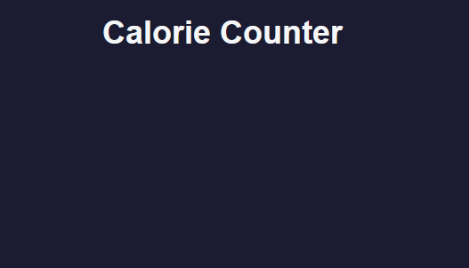
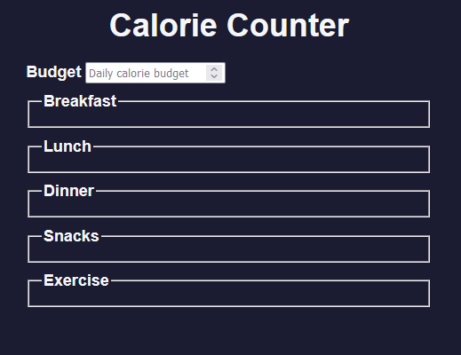
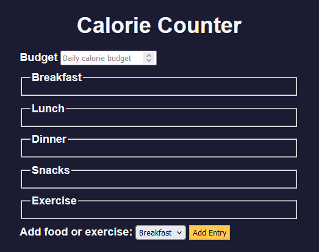
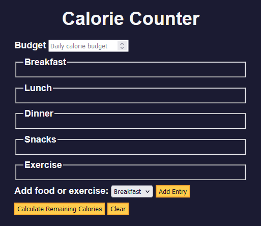

# 🧠 1E Learning Form Validation by Building a Calorie Counter
* In this exervice, I will learn how to accept input from user
* I will learn how to validate input, perform calculations, and dynamically update your interface to display the results.
* I will learn regex, template literals, and `addListener()` method.

## Final Product

## 🟥 Project Setup
* I have the following HTML:
```html
<!DOCTYPE html>
<html lang="en">
  <head>
    <meta charset="utf-8" />
    <meta name="viewport" content="width=device-width, initial-scale=1.0" />
    <link rel="stylesheet" href="styles.css" />
    <title>Calorie Counter</title>
  </head>
  <body>
    <main>
      <h1>Calorie Counter</h1>
      <div class="container">

      </div>
    </main>
  </body>
</html>
```
* CSS:
```css
:root {
  --light-grey: #f5f6f7;
  --dark-blue: #0a0a23;
  --fcc-blue: #1b1b32;
  --light-yellow: #fecc4c;
  --dark-yellow: #feac32;
  --light-pink: #ffadad;
  --dark-red: #850000;
  --light-green: #acd157;
}

body {
  font-family: "Lato", Helvetica, Arial, sans-serif;
  font-size: 18px;
  background-color: var(--fcc-blue);
  color: var(--light-grey);
}

h1 {
  text-align: center;
}

.container {
  width: 90%;
  max-width: 680px;
}

h1,
.container,
.output {
  margin: 20px auto;
}

label,
legend {
  font-weight: bold;
}

.input-container {
  display: flex;
  flex-direction: column;
}

button {
  cursor: pointer;
  text-decoration: none;
  background-color: var(--light-yellow);
  border: 2px solid var(--dark-yellow);
}

button,
input,
select {
  min-height: 24px;
  color: var(--dark-blue);
}

fieldset,
label,
button,
input,
select {
  margin-bottom: 10px;
}

.output {
  border: 2px solid var(--light-grey);
  padding: 10px;
  text-align: center;
}

.hide {
  display: none;
}

.output span {
  font-weight: bold;
  font-size: 1.2em;
}

.surplus {
  color: var(--light-pink);
}

.deficit {
  color: var(--light-green);
}
``` 

## 🟥 Writing HTML for Form
* Currently the webpage looks like:


* I add a label and input for the calorie budget, its of type number and has minimum value of 0
```html
<form id="calorie-counter">
   <label for="budget">Budget</label>
   <input
   type="number"
   min="0"
   id="budget"
   placeholder="Daily calorie budget"
   required
   />
</form>
```
* Below the calorie budget, I create a fieldset for Breakfast:
```html
<fieldset id="breakfast">
   <legend>Breakfast</legend>
   <div class="input-container"></div>
</fieldset>
```
* I create fieldsets for lunch and dinner too:
```html
<fieldset id="lunch">
   <legend>Lunch</legend>
   <div class="input-container"></div>
</fieldset>
<fieldset id="dinner">
   <legend>Dinner</legend>
   <div class="input-container"></div>
</fieldset>
```
* I add two more fieldsets for Snacks and Exercise:
```html
<fieldset id="snacks">
   <legend>Snacks</legend>
   <div class="input-container"></div>
</fieldset>
<fieldset id="exercise">
   <legend>Exercise</legend>
   <div class="input-container"></div>
</fieldset>
```
* The website now looks like:


* A user should be able to select the meal type (breakfast, lunch, etc), so I create a field for adding a entry:
```html
<div class="controls">
   <span>
      <label for="entry-dropdown">Add food or exercise:</label>
      <select id="entry-dropdown" name="options">
         <option value="breakfast" selected>Breakfast</option>
         <option value="lunch">Lunch</option>
         <option value="dinner">Dinner</option>
         <option value="snacks">Snacks</option>
         <option value="exercise">Exercise</option>
      </select>
      <button type="button" id="add-entry">Add Entry</button>
   </span>
</div>
```
* I set the `type` to `button` so the button does not submit
* The page now looks like:

* I add two other buttons, one for submission, one to clear the form:
```html
<div>
   <button type="submit">Calculate Remaining Calories</button>
   <button id="clear" type="button">Clear</button>
</div>
```
* I create a div to display the result below the form:
```html
<div id="output" class="output hide"></div>
```
* Below the `main` element, I add the JavaScript:
```html
<script src="./script.js"></script>
```
* The page now looks like:


## JavaScript
* I declare a variable for my form:
```js
const calorieCounter = document.getElementById("calorie-counter");
```
* I declare a variable for the budget input:
```js
const budgetNumberInput = document.getElementById("budget");
```
* I declare a variable for the dropdown:
```js
const entryDropdown = document.getElementById("entry-dropdown");
```
* I add variables for the add entry and clear button:
```js
const addEntryButton = document.getElementById("add-entry");
const clearButton = document.getElementById("clear")
```
* I declare a variale for the output:
```js
const output = document.getElementById("output")
```