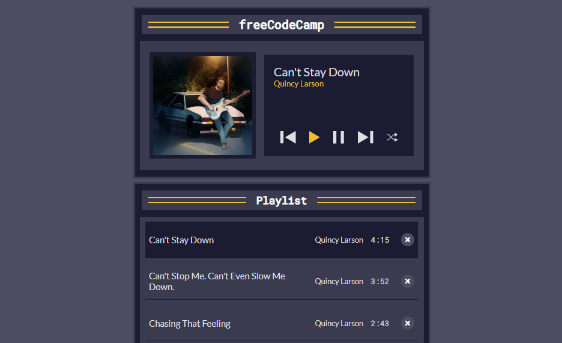
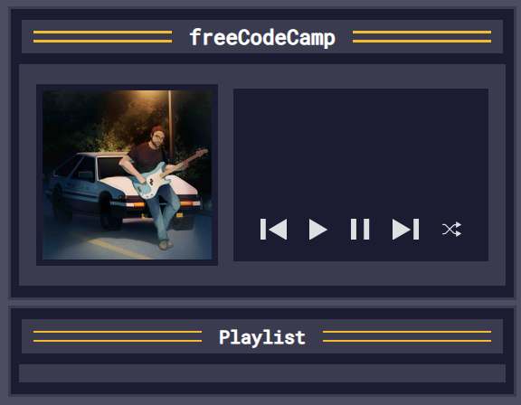
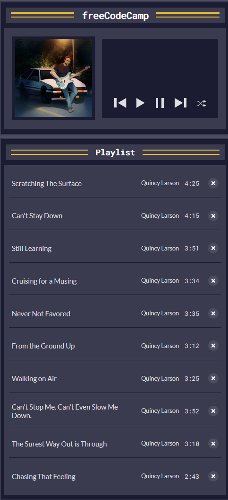
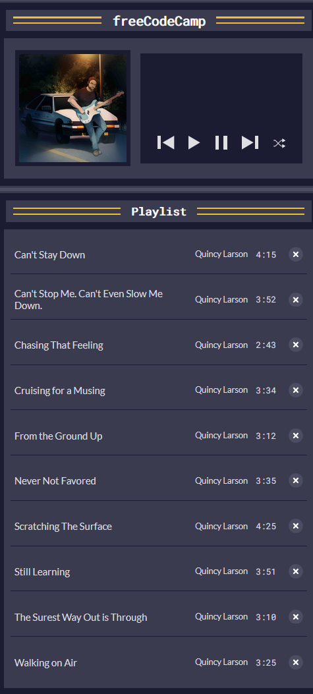
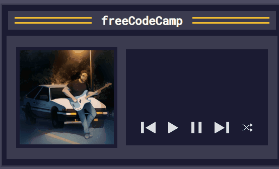

<!-- omit in toc -->
# 🧠 1G Learn Basic String and Array ?Methods by Building a Music Player
* In this exercise I will learn essential string and array methods like `find()`, `forEach()`, `map()` and `join()`
* I will code a basic MP3 player using HTML/CSS/JavaScript 
* I will implement the following features:
   - Handling audio playback
   - Managing playlist
   - Pause, Play, Next, Previous, and Shuffle
   - Dynamically update the UI based on current song
* Here is a preview of what I will build:



<!-- omit in toc -->
## 👨‍🍳 Final Product 👨‍🍳

* You can test the app [here]()

* Here is a demo:


<!-- omit in toc -->
## 📜 Table of Contents 📜


## 🟥 Project Setup
* The [HTML](project-setup/index.html) and [CSS](project-setup/styles.css) files have been provided to me
* The website currently looks like this and has no functionality:


## 🟥 Initialising Variables
* I create my javascript and initialise some variables   
```js
const playlistSongs = document.getElementById("playlist-songs");
const playButton = document.getElementById("play");
const pauseButton = document.getElementById("pause");

const nextButton = document.getElementById("next");
const previousButton = document.getElementById("previous");
const shuffleButton = document.getElementById("shuffle");
```

## 🟥 Creating Array for Songs

* I create an array to store all the songs
```js
let allSongs = [];
```
* I add 10 songs as objects to this array
```js
const allSongs = [
  {
    id: 0,
    title: "Scratching The Surface",
    artist: "Quincy Larson",
    duration: "4:25",
    src: "https://cdn.freecodecamp.org/curriculum/js-music-player/scratching-the-surface.mp3",
  },
  {
    id: 1,
    title: "Can't Stay Down",
    artist: "Quincy Larson",
    duration: "4:15",
    src: "https://cdn.freecodecamp.org/curriculum/js-music-player/can't-stay-down.mp3",
  },
  {
    id: 2,
    title: "Still Learning",
    artist: "Quincy Larson",
    duration: "3:51",
    src: "https://cdn.freecodecamp.org/curriculum/js-music-player/still-learning.mp3",
  },
  {
    id: 3,
    title: "Cruising for a Musing",
    artist: "Quincy Larson",
    duration: "3:34",
    src: "https://cdn.freecodecamp.org/curriculum/js-music-player/cruising-for-a-musing.mp3",
  },
  {
    id: 4,
    title: "Never Not Favored",
    artist: "Quincy Larson",
    duration: "3:35",
    src: "https://cdn.freecodecamp.org/curriculum/js-music-player/never-not-favored.mp3",
  },
  {
    id: 5,
    title: "From the Ground Up",
    artist: "Quincy Larson",
    duration: "3:12",
    src: "https://cdn.freecodecamp.org/curriculum/js-music-player/from-the-ground-up.mp3",
  },
  {
    id: 6,
    title: "Walking on Air",
    artist: "Quincy Larson",
    duration: "3:25",
    src: "https://cdn.freecodecamp.org/curriculum/js-music-player/walking-on-air.mp3",
  },
  {
    id: 7,
    title: "Can't Stop Me. Can't Even Slow Me Down.",
    artist: "Quincy Larson",
    duration: "3:52",
    src: "https://cdn.freecodecamp.org/curriculum/js-music-player/cant-stop-me-cant-even-slow-me-down.mp3",
  },
  {
    id: 8,
    title: "The Surest Way Out is Through",
    artist: "Quincy Larson",
    duration: "3:10",
    src: "https://cdn.freecodecamp.org/curriculum/js-music-player/the-surest-way-out-is-through.mp3",
  },
  {
    id: 9,
    title: "Chasing That Feeling",
    artist: "Quincy Larson",
    duration: "2:43",
    src: "https://cdn.freecodecamp.org/curriculum/js-music-player/chasing-that-feeling.mp3",
  },
];
```

## 🟥 Web Audio API
* All modern web browsers support Web Audio API which enables you to generate and process audio in webb applications
* I initialise an `Audio` class instance which creates a HTML5 `audio` element:
```js
const audio = new Audio()
```

* The music player should keep track of the songs, the current song playing, and the time of the current song. I create a `userData` variable to hold this information
```js
let userData = {};
```

## 🟥 Spread Operator (...)
* In order for me to remove a song, or shuffle songs in my playlist, I need to take a copy of `allSongs` without mutating it
* The `...` spread operator can help me achieve this, its used to copy one array into another. E.g. suppose I have two arrays `arr1` and `arr2`, then I can merge as so:
```js
const arr1 = [1,2,3];
const arr2 = [4,5,6];
const combined = [...arr1, ...arr2]; // [1,2,3,4,5,6]
```
* Using this, I copy `allSongs` to a songs property of userData:
```js
let userData = {
   songs: [...allSongs]
}
```
* To track the current song's info and playback time, I initialise `currentSong` and `songCurrentTime` properties:
```js
let userData = {
  songs: [...allSongs],
  currentSong: null,
  songCurrentTime: 0
};
```

## 🟥 Arrow Functions
* In the previous projects, I used regular functions (and anonymous functions), now I will be using `arrow functions`
* Arrow functions are ANONYMOUS functions
* E.g. you can declare an arrow function as:
```js
() => {console.log("hello")}
```
* This will NOT print anything unless I call it
* You can call an anonymous function using a variable:
```js
let arrowFunction = () => { console.log("hello"); }
arrowFunction(); // hello
```
* Or you can call it directly:
```js
(
   () => { console.log("hello"); }
)(); // hello
```

* I create an arrow function called `printGreeting`:
```js
const printGreeting = () => {
  console.log("Hello there!")
}
printGreeting() // Hello there!
```

* I create a new function called printMessage which prints a parameter:
```js
const printMessage = (org) => {
  console.log(`${org} is awesome!`)
}
printMessage("freeCodeCamp"); 
// freeCodeCamp is awesome!
```

* You can also return a value from arrow function
```js
const addTwoNumbers  = (num1,num2) => {
  return num1+num2;
}
console.log(addTwoNumbers(3, 4))  // 7
```

* Like Java lambdas, you can omit the curly braces and `return` keyword if the result can expressed as a single line:
```js
const addTwoNumbers = (num1, num2) => num1+num2
```

<hr>

## 🟥 Array Map Function


* The `map()` function takes a function as a parameter - AKA a **callback function**:
```js
let array = [1,2,3]
let doubledArray = array.map((number) => number*2) // [2,4,6]
```
* To display songs in UI, I need to create a function, I create a `renderSongs` function which takes an array parameter:
```js
const renderSongs = (array) => {
}
```
* I use the map function to create a `<li>` element with an id of `song-id` (with id being replaced with actual ID of song) and class `playlist-song`:
```js
const renderSongs = (array) => {
  const songsHTML = array.map((song) => {
    return `<li id="song-${song.id}" class="playlist-song"></li>`
  })
}
```
* Within the `li` element, I nest a button with class `playlist-song-info` and a span of `song.title`:
```js
return `
<li id="song-${song.id}" class="playlist-song">
  <button class="playlist-song-info">
    <span class="playlist-song-title">${song.title}</span>
  </button>
</li>
`
```
* I create two more spans within the button element:
```js
<button class="playlist-song-info">
  <span class="playlist-song-title">${song.title}</span>
  <span class="playlist-song-artist">${song.artist}</span>
  <span class="playlist-song-duration">${song.duration}</span>
</button>
```
* I add another button element in the `li` element:
```js
<button class="playlist-song-delete" aria-label="Delete ${song.title}">
  <svg width="20" height="20" viewBox="0 0 16 16" fill="none" xmlns="http://www.w3.org/2000/svg">
    <circle cx="8" cy="8" r="8" fill="#4d4d62"/><path fill-rule="evenodd" clip-rule="evenodd" d="M5.32587 5.18571C5.7107 4.90301 6.28333 4.94814 6.60485 5.28651L8 6.75478L9.39515 5.28651C9.71667 4.94814 10.2893 4.90301 10.6741 5.18571C11.059 5.4684 11.1103 5.97188 10.7888 6.31026L9.1832 7.99999L10.7888 9.68974C11.1103 10.0281 11.059 10.5316 10.6741 10.8143C10.2893 11.097 9.71667 11.0519 9.39515 10.7135L8 9.24521L6.60485 10.7135C6.28333 11.0519 5.7107 11.097 5.32587 10.8143C4.94102 10.5316 4.88969 10.0281 5.21121 9.68974L6.8168 7.99999L5.21122 6.31026C4.8897 5.97188 4.94102 5.4684 5.32587 5.18571Z" fill="white"/>
  </svg>
</button>
```

## 🟥 Array Join Method
* You can join elements of an array using `.join()` method which can optionally take in a seperator:
```js
let array = ["hello","my","name","is","Shiv"]
array.join(); // "hello,my,name,is,shiv"
array.join(" "); // "hello my name is shiv"
```

* Currently, the `songsHTML` is an array, so all the HTML is seperated by commas
* I chain on the join method at the end of the map:
```js
const renderSongs = (array) => {
  const songsHTML = array.map((song) => {
    return `
    <li id="song-${song.id}" class="playlist-song">
      <button class="playlist-song-info">
          <span class="playlist-song-title">${song.title}</span>
          <span class="playlist-song-artist">${song.artist}</span>
          <span class="playlist-song-duration">${song.duration}</span>
      </button>
      ... (REST OF LITERAL OMITTED)
    `   
  }).join("");
}
```

* I now need to use the constructed `songsHTML` element and update the playlistSongs inner HTML:
```js
const renderSongs = (array) => {
  const songsHTML = array.map((song) => {
    return `
    <li id="song-${song.id}" class="playlist-song">
      <button class="playlist-song-info">
          <span class="playlist-song-title">${song.title}</span>
          <span class="playlist-song-artist">${song.artist}</span>
          <span class="playlist-song-duration">${song.duration}</span>
      </button>
      ... (REST OF LITERAL OMITTED)
    `   
  }).join("");
  playlistSongs.innerHTML = songsHTML;
}
```

* To test my code was working so I call the renderSongs function with allSongs
```js
renderSongs(allSongs)
```
* And I do now see all the songs listed on the webpage:



## 🟥 Optional Chaining (?.)
* Optional chaining can help you avoid getting Reference Errors at run time for accessing properties which do exist:
```js
const user = { name: "Shiv" }
// user.address.zipCode // THROWS ERROR
user.address?.zipCode // undefined
```

* Using optional chaining, I replace the `allSongs` parameter of `renderSongs` with the songs property of userData:
```js
renderSongs(userData?.songs)
```

* I still see the same list of songs as previous screenshot

## 🟥 Array Sort Method
* I want to sort the songs in the playlist by name of song
* Arrays has a sort method:
```js
const names = ["Charlie", "Alpha", "Zebra", "Beta"]
console.log(names.sort()) // [ 'Alpha', 'Beta', 'Charlie', 'Zebra' ]
```
* I start by creating an arrow function called `sortSongs`:
```js
const sortSongs = () => {
  userData?.songs.sort();
}
```

* In order for us to sort by the name of the song objects, a compare callback must be supplied.
* The callback function takes two parameters and returns a number. 
  * If the number is negative, the two elements are in right order
  * If the number is positive, the second element should be before first number
  * If the number is 0, then they are the same element and require no change
* You can directly compare strings using `<`, `>` operators
* I implement the sortSongs method as:
```js
const sortSongs = () => {
  userData?.songs.sort((a,b) => {
    if (a.title < b.title)
      return -1
    if (a.title > b.title)
      return 1
    return 0
  });

  return userData?.songs
}
```

* Finally, I replace the direct usage of `userDate?.songs` with the sortSongs function:
```js
renderSongs(sortSongs());
```

* Looking at the webpage, the songs are now sorted:




## 🟥 Array Find Method
* The `find()` method finds the first element of an array which satisfies the condition defined in callback function, if no element satisfies condition then `undefined` is returned
* E.g.:
```js
const nums = [1,3,5,7]
nums.find(a => a%2==0); // undefined
nums.find(a => a%1==0); // 1
nums.find(a => a>3); // 5
```

* I create a playSong function which takes an `id` for a song:
```js
const playSong = (id) => {
  const song = userDate?.songs.find(song => song.id === id);
}
```
* I now use the song which is found to set the src and title properties of the `Audio` instance which was created:
```js
const audio = new Audio()
let userData = {
   songs: [...allSongs],
   currentSong: null,
   songCurrentTime: 0
};
// ^^ EXISTING CODE

const playSong = (id) => {
  const song = userData?.songs.find((song) => song.id === id);
  audio.src = song.src
  audio.title = song.title
};
```

* I now want to set the currentTime property of the song, before I do, I check if the currentSong is null (no song is playing yet) OR that the song ID is different from the currerent song
* If the selected song is new or different, then I set `currentTime` property of `audio` to 0
```js
if (userData?.currentSong === null || userData?.currentSong.id !== song.id) {
  audio.currentTime = 0
}
```
* I add an else clause to set the currentTime to what's in the userData (this can be used to resume existing song):
```js
if (userData?.currentSong === null || userData?.currentSong.id !== song.id) {
  audio.currentTime = 0;
} else {
  audio.currentTime = userData?.songCurrentTime;
}
```

* I need to update the current song to the song variable:
```js
userData.currentSong = song;
```

* To the `playButton` element, I add the `playing` class, and finally call the `play()` method on the audio instance:
```js
playButton.classList.add("playing");
audio.play();
```

* The playSong is completed! See below for the code:
```js
const playSong = (id) => {
  const song = userData?.songs.find((song) => song.id === id);
  audio.src = song.src
  audio.title = song.title

  if (userData?.currentSong === null || userData?.currentSong.id !== song.id) {
    audio.currentTime = 0;
  } else {
    audio.currentTime = userData?.songCurrentTime;
  }
  
  userData.currentSong = song;
  playButton.classList.add("playing");
  audio.play();
};
```

## 🟥 Adding Event Listener To Play Song
* Now that the playSong function is complete, I need to add an event listener for the play song
* Here is the current behaviour of pressing the play button:


* I add an empty function call for when the `playButton` is clicked:
```js
playButton.addEventListener("click", ()=> {

})
```
* When the page is first loaded, `userData.currentSong` will be null
* So I do a check to see if it is falsey, so if currentSong is null I call the playSong function using the id of first song in `userData.songs`:
```js
playButton.addEventListener("click", ()=> {
   if (!userData?.currentSong) {
      playSong(userData.songs[0].id)
   }
})
```