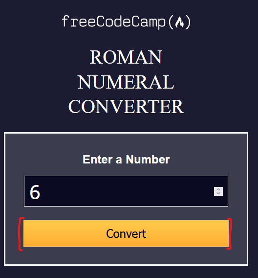
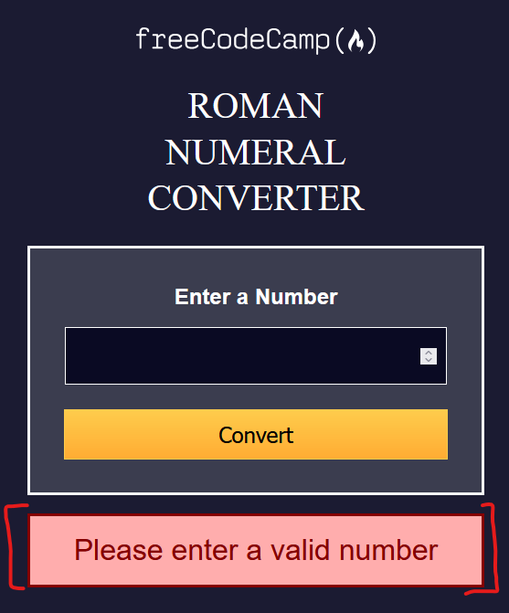
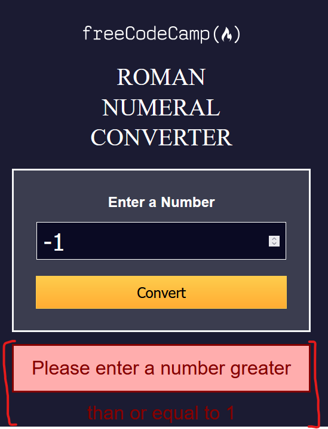
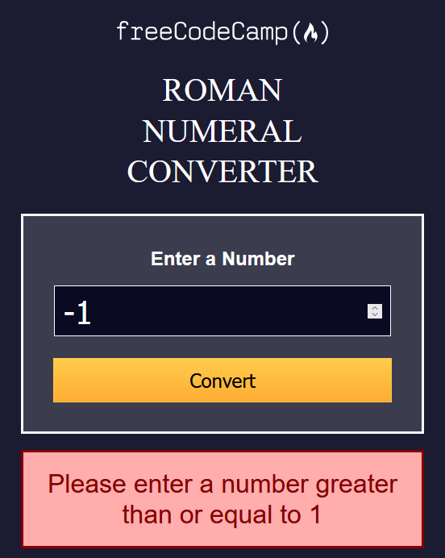
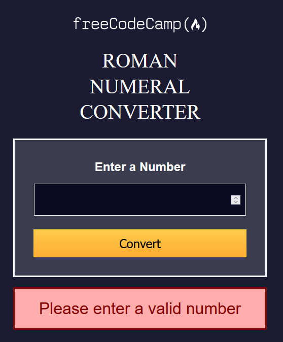
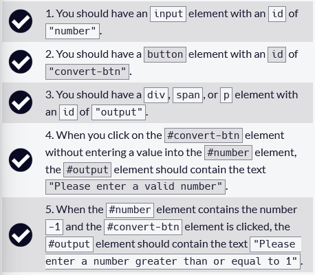
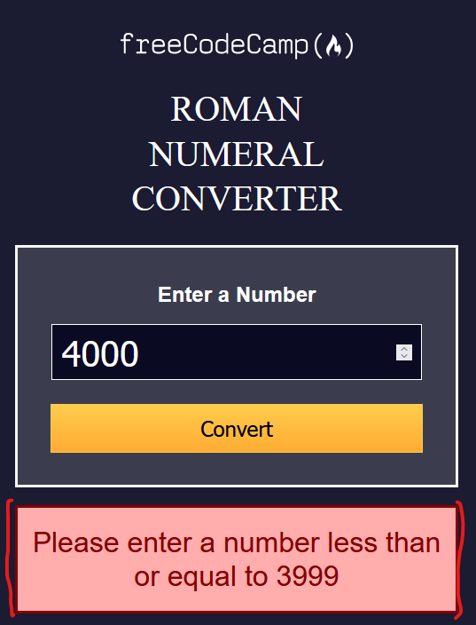
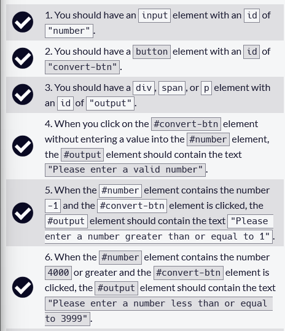

# 🚧 1 Build a Roman Numeral Converter Project

* **Objective**: Build an app that is functionally similar to [https://roman-numeral-converter.freecodecamp.rocks](https://roman-numeral-converter.freecodecamp.rocks)

## 📜 Instructions 📜
* Roman numerals are based on seven symbols which can be combined to express Arabic numerals. E.g.:
  
| Roman numerals | Arabic numerals |
|----------------|-----------------|
|      M         |      1000       |
|      CM        |      900        |
|      D         |      500        |
|      CD        |      400        |
|      C         |      100        |
|      XC        |      90         |
|      L         |      50         |
|      XL        |      40         |
|      X         |      10         |
|      IX        |      9          |
|      V         |      5          |
|      IV        |      14         |
|      I         |      1          |

## 📖 User Stories 📖 
1. You should have an `input` element with an `id` of `"number"`
2. You should have a `button` element with an `id` of `"convert-btn"`
3. You should have a `div`, `span` or `p` element with an `id` of `output`
4. When you click on the `#convert-btn` element without entering a value into the `#number` element, the `#output` element should contain the text `"Please enter a valid number"`
5. When the `#number` element contains the number -1 and the `#convert-btn` element is clicked, the `#output` element should contain the text `"Please enter a number greater than or equal to 1"`
6. When the `#number` element contains the number 4000 or greater and the `#convert-btn` element is clicked, the `#output` element should contain the text `"Please enter a number less than or equal to 3999"`
7. When the `#number` element contains the number 9 and the `#convert-btn` element is clicked, the `#output` should contain the text `"IX"`.
8. When the `#number` element contains the number 16 and the `#convert-btn` element is clicked, the `#output` element should contain the text `"XVI"`
9. When the `#number` element contains the number 649 and the `#convert-btn` element is clicked, the `#output` element should contain the text `"DCXLIX"`
10. When the `#number` element contains the number 1023 and the `#convert-btn` element is clicked, the `#output` element should contain the text `"MXXIII"`
11. When the `#number` element contains the number 3999 and the `#convert-btn` element is clicked, the `#output` element should contain the text `"MMMCMXCIX"`

## ✏️ Project Commentary ✏️

### ⭐ Front-End Work ⭐
* I intialised the HTML as:
    ```html
    <!DOCTYPE html>
    <html>
        <head>
            <meta lang="en">
            <meta charset="UTF-8">
            <link rel="stylesheet" href="./styles.css">
            <title>Roman Numeral Converter</title>
        </head>
        <body>
            <div class="centred">
                
                <h1>ROMAN <br>NUMERAL<br> CONVERTER</h1>
            
            </div>
            <script src="./script.js"></script>
        </body>
    </html>
    ```
* And my CSS as:
    ```css
    body {
        background-color: #1b1b32;
        margin-top: 48px;
    }
    .centred {
        margin: auto;
        width: 500px;
        min-width: 400px;
        text-align: center;
    }

    .container {
        background-color: whitesmoke;
    }

    h1 { 
        font-family: 'Castoro Titling';
        color: white;
        font-size: 30pt;
        font-weight: lighter;
        line-height: 38pt;
    }
    ```
* This is what it looks like:
    <details>
    <summary>Screenshot</summary>

    
    </details>
  

* I add a `main` element:
    ```html
    <div class="centred">
        
        <h1>ROMAN <br>NUMERAL<br> CONVERTER</h1>
        <main>
            <h2>Enter a Number</h2>
        </main>
    </div>
    ```
* And I give it the following styling:
    ```css
    main {
        border: 3px solid #f5f6f7;
        background-color: #3b3d4f;
        color: white;
        font-family: 'Lato', Helvetica, Arial, sans-serif;
        padding-top: 18px;
    }
    ```

* In my `main` element, I add the following input:
    ```html
    <input id="number" type="number">
    ```
* With the following styling:
    ```css
    #number {
        width: 80%;
        height: 40pt;
        background-color: #0a0a23;
        font-size: 30pt;
        color:white;
        border: 1px solid white;
        padding: 4px 10px;
    }
    ```
* This is what it looks like:
    <details>
    <summary>Screenshot</summary>

    
    </details>

* I add the Convert button:
    ```js
    <main>
        <h2>Enter a Number</h2>
        <input id="number" type="number">
        <br>
        <button id="convert-btn">Convert</button>
    </main>
    ```
* I style it with CSS:
    ```css
    #convert-btn {
        width: 85%;
        font-size: 18pt;
        background: linear-gradient(#fecc4c, #ffac33);
        margin-top: 20pt;
        border: 1px solid #fecc4c;
        padding: 12px 0;
    }
    ```
* This is what it looks like:
    <details>
    <summary>Screenshot</summary>

    
    </details>

### ⭐ Handling Empty Number Input ⭐
* I add an `#output` div which has a CSS class of hide:
    ```html
    <div class="centred">
        
        <h1>ROMAN <br>NUMERAL<br> CONVERTER</h1>
        <main>
            <h2>Enter a Number</h2>
            <input id="number" type="number">
            <br>
            <button id="convert-btn">Convert</button>
        </main>
        <div id="output" class="hide"></div>
    </div>
    ```
* I style it using: 
    ```css
    .hide {
        display: none;
    }
    #output {
        font-family: 'Lato', Helvetica, Arial, sans-serif;
        height: 56pt;
        line-height: 56pt;
        margin-top: 20px;   
        justify-content: center;
    }
    .error {
        color: #850000;
        background-color: #ffadad;
        font-size: 24pt;
        border: 3px solid #850000;
    }
    ```
* I initialise my JavaScript file as:
    ```js
    const convertBtn = document.getElementById("convert-btn")
    const output = document.getElementById("output")

    convertBtn.addEventListener("click", ()=> {
        output.textContent = "Please enter a valid number";
        output.classList.remove("hide")
        output.classList.add("error")
    })
    ```
* Now, when I click the convert button, I will always see an error in the output div:
    <details>
    <summary>Screenshot</summary>

    
    </details>

* I fix my script, so that the error is only shown when the number input is empty:
    ```js
    const number = document.getElementById("number")
    convertBtn.addEventListener("click", ()=> {
        if (number.value ==="") {
            output.textContent = "Please enter a valid number";
            output.classList.remove("hide")
            output.classList.add("error")
        }
    })
    ```
* Now the error will show if number is blank, and nothing is shown if there is a number in the field

### ⭐ Handling Negative Number Input ⭐
* As of now, nothing happens if a negative number is inputted
* I add another if block to my JavaScript:
    ```js
    convertBtn.addEventListener("click", ()=> {
        // EXISTING CODE HERE

        if (parseInt(number.value) <= 0) {
            output.textContent = "Please enter a number greater than or equal to 1";
            output.classList.remove("hide")
            output.classList.add("error")
        }
    })
    ```
* However the text bleeds outside of the div:
    <details>
    <summary>Screenshot</summary>

    
    </details>

* I change the CSS, so that the height is not fixed to `56pt`, from
    ```css
    #output {
        font-family: 'Lato', Helvetica, Arial, sans-serif;
        height: 56pt;
        line-height: 56pt;
        margin-top: 20px;   
        justify-content: center;
    }
    ```
* to:
    ```css
    #output {
        font-family: 'Lato', Helvetica, Arial, sans-serif;
        min-width: 56pt;
        margin-top: 20px;   
        padding: 20px 0;
        justify-content: center;
        overflow-wrap: break-word;
    }
    ```
* Now when I enter `-1`, it looks like:
    <details>
    <summary>Screenshot</summary>

    
    </details>
* And if I enter empty, it looks like:
    <details>
    <summary>Screenshot</summary>

    
    </details>

* I now have 5 of the tests from freeCodeCamp passing:
    <details>
    <summary>Screenshot</summary>

    
    </details>

### ⭐ Handling Too Large Number Input ⭐
* I also check if the input is greater than 3999:
    ```js
    convertBtn.addEventListener("click", ()=> {
        // EXISTING CODE HERE

        if (parseInt(number.value) > 3999) {
            output.textContent = "Please enter a number less than or equal to 3999";
            output.classList.remove("hide")
            output.classList.add("error")
        }
    })
    ```
* Now if enter a large number, I see this error message:
    <details>
    <summary>Screenshot</summary>

    
    </details>

* Now the first 6 tests pass:
    <details>
    <summary>Screenshot</summary>

    
    </details>

### ⭐ Converting 9 to Roman Numerals ⭐
* The seventh test is:

7. When the `#number` element contains the number 9 and the `#convert-btn` element is clicked, the `#output` element should contain the text `"IX"`.

* I initialise my `functions.js` file [here](./code/js/functions.js) as:
    ```js
    function decimalToRomanNumeral(input) {
        return "IX"
    }

    module.exports = { decimalToRomanNumeral}
    ```
* I intialise my `functions.test.js` file [here](./code/js/functions.test.js) as:
    ```js
    const { decimalToRomanNumeral } = require('./functions');

    test('should return IX when 9 is input', ()=> {
        expect(decimalToRomanNumeral(9)).toBe('IX')
    })
    ```
* I then open the terminal and enter:
```
npm init -y    
npm install --save-dev jest
```
* I then can run my tests by clicking on the test button in VSCode or using the terminal
