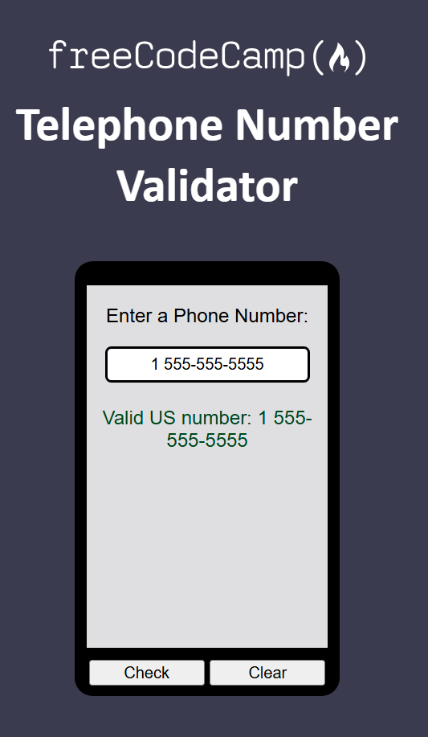

# 🎓 3 Build a Telephone Number Validator 🎓

## 🎬 Demo 🎬
* You can test out my application which I built for this project [here](TODO)
* The code I wrote for this can be found [here](./code/)

* **Objective**: Build an app that is functionally similar to [https://telephone-number-validator.freecodecamp.rocks/](https://telephone-number-validator.freecodecamp.rocks/)

## 📜 Instructions 📜
* In the US, phone numbers can be formatted in many way; here are some examples:
```
1 555-555-5555
1 (555) 555-5555
1(555)555-5555
5555555555
555-555-5555
(555)555-5555
```
* The area code (555) is required, if country code is provided it must be 1

## 📖 User Stories 📖 
1. You should have an `input` element with an `id` of `user-input`
2. You should have a `button` element with an `id` of `check-btn`
3. You should have a `button` element with an `id` of `clear-btn`
4. You should have a `div`, `span` or `p` elements with an `id` of `results-div`
5. When you click on `#check-btn` element without entering a value into the `#user-input` element, an alert should appear with the text `Please provide a phone number`
6. When you click on the `#clear-btn` element, the content within the `#results-div` should be removed
7. If the `#user-input` contains any of the following, and the `#results-div` element should contain `Valid US number: ` followed by the number in `#user-input`:
```
1 555-555-5555
1 (555) 555-5555
5555555555
555-555-5555
(555)555-5555
1(555)555-5555
```
8. If the `#user-input` contains any of the following, and the `#results-div` element should contain `Invalid US number: ` followed by the number in `#user-input`:
```
555-5555
5555555 
1 555)555-5555
1 555 555 5555
1 456 789 4444
123**&!!asdf#
55555555
(6054756961)
(6054756961)
2 (757) 622-7382
0 (757) 622-7382
-1 (757) 622-7382
2 757 622-7382
10 (757) 622-7382
27576227382
(275)76227382
2(757)6227382
2(757)622-7382
555)-555-5555
(555-555-5555
(555)5(55?)-5555
55 55-55-555-5
11 555-555-5555
```


## ✏️ Project Commentary ✏️

### ⭐ HTML and CSS ⭐
* I completed the front end and styles, the results look like this:


### ⭐ Showing Alert if Input is Empty ⭐
* I got the user story of showing an alert if the input is empty with the following code:
```js
const checkButton = document.getElementById("check-btn")
const userInput = document.getElementById("user-input")
checkButton.addEventListener("click", (e) => {
   if (userInput.value === "") 
      alert("Please provide a phone number")
})
```
* I get the user story of clearing the contents of `results-div` with the following code:
```js
clearButton.addEventListener("click", (e) => {
   results.innerHTML =  ""
})
```

### ⭐ Initialising isPhoneNumberValid Function and Tests ⭐
* I wrote a regex so it only allows spaces, numbers and dashes:
```js
function isPhoneNumberValid(phoneNumber) {
   const validPhoneNumber = /^[\d\s-]+$/g
   return validPhoneNumber.test(phoneNumber)
}
```
* I wrote two tests for this:
```js
test('should allow numbers, spaces and dashes', () => {
   expect(isPhoneNumberValid("1 555-555-5555")).toBe(true)
})

test('should not allow special characters or letters', () => {
   expect(isPhoneNumberValid("123**&!!asdf#")).toBe(false)
})
```
* I wrote a test to allow for brackets:
```js
test('should allow numbers in brackets', () => {
   expect(isPhoneNumberValid("1 (555) 555-5555")).toBe(true)
})
```
* I update my function to:
```js
function isPhoneNumberValid(phoneNumber) {
   const validPhoneNumber = /^[\d\s-()]+$/g
   return validPhoneNumber.test(phoneNumber)
}
```

### ⭐ Importing Function from functions.js in script.js ⭐
* I wanted to utilise my function that I defined in [./code/js/functions.js](./code/js/functions.js), without having to paste the function directly
* The first thing I did was import the function in [./code/script.js](./code/script.js):
```js
import { isPhoneNumberValid  } from "./js/functions.js"
```
* I got an error in my browser that imports needed to be top level. The solution to that was to specify the script import as a module in [index.html](./code/index.html):
```js
<script type="module" src="./script.js"></script>
```
* I got another error in browser, which says modules can not served via filesystem. The solution to that was to run a server which I achieved by installing `Live Server` extension from VS code,. I then opened the HTML file using Live Server and everything worked!

### ⭐ Displaying Result ⭐
* I update my script so that it uses the function I've written, and displays whether it is valid in the results div:
```js
checkButton.addEventListener("click", (e) => {
   if (userInput.value === "") 
      alert("Please provide a phone number")
   if (isPhoneNumberValid(userInput.value)) {
      results.textContent = "Valid US number: "+userInput.value;
   } else 
      results.textContent = "Invalid US number: "+userInput.value;
})
```
* Now when I enter a valid number, I get the result:

   

* I also updated the style for the results div:
```css
#results-div {
   height: 200px;
   padding-top: 20px;
   color: rgb(0, 71, 27);
   font-size: 300;
   font-weight: 300;
}
```
* So it now looks like:
  
   

### ⭐ Fixing Tests ⭐
* My tests did not work due to me using module export. I fixed this by following thi by installing babel-jest using `npm i jest ts-jest babel-jest @babel/preset-env`
* I then also created a `babel.config.js` file with:
```js
module.exports = {presets: ['@babel/preset-env']}
```
* Now my tests run!

### ⭐ Asserting Minimum Number of Digits ⭐
* I write a test that the area code must be provided, so minimum number of digits is 10:
```js
test('should have a minimum of 10 digits', () => {
   expect(isPhoneNumberValid("555 555 555")).toBe(false)
})
```
* I update my implementation to:
```js
function isPhoneNumberValid(phoneNumber) {
   const numberOfDigits = phoneNumber.split("").filter((a) => a.match(/\d/)).length
   if (numberOfDigits < 10) return false
   const validPhoneNumber = /^[\d\s-()]+$/g
   return validPhoneNumber.test(phoneNumber)
}
```

### ⭐ Asserting Each Opening Bracket has a Closing Bracket ⭐
* I write the following test which fails:
```js
test('should have equal number of opening and closing brackets', () => {
   expect(isPhoneNumberValid("1 555)555-5555")).toBe(false)
})
```
* I update the function to check number of `(` is equal to number of `)`:
```js
function isPhoneNumberValid(phoneNumber) {
   const numberOfDigits = phoneNumber.split("").filter((a) => a.match(/\d/)).length
   if (numberOfDigits < 10) return false
   const numberOfOpeningBrackets = phoneNumber.split("").filter(a => a==='(').length
   const numberOfClosingBrackets = phoneNumber.split("").filter(a => a===')').length
   if (numberOfOpeningBrackets != numberOfClosingBrackets)
      return false
   const validPhoneNumber = /^[\d\s-()]+$/g
   return validPhoneNumber.test(phoneNumber)
}
```
* I then do some minor refactoring so that multiple arrays aren't being created:
```js
function isPhoneNumberValid(phoneNumber) {
   const phoneNumberSplit = phoneNumber.split("")
   const numberOfDigits = phoneNumberSplit.filter((a) => a.match(/\d/)).length
   if (numberOfDigits < 10) return false
   const numberOfOpeningBrackets = phoneNumberSplit.filter(a => a==='(').length
   const numberOfClosingBrackets = phoneNumberSplit.filter(a => a===')').length
   if (numberOfOpeningBrackets != numberOfClosingBrackets)
      return false
   const validPhoneNumber = /^[\d\s-()]+$/g
   return validPhoneNumber.test(phoneNumber)
}
```

### ⭐ Asserting Number in round Brackets needs to begin with 5 ⭐
* Only the area code `555` can be wrapped in brackets, so I write the following test which fails:
```js
test('only the area code 555 should be surrounded in brackets', () => {
   expect(isPhoneNumberValid("(6054756961)")).toBe(false)
});
```
* And I update my function to:
```js
function isPhoneNumberValid(phoneNumber) {
   const phoneNumberSplit = phoneNumber.split("")
   const numberOfDigits = phoneNumberSplit.filter((a) => a.match(/\d/)).length
   if (numberOfDigits < 10) return false
   const numberOfOpeningBrackets = phoneNumberSplit.filter(a => a==='(').length
   const numberOfClosingBrackets = phoneNumberSplit.filter(a => a===')').length
   if (numberOfOpeningBrackets != numberOfClosingBrackets)
      return false
   const numbersInBrackets = /\((.*?)\)/
   if (numbersInBrackets.test(phoneNumber)) {
      const firstLetterAfterOpeningBracket = phoneNumber.match(/\((.*?)\)/)[0][1]
      if (firstLetterAfterOpeningBracket != '5') return false
   }
   
   const validPhoneNumber = /^[\d\s-()]+$/g
   return validPhoneNumber.test(phoneNumber)
}
```

### ⭐ If Country Code is Provided It Has to Be 1 ⭐
* I wrote the following two tests, first which fails and second passes already:
```js
test('if country code is provided, should return false if it is one', ()=> {
   expect(isPhoneNumberValid("2 757 622-7382")).toBe(false)
})

test('if country code is provided, should return true, if it is 1', () => {
   expect(isPhoneNumberValid("1 555-555-5555")).toBe(true)
})
```
* I update my function:
```js
function isPhoneNumberValid(phoneNumber) {
   const phoneNumberSplit = phoneNumber.split("")
   const numberOfDigits = phoneNumberSplit.filter((a) => a.match(/\d/)).length
   if (numberOfDigits < 10) return false
   const countryCodeIsProvided = numberOfDigits == 11;
   if (countryCodeIsProvided) {
      const digitsOfPhoneNumberOnly =  phoneNumberSplit.filter((a) => a.match(/\d/))
      const countryCodeDigit = digitsOfPhoneNumberOnly[0];
      if (countryCodeDigit != "1")
         return false;
   }
   // REST OF FUNCTION
}
```

### ⭐ Invalidate Phone Numbers with more than two dashes ⭐
* I write the following test which fails:
```js
test('should return false if no country code is provided  and there is more than 2 dashes', () => {
   expect(isPhoneNumberValid("55 55-55-555-5")).toBe(false)
})
```
* I update my function to:
```js
function isPhoneNumberValid(phoneNumber) {
   const phoneNumberSplit = phoneNumber.split("")
   const digitsOfPhoneNumberOnly = phoneNumberSplit.filter((a) => a.match(/\d/));
   const numberOfDigits = digitsOfPhoneNumberOnly.length
   if (numberOfDigits < 10) return false
   if (numberOfDigits === 10) {
      const numberOfDashes = phoneNumberSplit.filter(char => char === '-').length;
      if (numberOfDashes > 2) 
         return false;
   }
   // REST OF FUNCTION
}
```