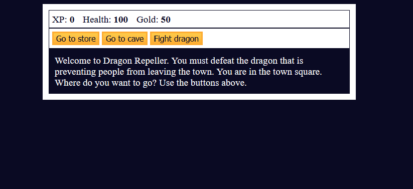
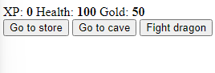
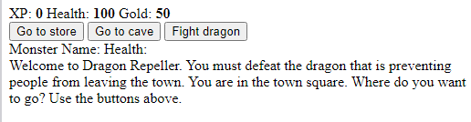
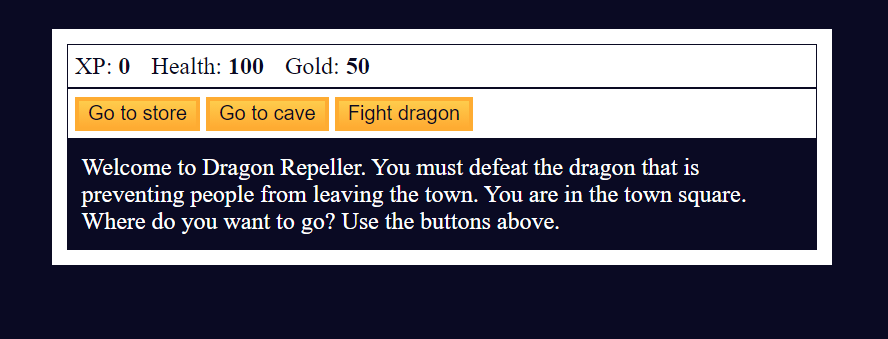
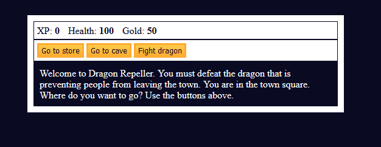
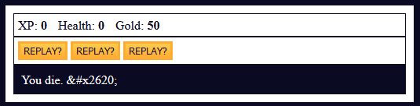
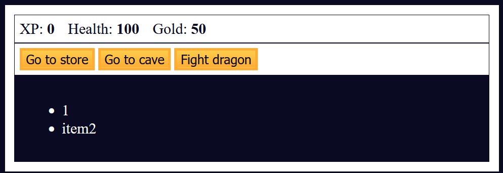
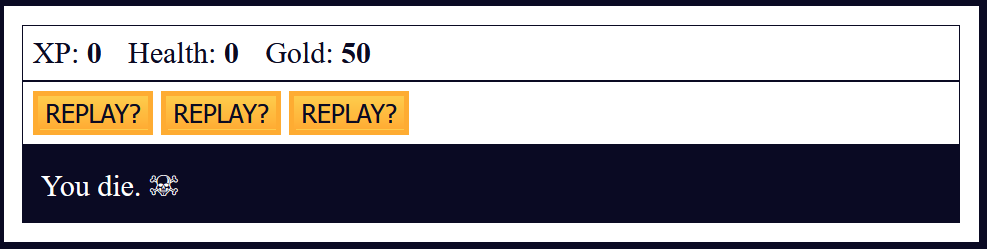
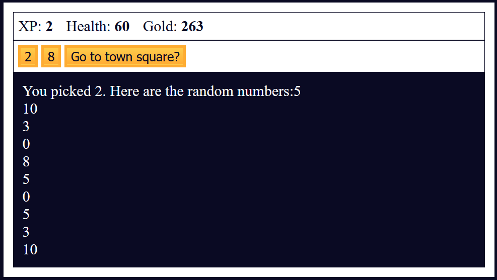

# 🧠 1C Building a RPG Game
* JavaScript is a core technology of web pages to make them interactive. In this exercise, I will build a Role Playing Game

## 👨‍🍳 Final Product 👨‍🍳
* The code for this exercise can be found [here](code)
* You can try the game using this [link](https://htmlpreview.github.io/?https://github.com/shivkumar98/FreeCodeCamp-Projects/blob/main/05-javascript-a-ds-new/1-javascript-fundamentals/1c-building-a-rpg-game/code/index.html)
* Here is a demo of it running:


## 📝 Summary Notes 📝
* `document.querySelector(id/class)` is used to obtain the HTML as a node from the webpage
```js
let button1 = document.querySelector("#button1");
console.log(button1); // <button id="button1">Go to store</button>
```
* You can access the text within a HTML element via `.innerText`
```js
button1.innerText; // Go to store
```
* Clicable elements will trigger a on click event, you can specify this by setting the `.onclick` property:
```js
button1.onclick = someFunction;
```
* We can specify the `.innerHTML` property if we want to render HTML for an element:
```js
text.innerHTML = "<ul><li>item1</li><li>item2</li></ul>"; 
```
* We can declare objects literally using JSON syntax:
```js
let someObject = {
  property1: 123,
  "property with spaces": 64
}
```
* Arrays have a `.length` property and a `.includes(T)` method
```js
numbers = [1,2,3];
numbers.length; // 3
numbers.includes(5); // false
```
* Math class has static `.random()` and `.floor()` methods. The `.floor()` method returns a random number between 0 (inclusive) and 1 (exclusive)

## 🟥 Setting up HTML

* I create the boiler point of my HTML file:
```html
<!DOCTYPE HTML>
<html lang="en">
  <head>
    <meta charset="UTF-8">
    <link rel="stylesheet.css">
    <title>RPG - Dragon Repeller</title>
  </head>
  <body>
    <div id="game">
    </div>
  </body>

</html>
```

* I add a script elemment to load my JavaScript into the HMTL file:
```html
    <head>
        <meta lang="en">
        <meta charset="UTF-8">
        <link rel="stylesheet" href="styles.css">
        <title>RPG - Dragon Repeller</title>
        <script>
            console.log("Hello World");
        </script>
    </head>
```

* I specify an external js file in the script tag:
```html
<script src="./script.js">
</script>
```
* I add a variable called `xp`, `health` and `gold`
```js
let xp = 0;
let health = 100;
let gold = 50;
let currentWeapon = 0;
let fighting;
let monsterHealth;
let inventory = ["stick"]
```

* I set up the test and buttons in my HTML:
```html
<body>
    <div id="game">
        <div id="stats">
            <span class="stat">XP: <strong><span id="xpText">0</span></strong></span>
            <span class="stat">Health: <strong><span id="healthText">100</span></strong></span>
            <span class="stat">Gold: <strong><span id="goldText">50</span></strong></span>
          </div>
          <div id="controls">
            <button id="button1">Go to store</button>
            <button id="button2">Go to cave</button>
            <button id="button3">Fight dragon</button>
          </div>
          <div id="monsterStats"></div>
          <div id="text"></div>
    </div>
</body>
```


<hr>

## 🟥 DOM

* The DOM is a tree structure representation of the HTML which JavaScript can use to interact with the HTML
* The `document` object represents the entire HTML
* We can use `document.getQuerySelector()` to obtain an element using a CSS selector
* I try to obtain the button element by adding the following to my script.js:
```js
let button1 = document.querySelector("#button1");
console.log(button1);
```
* But when I run the code in the browser it logs `null`😱
* The issue is that the JavaScript file is located in the `script` tag, so the JavaScript loads before the browser has processed it!!!
* I rectify this issue by moving the script tag to just before the `</body>` tag:
```html
<!DOCTYPE html>
<html>
    <head>
        <meta lang="en">
        <meta charset="UTF-8">
        <link rel="stylesheet" href="styles.css">
        <title>RPG - Dragon Repeller</title>
    </head>
        
    </head>
    <body>

        <div id="game">
            <div id="stats">
                <span class="stat">XP: <strong><span id="xpText">0</span></strong></span>
                <span class="stat">Health: <strong><span id="healthText">100</span></strong></span>
                <span class="stat">Gold: <strong><span id="goldText">50</span></strong></span>
              </div>
              <div id="controls">
                <button id="button1">Go to store</button>
                <button id="button2">Go to cave</button>
                <button id="button3">Fight dragon</button>
              </div>
              <div id="monsterStats"></div>
              <div id="text"></div>
        </div>
        <script src="./script.js"></script>
    </body>
</html>
```
* Now running the JavaScript I see the following in the console:
```html
<button id="button1">Go to store</button>
```
* I use const instead as I will not reassign this, and get the other two buttons:
```js
const  button1 = document.querySelector("#button1");
// console.log(button1); // logs: <button id="button1">Go to store</button>
const button2 = document.querySelector("#button2");
const button3 = document.querySelector("#button3");
```

* I add two spans for the monster's name and health in the `#monsterStats` div:
```html
<div id="monsterStats">
  <span class="stat">Monster Name: <strong><span id="monsterName"></span></strong></span>
  <span class="stat">Health: <strong><span id="monsterHealth"></span></strong></span>
</div>
```
* I add some text to my `#text` div:
```html
<div id="text">Welcome to Dragon Repeller. You must defeat the dragon that is preventing people from leaving the town. You are in the town square. Where do you want to go? Use the buttons above.
</div>
```
* My web page now looks like:



## 🟥 Styling
* I start adding styling to the css:
```css
body {
  background-color: #0a0a23;
}
#text {
  background-color: #0a0a23;
  color: #ffffff;
  padding: 10px;
}
```
* I give my #game windows to be centered horizontally:
```css
#game {
  max-width: 500px;
  max-height: 400px;
  background-color: #ffffff;
  color: #ffffff;
  margin: 30px auto 0px auto;
  padding: 10px;
}
```

* I give both my controls and stats divs borders and padding:
```css
#controls, #stats {
  border: 1px solid #0a0a23;
  color: #0a0a23;
  padding: 5px;
}
```
* I give the Monster stats a reddish background color, and hide it for now:
```css
#monsterStats {
  border: 1px solid #0a0a23;
  padding: 5px;
  color: #ffffff;
  background-color: #c70d0d;
  display: none;
}
```
* I give the `.stat` classes some padding to the right:
```css
.stat {
  padding-right: 10px;
}
```
* I style the buttons so they have a vertical gradient, and a yellowish look:
```css
button {
  cursor: pointer;
  color: #0a0a23;
  background-color: #feac32;
  background-image: linear-gradient(#fecc4c, #ffac33);
  border: 3px solid #feac32;
}
```
* The page now looks like:


<hr>

## 🟥 Using onclick Event

* I add constants for the other text elements:
```js
const text = document.querySelector("#text");
const xpText = document.querySelector("#xpText");
const healthText = document.querySelector("#healthText");
const goldText = document.querySelector("#goldText");
const monsterStats = document.querySelector("#monsterStats");
const monsterName = document.querySelector("#monsterName");
const monsterHealthText = document.querySelector("#monsterHealth");
```
* I add the following functions:
```js
function goStore() {
  console.log("Going to store.");
}

function goCave() {
  console.log("Going to cave.");
}

function fightDragon() {
  console.log("Fighting dragon.");
}
```

* `button1` is a button element (Go to store) - buttons have a `onclick` property
  - Properties can bbe accessed via **DOT NOTATION**
* I set the onclick property of button1 to the function `goStore`
```js
// initialising buttons:
button1.onclick = goStore;
```
* Clicking on the button in browser now logs `Going to store`💡
* Note: you cannot use `goStore()` on the RHS:
```js
button.onclick = goStore(); // ⚠️ does not work!!
```
* I now set button2 and button3:
```js
button2.onclick = goCave;
button3.onclick = fightDragon;
```

* Using the `querySelector()` method returns the entire HTML element, we can obtain the text by using the `innerText` property 💡
```js
const button1 = document.querySelector("#button1");
console.log(button1); // <button id="button1">
console.log(button1.innerText); // Go to store
```

* I update the `goStore()` function so it updates:
  - the text of button1 to "Buy 10 health (10 gold)"
  - the text of button2 to "Buy weapon (30 gold)"
  - the text of button3 to "Go to town square"
```js
function goStore() {
  button1.innerText = "Buy 10 health (10 gold)";
  button2.innerText = "Buy weapon (30 gold)"
  button3.innerText = "Go to town square"
}
```
* I also update the text of the #text div, and assign new functions on the button's onclick event:
```js
function goStore() {
  button1.innerText = "Buy 10 health (10 gold)";
  button2.innerText = "Buy weapon (30 gold)"
  button3.innerText = "Go to town square"
  button1.onclick = buyHealth;
  button2.onclick = buyWeapon;
  button3.onclick = goTown;
  text.innerText =  "You enter the store.";
}

function buyHealth() {}
function buyWeapon() {}
function goTown() {}
```

* Clicking on the `Go to store` button in browser:


* I implement the goTown() function:
```js
function goTown() {
  button1.innerText = "Go to store";
  button2.innerText = "Go to cave";
  button3.innerText = "Fight dragon";
  button1.onclick = goStore;
  button2.onclick = goCave;
  button3.onclick = fightDragon;
  text.innerText = "You are in the town square. You see a sign that says \"Store\".";
}
```

<hr>

## 🟥 Using Objects
* There are 7 primitive types in JavaScript:
  - Number
  - BigInt
  - String
  - Boolean
  - Null
  - Undefined
  - Symbol
* Objects are non-primitive data types which **STORE KEY-VALUE PAIRS**
* The syntax of an object is:
```js 
{
  key: value
}
```
* Objects are like arrays but you can also access and modify data using **PROPERTIES**
* E.g.:
```js
const cat = {
  name: "Whiskers"
}
console.log(cat); // Object { name: "Whiskers" }
```
* To add multiple properties, they **MUST be seperated by commas**;
```js
const multipleProperties = {
  property1: 1,
  "property2": 3
};
```
* If I want to declare a property with whitespace, then it **MUST BE WRAPPED WITH QUOTES**
```js
const cat = {
  name: "Whiskers",
  "Number of legs": 4
}
```
* You can access properties via **DOT NOTATION OR BRACKET NOTATION**:
```js
const obj = {
  property1: "Hello world",
  "property2": "My name is Shiv",
  "property with whitespace": 64
}
obj.property1; // "Hello World"
obj."property2"; // COMPILER ERROR
obj.property2; // "My name is Shiv"
// you access a property with white space with bracket notation:
obj["property with whitespace"]; // 64
obj["property1"]; // "Hello world"
```

## 🟥 Refactoring goTown() and goStore()
* There's alot of duplication with the `goStore()` and `goTown()` functions:
```js
function goTown() {
  button1.innerText = "Go to store";
  button2.innerText = "Go to cave";
  button3.innerText = "Fight dragon";
  button1.onclick = goStore;
  button2.onclick = goCave;
  button3.onclick = fightDragon;
  text.innerText = "You are in the town square. You see a sign that says \"Store\".";
}
  
function goStore() {
  button1.innerText = "Buy 10 health (10 gold)";
  button2.innerText = "Buy weapon (30 gold)"
  button3.innerText = "Go to town square"
  button1.onclick = buyHealth;
  button2.onclick = buyWeapon;
  button3.onclick = goTown;
  console.log(text.innerText)
  text.innerText =  "You enter the store.";
}
```
* I create a `locations` array with objects to store the above information:
```js
const locations = [
  {
    name: "town square",
    "button text": ["Go to store", "Go to cave", "Fight dragon"],
    "button functions": [goStore, goCave, fightDragon],
    text: "You are in the town square. You see a sign that says \"Store\"."
  },
  {
    name: "store",
    "button text": ["Buy 10 health (10 gold)", "Buy weapon (30 gold)", "Go to town square"],
    "button functions": [buyHealth, buyWeapon, goTown],
    text: "You enter the store."
  }
];
```
* I create a new function called `update()` and move the body of `goTown()` into the update function:

```js
function update(location) {
  button1.innerText = "Go to store";
  button2.innerText = "Go to cave";
  button3.innerText = "Fight dragon";
  button1.onclick = goStore;
  button2.onclick = goCave;
  button3.onclick = fightDragon;
  text.innerText = "You are in the town square. You see a sign that says \"Store\".";
}

function goTown() {
  update(locations[0]);
}
```
* I then update the `update()` function to set the innerTexts and onclick events using data from `locations`:
```js
function update(location) {
  button1.innerText = location["button text"][0];
  button2.innerText = location["button text"][1];
  button3.innerText = location["button text"][2];
  button1.onclick = location["button functions"][0];
  button2.onclick = location["button functions"][1];
  button3.onclick = location["button functions"][2];
  text.innerText = location.text
}
```

* I then update the implementation of `goStore()`:
```js
function goStore() {
    update(locations[1]);
}
```

* I add a new item to the `locations` array, and use it a new function:
```js
const locations = [
  {
    name: "town square",
    "button text": ["Go to store", "Go to cave", "Fight dragon"],
    "button functions": [goStore, goCave, fightDragon],
    text: "You are in the town square. You see a sign that says \"Store\"."
  },
  {
    name: "store",
    "button text": ["Buy 10 health (10 gold)", "Buy weapon (30 gold)", "Go to town square"],
    "button functions": [buyHealth, buyWeapon, goTown],
    text: "You enter the store."
  },
  {
    name: "cave",
    "button text": ["Fight slime", "Fight fanged beast", "Go to town square"],
    "button functions": [fightSlime, fightBeast, goTown],
    text: "You enter the cave. You see some monsters."
  }
]
```
```js
function goCave() {
  update(locations[2]);
}
function fightSlime() {}
function fightBeast() {}
```

## 🟥 Implementing buyHealth

* The "store" and "cave" locations are complete. I now need to code player actions!
* I implemment a `buyHealth()` method which reduces gold and increases health, then updates the #stats window:
```js
function buyHealth() {
  if (gold >= 10) {
    gold -= 10;
    health += 10;
    healthText.innerText = health;
    goldText.innerText = gold
  } else {
    text.innerText = "You do not have enough gold to buy health."
  }
}
```

## 🟥 Implementing buyWeapon()

* I create weapons array:
```js
const weapons = [
  {
    name: "stick",
    power: 5
  }, {
    name: "dagger",
    power: 30,
  }, {
    name: "claw hammer",
    power: 50
  }, {
    name: "sword",
    power: 100
  }
];
```
* I now implement the `buyWeapon()` function so that gold is reduced, and the `currentWeapon` index is incremented. I then also update the #gold text and #text:
```js
function buyWeapon() {
    if (gold >= 30) {
        gold -= 30;
        currentWeapon++;
        goldText.innerText = gold;
        text.innerText = "You now have a new weapon."
    }
}
```
* I then update the function so that it adds the weapon to the inventory and prints a message of what's in your inventory:
```js
function buyWeapon() {
  if (gold >= 30) {
    gold -= 30;
    currentWeapon++;
    goldText.innerText = gold;
    let newWeapon = weapons[currentWeapon].name;
    text.innerText = "You now have a " + newWeapon + ".";
    inventory.push(newWeapon);
    text.innerText += " In your inventory you have: "+inventory;
  } else {
    text.innerText = "You do not have enough gold to buy a weapon.";
  }
}
```
* I finally add an enclosing check so that the currentWeapon index is less than the weapons size:
```js
function buyWeapon() {
  if (currentWeapon < weapons.length - 1) {
    if (gold >= 30) {
      gold -= 30;
      currentWeapon++;
      goldText.innerText = gold;
      let newWeapon = weapons[currentWeapon].name;
      text.innerText = "You now have a " + newWeapon + ".";
      inventory.push(newWeapon);
      text.innerText += " In your inventory you have: " + inventory;
    } else {
      text.innerText = "You do not have enough gold to buy a weapon.";
    }
  } else {
    text.innerText = "You already have the most powerful weapon!";
  }
}
```

* The code so far is:
```js
let xp = 0;
let health = 100;
let gold = 50;
let currentWeapon = 0;
let fighting;
let monster;
let inventory = ["stick"];

const button1 = document.querySelector("#button1");
const button2 = document.querySelector("#button2");
const button3 = document.querySelector("#button3");
const text = document.querySelector("#text");
const xpText = document.querySelector("#xpText");
const healthText = document.querySelector("#healthText");
const goldText = document.querySelector("#goldText");
const monsterStats = document.querySelector("#monsterStats");
const monsterName = document.querySelector("#monsterName");
const monsterHealthText = document.querySelector("#monsterHealth");

// initiliasing buttons:
button1.onclick = goStore;
button2.onclick = goCave;
button3.onclick = fightDragon;

const weapons = [
  {
    name: "stick",
    power: 5
  }, {
    name: "dagger",
    power: 30
  }, {
    name: "claw hammer",
    power: 50
  }, {
    name: "sword",
    power: 100
  }
]

const locations = [
  {
    name: "town square",
    "button text": ["Go to store", "Go to cave", "Fight dragon"],
    "button functions": [goStore, goCave, fightDragon],
    text: "You are in the town square. You see a sign that says \"Store\"."
  }, 
  {
    name: "store",
    "button text": ["Buy 10 health (10 gold)", "Buy weapon (30 gold)", "Go to town square"],
    "button functions": [buyHealth, buyWeapon, goTown],
    text: "You enter the store."
  },
  {
    name: "cave",
    "button text": ["Fight slime", "Fight fanged beast", "Go to town square"],
    "button functions": [fightSlime, fightBeast, goTown],
    text: "You enter the cave. You see some monsters."
  }
]

function update(location) {
  button1.innerText = location["button text"][0];
  button2.innerText = location["button text"][1];
  button3.innerText = location["button text"][2];
  button1.onclick = location["button functions"][0];
  button2.onclick = location["button functions"][1];
  button3.onclick = location["button functions"][2];
  text.innerText = location.text
}

function goTown() { update(locations[0]); }
function goStore() { update(locations[1]); }
function goCave() { update(locations[2]); }

function buyHealth() {
    if (gold >= 10) {
        gold -= 10;
        health += 10;
        healthText.innerText = health;
        goldText.innerText = gold
    } else {
        text.innerText = "You do not have enough gold to buy health."
    }
}

function buyWeapon() {
  if (currentWeapon < weapons.length - 1) {
    if (gold >= 30) {
      gold -= 30;
      currentWeapon++;
      goldText.innerText = gold;
      let newWeapon = weapons[currentWeapon].name;
      text.innerText = "You now have a " + newWeapon + ".";
      inventory.push(newWeapon);
      text.innerText += " In your inventory you have: " + inventory;
    } else {
      text.innerText = "You do not have enough gold to buy a weapon.";
    }
  } else {
    text.innerText = "You already have the most powerful weapon!";
  }
}

function goCave() {
    console.log("Going to cave.");
} 
function fightDragon() {
    console.log("Fighting dragon.");
}
function fightSlime() {}
function fightBeast() {}
```

* And here is the behavior when we initialise the `gold` with 250:


## 🟥 Selling Weapons
* When the player has the most powerful weapon (sword), they will have the ability to sell their old weapons:
```js
function sellWeapon() {
  if (inventory.length > 1) {
    gold += 15;
    goldText.innerText = gold;
  }
}
```
* I need to add a `currentWeapon` variable, but there is already one declared globally! 😱
* If we declare this variable in the function, it will only be scoped within the function:
```js
function sellWeapon() {
  if (inventory.length > 1) {
    gold += 15;
    goldText.innerText = gold;
    let currentWeapon = inventory.shift();
    text.innerText = "You sold a "+currentWeapon+".";
    tex.innerText+=" In your inventory you have: "+ inventory;
  } else {
    text.innerText = "Don't sell your only weapon";
  }
}
```

## 🟥 Monsters
* I create a `goFight()` function:
```js
function goFight() {
}
```
* I then implement the fight monster functions:
```js
function fightSlime() {
  fighhting = 0;
  goFight();
}
function fightBeast() {
  fighting = 1; 
  goFight();
}
function fightDragon() {
  fighting = 2;
  goFight();
}
```
* And declared attack and dodge functions:
```js
function attack() {}
function dodge() {}
```
* I add a new location for the fighting of monsters:
```js
const locations = [
  {
    name: "town square",
    "button text": ["Go to store", "Go to cave", "Fight dragon"],
    "button functions": [goStore, goCave, fightDragon],
    text: "You are in the town square. You see a sign that says \"Store\"."
  },
  {
    name: "store",
    "button text": ["Buy 10 health (10 gold)", "Buy weapon (30 gold)", "Go to town square"],
    "button functions": [buyHealth, buyWeapon, goTown],
    text: "You enter the store."
  },
  {
    name: "cave",
    "button text": ["Fight slime", "Fight fanged beast", "Go to town square"],
    "button functions": [fightSlime, fightBeast, goTown],
    text: "You enter the cave. You see some monsters."
  },
  {
    name: "fight",
    "button text": ["Attack", "Dodge", "Run"],
    "button functions": [attack, dodge, goTown],
    text: "You are fighting a monster."
  }
];
```

* I update the goFight implementation to update the buttons/text and set the monster health:
```js
function goFight() {
  update(locations[3]);
  monsterHealth = monsters[fighting].health;
}
```

* Currently the monster stats window does not show, so i set the display to "block" (displays element like a block element like `<p`>):
```js
function goFight() {
  updation(locations[3]);
  monsterHealth = monster[fighting].health;
  monsterStats.style.display = "block";
}
```
* I also update the name and health of the monsters stats:
```js
function goFight() {
  update(locations[3]);
  monsterHealth = monsters[fighting].health;
  monsterStats.style.display = "block";
  monsterHealthText.innerText = monsters[fighting].health;
  monsterName.innerText = monsters[fighting].name;
}
```

* I implement the `attack()` method, which reduces the player's health by the monster's power, and reduces monster's health by the power of player's weapon:
```js
function attack() {
  text.innerText = "The "+ monsters[fighting].name+" attacks.";
  text.innerText += " You attack it with your "+ weapons[currentWeapon].name+".";
  health -= monsters[fighting].level;
  monsterHealth -= weapons[currentWeapon].power;
}
```

## 🟥 Math.random()

* The `Math` object has a static `.random()` method which generates a random number between 0 (inclusive) and 1 (exclusive)
* To generate a random number between 1 and 5, we need to use the `Math.floor()` function:
```js
Math.floor(Math.ranom()*5) + 1;
```
* I update the attack function such that damage is increased by a number between 1 and player's XP:
```js
function attack() {
  text.innerText = "The " + monsters[fighting].name + " attacks.";
  text.innerText += " You attack it with your " + weapons[currentWeapon].name + ".";
  health -= monsters[fighting].level;
  monsterHealth -= weapons[currentWeapon].power + Math.floor(Math.random()*xp) + 1;
  // updating health and monster health text:
  healthText.innerText = health;
  monsterHealthText.innerText = monsterHealth;
  if (health <= 0) {
    lose();
  } else if (monsterHealth <= 0) {
    defeatMonster();
  }
}
function lose() {}
function defeatMonster() {}
```

* I implement the `dodge()` function:
```js
function dodge() {
    text.innerText = "You dodge the attack from the "+monsters[fighting].name;
}
```
* I implement the `defeatMonster()` function such that gold is incremented by monster's level times 6.7, and xp is incremented by monster's level:
```js
function defeatMonster() {
  gold += Math.floor(monsters[fighting].level * 6.7); 
  xp += monsters[fighting].level;
}
```
* I then also update the gold and xp text:
```js
function defeatMonster() {
  gold += Math.floor(monsters[fighting].level * 6.7);
  xp += monsters[fighting].level;
  goldText.innerText = gold;
  xpText.innerText = xp;
}
```
* I create a new location in the locations variable:
```js
const locations = [
  {
    name: "town square",
    "button text": ["Go to store", "Go to cave", "Fight dragon"],
    "button functions": [goStore, goCave, fightDragon],
    text: "You are in the town square. You see a sign that says \"Store\"."
  },
  {
    name: "store",
    "button text": ["Buy 10 health (10 gold)", "Buy weapon (30 gold)", "Go to town square"],
    "button functions": [buyHealth, buyWeapon, goTown],
    text: "You enter the store."
  },
  {
    name: "cave",
    "button text": ["Fight slime", "Fight fanged beast", "Go to town square"],
    "button functions": [fightSlime, fightBeast, goTown],
    text: "You enter the cave. You see some monsters."
  },
  {
    name: "fight",
    "button text": ["Attack", "Dodge", "Run"],
    "button functions": [attack, dodge, goTown],
    text: "You are fighting a monster."
  },
  {
    name: "kill monster",
    "button text": ["Go to town square", "Go to town square", "Go to town square"],
    "button functions": [goTown, goTown, goTown],
    text: 'The monster screams "Arg!" as it dies. You gain experience points and find gold.'
  }
];
```
* I update the defeatMonster method:
```js
function defeatMonster() {
  gold += Math.floor(monsters[fighting].level * 6.7);
  xp += monsters[fighting].level;
  goldText.innerText = gold;
  xpText.innerText = xp;
  update(locations[4])
}
```
* I now need to hide the monster stats window
```js
function update(location) {
  monsterStats.style.display = "none";
  button1.innerText = location["button text"][0];
  button2.innerText = location["button text"][1];
  button3.innerText = location["button text"][2];
  button1.onclick = location["button functions"][0];
  button2.onclick = location["button functions"][1];
  button3.onclick = location["button functions"][2];
  text.innerText = location.text;
}
```
* I implement the lose method, the 6th location is to be specified:
```js
function lose() {
  update(locations[5]);
}
```

* I create the restart() function:
```js
function restart() {
  xp = 0;
  health = 100;
  gold = 50;
  currentWeaponIndex = 0;
  inventory = ["stick"];
  goldText.innerText = gold;
  healthText.innerText = health;
  xpText.innerText = xp;
  goTown();
}
```

* I add the 6th location:
```js
{
  name: "lose",
  "button text": ["REPLAY?","REPLAY?","REPLAY?"],
  "button functions": [restart, restart, restart],
  text: "You die. &#x2620;"
}
```
* Currently, when I lose the fight I see the following:



* I update the `attack()` function such that it calls a `winGame()` function if the you have defeated the dragon:
```js
function attack() {
  text.innerText = "The " + monsters[fighting].name + " attacks.";
  text.innerText += " You attack it with your " + weapons[currentWeapon].name + ".";
  health -= monsters[fighting].level;
  monsterHealth -= weapons[currentWeapon].power + Math.floor(Math.random()*xp) + 1;
  // updating health and monster health text:
  healthText.innerText = health;
  monsterHealthText.innerText = monsterHealth;
  if (health <= 0) {
    lose();
  } else if (monsterHealth <= 0) {
    if (fighting === 2) {
      winGame();
    } else {
       defeatMonster();
    }
  }
}
function winGame() {
    console.log("You won the game");
}
```

## 🟥 Using innerHTML

* `&#x2620;` is HTML and it needs to be rendered as HTML
* We use `innerHTML` to set the HTML of the page
* E.g. setting the innerHTML to will have the following result:
```js
text.innerHTML = "<ul><li>1</li><li>item2</li></ul>";
```


* So I set the innerHTML rather than innerText in my update function:
```js
function update(location) {
  monsterStats.style.display = "none";
  button1.innerText = location["button text"][0];
  button2.innerText = location["button text"][1];
  button3.innerText = location["button text"][2];
  button1.onclick = location["button functions"][0];
  button2.onclick = location["button functions"][1];
  button3.onclick = location["button functions"][2];
  text.innerHTML = location.text; // so HTML renders
}
```
* Now when I lose, I see the following:


* I update the `winGame()` function to:
```js
function winGame() {
  update(locations[6]);
}
```
* And i define a new location:
```js
{
  name: "win",
  "button text": ["REPLAY?", "REPLAY?", "REPLAY?"],
  "button functions": [restart, restart, restart],
  text: "You defeat the dragon! YOU WIN THE GAME! &#x1F389;"
}
```
## 🟥 Improving Monster Attack

* The game is now finished in terms of features. 
* We shall improve the monster's attack value by making it depend on xp as well as level
* I update the `attack()` function to:
```js
function attack() {
  text.innerText = "The "+monsters[fighting].name+" attacks.";
  text.innerText += " You attack it with your "+ weapons[currentWeaponIndex].name + " attacks.";
  health -= getMonsterAttackValue(monsters[fighting].level);
  /*
  ... rest of code
  */
}
```
* I define the `getMonsterAttackValue()`:
```js
function getMonsterAttackValue(level) {
  const hit = (level * 5) - (Math.floor(Math.random() * xp));
  console.log(hit);
  return hit;
}
```
* There is a bug in the above code😱 If xp is large, then `hit` could become negative.
* We fix this by using a ternary operator:
```js
function getMonsterAttackValue(level) {
  const hit = (level * 5) - (Math.floor(Math.random() * xp));
  console.log(hit);
  return hit > 0 ? hit : 0;
}
```

## 🟥 Adding Randomness to Whether Monster Hits
* I update `attack()` function so that monster's health is only reduced if `isMonsterHit()` returns true:
```js
function attack() {
  text.innerText = "The " + monsters[fighting].name + " attacks.";
  text.innerText += " You attack it with your " + weapons[currentWeaponIndex].name + ".";
  health -= getMonsterAttackValue(monsters[fighting].level);
  if (isMonsterHit()) {
    monsterHealth -= weapons[currentWeaponIndex].power + Math.floor(Math.random() * xp) + 1;    
  } else {
    text.innerText += " You miss.";
  }
  /*
  ... rest of code
  */
}
```
* I define the `isMonsterHit()` function to return true if Math.random > 0.2 (80% probability) OR when player's health is less than 20:
```js
function isMonsterHit() {
  return Math.random() > .2 || health < 20;
}
```

## 🟥 Weapon Breaking
* On attack, there's a chance of weapon breaking so I add block of code at the end of the `attack()` function:
```js
function attack() {
  /*
  ... beginning of attack function
  */
  if (Math.random() <= .1) {
    text.innerText += " Your "+ inventory.pop() + " breaks.";
    currentWeapon--;
  }
}
```
* Currently the code breaks when they only have one weapon and it breaks!
* I update the condition so that the weapon can NOT break if they only have one in inventory:
```js
function attack() {
  /*
  ... beginning of attack function
  */
  if (Math.random() <= .1 && inventory.length !==1) {
    text.innerText += " Your " + inventory.pop() + " breaks.";
    currentWeaponIndex--;
  }
}
```

## 🟥 Easter Egg
* I add an easter egg to the RPG which lets the user to guess either 2 or 8 being present in a random numberes array🐣
* If they guess successfully, the get extra gold; otherwise they lose health!
* I start withh creating my `easterEgg()` function:
```js
function easterEgg() {
  update(locations[7]);
}
```
* I add a new location:
```js
{
  name: "easter egg",
  "button text": ["2", "8", "Go to town square?"],
  "button functions": [pickTwo, pickEight, goTown],
  text: "You find a secret game. Pick a number above. Ten numbers will be randomly chosen between 0 and 10. If the number you choose matches one of the random numbers, you win!"
}
```
* I add this `easterEgg()` function to the `kill monster` location:
```js
{
  name: "kill monster",
  "button text": ["Go to town square", "Go to town square", "Go to town square"],
  "button functions": [goTown, goTown, easterEgg],
  text: 'The monster screams "Arg!" as it dies. You gain experience points and find gold.'
}
```

* I define the `pickTwo()` and `pickEight()` as:
```js
function pickTwo() {
  pick(2);
}
function pickEight() {
  pick(8);
}
```
* I implement the `pick(guess)` function as:
```js
function pick(guess) {
  const numbers = [];
  while (numbers.length < 10) {
    // add random number between 0 and 10:
    numbers.push(Math.floor(Math.random()*11));
  }
  text.innerText = "You picked "+guess+". Here are the random numbers:";
  for (let i = 0; i < 10; i++) {
    text.innerText += numbers[i] + "\n"
  }
}
```
* Playing the easter egg shows the following for example:


* I use the `Arrays.includes()` method to see if the guess is present:
```js
function pick(guess) {
  const numbers = [];
  while (numbers.length < 10) {
    // add random number between 0 and 10:
    numbers.push(Math.floor(Math.random() * 11));
  }
  text.innerText = "You picked " + guess + ". Here are the random numbers:\n";
  for (let i = 0; i < 10; i++) {
    text.innerText += numbers[i] + "\n";
  }
  if (numbers.includes(guess)) {
    text.innerText += "Right! You win 20 gold!";
    gold += 20;
    goldText.innerText = gold;
  } else {
    text.innerText += "Wrong! You lose 10 health!";
    health -= 10;
    healthText.innerText = health;
  }
}
```
* We need to check if the health has gone to zero!
```js
function pick(guess) {
  const numbers = [];
  while (numbers.length < 10) {
    // add random number between 0 and 10:
    numbers.push(Math.floor(Math.random() * 11));
  }
  text.innerText = "You picked " + guess + ". Here are the random numbers:\n";
  for (let i = 0; i < 10; i++) {
    text.innerText += numbers[i] + "\n";
  }
  if (numbers.includes(guess)) {
    text.innerText += "Right! You win 20 gold!";
    gold += 20;
    goldText.innerText = gold;
  } else {
    text.innerText += "Wrong! You lose 10 health!";
    health -= 10;
    healthText.innerText = health;
    if (health <=0) {
      lose();
    }
  }
}
```