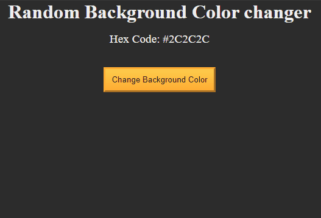
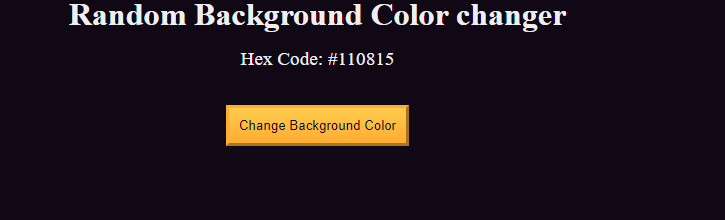
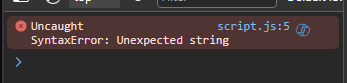
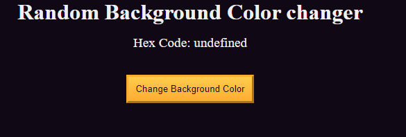

# 🧠 1D Building a Random Background Colour Changer

## 👨‍🍳 Final Product 👨‍🍳
* You can test out the app [here](https://htmlpreview.github.io/?https://github.com/shivkumar98/FreeCodeCamp-Projects/blob/main/05-javascript-a-ds-new/1-javascript-fundamentals/1d-building-a-random-background-color-changer/code/index.html)
* Here's a small demo:



## 🟥 Setup
* I am provided with a HTML file and CSS file:
```html
<!DOCTYPE html>
<html lang="en">
  <head>
    <meta charset="UTF-8" />
    <meta name="viewport" content="width=device-width, initial-scale=1.0" />
    <title>Build a random background color changer</title>
    <link rel="stylesheet" href="./styles.css" />
  </head>
  <body>
    <h1>Random Background Color changer</h1>

    <main>
      <section class="bg-information-container">
        <p>Hex Code: <span id="bg-hex-code">#110815</span></p>
      </section>

      <button class="btn" id="btn">Change Background Color</button>
    </main>
    <script src="./script.js"></script>
  </body>
</html>
```
```css
*,
*::before,
*::after {
  margin: 0;
  padding: 0;
  box-sizing: border-box;
}

:root {
  --yellow: #f1be32;
  --golden-yellow: #feac32;
  --dark-purple: #110815;
  --light-grey: #efefef;
}

body {
  background-color: var(--dark-purple);
  color: var(--light-grey);
  text-align: center;
}

.bg-information-container {
  margin: 15px 0 25px;
  font-size: 1.2rem;
}

.btn {
  cursor: pointer;
  padding: 10px;
  margin: 10px;
  color: var(--dark-purple);
  background-color: var(--golden-yellow);
  background-image: linear-gradient(#fecc4c, #ffac33);
  border-color: var(--golden-yellow);
  border-width: 3px;
}

.btn:hover {
  background-image: linear-gradient(#ffcc4c, #f89808);
}
```

<hr>

## 🟥 Step 1: Debugging JS
* The webpage currently shows as:


* I get a `SyntaxError` in the console


* I fixed the javascript by adding the missing commas:
```js
const darkColorsArr = [
  "#2C3E50",
  "#34495E",
  "#2C2C2C",
  "#616A6B",
  "#4A235A",
  "#2F4F4F",
  "#0E4B5A",
  "#36454F",
  "#2C3E50",
  "#800020",
];
```

<hr>

## 🟥 Step 2:
* I now getting the following error in my console:
```
Uncaught
ReferenceError: math is not defined
   at getRandomIndex (script.js:15:40)
   at script.js:17:3
```
* I fix the `getRandomIndex()` function by fixing the typo of the `Math` class:
```js
function getRandomIndex() {
   console.log(darkColorsArr.length * Math.random())
}
getRandomIndex();
```

<hr>

## 🟥 Step 3:
* Now when I go the console, I get random numbers being printed like:
```js
4.327219676255522
7.4255531822394705
7.825695290532806
```
* The expected behaviour is that a WHOLE number between 0 and 9 are printed
* I fix this by using `Math.floor()`:
```js
function getRandomIndex() {
   const randomIndex = Math.floor(darkColorsArr.length * Math.random());
    return randomIndex;}
getRandomIndex();
```

<hr>

## 🟥 Step 4:
The javascript has a new line to get an element from the DOM:
```js
const body = document.queryselector("body");
```
* I get the following error in the console:
```
Uncaught TypeError: document.queryselector is not a function
    at script.js:19:25
```
* I fix the typo:
```js
const body = document.querySelector("body");
```

<hr>

## 🟥 Step 5:
* There's a new variable which is added to store the reference to the span element with id `bg-hex-code` 
* Currently it only returns null:
```js
const body = document.querySelector("body");
const bgHexCodeSpanElement = document.querySelector("bg-hex-code");

console.log(bgHexCodeSpanElement);
```
* I fix this by adding the missing `#`:
```js
const body = document.querySelector("body");
const bgHexCodeSpanElement = document.querySelector("#bg-hex-code");

console.log(bgHexCodeSpanElement); // <span id="bg-hex-code">#110815</span>
```

<hr>

## 🟥 Step 6:
* Now a `changeBackgroundColor()` function has been added to set the background color to a random color from `darkColorsArr`:
```js
function changeBackgroundColor() {
  const color = darkColorsArr[getRandomIndex];

  bgHexCodeSpanElement.innerText = color;
  body.style.backgroundColor = color;
}
changeBackgroundColor();
```

* Clicking on the `Change Background Color` button has no change to the background-color, and the Hex Code is shown as undefined:



* I fix the above:
```js
function changeBackgroundColor() {
   const color = darkColorsArr[getRandomIndex()];

   bgHexCodeSpanElement.innerText = color;
   body.style.backgroundColor = color;
}
changeBackgroundColor();
```
* Now the page loads with a random color!


<hr>

## 🟥 Step 7:

* A `btn` variable is added to reference the button with id of `click-btn`
* When logging, it returns null:
```js
const btn = document.querySelector("#click-btn");
console.log(btn);
```

* I fix this by setting the id parameter as shown in the HTML:
```js
const btn = document.querySelector("#btn");
console.log(btn);
```

<hr>

## 🟥 Step 8:
* Now we have code to change the background color on the `onclick` event of the button:
```js
btn.onclick = changeBackgroundColor(); // doesnt work
```
* I fix this by removing the parenthesis:
```js
btn.onclick = changeBackgroundColor;
```

* The page now works:


