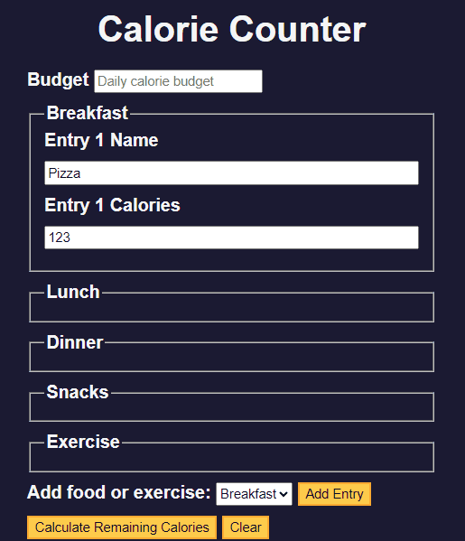

<!-- omit in toc -->
# 🧠 1E Learning Form Validation by Building a Calorie Counter
* In this exervice, I will learn how to accept input from user
* I will learn how to validate input, perform calculations, and dynamically update your interface to display the results.
* I will learn regex, template literals, and `addListener()` method.

<!-- omit in toc -->
## 👨‍🍳 Final Product 👨‍🍳
* You can test the app [here](https://htmlpreview.github.io/?https://github.com/shivkumar98/FreeCodeCamp-Projects/blob/main/05-javascript-a-ds-new/1-javascript-fundamentals/1e-building-a-calorie-counter/code/index.html)
* Here is a small demo:


<!-- omit in toc -->
## 📜 Table of Contents 📜

- [📝 Summary Notes 📝](#-summary-notes-)
- [🟥 1. Project Setup](#-1-project-setup)
- [🟥 2. Writing HTML for Form](#-2-writing-html-for-form)
- [🟥 3. Declaring Variables](#-3-declaring-variables)
- [🟥 4. Regular Expressions](#-4-regular-expressions)
- [🟥 5. Event Listeners](#-5-event-listeners)
- [🟥 6. Ironing out Bugs🕷️](#-6-ironing-out-bugs️)
- [🟥 7. Getting Calories From Inputs](#-7-getting-calories-from-inputs)
- [🟥 8. Calculating Calories](#-8-calculating-calories)
- [🟥 9. Submitting the Form](#-9-submitting-the-form)
- [🟥 10. Clearing Form](#-10-clearing-form)

<hr>

## 📝 Summary Notes 📝
* You can declare regex using `/`
   * E.g. if you want to match for hello, it would be `/hello`
* White space is declared using `\s`
* If I wanted my regex to match for characters in any order, then I wrap it with square brackets (`[]`)
   * E.g. matching for `+`, `-` and whitespace in any order: `/[+-\s]/`
* If you want the regex to continue seeking matches after finding first match, you add the `g` global flah
  * E.g. `/[+-\s]/g`
* String class has `.replace(regex, replacement)` to replace matches with replacement
  * E.g. `"hello-+ ".replace(/[+-\s]/g, "")`
* You can match for numbers using `\d`
* You can check for matches ignoring cases using `/i`
* String class has a `.match(regex)` method which returns an array of matches - or null if there are no matches

<br>

* There is a `document.querySelector(selection)` which returns the first element which matches selection
* The selection can be an ID or class
  * E.g. `document.querySelector('#idOfElement .classOfElement)`
* You can even specify type of HTML tag
  * E.g. `document.querySelector('input[type="text"'])`
* The `document.querySelectorAll(selection)` returns a `NodeList` of ALL elements which match selection

<br>

* You can add an event listener for when the form is submitted (by clicking submit button), using the form elements ID:
```js
idOfSubmitButton.addEventListener('submit', functionToExecute)
```
* The default behavior of a form submission is to reload the page, using the event listener we can prevent this from occuring
  * We need to declare the event listener as a parameter to the function and call `.preventDefault()`:
```js
function functionToExecute(e) {
   e.preventDefault();
}
```

<br>

* You can access the raw HTML of an element by calling the `.innerHTML` property of an element
* The `.innerText` property is the textual information contained within an element, it will discard all HTML tags (like `<strong>`)

<br>

* There is `.insertAdjacentHTML(position, html)` method which can allow you to append HTML to an element to an existing HTML
   * E.g. you can specify position as "beforeend" which will add HTML right before the end of the element
```js
document.getElementById("breakfast").insertAdjacentHTML("beforeend", `<h1>2</h1>`) 
```

<br>

* You can add/remove a class from an element by accessing its `.classList` property
  * E.g. `ouput.classList.add('hide')`

<hr>

## 🟥 1. Project Setup 
* I have the following HTML:
```html
<!DOCTYPE html>
<html lang="en">
  <head>
    <meta charset="utf-8" />
    <meta name="viewport" content="width=device-width, initial-scale=1.0" />
    <link rel="stylesheet" href="styles.css" />
    <title>Calorie Counter</title>
  </head>
  <body>
    <main>
      <h1>Calorie Counter</h1>
      <div class="container">

      </div>
    </main>
  </body>
</html>
```
* CSS:
```css
:root {
  --light-grey: #f5f6f7;
  --dark-blue: #0a0a23;
  --fcc-blue: #1b1b32;
  --light-yellow: #fecc4c;
  --dark-yellow: #feac32;
  --light-pink: #ffadad;
  --dark-red: #850000;
  --light-green: #acd157;
}

body {
  font-family: "Lato", Helvetica, Arial, sans-serif;
  font-size: 18px;
  background-color: var(--fcc-blue);
  color: var(--light-grey);
}

h1 {
  text-align: center;
}

.container {
  width: 90%;
  max-width: 680px;
}

h1,
.container,
.output {
  margin: 20px auto;
}

label,
legend {
  font-weight: bold;
}

.input-container {
  display: flex;
  flex-direction: column;
}

button {
  cursor: pointer;
  text-decoration: none;
  background-color: var(--light-yellow);
  border: 2px solid var(--dark-yellow);
}

button,
input,
select {
  min-height: 24px;
  color: var(--dark-blue);
}

fieldset,
label,
button,
input,
select {
  margin-bottom: 10px;
}

.output {
  border: 2px solid var(--light-grey);
  padding: 10px;
  text-align: center;
}

.hide {
  display: none;
}

.output span {
  font-weight: bold;
  font-size: 1.2em;
}

.surplus {
  color: var(--light-pink);
}

.deficit {
  color: var(--light-green);
}
``` 

<hr>

## 🟥 2. Writing HTML for Form
* Currently the webpage looks like:


* I add a label and input for the calorie budget, its of type number and has minimum value of 0
```html
<form id="calorie-counter">
   <label for="budget">Budget</label>
   <input
   type="number"
   min="0"
   id="budget"
   placeholder="Daily calorie budget"
   required
   />
</form>
```
* Below the calorie budget, I create a fieldset for Breakfast:
```html
<fieldset id="breakfast">
   <legend>Breakfast</legend>
   <div class="input-container"></div>
</fieldset>
```
* I create fieldsets for lunch and dinner too:
```html
<fieldset id="lunch">
   <legend>Lunch</legend>
   <div class="input-container"></div>
</fieldset>
<fieldset id="dinner">
   <legend>Dinner</legend>
   <div class="input-container"></div>
</fieldset>
```
* I add two more fieldsets for Snacks and Exercise:
```html
<fieldset id="snacks">
   <legend>Snacks</legend>
   <div class="input-container"></div>
</fieldset>
<fieldset id="exercise">
   <legend>Exercise</legend>
   <div class="input-container"></div>
</fieldset>
```
* The website now looks like:


* A user should be able to select the meal type (breakfast, lunch, etc), so I create a field for adding a entry:
```html
<div class="controls">
   <span>
      <label for="entry-dropdown">Add food or exercise:</label>
      <select id="entry-dropdown" name="options">
         <option value="breakfast" selected>Breakfast</option>
         <option value="lunch">Lunch</option>
         <option value="dinner">Dinner</option>
         <option value="snacks">Snacks</option>
         <option value="exercise">Exercise</option>
      </select>
      <button type="button" id="add-entry">Add Entry</button>
   </span>
</div>
```
* I set the `type` to `button` so the button does not submit
* The page now looks like:


* I add two other buttons, one for submission, one to clear the form:
```html
<div>
   <button type="submit">Calculate Remaining Calories</button>
   <button id="clear" type="button">Clear</button>
</div>
```
* I create a div to display the result below the form:
```html
<div id="output" class="output hide"></div>
```
* Below the `main` element, I add the JavaScript:
```html
<script src="./script.js"></script>
```
* The page now looks like:


<hr>

## 🟥 3. Declaring Variables
* I declare a variable for my form:
```js
const calorieCounter = document.getElementById("calorie-counter");
```
* I declare a variable for the budget input:
```js
const budgetNumberInput = document.getElementById("budget");
```
* I declare a variable for the dropdown:
```js
const entryDropdown = document.getElementById("entry-dropdown");
```
* I add variables for the add entry and clear button:
```js
const addEntryButton = document.getElementById("add-entry");
const clearButton = document.getElementById("clear")
```
* I declare a variale for the output:
```js
const output = document.getElementById("output")
```
* I initialise a variable called `isError` which will be set to true if user provides invalid input:
```js
let isError = false;
```

<hr>

## 🟥 4. Regular Expressions

* The budget input allows the user to enter `+` or `-` (e.g. +1.1 is a valid number).
* I declare a `cleanInputString` function which cleans up the input using regex:
```js
function cleanInputString(str) {

}
```
* I write the following regex, which will match for the word `hello`:
```js
const regex = \hello\; 
```
* I want to search for `+`, `-` and spaces. I write the following regex which searches for +, - (the + needs to be escaped with `\`):
```js
const regex = /\+-/;
```
* I use `\s` for whitespace characters:
```js
const regex = /\+-\s/;
```
* I want my regex to look for `+`, `-`, and whitespace in any order. To do this I create a character class by wrapping the characters in square brackets. I no longer need to escape the `+` character:
```js
const regex = /[+-\s]/;
```
* You can add flags after the closing `\`
* The global flag `g` instructs the regex to continue looking after it has found a match:
```js
const regex = /[+-\s]/g;
```
* I use the `.replace(regex, String)` method to replace the `+`, `-` and whitespace characters of the `str` parameter:
```js
function cleanInputString(str) {
   const regex = /[+-\s]/g;
   return str.replace(regex, "");
}
```
* I test my code:
```js
console.log(cleanInputString("+-99")); // 99
```

<br>

* HTML allows numbers in exponent notation (10e2 for e.g.)
* We want to filter these out, so I create a function called `isInvalidInput(str)`:
```js
function isInvalidInput(str) {

}
```
* I declare a regex variable which seeks for e, I use the `i` flag to make it case insensitive:
```js
const regex = /e/i;
```
* I use a character class range to find patterns where any number between 0-9 is before and after `e` is found:
```js
const regex = /[0-9]e[0-9]/i;
```
* The `+` modifier signifies a pattern which occurs ONE OR MORE times:
```js
const regex = /[0-9]+e[0-9]+/i;
```
* There is a shorthand for digits `\d`:
```js
const regex = /\d+e\d+/i;
```
* I use the String's `.match()` method which returns an array of matched, containing first match OR all matches if global flag is used
```js
const regex = /example/
constr result = "example string".match(regex) // ['example']
```
* I implement my `isInvalidInput()` function:
```js
function isInvalidInput(str) {
   const regex = \/d+e\d+/i;
   return str.match(regex);
}
```
* I test my function:
```js
console.log(isInvalidInput("1e3")); // Array [ "1e3" ]
console.log(isInvalidInput("10")); // null
```

<br>

* I create a function called `addEntry()`, to get the type, I use the `.value` property of the entryDropdown to construct a `targetId` variable:
```js
function addEntry() {
   const targetId = "#" + entryDropdown.value;
}
```
* I create a variable for `targetInputContainer`:
```js
function addEntry() {
   const targetId = "#" + entryDropdown.value;
   const targetInputContainer  = document.querySelector(targetId + " .input-container");
}
```
* I refactor the above code to use TEMPLATE LITERALS:
```js
function addEntry() {
  const targetId = '#' + entryDropdown.value;
  const targetInputContainer = document.querySelector(`${targetId} .input-container`);
}
```
* The code can be simplified:
```js
function addEntry() {
   const targetInputContainer = document
      .querySelector(`#{entryDropdown.value} .input-container`);
}
```


* The `querySelectorAll()` method returns a `NodeList`. I use this method to get the number of entries a user adds. I provide an argument of `input[type="text"]`:
```js
function addEntry() {
   const targetInputContainer = document
   .querySelector(`#${entryDropdown.value} .input-container`);
  const entryNumber = targetInputContainer.querySelectorAll('input[type="text"]').length;
}
```
* I create a `HTMLString` for a label and input for Name:
```js
const HTMLString = `
   <label for="${entryDropdown.value}-${entryName}-name">Entry ${entryNumber} Name</label>
   <input type="text" placeholder="Name" id="${entryDropdown.value}-${entryNumber}-name" />`
```
* I add a label and input for Calories:
```js
const HTMLString = `
  <label for="${entryDropdown.value}-${entryNumber}-name">Entry ${entryNumber} Name</label>
  <input type="text" id="${entryDropdown.value}-${entryNumber}-name" placeholder="Name" />
  <label for="${entryDropdown.value}-${entryNumber}-calories">Entry ${entryNumber} Calories</label>
  <input type="number" min="0" placeholder="Calories" id="${entryDropdown.value}-${entryNumber}-calories"/>`;
```
* My function now looks like:
```js
function addEntry() {
   const targetInputContainer = document.querySelector(`#${entryDropdown.value} .input-container`);
   const entryNumber = targetInputContainer
      .querySelectorAll('input[type="text"]').length;
   const HTMLString = `
   <label for="${entryDropdown.value}-${entryNumber}-name">Entry ${entryNumber} Name</label>
   <input type="text" id="${entryDropdown.value}-${entryNumber}-name" placeholder="Name" />
   <label for="${entryDropdown.value}-${entryNumber}-calories">Entry ${entryNumber} Calories</label>
   <input type="number" min="0" placeholder="Calories" id="${entryDropdown.value}-${entryNumber}-calories"/>`;
}
```

* I use the `innerHTML` property of the `targetInputContainer` to add the content of `HTMLString`:
```js
targetInputContainer.innerHTML += HTMLString;
```

## 🟥 5. Event Listeners
* We previously assigned the `.onclick` property of a button to a function to execute code on the click
* We can also use theh `.addEventListener()` to do this:
```js
addEntryButton.addEventListener("click", function() {console.log("hello")}); // prints hello when Add Entry is clicked
```
* At the bottom of my script, I add the following to call the `addEntry()` function:
```js
addEntryButton.addEventListener("click", addEntry)
```

<hr>

## 🟥 6. Ironing out Bugs🕷️
* Currently the first entry number is 0


* I fix this by adding one to `entryNumber` where its initialised:
```js
const entryNumber = targetInputContainer.querySelectorAll('input[type="text"]').length+1;
```

<br>

* Another bug is when you fill in one entry, click Add Entry and the existing entry clears out:

* This is because the values in the inputs are not saved into the `.innerHTML` property
* We can use the built in `insertAdjacentHTML()` method, which takes postion as first argument, and HTML to add as second argument.
* We can use `"beforeend"` to position it as the last child of the element:
```js
targetInputContainer.insertAdjacentHTML("beforeend", HTMLString);
```
* Now the app behaves as expected:


<hr>

## 🟥 7. Getting Calories From Inputs
* I create a function to calculates the calories from a list:
```js
function getCaloriesFromInputs(list) {
   let calories = 0;

   for (const item of list) {
      const currVal = cleanInputString(item.value);
      const invalidInputMatch = isInvalidInput(currVal);
   }
}
```

* I treat `invalidInputMatch` as a truthy value (if null its false) and alert a message which contains the first elemment of the array:
```js
function getCaloriesFromInputs(list) {
   let calories = 0;
   for (const item of list) {
      const currVal = cleanInputString(item.value);
      const invalidInputMatch = isInvalidInput(currVal);
      if (invalidInputMatch) {
         alert(`Invalid Input : ${invalidInputMatch[0]}`);
      }
   }
}
```
* Within the if block, I set `isError` to true and return null:
```js
if (invalidInputMatch) {
   alert(`Invalid Input : ${invalidInputMatch[0]}`);
   isError = true;
   return null;
}
```
* Now I want to add the currVal to the calories when it is valid in order to convert currVal into an actual number, I can use the `Number` class's constructor which has the following behaviour:
```js
Number('1000'); // 1000
Number('fdjsf'); // NaN
```
```js
function getCaloriesFromInputs(list) {
   let calories = 0;
   for (const item of list)  {
      const currVal = cleanInputString(item.value);
      const invalidInputMatch = isInvalidInput(currVal);

      if (invalidInputMatch) {
         alert(`Invalid Input : ${invalidInputMatch[0]}`);
         isError = true;
         return null;
      }
      calories += Number(currVal);
   }
   retun calories;
}
``` 

<hr>

## 🟥 8. Calculating Calories
* I declare an empty function which has a parameter `e` - this is a commmon name for the event listeners
```js
function calculateCalories(e) {

}
```
* I will attach this function to the submission of the form
* The `sumbit` event is triggered when the form is submitted, the default behaviour is to reload the page. We can prevent this by calling `.preventDefault()`
```js
function calculateCalories(e) {
   e.preventDefault();
   isError = false;
}
```

<br>

* I use `document.querySelectorAll()` to get the number inputs from the form for breakfast, lunch, ...:
```js
function calculateCalories(e) {
   e.preventDefault();
   isError = false;

   const breakfastNumberInputs = document.querySelectorAll('#breakfast input[type=number]');
   const lunchNumberInputs = document.querySelectorAll('#lunch input[type=number]');
   const dinnerNumberInputs = document.querySelectorAll('#dinner input[type=number]');
   const snackNumberInputs = document.querySelectorAll('#snacks inpute[type=number]');
   const exerciseNumberInputs = document.querySelectorAll('#exercise input[type=number]');
}
```
* I then calculate the calories using the function I defined earlier:
```js
const breakfastCalories = getCaloriesFromInputs(breakfastNumberInputs);
const lunchCalories = getCaloriesFromInputs(lunchNumberInputs);
const dinnerCalories = getCaloriesFromInputs(dinnerNumberInputs);
const snacksCalories = getCaloriesFromInputs(snacksNumberInputs);
const exerciseCalories = getCaloriesFromInputs(exerciseNumberInputs);
```

* I already have a decalred variable for the budget calories, I wrap this in an array:
```js
const budgetCalories = getCaloriesFromInputs([budgetNumberInput]);
```

* If any of the `getCaloriesFromInput()` calls yield an error, the global `isError` will be set to true
  * I return from the function if this is the case:
```js
function calculateCalories(e) {
   e.preventDefault();
   isError = false;

   const breakfastNumberInputs = document.querySelectorAll('#breakfast input[type=number]');
   const lunchNumberInputs = document.querySelectorAll('#lunch input[type=number]');
   const dinnerNumberInputs = document.querySelectorAll('#dinner input[type=number]');
   const snacksNumberInputs = document.querySelectorAll('#snacks input[type=number]');
   const exerciseNumberInputs = document.querySelectorAll('#exercise input[type=number]');

   const breakfastCalories = getCaloriesFromInputs(breakfastNumberInputs);
   const lunchCalories = getCaloriesFromInputs(lunchNumberInputs);
   const dinnerCalories = getCaloriesFromInputs(dinnerNumberInputs);
   const snacksCalories = getCaloriesFromInputs(snacksNumberInputs);
   const exerciseCalories = getCaloriesFromInputs(exerciseNumberInputs);
   const budgetCalories = getCaloriesFromInputs([budgetNumberInput]);

   if (isError) {
      return;
   }

   output.innerHTML = '<h1>Hello world</h1>'
}
```

* Currently, my webpage does not do anything when clicking `Calculate Remaining Calories`
* I start doing some calculations, I begin with creating a `consumedCalories` variable after the error check:
```js
const consumedCalories = breakfastCalories + lunchCalories + dinnerCalories + snacksCalories;
```
* I create a variable remaining calories:
```js
const remainingCalories = budgetCalories - consumedCalories + exerciseCalories;
```

* I now need to determine if user is in calorie surplus or deficit, I declare a `surplusOrDeficit` variable:
```js
const surplusOrDeficit = remainingCalories < 0 ? 'Surplus' : 'Deficit';
```
* I will now output this data in my `output` div.
  - I first create a span for the surplusOrDeficit variable:
```js
output.innerHTML = `<span class="${surplusOrDeficit.toLowerCase()}"></span>`;
```
* For debugging purposes, I added an even listener for my `Calculate Remaining Calories` button (I add ID of `submit`):
```js
const submitButton = document.getElementById("submit");
submitButton.addEventListener("click", calculateCalories);
```

* I add text to this span of the `output` element:
```js
output.innerHTML =  `<span class="${surplusOrDeficit.toLowerCase()}">${remainingCalories} Calorie ${surplusOrDeficit}</span>`;
```
* I use `Math.abs()` to make remaining calories display as absolute value:
```js
output.innerHTML = `
  <span class="${surplusOrDeficit.toLowerCase()}">${Math.abs(remainingCalories)} Calorie ${surplusOrDeficit}</span>
  `;
```
* I add a `<hr>` to the end, and a paragraph below too:
```js
output.innerHTML = `
  <span class="${surplusOrDeficit.toLowerCase()}">${Math.abs(remainingCalories)} Calorie ${surplusOrDeficit}</span>
  <hr>
  `;
```
* Below the `<hr>` tag, I add a few paragraphs:
```js
`
<hr>
<p>${budgetCalories} Calories Budgeted</p>
<p>${consumedCalories} Calories Consumed</p>
<p>${exerciseCalories} Calories Burned</p>
`
```

<hr>

## 🟥 9. Submitting the Form 

* I now need to remove the `hide` class of my `output` div so it is visible to user
   - This can be achieved by accessing the `.classList` property of an element and calling `.remove()` with the class you want to remove
```js
output.classList.remove('hide');
```

* I will now remove the eventListener which I added for debugging so I can do it the correct way!
   - Instead of setting up an eventListener for the submit button, I can instead do it for the form (which is already declared as `calorieCounter`) and listen for `submit`:
```js
calorieCounter.addEventListener("submit", calculateCalories)
```

* Now the output does show:


<hr>

## 🟥 10. Clearing Form
* I need to make the `Clear` button to work so user can restart without refreshing the page
* I create a new function and declare a variable inside which captures all elements with class `input-container`:
```js
function clearForm() {
   const inputContainers = document.querySelectorAll('.input-container');
}
```
* The querySelectorAll() method returns a `NodeList` which is an array like object
  * You can use the `Array.from(arrayLikeObject)` to convert it to an array
  * I wrap the inputContainers seletor in an Array:
```js
function clearForm() {
   const inputContainers = Array.from(
      document.querySelectorAll('.input-container'));
}
```

* I add an event listener to the button for debugging purposes:
```js
clearButton.addEventListener('click', clearForm);
```
* I create a for loop to clear the HTML of the inputContainers:
```js
function clearForm() {
   const inputContainers = Array.from(
      document.querySelectorAll('.input-container'));
   for (let container of inputContainers) {
      container.innerHTML = '';
   }
}
```
* We can see the inner HTML of the input-container divs get cleared:
```js
function clearForm() {
   const inputContainers = Array.from(
      document.querySelectorAll('.input-container'));
   for (let container of inputContainers) {
      container.innerHTML = '';
   }
}
```


* I add a line to clear the budgetNumerInput value:
```js
budgetNumberInput.value = '';
```
* I clear the text in the `output` element (the div will still be visible)
```js
output.innerText = '';
```
* I then hide the output by adding the `hide` class:
```js
output.classList.add('hide');
```

* The project is now complete!🎉🎉🎉🎉