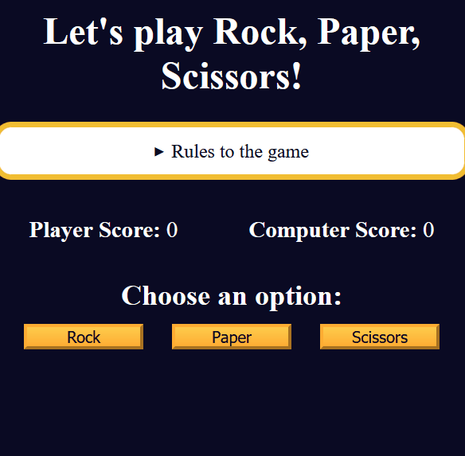
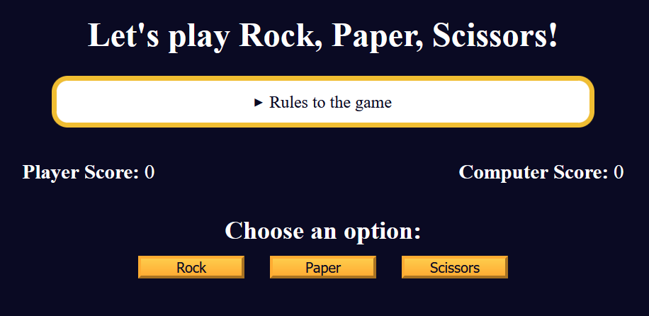
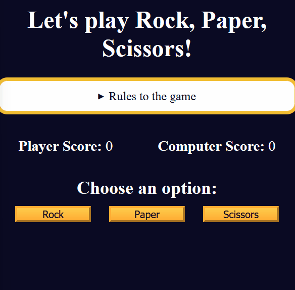

<!-- omit in toc -->
# 🧠 1F Review DOM Manipulation by Building a Rock, Paper, Scissors Game

<!-- omit in toc -->
## 👨‍🍳 Final Product 👨‍🍳

* You can test the app [here](https://htmlpreview.github.io/?https://github.com/shivkumar98/FreeCodeCamp-Projects/blob/main/05-javascript-a-ds-new/1-javascript-fundamentals/1f-review-dom-manipulation-by-building-a-rock-paper-scissors-game/code/index.html)

* Here is a demo:



<!-- omit in toc -->
## 📜 Table of Contents 📜
- [🟥 Project Setup](#-project-setup)
- [🟥 1. Implement getRandomComputerResult](#-1-implement-getrandomcomputerresult)
- [🟥 2. Implement hasPlayerWonTheRound()](#-2-implement-hasplayerwontheround)
- [🟥 3. Implement getRoundResults()](#-3-implement-getroundresults)
- [🟥 4. Implementing showResults](#-4-implementing-showresults)
- [🟥 5. First one to Three Points](#-5-first-one-to-three-points)
- [🟥 6. Reset the game](#-6-reset-the-game)

## 🟥 Project Setup
* I am given HTML, CSS for a page which looks like:

* I have a JS file with the following content:
```js
function getRandomComputerResult() {
  const options = ["Rock", "Paper", "Scissors"];

}

let playerScore = 0;
let computerScore = 0;
```

<hr>

## 🟥 1. Implement getRandomComputerResult
* The `getRandomComputerResult` needs to return a random element from `options`:
```js
function getRandomComputerResult() {
   const options = ["Rock", "Paper", "Scissors"];
   let randomIndex = Math.floor((Math.random()*3));
   return options[randomIndex];
}
```
<hr>

## 🟥 2. Implement hasPlayerWonTheRound()
* I am given an empty `hasPlayerWonTheRound(player, computer)` function which I need to implement
```js
function hasPlayerWonTheRound(player, computer) {
  
}
console.log(hasPlayerWonTheRound("Rock", "Scissors")); // should return true 
console.log(hasPlayerWonTheRound("Scissors", "Rock")); // should return false
console.log(hasPlayerWonTheRound("Scissors", "Scissors")); // should return false
```

* I implement the function as:
```js
function hasPlayerWonTheRound(player, computer) {
   if (player == computer) 
      return false;
   if ((player == "Rock" && computer == "Scissors")
         || (player == "Scissors" && computer == "Paper")
         || (player == "Paper" && computer == "Rock")) 
      return true;
   else
      return false;
}
```

<hr>

## 🟥 3. Implement getRoundResults()
* I now need to implement the `getRoundResults()` function:
  - If player wins, then update the playerScore by 1 and return message: `Player wins! [player's choice] beats [computer's choice]`
  - If tie, return message: `It's a tie! Both chose [player's choice]`
  - If computer wins, update the computeScore by 1 and return message `Computer wins! [computer's choice] beats [player's choice]`
* I am given the following code:
```js
function getRoundResults(userOption) {
  const computerResult = getRandomComputerResult();
 
}

console.log(getRoundResults("Rock"));
console.log("Player Score: ", playerScore, "Computer Score: ", computerScore);
```

<br>

* I implement the function as:
```js
function getRoundResults(userOption) {
   const computerResult = getRandomComputerResult();
   if (userOption == computerResult) {
      return `It's a tie! Both chose ${userOption}`
   }
   if (hasPlayerWonTheRound(userOption, computerResult)) {
      playerScore++;
      return `Player wins! ${userOption} beats ${computerResult}`
   } else {
      computerScore++;
      return `Computer wins! ${computerResult} beats ${userOption}`
   }
}
```


<hr>

## 🟥 4. Implementing showResults
* I now need to update the code so that scores are updated on screen
* I need to complete the `showResults()` function so that `playerScoreSpanElement` and `computeScoreSpanElement` show the scores and `roundResultsMsg` is updated with the result:
```js
const playerScoreSpanElement = document.getElementById("player-score");
const computerScoreSpanElement = document.getElementById("computer-score");
const roundResultsMsg = document.getElementById("results-msg");

function showResults(userOption) {

};

showResults("Rock");
```
<br>

* I implement the function as:
```js
function showResults(userOption) {
  const results = getRoundResults(userOption);
  playerScoreSpanElement.innerText = playerScore;
  computerScoreSpanElement.innerText = computerScore;
  roundResultsMsg.innerText = results;
}
```
* I add event listeners for the buttons:
```js
const rockBtn = document.getElementById("rock-btn");
const paperBtn = document.getElementById("paper-btn");
const scissorsBtn = document.getElementById("scissors-btn");

rockBtn.addEventListener("click", function () {
  showResults("Rock");
});

paperBtn.addEventListener("click", function () {
  showResults("Paper");
});

scissorsBtn.addEventListener("click", function () {
  showResults("Scissors");
});
```
* Now the game functions:



<hr>

## 🟥 5. First one to Three Points
* The rules of this game is that the first one to win 3 games wins the game
* I create 3 more constants for the `winner-msg`, `options-container`, and `reset-game-btn` elements:
```js
const winnerMsgElement = document.getElementById("winner-msg");
const optionsContainer = document.querySelector(".options-container");
const resetGameBtn = document.getElementById("reset-game-btn");
```
* I add to the `showResults()` function so that the winner message is set to `Player/Computer has won the game`, the reset button is show and the rock, paper, scissors buttons are hidden:
```js
function showResults(userOption) {
   const results = getRoundResults(userOption);
   playerScoreSpanElement.innerText = playerScore;
   computerScoreSpanElement.innerText = computerScore;
   roundResultsMsg.innerText = results;
   if (playerScore == 3) {
      winnerMsgElement.innerText = 'Player has won the game!'
      resetGameBtn.style.display = 'block'
      optionsContainer.style.display = 'none'
   } else if (computerScore == 3) {
      winnerMsgElement.innerText = 'Computer has won the game!'
      resetGameBtn.style.display = 'block'
      optionsContainer.style.display = 'none'
   }
};
```
* The game now finishes when one of the player's reach 3 points:


<hr>

## 🟥 6. Reset the game
* I now create a resetGame function and an event listener for the reset button being clicked:
```js
function resetGame() {

};

resetGameBtn.addEventListener("click", resetGame);
```
* I complete the reset function so that:
  - Player and computer score set to 0
  - Updates the player and computer score on screen
  - Hides the reset button
  - Shows the Rock, Paper, Scissors buttons
  - Clear the content of winner message and round results message
```js
function resetGame() {
  computerScore = 0;
  playerScore = 0;
  computerScoreSpanElement.innerText = computerScore;
  playerScoreSpanElement.innerText = playerScore;
  resetGameBtn.style.display = 'none';
  optionsContainer.style.display = 'block'
  winnerMsgElement.innerText = '';
  roundResultsMsg.innerText = '';
}
```

* I am now finished with this project🎉🎉🎉