<!-- omit in toc -->
# 🧠 1G Learn Basic String and Array Methods by Building a Music Player
* In this exercise I will learn essential string and array methods like `find()`, `forEach()`, `map()` and `join()`
* I will code a basic MP3 player using HTML/CSS/JavaScript 
* I will implement the following features:
   - Handling audio playback
   - Managing playlist
   - Pause, Play, Next, Previous, and Shuffle
   - Dynamically update the UI based on current song
* Here is a preview of what I will build:

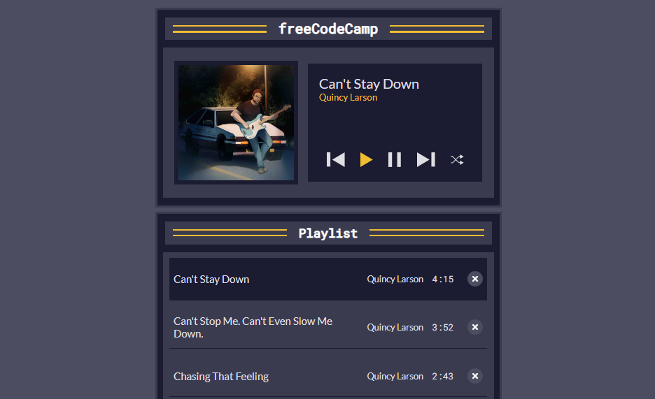

<!-- omit in toc -->
## 👨‍🍳 Final Product 👨‍🍳

* You can test the app [here](https://htmlpreview.github.io/?https://github.com/shivkumar98/FreeCodeCamp-Projects/blob/main/05-javascript-a-ds-new/1-javascript-fundamentals/1g-learn-basic-string-and-array-methods-by-building-a-music-player/code/index.html)

Here is a demo:

<details>
<summary>Demo</summary>

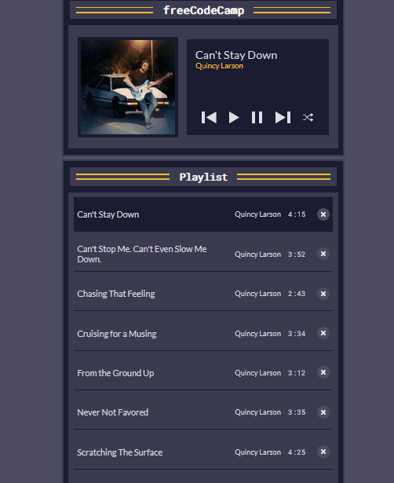

</details>


<!-- omit in toc -->
## 📜 Table of Contents 📜
- [🟥 1. Project Setup](#-1-project-setup)
- [🟥 2. Initialising Variables](#-2-initialising-variables)
- [🟥 3. Creating Array for Songs](#-3-creating-array-for-songs)
- [🟥 4. Web Audio API](#-4-web-audio-api)
- [🟥 5. Spread Operator (...)](#-5-spread-operator-)
- [🟥 6. Arrow Functions](#-6-arrow-functions)
- [🟥 7. Array Map Function](#-7-array-map-function)
- [🟥 8. Array Join Method](#-8-array-join-method)
- [🟥 9. Optional Chaining (?.)](#-9-optional-chaining-)
- [🟥 10. Array Sort Method](#-10-array-sort-method)
- [🟥 11. Array Find Method](#-11-array-find-method)
- [🟥 12. Adding Event Listener To Play Song](#-12-adding-event-listener-to-play-song)
- [🟥 13. Adding Event Listener to Play Song in Playlist](#-13-adding-event-listener-to-play-song-in-playlist)
- [🟥 14. Pausing Song](#-14-pausing-song)
- [🟥 15. Arrays indexOf Method](#-15-arrays-indexof-method)
- [🟥 16. Playing Next Song](#-16-playing-next-song)
- [🟥 17. Playing Previous Song](#-17-playing-previous-song)
- [🟥 18. Arrays forEach Method - Highlighting Current Song](#-18-arrays-foreach-method---highlighting-current-song)
- [🟥 19. Node textContent - Displaying Current Song Title and Artist](#-19-node-textcontent---displaying-current-song-title-and-artist)
- [🟥 20. Improving Accessibility](#-20-improving-accessibility)
- [🟥 21. Shuffle Button](#-21-shuffle-button)
- [🟥 22. Delete Button](#-22-delete-button)
- [🟥 23. Reset Button](#-23-reset-button)
- [🟥 24. Automatically Play Next Song](#-24-automatically-play-next-song)

<small><i><a href='http://ecotrust-canada.github.io/markdown-toc/'>Table of contents generated with markdown-toc</a></i></small>


<hr>

## 🟥 1. Project Setup


* The [HTML](project-setup/index.html) and [CSS](project-setup/styles.css) files have been provided to me
* The website currently looks like this and has no functionality:
<details>

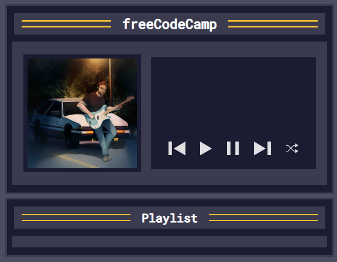
</details>
<hr>

## 🟥 2. Initialising Variables
* I create my javascript and initialise some variables   
```js
const playlistSongs = document.getElementById("playlist-songs");
const playButton = document.getElementById("play");
const pauseButton = document.getElementById("pause");

const nextButton = document.getElementById("next");
const previousButton = document.getElementById("previous");
const shuffleButton = document.getElementById("shuffle");
```

<hr>

## 🟥 3. Creating Array for Songs

* I create an array to store all the songs
```js
let allSongs = [];
```
* I add 10 songs as objects to this array

<details>

```js
const allSongs = [
  {
    id: 0,
    title: "Scratching The Surface",
    artist: "Quincy Larson",
    duration: "4:25",
    src: "https://cdn.freecodecamp.org/curriculum/js-music-player/scratching-the-surface.mp3",
  },
  {
    id: 1,
    title: "Can't Stay Down",
    artist: "Quincy Larson",
    duration: "4:15",
    src: "https://cdn.freecodecamp.org/curriculum/js-music-player/can't-stay-down.mp3",
  },
  {
    id: 2,
    title: "Still Learning",
    artist: "Quincy Larson",
    duration: "3:51",
    src: "https://cdn.freecodecamp.org/curriculum/js-music-player/still-learning.mp3",
  },
  {
    id: 3,
    title: "Cruising for a Musing",
    artist: "Quincy Larson",
    duration: "3:34",
    src: "https://cdn.freecodecamp.org/curriculum/js-music-player/cruising-for-a-musing.mp3",
  },
  {
    id: 4,
    title: "Never Not Favored",
    artist: "Quincy Larson",
    duration: "3:35",
    src: "https://cdn.freecodecamp.org/curriculum/js-music-player/never-not-favored.mp3",
  },
  {
    id: 5,
    title: "From the Ground Up",
    artist: "Quincy Larson",
    duration: "3:12",
    src: "https://cdn.freecodecamp.org/curriculum/js-music-player/from-the-ground-up.mp3",
  },
  {
    id: 6,
    title: "Walking on Air",
    artist: "Quincy Larson",
    duration: "3:25",
    src: "https://cdn.freecodecamp.org/curriculum/js-music-player/walking-on-air.mp3",
  },
  {
    id: 7,
    title: "Can't Stop Me. Can't Even Slow Me Down.",
    artist: "Quincy Larson",
    duration: "3:52",
    src: "https://cdn.freecodecamp.org/curriculum/js-music-player/cant-stop-me-cant-even-slow-me-down.mp3",
  },
  {
    id: 8,
    title: "The Surest Way Out is Through",
    artist: "Quincy Larson",
    duration: "3:10",
    src: "https://cdn.freecodecamp.org/curriculum/js-music-player/the-surest-way-out-is-through.mp3",
  },
  {
    id: 9,
    title: "Chasing That Feeling",
    artist: "Quincy Larson",
    duration: "2:43",
    src: "https://cdn.freecodecamp.org/curriculum/js-music-player/chasing-that-feeling.mp3",
  },
];
```
</details>

<hr>

## 🟥 4. Web Audio API
* All modern web browsers support Web Audio API which enables you to generate and process audio in webb applications
* I initialise an `Audio` class instance which creates a HTML5 `audio` element:
```js
const audio = new Audio()
```

* The music player should keep track of the songs, the current song playing, and the time of the current song. I create a `userData` variable to hold this information
```js
let userData = {};
```

<hr>

## 🟥 5. Spread Operator (...)
* In order for me to remove a song, or shuffle songs in my playlist, I need to take a copy of `allSongs` without mutating it
* The `...` spread operator can help me achieve this, its used to copy one array into another. E.g. suppose I have two arrays `arr1` and `arr2`, then I can merge as so:
```js
const arr1 = [1,2,3];
const arr2 = [4,5,6];
const combined = [...arr1, ...arr2]; // [1,2,3,4,5,6]
```
* Using this, I copy `allSongs` to a songs property of userData:
```js
let userData = {
   songs: [...allSongs]
}
```
* To track the current song's info and playback time, I initialise `currentSong` and `songCurrentTime` properties:
```js
let userData = {
  songs: [...allSongs],
  currentSong: null,
  songCurrentTime: 0
};
```

<hr>

## 🟥 6. Arrow Functions
* In the previous projects, I used regular functions (and anonymous functions), now I will be using `arrow functions`
* Arrow functions are ANONYMOUS functions
* E.g. you can declare an arrow function as:
```js
() => {console.log("hello")}
```
* This will NOT print anything unless I call it
* You can call an anonymous function using a variable:
```js
let arrowFunction = () => { console.log("hello"); }
arrowFunction(); // hello
```
<details>
<summary>More examples of arrows functions:</summary>

* Or you can call it directly:
```js
(
   () => { console.log("hello"); }
)(); // hello
```

* I create an arrow function called `printGreeting`:
```js
const printGreeting = () => {
  console.log("Hello there!")
}
printGreeting() // Hello there!
```

* I create a new function called printMessage which prints a parameter:
```js
const printMessage = (org) => {
  console.log(`${org} is awesome!`)
}
printMessage("freeCodeCamp"); 
// freeCodeCamp is awesome!
```

* You can also return a value from arrow function
```js
const addTwoNumbers  = (num1,num2) => {
  return num1+num2;
}
console.log(addTwoNumbers(3, 4))  // 7
```

* Like Java lambdas, you can omit the curly braces and `return` keyword if the result can expressed as a single line:
```js
const addTwoNumbers = (num1, num2) => num1+num2
```

</details>

<hr>

## 🟥 7. Array Map Function

<details>
<summary>How to use Map Function</summary>

* The `map()` function takes a function as a parameter - AKA a **callback function**:
```js
let array = [1,2,3]
let doubledArray = array.map((number) => number*2) // [2,4,6]
```

</details>

* To display songs in UI, I need to create a function, I create a `renderSongs` function which takes an array parameter:
```js
const renderSongs = (array) => {
}
```
* I use the map function to create a `<li>` element with an id of `song-id` (with id being replaced with actual ID of song) and class `playlist-song`:
```js
const renderSongs = (array) => {
  const songsHTML = array.map((song) => {
    return `<li id="song-${song.id}" class="playlist-song"></li>`
  })
}
```
* Within the `li` element, I nest a button with class `playlist-song-info` and a span of `song.title`, `song.artist`, `song.duration`:
```js
return `
<li id="song-${song.id}" class="playlist-song">
  <button class="playlist-song-info">
    <span class="playlist-song-title">${song.title}</span>
    <span class="playlist-song-artist">${song.artist}</span>
    <span class="playlist-song-duration">${song.duration}</span>
  </button>
</li>
`
```
* I add another button element in the `li` element:
<details>

```js
<button class="playlist-song-delete" aria-label="Delete ${song.title}">
  <svg width="20" height="20" viewBox="0 0 16 16" fill="none" xmlns="http://www.w3.org/2000/svg">
    <circle cx="8" cy="8" r="8" fill="#4d4d62"/><path fill-rule="evenodd" clip-rule="evenodd" d="M5.32587 5.18571C5.7107 4.90301 6.28333 4.94814 6.60485 5.28651L8 6.75478L9.39515 5.28651C9.71667 4.94814 10.2893 4.90301 10.6741 5.18571C11.059 5.4684 11.1103 5.97188 10.7888 6.31026L9.1832 7.99999L10.7888 9.68974C11.1103 10.0281 11.059 10.5316 10.6741 10.8143C10.2893 11.097 9.71667 11.0519 9.39515 10.7135L8 9.24521L6.60485 10.7135C6.28333 11.0519 5.7107 11.097 5.32587 10.8143C4.94102 10.5316 4.88969 10.0281 5.21121 9.68974L6.8168 7.99999L5.21122 6.31026C4.8897 5.97188 4.94102 5.4684 5.32587 5.18571Z" fill="white"/>
  </svg>
</button>
```

</details>

<hr>

## 🟥 8. Array Join Method

<details>
<summary>How to use Join Method</summary>

* You can join elements of an array using `.join()` method which can optionally take in a seperator:
```js
let array = ["hello","my","name","is","Shiv"]
array.join(); // "hello,my,name,is,shiv"
array.join(" "); // "hello my name is shiv"
```
</details>

<br>

* Currently, the `songsHTML` is an array, so all the HTML is seperated by commas
* I chain on the join method at the end of the map:
```js
const renderSongs = (array) => {
  const songsHTML = array.map((song) => {
    return `
    <li id="song-${song.id}" class="playlist-song">
      <button class="playlist-song-info">
          <span class="playlist-song-title">${song.title}</span>
          <span class="playlist-song-artist">${song.artist}</span>
          <span class="playlist-song-duration">${song.duration}</span>
      </button>
      ... (REST OF LITERAL OMITTED)
    `   
  }).join("");
}
```

* I now need to use the constructed `songsHTML` element and update the playlistSongs inner HTML:
```js
const renderSongs = (array) => {
  const songsHTML = array.map((song) => {
    return `
    <li id="song-${song.id}" class="playlist-song">
      <button class="playlist-song-info">
          <span class="playlist-song-title">${song.title}</span>
          <span class="playlist-song-artist">${song.artist}</span>
          <span class="playlist-song-duration">${song.duration}</span>
      </button>
      ... (REST OF LITERAL OMITTED)
    `   
  }).join("");
  playlistSongs.innerHTML = songsHTML;
}
```

<details>
<summary>Testing renderSongs() </summary>

* To test my code was working so I call the renderSongs function with allSongs
```js
renderSongs(allSongs)
```
* And I do now see all the songs listed on the webpage:

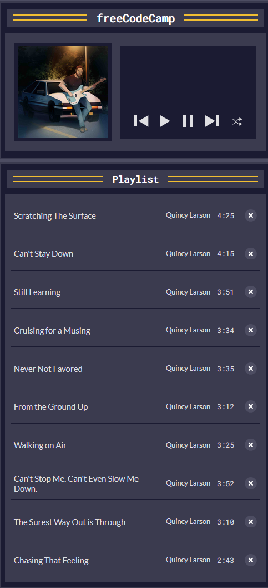

</details>

<hr>

## 🟥 9. Optional Chaining (?.)
* Optional chaining can help you avoid getting Reference Errors at run time for accessing properties which do exist:
```js
const user = { name: "Shiv" }
// user.address.zipCode // THROWS ERROR
user.address?.zipCode // undefined
```

* Using optional chaining, I replace the `allSongs` parameter of `renderSongs` with the songs property of userData:
```js
renderSongs(userData?.songs)
```

* I still see the same list of songs as previous screenshot

<hr>


## 🟥 10. Array Sort Method

<details>
<summary>Array Sort Method Explained </summary>

* Arrays has a sort method:
```js
const names = ["Charlie", "Alpha", "Zebra", "Beta"]
console.log(names.sort()) // [ 'Alpha', 'Beta', 'Charlie', 'Zebra' ]
```
* I start by creating an arrow function called `sortSongs`:
```js
const sortSongs = () => {
  userData?.songs.sort();
}
```

* In order for us to sort by the name of the song objects, a compare callback must be supplied.
* The callback function takes two parameters and returns a number. 
  * If the number is negative, the two elements are in right order
  * If the number is positive, the second element should be before first number
  * If the number is 0, then they are the same element and require no change
* You can directly compare strings using `<`, `>` operators

</details>

* I want to sort the songs in the playlist by name of song
* I implement the sortSongs method as:
```js
const sortSongs = () => {
  userData?.songs.sort((a,b) => {
    if (a.title < b.title)
      return -1
    if (a.title > b.title)
      return 1
    return 0
  });

  return userData?.songs
}
```

* Finally, I replace the direct usage of `userDate?.songs` with the sortSongs function:
```js
renderSongs(sortSongs());
```

* Looking at the webpage, the songs are now sorted:
<details>

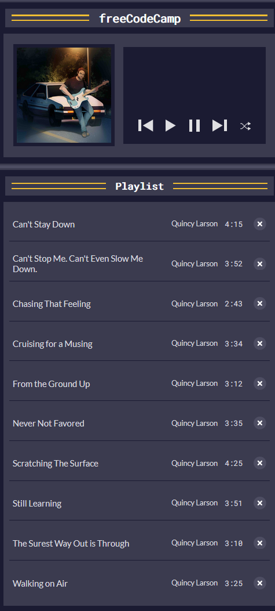

</details>

<hr>

## 🟥 11. Array Find Method


* The `find()` method finds the first element of an array which satisfies the condition defined in callback function, if no element satisfies condition then `undefined` is returned
<details>

* E.g.:
```js
const nums = [1,3,5,7]
nums.find(a => a%2==0); // undefined
nums.find(a => a%1==0); // 1
nums.find(a => a>3); // 5
```
</details>

* I create a playSong function which takes an `id` for a song:
```js
const playSong = (id) => {
  const song = userDate?.songs.find(song => song.id === id);
}
```
* I now use the song which is found to set the src and title properties of the `Audio` instance which was created:
```js
const audio = new Audio()
let userData = {
   songs: [...allSongs],
   currentSong: null,
   songCurrentTime: 0
};
// ^^ EXISTING CODE

const playSong = (id) => {
  const song = userData?.songs.find((song) => song.id === id);
  audio.src = song.src
  audio.title = song.title
};
```

* I now want to set the currentTime property of the song, before I do, I check if the currentSong is null (no song is playing yet) OR that the song ID is different from the currerent song
* If the selected song is new or different, then I set `currentTime` property of `audio` to 0
```js
if (userData?.currentSong === null || userData?.currentSong.id !== song.id) {
  audio.currentTime = 0
}
```
* I add an else clause to set the currentTime to what's in the userData (this can be used to resume existing song):
```js
if (userData?.currentSong === null || userData?.currentSong.id !== song.id) {
  audio.currentTime = 0;
} else {
  audio.currentTime = userData?.songCurrentTime;
}
```

* I need to update the current song to the song variable:
```js
userData.currentSong = song;
```

* To the `playButton` element, I add the `playing` class, and finally call the `play()` method on the audio instance:
```js
playButton.classList.add("playing");
audio.play();
```

* The playSong is completed! See below for the code:
<details>

```js
const playSong = (id) => {
  const song = userData?.songs.find((song) => song.id === id);
  audio.src = song.src
  audio.title = song.title

  if (userData?.currentSong === null || userData?.currentSong.id !== song.id) {
    audio.currentTime = 0;
  } else {
    audio.currentTime = userData?.songCurrentTime;
  }
  
  userData.currentSong = song;
  playButton.classList.add("playing");
  audio.play();
};
```

</details>

<hr>

## 🟥 12. Adding Event Listener To Play Song
* Now that the playSong function is complete, I need to add an event listener for the play song
* Here is the current behaviour of pressing the play button:

<details>

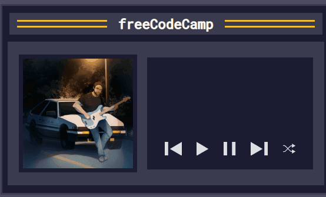

</details>

* I add an empty function call for when the `playButton` is clicked:
```js
playButton.addEventListener("click", ()=> {

})
```
* When the page is first loaded, `userData.currentSong` will be null
* So I do a check to see if it is falsey, so if currentSong is null I call the playSong function using the id of first song in `userData.songs`:
```js
playButton.addEventListener("click", ()=> {
  if (!userData?.currentSong) {
    playSong(userData.songs[0].id)
  }
})
```
* I add an else clause:
```js
if (!userData?.currentSong) {
  playSong(userData?.songs[0].id)
} else {
  playSong(userData?.currentSong.id)
}
```
* Now when I press play on webpage load, the first song in the list is played🎉

<hr>

## 🟥 13. Adding Event Listener to Play Song in Playlist
* For the `renderSongs` function, I update the construction of the button with class `playlist-song-info` to have an onclick event:
```js
const renderSongs = (array) => {
   const songsHTML = array.map((song) => {
      return `
      <li id="song-${song.id}" class="playlist-song">
        <button class="playlist-song-info" onclick="playSong(${song.id})">
            <span class="playlist-song-title">${song.title}</span>
            <span class="playlist-song-artist">${song.artist}</span>
            <span class="playlist-song-duration">${song.duration}</span>
        </button>
        ...` // REST OF CODE
   })
}
```
* Now if the play button has been clicked, and I click on one of the songs in the playlist, the song I clicked on will start playing!!!🎉🎉🎉

<hr>

## 🟥 14. Pausing Song
* I define a pauseSong function:
```js
const pauseSong = () => {
};
```
* In order to resume the song, I set the songCurrentTime to currentTime of the audio instance:
```js
const pauseSong = () => {
  userData.songCurrentTime = audio.currentTime;
}
```
* I then remove the `playing` class from the `playButton` as the song should now be paused. The `audio` instance has a `.pause()` method to pausing the music file:
```js
const pauseSong = () => {
  userData.songCurrentTime = audio.currentTime;
  playButton.classList.remove('playing');
  audio.pause();
}
```
* I then add an event listener for the pause button:
```js
pauseButton.addEventListener("click", pauseSong)
```

* The pause button now works!🎉🎉🎉

<hr>

## 🟥 15. Arrays indexOf Method 
<details>
<summary>How to use indexOf() Function</summary>

* The Arrays class has an `indexOf(object)` method which returns first index of appearence of parameter in the array;otherwise it returns -1
* E.g:
```js
["hello", "world"].indexOf(12); // -1
```

</details>

* In order for to move to previous and next song, I need the index of the current song
* I create a `getCurrentSongIndex` function:
```js
const getCurrentSongIndex = () => {}
```

* I return the indexOf `userData?.currentSong`:
```js
const getCurrentSongIndex = () => {
   return userData?.songs.indexOf(userData?.currentSong);
}
```
<hr>

## 🟥 16. Playing Next Song
* Now that we have the current index of song, I can make functions for playing previous and next songs
* I do an if check to see if there are songs currently playing, and to play the first song of the userData.songs array:
```js
const playNextSong = () => {
   let noSongsCurrentlyPlaying = userData?.currentSong === null;
   if (noSongsCurrentlyPlaying) {
      let firstSongId = userData?.songs[0].id;
      playSong(firstSongId)
   }
}
```
* I create an else clause for when a song is currently playing:
```js
if (noSongsCurrentlyPlaying) {
  let firstSongId = userData?.songs[0].id;
  playSong(firstSongId)
} else {
  const currentSongIndex = getCurrentSongIndex()
}
```
* I then obtain the next song, by adding 1 to the index:
```js
const currentSongIndex = getCurrentSongIndex()
const nextSong = userData?.songs[currentSongIndex + 1]
playSong(nextSong.id);
```

* I now add an event listener for the `playNextSong()` function:
```js
nextButton.addEventListener("click", playNextSong);
```

* I test that this works and it indeed does!🎉🎉🎉
* However I do notice that when I am on the last song, and press the next button, a reference error is thrown:
<details>

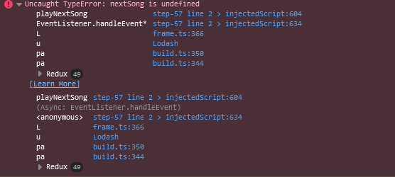

</details>

## 🟥 17. Playing Previous Song
* I create a const for `playPreviousSong` function:
```js
const playPreviousSong = () => {}
```
* Just like the `playNextSong` function, I check if a song is not currently playing, if so I return otherwise I create the `currentSongIndex` constant:
```js
const playPreviousSong = () => {
  if (userData?.currentSong === null) {
    return
  } else {
    const currentSongIndex = getCurrentSongIndex()
  }
};
```
* I then create a previousSong constant by subtracting 1 from the currentSongIndex:
```js
if (userData?.currentSong === null) {
  return
} else {
  const currentSongIndex = getCurrentSongIndex();
  const previousSong = userData?.songs[currentSongIndex - 1];
  playSong(previousSong.id);
}
```

* I add an event listener for the `playPreviousSong` function:
```js
previousButton.addEventListener("click", playPreviousSong)
```

* I test the code and confirm it works!🎉🎉🎉
* It has the same issue as playing next song, except on being on the first song and clicking previous😔
<hr>

## 🟥 18. Arrays forEach Method - Highlighting Current Song
* Currently, you can not see what sonng is actually being played!
* We will rectify his by creating a `highlightCurrentSong` function:
```js
const highlightCurrentSong = () => {
}
```
* I use the `querySelectorAll` to get the `.playlist-song` element:
```js
const highlightCurrentSong = () => {
  const playlistSongElements = document.querySelectorAll(".playlist-song");
}
```
* We want to highlight the HTML element with an ID of `song-${currentSongIndex}`, as we can see from the `renderSongs` function
* I create a constant to get the node element of song to highlight:
```js
const highlightCurrentSong = () => {
  const playlistSongElements = document.querySelectorAll(".playlist-song");
   const songToHighlight = document.getElementById(`song-${userData?.currentSong?.id}`);
}
```

<details>
<summary>How to use forEach() Function</summary>

* Arrays have a `forEach()` method which accepts a callback function, e.g.:
```js
[1, 2, 3, 4, 5].forEach(num => {
  console.log(num); // 1 2 3 4 5
})
```
</details>

* Using forEach, I remove the `"aria-current"` attribute from each of the songs in the playlist:
```js
const highlightCurrentSong = () => {
   const playlistSongElements = document.querySelectorAll(".playlist-song");
   const songToHighlight = document.getElementById(`song-${userData?.currentSong?.id}`);
   playlistSongElements.forEach((songEl) => {
      songEl.removeAttribute("aria-current");
   });
}
```
* Then I add a clause to set the `aria-current` attribute to `true` for songToHighlight:
```js
const highlightCurrentSong = () => {
   const playlistSongElements = document.querySelectorAll(".playlist-song");
   const songToHighlight = document.getElementById(`song-${userData?.currentSong?.id}`);
   playlistSongElements.forEach((songEl) => {
      songEl.removeAttribute("aria-current");
   });
   if (songToHighlight) {
      songToHighlight.setAttribute("aria-current", "true");
   }
}
```

* Finally, I call the above function in the `playSong` function:
```js
const playSong = (id) => {
   // pre-existing code
   highlightCurrentSong();
   audio.play();
}
```

Now the currently playing song becomes highlighted:

<details>

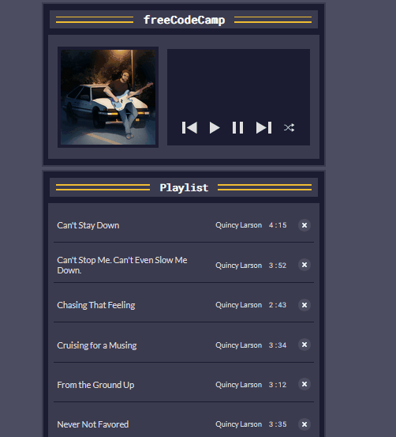

</details>

<hr>

## 🟥 19. Node textContent - Displaying Current Song Title and Artist
* I declare an empty `setPlayerDisplay` function:
```js
const setPlayerDisplay = () => {
}
```
* I create `playingSong` and `songArtist` variables:
```js
const setPlayerDisplay = () => {
   const playingSong = document.getElementById("player-song-title");
   const songArtist = document.getElementById("player-song-artist");
}
```
* I then get the current song title and artist values:
```js
const currentTitle = userData?.currentSong?.title;
const currentArtist = userData?.currentSong?.artist;
```

* The `textContent` lets you read/update the text of a HTML element.

<details>
<summary>Example</summary>

```js
<div id="example">This is text.</div>

const elemment = document.getElementById('example');
console.log(element.textContent); // This is text.
```

</details>

* I check if `currentTitle` is truthy, if it is, I set it textContent of `playingSong`:
```js
playingSong.textContent = currentTitle ? currentTitle : "";
```
* And similarily for currentArtist:
```js
songArtist.textContent = currentArtist ? currentArtist : "";
```

* Finally, I call the `setPlayerDisplay` function in the `playSong` function:?
```js
const playSong = (id) => {
  // pre-existing code
  highlightCurrentSong();
  setPlayerDisplay();
  audio.play();
};
```

<hr>

## 🟥 20. Improving Accessibility
* I create an empty arrow function to set the play button's accessible text:
```js
const setPlayButtonAccessibleText = () => {
}
```
* I need to obtain the currently playing song or the first song in the playlist, I create a constant for this:
```js
const song = userData?.currentSong || userData?.songs[0]
```
* To cover the scenario in which no songs are in the playlist, we will check if `song.title` is null, if so then the aria label will just be `Play` otherwise it is `Play song-title`:
```js
const setPlayButtonAccessibleText = () => {
  const song = userData?.currentSong || userData?.songs[0];
  playButton.setAttribute("aria-label", song?.title ? `Play ${song.title}` : "Play");
}
```

* I call the above function inside the `playSong` function
```js
const playSong = (id) => {
  // pre-existing code
  highlightCurrentSong();
  setPlayerDisplay();
  setPlayButtonAccessibleText();
  audio.play();
}
```

* The aria-label is now updated accordingly🎉🎉🎉
<details>

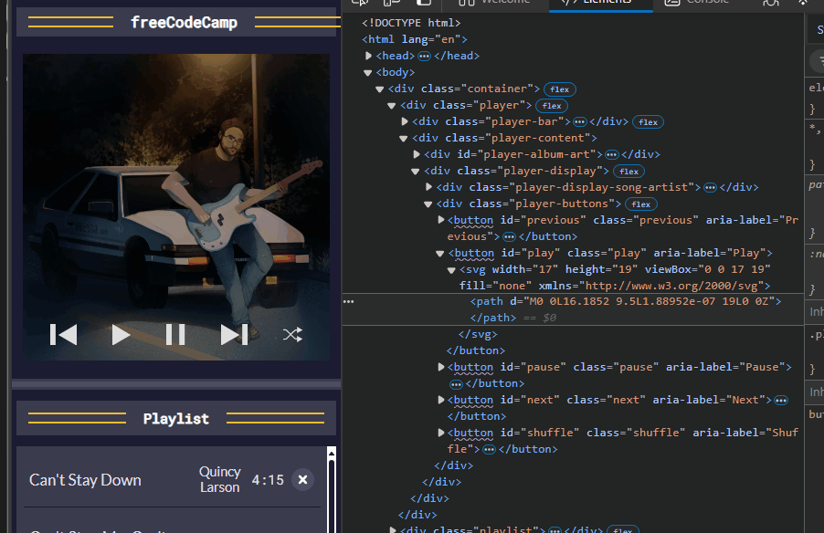

</details>

<hr>

## 🟥 21. Shuffle Button
<details>
<summary>How to use Array sort() Function</summary>

* The `sort()` method takes a callback which returns an number, and according to its sign orders the elements.
* Using `Math.random()` which returns a number between 0 and 1, we can generate a number between -0.5 and 0.5:
```js
const names = ["Shiv", "Sammy", "Rohan"]
names.sort(() => Math.random() - 0.5);
```

<hr>

</details>

* We sorted the songs in an alphabetical order when rendering the songs.
* I use the above to sort the `userData.songs` array:
```js
const shuffle = () => {
  userData?.songs.sort(() => Math.random() - 0.5);
};
```
* When the shuffle button is pressed, the `currentSong` needs to be set to nothing and `songCurrentTime` needs to be set to 0:
```js
const shuffle = () => {
  userData?.songs.sort(() => Math.random() - 0.5);
  userData.currentSong = null;
  userData.songCurrentTime = 0;
};
```

* I also re-render the songs, pause the current song, set the player display, and set the play button's accessible text:
```js
const shuffle = () => {
  userData?.songs.sort(() => Math.random() - 0.5);
  userData.currentSong = null;
  userData.songCurrentTime = 0;
  renderSongs(userData?.songs);
  pauseSong();
  setPlayerDisplay();
  setPlayButtonAccessibleText();
};
```

* Finally, I add an event listener for the shuffle button:
```js
shuffleButton.addEventListener("click", shuffle)
```

The shuffle button works!!🎉🎉🎉

<details>

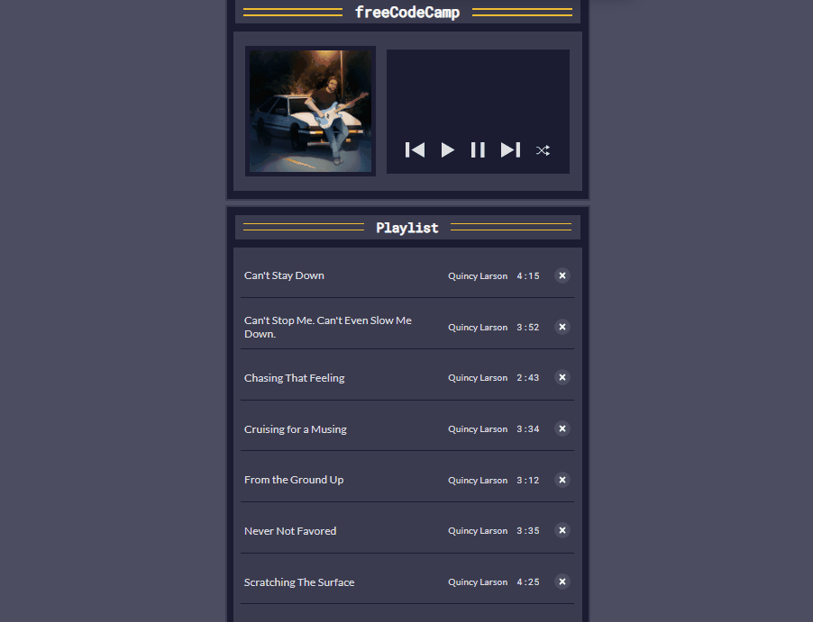

<hr>

</details>

<hr>

## 🟥 22. Delete Button
* I use the Arrays filter method in a new `deleteSong` method to update `userData.songs`:
```js
const deleteSong = (id) => {
   userData.songs = userData?.songs.filter(song => song.id !== id)
}
```
* I then re-render the songs, accessible text of current song, and highlight current song:
```js
const deleteSong = (id) => {
   userData.songs = userData?.songs.filter(song => song.id !== id)
   renderSongs(userData?.songs);
   highlightCurrentSong();
   setPlayButtonAccessibleText();
}
```

* I do a check to see if the song being played is the song which is being deleted, if so I set the currentSong and songCurrentTime fields to null/0. I also pause thhe song, and set the player's display:
```js
const deleteSong = (id) => {
   if (userData?.currentSong?.id === id) {
      userData.currentSong = null;
      userData.songCurrentTime = 0;
      pauseSong();
      setPlayerDisplay();
  }
  // pre-existing code
}
```
* I add an onclick attribute to the Delete button which is rendered in the `renderSong` function:
```js
const renderSongs = (array) => {
  const songsHTML = array
   .map((song)=> {
      return `
      <li id="song-${song.id}" class="playlist-song">
      <button class="playlist-song-info" onclick="playSong(${song.id})">
         <span class="playlist-song-title">${song.title}</span>
         <span class="playlist-song-artist">${song.artist}</span>
         <span class="playlist-song-duration">${song.duration}</span>
      </button>
      <button class="playlist-song-delete" onclick="deleteSong(${song.id})" aria-label="Delete ${song.title}">
      // rest of code here`
   })
}
```

* I now can delete any song I want!🎉🎉🎉

<hr>

## 🟥 23. Reset Button
<details>
<summary>DOM createElement() Function</summary>

* The `createElement()` DOM method which accepts the name of the tag and returns an Element:
```js
console.log(document.createElement("hello")) 
// <hello></hello>
```
<hr>
</details>

* If the playlist is empty after deleting all the songs, I want a `resetButton` element. 

  * I add a check to see if no songs are remaining at the end of my `deleteSong()`, so I can create a button element:
```js
if (userData?.songs.length === 0) {
  const resetButton = document.createElement("button");
}
```

* Using `document.createTextNode()`, I create a `resetText` constant:
```js
if (userData?.songs.length === 0) {
  const resetButton = document.createElement("button");
  const resetText = document.createTextNode("Reset Playlist")
}
```

* I now need to need to set the `id` and `aria-label` of `resetButton`. I can set these attributes by accessing the `id` and `ariaLabel` properties of the element. These properties accept strings as values.
* I set the id and aria-label:
```js
if (userData?.songs.length === 0) {
  const resetButton = document.createElement("button");
  const resetText = document.createTextNode("Reset Playlist");
  resetButton.id = "reset";
  resetButton.ariaLabel = "Reset playlist";
}
```

* I now need to add the `resetText` as a child of the `resetButton` element.
* There is a `appendChild()` method which enables you to do this!
```js
if (userData?.songs.length === 0) {
  const resetButton = document.createElement("button");
  const resetText = document.createTextNode("Reset Playlist");
  resetButton.id = "reset";
  resetButton.ariaLabel = "Reset playlist";
  resetButton.appendChild(resetText);
  playlistSongs.appendChild(resetButton);
}
```

Now the reset button appears when all songs are deleted:

<details>
<summary>Demo</summary>

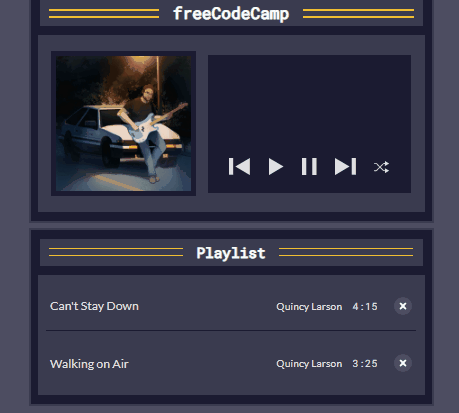

<hr>
</details>

* I now add an event listener for the resetButton with an empty callbackk now
```js
if (userData?.songs.length === 0) {
  const resetButton = document.createElement("button");
  const resetText = document.createTextNode("Reset Playlist");
  resetButton.id = "reset";
  resetButton.ariaLabel = "Reset playlist";
  resetButton.appendChild(resetText);
  playlistSongs.appendChild(resetButton);
  resetButton.addEventListener("click", ()=>{})
}
```
* I spread the `allSongs` into an array and assign it to `userData.song`:
```js
resetButton.addEventListener("click", () => {
  userData.songs = [...allSongs]   
});
```
* I then call the renderSongs(), setPlayButtonAccessibleText(), and finally `.remove()` on the reset button element to completely remove from DOM:
```js
resetButton.addEventListener("click", () => {
  userData.songs = [...allSongs];
  renderSongs(sortSongs())
  setPlayButtonAccessibleText()
  resetButton.remove()
});
```

* The full if-block is:
```js
if (userData?.songs.length === 0) {
  const resetButton = document.createElement("button");
  const resetText = document.createTextNode("Reset Playlist");
  resetButton.id = "reset";
  resetButton.ariaLabel = "Reset playlist";
  resetButton.appendChild(resetText);
  playlistSongs.appendChild(resetButton);
  resetButton.addEventListener("click", ()=>{});

  resetButton.addEventListener("click", () => {
    userData.songs = [...allSongs];
    renderSongs(sortSongs())
    setPlayButtonAccessibleText()
    resetButton.remove()
  });
}
```

My reset button is now complete!🎉🎉🎉

<details>

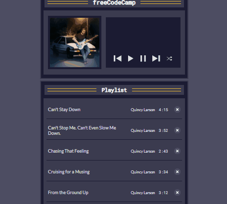

<hr>
</details>

<hr>

## 🟥 24. Automatically Play Next Song
* All core functionalities have been implemented!
* The only issue is that the next song does not automatically play when current song ends.
* Luckily the audio class has an `"ended"` event which can be listened to:
```js
audio.addEventListener("ended", () => {
});
```
* I need to check if there is a next song to play:
```js
audio.addEventListener("ended", () => {
  const currentSongIndex = getCurrentSongIndex();
  const nextSongExists = currentSongIndex < userData.songs.length-1 
});
```
* Using `nextSongExists`, I call the `playNextSong()` function:
```js
audio.addEventListener("ended", () => {
  const currentSongIndex = getCurrentSongIndex();
  const nextSongExists = currentSongIndex < userData.songs.length-1;
  if (nextSongExists)  {
    playNextSong();
  }
});
```
* I add an else clause to set currentSong of userData to null, and reset the songCurrentTime:
```js
if (nextSongExists) {
  playNextSong();
} else {
  userData.currentSong = null
  userData.songCurrentTime = 0
}
```
* Finally I call the `pauseSong()`, `setPlayerDisplay()`, `highlightCurrentSong()`, and `setPlayButtonAccessibleText()` functions in the event listener:
```js
audio.addEventListener("ended", () => {
  // pre-existing code

  pauseSong();
  setPlayerDisplay();
  highlightCurrentSong();
  setPlayButtonAccessibleText();
}
```