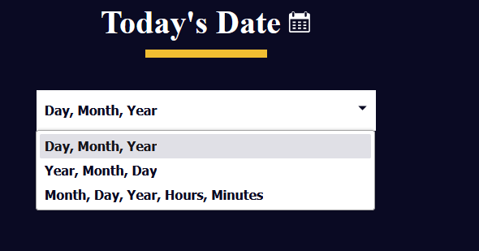

# 🧠 2A - Learn the Date Object by Building a Date Formatter
* In this practice project, I will learn about the JavaScript `Date` object by building a date formatter.
* The [HTML](./code/index.html) and [CSS](./code/styles.css) files have been provided to me
* The page currently looks like:
<details>


</details>

## 👨‍🍳 Final Product 👨‍🍳
* You can try out the application [here](https://htmlpreview.github.io/?https://github.com/shivkumar98/FreeCodeCamp-Projects/blob/main/05-javascript-a-ds-new/2-advanced-javascript/2a-learn-date-object-by-building-date-formatter/code/index.html)
* Here is a demo:
<details>


</details>

## 📝 Summary Notes 📝
* When you instantiate the `Date` class, it will have the current date and time as its properties
* The following methods are available to the class:
<details>

```js
Date date = new Date();
date.getDay();
date.getMonth(); // returns a value between 0-11 (0 is jan)
date.getFullYear();
date.getHours();
date.getMinutes();
```
</details>

* You can listen to the event in which the `value` of an element has changed using the `"change"` event. This can be used for drop-downs whose values can change!

## 🟥 Initialising JavaScript
* I initialise the JavaScript by creating a constants for the `#current-date` element and `#date-options`:
```js
const currentDateParagraph = document.getElementById('current-date')
const dateOptionsSelectElement = document.getElementById('date-options');
```
* The `#current-date` in the HTML is just an empty `p` tag:
```html
<p id="current-date"></p>
```

## 🟥 Constructing Date
* JavaScript has many built in constructors that create objects.
* I can construct Date using `new Date()` which returns an instance with the current date and time
<details>

```js
new Date(); // Date Sun Oct 06 2024 11:09:37 GMT+0100 (British Summer Time)
```

</details>

* I create a constant for the Date:
```js
const date = new Date()
```


## 🟥 Date Methods
* The Date object has a `.getDate()` method which returns the date as a number between 1 and 31
* The `.getMonth()` method returns a number between 0 and 11 where 0 represents Jan
<details>

```js
Date d = new Date(); // Date Sun Oct 06 2024 11:09:37 GMT+0100 (British Summer Time)
d.getDate(); // 6
d.getMonth(); // 9
```

</details>

* I create a constant for the day
* * I create a constant for the month - I add 1 to make it same as real world
```js
const day = date.getDate();
const month = date.getMonth()+1;
```
* There is a `.getFullYear()` which returns the year, I create a constant for this:
```js
const year = date.getFullYear();
```


* Here are the methods for time, they work as you'd expect!
* I create a const for hours, minutes
```js
const hours = date.getHours();
const minutes = date.getMinutes();
```

## 🟥 Displaying the Date

* I create a constant for `formattedDate`:
```js
const formattedDate = `${day}-${month}-${year}`
```

* I display the above in the textContent of `currentDateParagraph`:
```js
currentDateParagraph.textContent = formattedDate
```
* I can now see the date rendered on the page:


## 🟥 JavaScript Change Event
* We've seen before when we listened for the `submit` event when a form is submitted.
* We also can listen for a `change` event which detects when the value of a HTML element has changed.
* I add an event listener for dateOptionsSelectElement being changed:
```js
dateOptionsSelectElement.addEventListener("change", ()=>{});
```
* I create a `switch` statement based on the value of `dateOptionsSelectElement`:
```js
dateOptionsSelectElement.addEventListener("change", ()=>{
   switch (dateOptionsSelectElement.value) {

   }
});
```
* I look at the HTML to see what values can be present:
<details>

```html
<select name="date-options" id="date-options">
   <option value="dd-mm-yyyy">Day, Month, Year</option>
   <option value="yyyy-mm-dd">Year, Month, Day</option>
   <option value="mm-dd-yyyy-h-mm">
      Month, Day, Year, Hours, Minutes
   </option>
</select>
```
</details>


* I create a switch clause for `"yyyy-mm-dd"`:
```js
dateOptionsSelectElement.addEventListener("change", ()=>{
   switch (dateOptionsSelectElement.value) {
      case "yyyy-mm-dd": 
         currentDateParagraph.textContent = formattedDate
            .split("-")
            .reverse()
            .join("-");
   }
});
```
* I need to add a break statement, without it the rest of the cases will be executed ⚠️ 
```js
dateOptionsSelectElement.addEventListener("change", ()=>{
   switch (dateOptionsSelectElement.value) {
      case "yyyy-mm-dd": 
         currentDateParagraph.textContent = formattedDate
            .split("-")
            .reverse()
            .join("-");
         break;
   }
});
```

<br>

* I add a case for when the value is `"mm-dd-yyyy-h-mm"`, and I use string interpolation:
```js
dateOptionsSelectElement.addEventListener("change", ()=>{
   switch (dateOptionsSelectElement.value) {
      case "yyyy-mm-dd": 
         // EXISTING CODE
      case "mm-dd-yyyy-h-mm":
         currentDateParagraph.textContent=`${month}-${day}-${year} ${hours} Hours ${minutes} Minutes`
         break;
   }
});
```
* I add a default case which uses the `formattedDate` variable:
```js
dateOptionsSelectElement.addEventListener("change", ()=>{
   switch (dateOptionsSelectElement.value) {
      case "yyyy-mm-dd": 
         // EXISTING CODE
      case "mm-dd-yyyy-h-mm":
         // EXISTING CODE
      default:
         currentDateParagraph.textContent=formattedDate;
   }
});
```
* Here is the finished event listener:
<details>

```js
dateOptionsSelectElement.addEventListener("change", ()=>{
   switch (dateOptionsSelectElement.value) {
      case "yyyy-mm-dd": 
         currentDateParagraph.textContent = formattedDate
               .split("-")
               .reverse()
               .join("-");
         break;
      case "mm-dd-yyyy-h-mm":
         currentDateParagraph.textContent=`${month}-${day}-${year} ${hours} Hours ${minutes} Minutes`
         break;
      default:
         currentDateParagraph.textContent=formattedDate;
   }
});
```
</details>