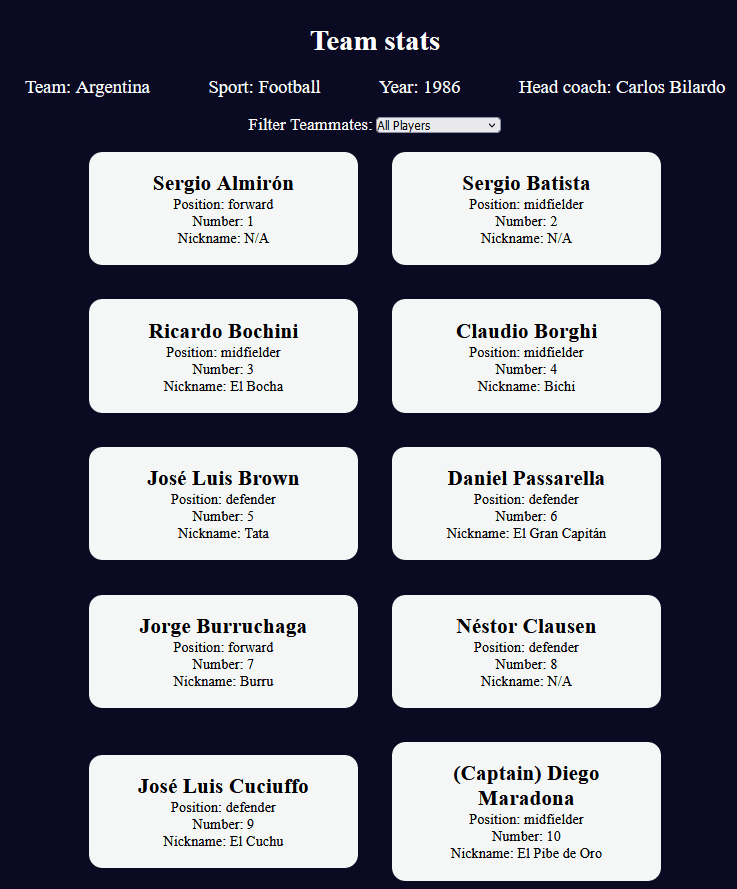
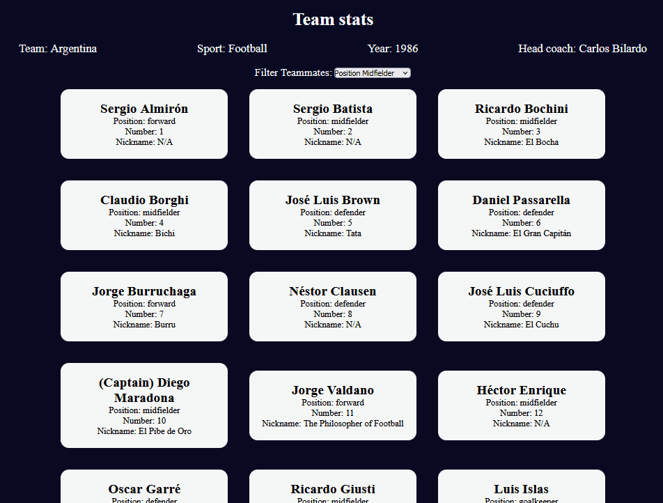
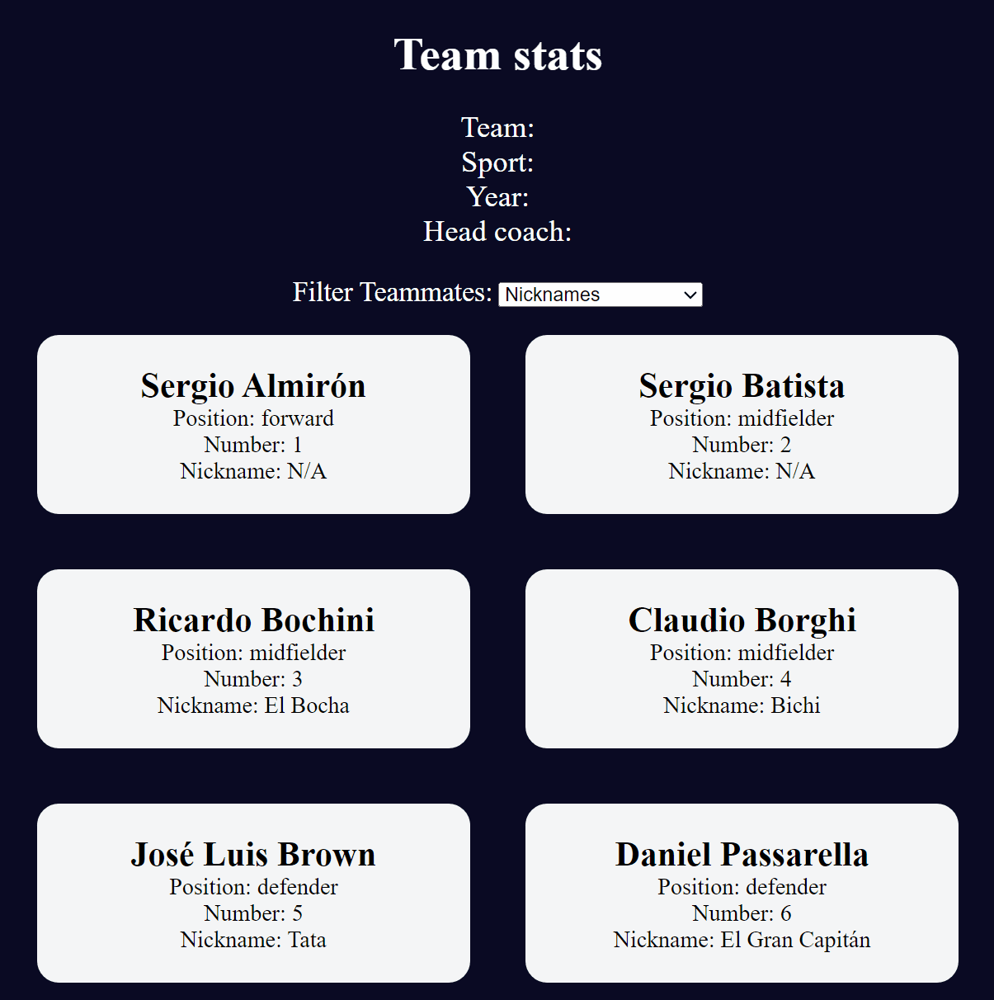

# 🧠 2B - Learn Modern JavaScript Methods by Building Football Team Cards
* Processing datasets and outputting information to the  screen is a common aspect of building web applications.
* In this project, I will learn how to work with DOM manipulation, object destructuring, event handling and data filtering
* I will visit concepts like default parameters, `Object.freeze()`, and reinforce your knowledge of the `switch` statement and `map()` method.
* Here is a preview of what I will build:
<details>


</details>


## 👨‍🍳 Final Product 👨‍🍳
* You can try out the application [here](https://htmlpreview.github.io/?https://github.com/shivkumar98/FreeCodeCamp-Projects/blob/main/05-javascript-a-ds-new/2-advanced-javascript/2b-learn-modern-js-methods-building-football-team-cards/code/index.html)
* Here is a demo:
<details>


</details>

## 📝 Summary Notes 📝
* Unlike Java, the JavaScript language supports default parameters for methods. This means the caller of a function needs not to supply a parameter
* You can use object destructuring to extract variables from an object using `const { key1, key2 } = oject`. The variable names MUST match the name of the properties!

## 🟥 Project Setup
* I have been given the HTML and CSS as a starting point
<details>

<Summary>HTML</Summary>

```HTML
<!DOCTYPE html>
<html lang="en">
   <head>
      <meta charset="UTF-8" />
      <meta http-equiv="X-UA-Compatible" content="IE=edge" />
      <meta name="viewport" content="width=device-width, initial-scale=1.0" />
      <title>
      Learn Modern JavaScript methods by building football team cards
      </title>
      <link rel="stylesheet" href="styles.css" />
   </head>
   <body>
      <h1 class="title">Team stats</h1>
      <main>
      <div class="team-stats">
         <p>Team: <span id="team"></span></p>
         <p>Sport: <span id="sport"></span></p>
         <p>Year: <span id="year"></span></p>
         <p>Head coach: <span id="head-coach"></span></p>
      </div>
      <label class="options-label" for="players">Filter Teammates:</label>
      <select name="players" id="players">
        <option value="all">All Players</option>
        <option value="nickname">Nicknames</option>
        <option value="forward">Position Forward</option>
        <option value="midfielder">Position Midfielder</option>
        <option value="defender">Position Defender</option>
        <option value="goalkeeper">Position Goalkeeper</option>
      </select>
      <div class="cards" id="player-cards">
         <div class="player-card">
            <h2>Sergio Almirón</h2>
            <p>Position: forward</p>
            <p>Number: 1</p>
            <p>Nickname: N/A</p>
         </div>
         <div class="player-card">
            <h2>Sergio Batista</h2>
            <p>Position: midfielder</p>
            <p>Number: 2</p>
            <p>Nickname: N/A</p>
         </div>
         <div class="player-card">
            <h2>Ricardo Bochini</h2>
            <p>Position: midfielder</p>
            <p>Number: 3</p>
            <p>Nickname: El Bocha</p>
         </div>
         <div class="player-card">
            <h2>Claudio Borghi</h2>
            <p>Position: midfielder</p>
            <p>Number: 4</p>
            <p>Nickname: Bichi</p>
         </div>
         <div class="player-card">
            <h2>José Luis Brown</h2>
            <p>Position: defender</p>
            <p>Number: 5</p>
            <p>Nickname: Tata</p>
         </div>
         <div class="player-card">
            <h2>Daniel Passarella</h2>
            <p>Position: defender</p>
            <p>Number: 6</p>
            <p>Nickname: El Gran Capitán</p>
         </div>
         <div class="player-card">
            <h2>Jorge Burruchaga</h2>
            <p>Position: forward</p>
            <p>Number: 7</p>
            <p>Nickname: Burru</p>
         </div>
         <div class="player-card">
            <h2>Néstor Clausen</h2>
            <p>Position: defender</p>
            <p>Number: 8</p>
            <p>Nickname: N/A</p>
         </div>
         <div class="player-card">
            <h2>José Luis Cuciuffo</h2>
            <p>Position: defender</p>
            <p>Number: 9</p>
            <p>Nickname: El Cuchu</p>
         </div>
         <div class="player-card">
            <h2>(Captain) Diego Maradona</h2>
            <p>Position: midfielder</p>
            <p>Number: 10</p>
            <p>Nickname: El Pibe de Oro</p>
         </div>
         <div class="player-card">
            <h2>Jorge Valdano</h2>
            <p>Position: forward</p>
            <p>Number: 11</p>
            <p>Nickname: The Philosopher of Football</p>
         </div>
         <div class="player-card">
            <h2>Héctor Enrique</h2>
            <p>Position: midfielder</p>
            <p>Number: 12</p>
            <p>Nickname: N/A</p>
         </div>
         <div class="player-card">
            <h2>Oscar Garré</h2>
            <p>Position: defender</p>
            <p>Number: 13</p>
            <p>Nickname: N/A</p>
         </div>
         <div class="player-card">
            <h2>Ricardo Giusti</h2>
            <p>Position: midfielder</p>
            <p>Number: 14</p>
            <p>Nickname: N/A</p>
         </div>
         <div class="player-card">
            <h2>Luis Islas</h2>
            <p>Position: goalkeeper</p>
            <p>Number: 15</p>
            <p>Nickname: El loco</p>
         </div>
         <div class="player-card">
            <h2>Julio Olarticoechea</h2>
            <p>Position: defender</p>
            <p>Number: 16</p>
            <p>Nickname: N/A</p>
         </div>
         <div class="player-card">
            <h2>Pedro Pasculli</h2>
            <p>Position: forward</p>
            <p>Number: 17</p>
            <p>Nickname: N/A</p>
         </div>
         <div class="player-card">
            <h2>Nery Pumpido</h2>
            <p>Position: goalkeeper</p>
            <p>Number: 18</p>
            <p>Nickname: N/A</p>
         </div>
         <div class="player-card">
            <h2>Oscar Ruggeri</h2>
            <p>Position: defender</p>
            <p>Number: 19</p>
            <p>Nickname: El Cabezón</p>
         </div>
         <div class="player-card">
            <h2>Carlos Tapia</h2>
            <p>Position: midfielder</p>
            <p>Number: 20</p>
            <p>Nickname: N/A</p>
         </div>
         <div class="player-card">
            <h2>Marcelo Trobbiani</h2>
            <p>Position: midfielder</p>
            <p>Number: 21</p>
            <p>Nickname: Calesita</p>
         </div>
         <div class="player-card">
            <h2>Héctor Zelada</h2>
            <p>Position: goalkeeper</p>
            <p>Number: 22</p>
            <p>Nickname: N/A</p>
         </div>
      </div>
   </main>
   <footer>&copy; freeCodeCamp</footer>
   <script src="./script.js"></script>
   </body>
</html>
```
</details>

<details>

<Summary>CSS</Summary>

```css
*,
*::before,
*::after {
  box-sizing: border-box;
  margin: 0;
  padding: 0;
}

:root {
  --dark-grey: #0a0a23;
  --light-grey: #f5f6f7;
  --white: #ffffff;
  --black: #000;
}

body {
  background-color: var(--dark-grey);
  text-align: center;
  padding: 10px;
}

.title,
.options-label,
.team-stats,
footer {
  color: var(--white);
}
.title {
  margin: 1.3rem 0;
}

.team-stats {
  display: flex;
  justify-content: space-around;
  flex-wrap: wrap;
  font-size: 1.3rem;
  margin: 1.2rem 0;
}

.options-label {
  font-size: 1.2rem;
}

.cards {
  display: flex;
  flex-wrap: wrap;
  justify-content: center;
  align-items: center;
}

.player-card {
  background-color: var(--light-grey);
  padding: 1.3rem;
  margin: 1.2rem;
  width: 300px;
  border-radius: 15px;
}

@media (max-width: 768px) {
  .team-stats {
    flex-direction: column;
  }
}
```

</details>

* Here is how the website behaves as of now:
<details>


</details>

## 🟥 Setting Up Variables
* I declare 4 variables for the 4 spans at the top of the HTML:
```js
const teamName = document.getElementById("team");
const typeOfSport = document.getElementById("sport");
const worldCupYear = document.getElementById("year");
const headCoach = document.getElementById("head-coach")
```

* I declare another variable for the dic which encapsulates all the cards:
```js
const playerCards = document.getElementById("player-cards")
```

* I declare a variable for the dropdown list:
```js
const playersDropdownList = document.getElementById("players")
```

* I initialise a variable called `myFavoriteFootballTeam`:
```js
const myFavoriteFootballTeam = {
   team: "Argentina",
   sport: "Football",
   year: 1986,
   isWorldCupYear: true,
   headCoach: {
      coachName: "Carlos Bilardo",
      matches: 7
   },
   players: [
      /* PLAYERS LISTED HERE AS OBJECTS */
   ]
}
```

<details>

<summary>players</summary>

```js
players: [
   {
      name: "Sergio Almirón",
      position: "forward",
      number: 1,
      isCaptain: false,
      nickname: null,
   },
   {
      name: "Sergio Batista",
      position: "midfielder",
      number: 2,
      isCaptain: false,
      nickname: null,
   },
   {
      name: "Ricardo Bochini",
      position: "midfielder",
      number: 3,
      isCaptain: false,
      nickname: "El Bocha",
   },
   {
      name: "Claudio Borghi",
      position: "midfielder",
      number: 4,
      isCaptain: false,
      nickname: "Bichi",
   },
   {
      name: "José Luis Brown",
      position: "defender",
      number: 5,
      isCaptain: false,
      nickname: "Tata",
   },
   {
      name: "Daniel Passarella",
      position: "defender",
      number: 6,
      isCaptain: false,
      nickname: "El Gran Capitán",
   },
   {
      name: "Jorge Burruchaga",
      position: "forward",
      number: 7,
      isCaptain: false,
      nickname: "Burru",
   },
   {
      name: "Néstor Clausen",
      position: "defender",
      number: 8,
      isCaptain: false,
      nickname: null,
   },
   {
      name: "José Luis Cuciuffo",
      position: "defender",
      number: 9,
      isCaptain: false,
      nickname: "El Cuchu",
   },
   {
      name: "Diego Maradona",
      position: "midfielder",
      number: 10,
      isCaptain: true,
      nickname: "El Pibe de Oro",
   },
   {
      name: "Jorge Valdano",
      position: "forward",
      number: 11,
      isCaptain: false,
      nickname: "The Philosopher of Football",
   },
   {
      name: "Héctor Enrique",
      position: "midfielder",
      number: 12,
      isCaptain: false,
      nickname: null,
   },
   {
      name: "Oscar Garré",
      position: "defender",
      number: 13,
      isCaptain: false,
      nickname: null,
   },
   {
      name: "Ricardo Giusti",
      position: "midfielder",
      number: 14,
      isCaptain: false,
      nickname: null,
   },
   {
      name: "Luis Islas",
      position: "goalkeeper",
      number: 15,
      isCaptain: false,
      nickname: "El loco",
   },
   {
      name: "Julio Olarticoechea",
      position: "defender",
      number: 16,
      isCaptain: false,
      nickname: null,
   },
   {
      name: "Pedro Pasculli",
      position: "forward",
      number: 17,
      isCaptain: false,
      nickname: null,
   },
   {
      name: "Nery Pumpido",
      position: "goalkeeper",
      number: 18,
      isCaptain: false,
      nickname: null,
   },
   {
      name: "Oscar Ruggeri",
      position: "defender",
      number: 19,
      isCaptain: false,
      nickname: "El Cabezón",
   },
   {
      name: "Carlos Tapia",
      position: "midfielder",
      number: 20,
      isCaptain: false,
      nickname: null,
   },
   {
      name: "Marcelo Trobbiani",
      position: "midfielder",
      number: 21,
      isCaptain: false,
      nickname: "Calesita",
   },
   {
      name: "Héctor Zelada",
      position: "goalkeeper",
      number: 22,
      isCaptain: false,
      nickname: null,
   },
]
```
</details>

## 🟥 Object freeze() Methhod
* The `Object.freeze()` method prevents modification of a variable at runtime (unlike using `const` which prevents modification at compile time)
* The browser will not actually have an issue if it does happen unless you are using strict mode
* I freeze the `myFavoriteFootballTeam` object:
```js
Object.freeze(myFavoriteFootballTeam)
```

* I access the `sport` key of my `myFavoriteFootballTeam` object - which is "Football", and the team key:
```js
const sport = myFavoriteFootballTeam.sport;
const team = myFavoriteFootballTeam.team;
```

## 🟥 Object Destructuring 
* Object destructuring enables you to set multiple constants at the same time:
<details>

```js
// WITHOUT destructuring:
const developerObj = {
   name: "Shiv is cool",
   isCool: true
}
const name = developerObj.name
const isCool = developerObj.isCool
console.log(`${name} ${isCool}`) // Shiv is cool true

// WITH destructuring
const { name, isCool } = { developerObj }
```
* NOTE: the variable names must be exactly same as the keys for this to work (I think)
</details>

* I rewrite my sport and team constants using destructuring:
```js
const { sport, team }  = myFavoriteFootballTeam
```
* I add year, and players to the destructuring:
```js
const { sport, team, year, players } = myFavoriteFootballTeam;
```
* I use destructuring to access `coachName` from `myFavoriteFootballTeam.headCoach`:
```js
const { coachName } =  myFavoriteFootballTeam.headCoach 
```

## 🟥 Setting the headings
* I now work on the information on the screen displaying.
* I set the textContent of the four headings at the top of the page to the destructured variables:
```js
typeOfSport.textContent = sport
teamName.textContent = team
worldCupYear.textContent = year
headCoach.textContent = coachName
```

## 🟥 Default Patameters

* Unlike Java, JavaScript supports default values for parameters when they are not provided:
<details>

<summary>Example</summary>

```js
const defaultValue = (age = 18) => {
   return `you must be atleast ${age}`
}
console.log(defaultValue()) // you must be atleast 18s
console.log(defaultValue(13)) // you must be atleast 13
```
</details>

* I work on making the dropdown filters work by setting up an empty setPlayerCards function which has an `arr` parameter with default value:
```js
const setPlayerCards = (arr = players) => {};
```
* I set up a new array which is responsible for adding the player card information to the page.
* Inside the function, I map the array:
```js
const setPlayerCards = (arr = players) => {
   playerCards.innerHTML += arr.map(() => {})
};
```
* The arr object contains `name`, `position`, `number`, `isCaptain`, and `nickname` properties, and I want to use these values for my mapping function. I replace the empty parameter of the callback function with a parameter using object destructuring:
```js
const setPlayerCards = (arr = players) => {
   playerCards.innerHTML += arr.map(
      ({ name, position, number, isCaptain, nickname }) => {}
   )
};
```
* I implement the return of the callback function as the following:
<details>

```js
const setPlayerCards = (arr = players) => {
   playerCards.innerHTML += arr.map(
      ({ name, position, number, isCaptain, nickname }) => {
         retun `
            <div class="player-card">
               <h2>${isCaptain?"(Captain)":""}${name}</h2>
               <p>Position: ${position}</p>
               <p>Number: ${number}</p>
               <p>Nickname: ${nickname ? nickname : "N/A"}</p>
            </div>
         `
      }
   )
};
```
</details>

* I construct the HTML for all player cards by joining the array:
```js
playerCards.innerHTML += arr.map(
   ({ name, position, number, isCaptain, nickname }) => {
      return `
         <div class="player-card">
            <h2>${isCaptain?"(Captain)":""}${name}</h2>
            <p>Position: ${position}</p>
            <p>Number: ${number}</p>
            <p>Nickname: ${nickname ? nickname : "N/A"}</p>
         </div>
      `
   }
).join("");
```

* The `setPlayerCards()` function is now commplete:
```js
const setPlayerCards = (arr = players) => {
   playerCards.innerHTML += arr.map(
      ({ name, position, number, isCaptain, nickname }) => {
         return `
            <div class="player-card">
               <h2>${isCaptain?"(Captain)":""}${name}</h2>
               <p>Position: ${position}</p>
               <p>Number: ${number}</p>
               <p>Nickname: ${nickname ? nickname : "N/A"}</p>
            </div>
         `
      }
   ).join("")
};
```


## 🟥 e.target.value

* I'll add an event listener for the dropdown list, the callback function will have access to the HTML element which is being listened to. We can check the value of the dropdown list by accessing the `e.target.value` property, where e is the element.
* The dropdown list has the following values:
<details>

```html
<select name="players" id="players">
   <option value="all">All Players</option>
   <option value="nickname">Nicknames</option>
   <option value="forward">Position Forward</option>
   <option value="midfielder">Position Midfielder</option>
   <option value="defender">Position Defender</option>
   <option value="goalkeeper">Position Goalkeeper</option>
</select>
```

</details>

* I define the event listener as:
```js
playersDropdownList.addEventListener("change", (e) => {
  playerCards.innerHTML = ""; // clear existing HTML
  switch (e.target.value) {

  }
});
```
* I create a case for when `Nicknames` is selected:
```js
switch (e.target.value) {
   case "nickname":
      setPlayerCards(players.filter(player => player.nickname!== null));
      break;
}
```
* I add other cases:
```js
switch (e.target.value) {
   case "nickname":
      setPlayerCards(players.filter(player => player.nickname!== null));
      break;
   case "forward":
      setPlayerCards(players.filter(player => player.position === "forward"));
      break;
   case "midfielder":
      setPlayerCards(players.filter(player => player.position === "midfielder"));
      break;
   case "defender":
      setPlayerCards(players.filter(player => player.position === "defender"));
      break;
   case "goalkeeper":
      setPlayerCards(players.filter(player => player.position === "goalkeeper"));
      break;
}
```
* I add a default case which uses the default parameter of `setPlayerCards()`:
```js
switch (e.target.value) {
   // CASES HERE
   default:
      setPlayerCards();
}
```
* The coding for this project is now complete! 🎉🎉🎉