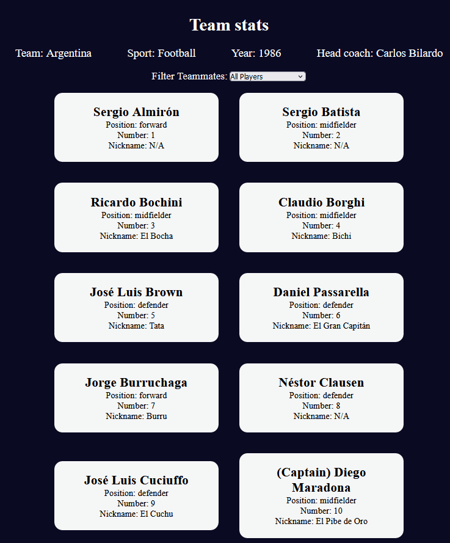

# 🧠 2B - Learn Modern JavaScript Methods by Building Football Team Cards
* Processing datasets and outputting information to the  screen is a common aspect of building web applications.
* In this project, I will learn how to work with DOM manipulation, object destructuring, event handling and data filtering
* I will visit concepts like default parameters, `Object.freeze()`, and reinforce your knowledge of the `switch` statement and `map()` method.
* Here is a preview of what I will build:

## 👨‍🍳 Final Product 👨‍🍳
* You can try out the application [here](//TODO: set this link)
* Here is a demo:

## 📝 Summary Notes 📝
// TODO: fill this section

## 🟥 H2