# 🧠 2C - Learn localStorage by Building a Todo App
* Local storage is a key-value pair system which enabled web applications to persist data in the user's browser. This means data from one session can be saved and retrieved from another session.

* Here is a preview of what I will build:
   <details>

   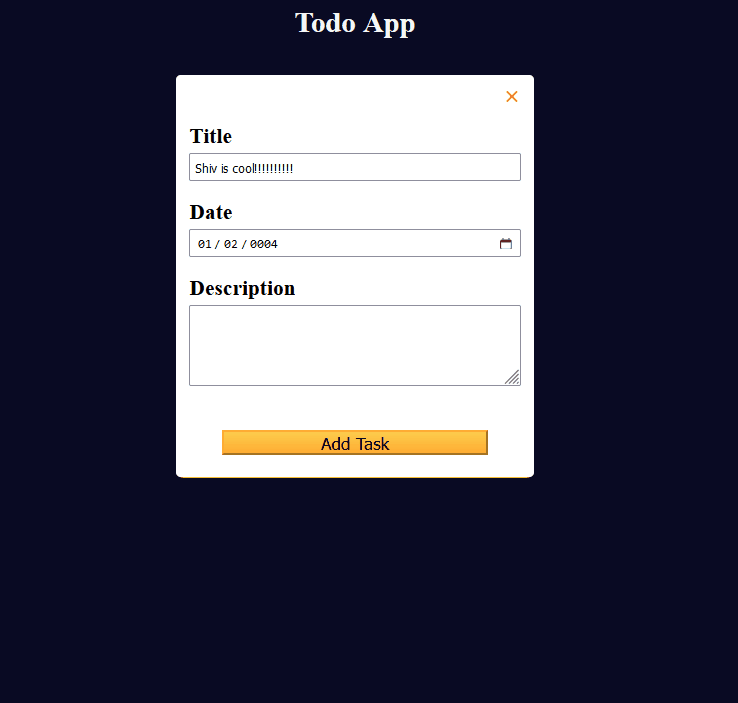
   </details>


## 👨‍🍳 Final Product 👨‍🍳
* You can try out the application I built in this tutorial [here](https://htmlpreview.github.io/?https://github.com/shivkumar98/FreeCodeCamp-Projects/blob/main/05-javascript-a-ds-new/2-advanced-javascript/2c-learn-localstorage-building-todo-app/code/index.html)

## 📝 Summary Notes 📝
* You can show and hide a modal elements (`<dialog>`), using `.showModal()` and `.close()`  ✅
* The `Arrays.splice()` method lets you remove/replace elements at a specific index while returning the elements which have been removed/replaced. It can also be used for addition of elements (nothing is returned from splice in this case). ✂️

   <details>
      <summary>Examples of Using splice()</summary>

   ```js
   // DELETION
   const arr = ["hello", "world", "my", "name", "is", "shiv"]
   arr.splice(1, 2); // removes 2 element from index 1: ["world", "my"]
   console.log(arr); // ['hello', 'name', 'is', 'shiv']

   // REPLACEMENT
   const arr = ["hello", "world", "my", "name", "is", "shiv"]
   arr.splice(1, 2, "internet", "the"); // replaces 2 elements at index 1
   console.log(arr); // ['hello', 'internet', 'the', 'name', 'is', 'shiv']

   // ADDITION
   const arr = ["hello", "world", "my", "name", "is", "shiv"]
   arr.splice(2,0, "!"); // at index 2, do not remove/replace, add "!"
   console.log(arr); // ['hello', 'world','!','my','name',  'is','shiv']
   ```
   </details>

* You can directly assign an function when a button is clicked by adding the `onclick` attribute, and you can pass in the context of the button to the function call using `this` keyword which is taken as the parameter to the function 🖱️
* The `.findIndex()` array method takes in a callback function (predicate), returns `-1` if item is not present in array 🔎

## 🛠️ Project Setup 🛠️
* The HTML and CSS for this project was given to me
* The files can be located:
  * [index.html](code/index.html)
  * [styles.css](code/styles.css)

## 🟥 Assigning Variables for Page Elements 
* I create variables for the elements in the HTML:
   <details>

   ```js
   const taskForm = document.getElementById("task-form")
   const confirmCloseDialog = document.getElementById("confirm-close-dialog")
   const openTaskFormBtn = document.getElementById("open-task-form-btn")

   const closeTaskFormBtn = document.getElementById("close-task-form-btn")
   const addOrUpdateTaskBtn = document.getElementById("add-or-update-task-btn")
   const cancelBtn = document.getElementById("cancel-btn")

   const discardBtn = document.getElementById("discard-btn")
   const tasksContainer = document.getElementById("tasks-container")
   const titleInput = document.getElementById("title-input")

   const dateInput = document.getElementById("date-input")
   const descriptionInput = document.getElementById("description-input") 
   ```
   </details>

<hr>

* I initialise a `taskData` variable as an empty array. This will store title, due date and description
   ```js
   const taskData = []
   let currentTask = {}
   ```

## 🟥 Showing and Closing Modal
* I want the Add New Task modal to open when the button is clicked. I access the classList of the modal and toggle "hidden":
   ```js
   openTaskFormBtn.addEventListener("click", () => {
      taskForm.classList.toggle("hidden")
   })
   ```

* I want to show the confirmCloseDialog element which is a `Modal`. I can call the `.showModal()` method on this when the closeTaskFormBtn is called:
   ```js
   closeTaskFormBtn.addEventListener("click", () => {
      confirmCloseDialog.showModal()
   })
   ```

* Here is a demo of the buttons working:
   <details>

   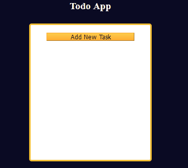
   </details>

* If the user clicks Cancel, then the Modal should be closed, this can be done via the `.close()` method:
   ```js
   cancelBtn.addEventListener("click", () => {
      confirmCloseDialog.close()
   })
   ```
* If the user clicks Discard, then the modal should be closed and the taskForm should be hidden:
   ```js
   discardBtn.addEventListener("click", () => {
      confirmCloseDialog.close();
      taskForm.classList.toggle("hidden");
   })
   ```

* Here is the app not responding to the Cancel and Discard buttons:

   <details>

   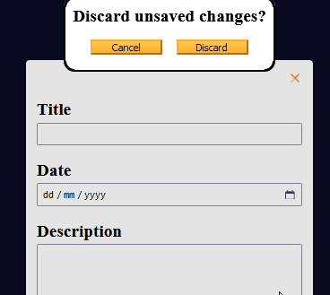
   </details>

<hr>

## 🟥 Creating To-do Task Data
* I begin by adding a listener for the taskForm being submitted:
   ```js
   taskForm.addEventListener("submit", (e) => {
      e.preventDefault()
   })
   ```

* I construct a taskObj using the fields on the form:
   ```js
   taskForm.addEventListener("submit", (e) => {
      e.preventDefault()

      const taskObj = {
         id: null,
         title: titleInput.value,
         date: dateInput.value,
         description: descriptionInput.value
      }
   })
   ```

## 🟥 Constructing id of `taskObj`

* I specify an id key which will hold the title as well as a timestamp❗
* I update the `id` so that it contains the title in lowercase, with spaces replaced with hyphen
   ```js
   const taskObj = {
      id: titleInput.value.toLowerCase().split(" ").join("-")
      // OTHER PROPERTIES HERE
   }
   ```
* I also append on the time stamp at the end, to ensure its uniquness:
   ```js
   id: `${titleInput.value.toLowerCase().split(" ").join("-")}-${Date.now()}`,
   ```
* Here is an example of what the `id` would look like:
   <details>

   ```js
   id: "shiv-is-cool-1730706437338"
   ```
   </details>

## 🟥 Adding `taskObj` to `taskData`

* Now that I have the `id` of a to-do task, I can use it to see if it's already in my `taskData` array:

   <details>

   ```js
   const dataArrIndex = taskData.findIndex((item) =>
      item.id === currentTask.id)
   ```
   </details>

* If dataArrIndex is `-1`, then `taskObj` needs to be added to `taskData`:
   ```js
   const dataArrIndex = taskData.findIndex((item) =>
      item.id === currentTask.id)
   const taskObj {/*PROPERTIES HERE*/}

   if (dataArrIndex === -1) {
      taskData.unshift(taskObj)
   }
   ```

## 🟥 Displaying the To-do Tasks
* I need the `Add Task` button to work before I can display the to-do tasks
* I add an event listener:
  
   ```js
   addOrUpdateTaskBtn.addEventListener("click", () => {
      confirmCloseDialog.close();
      taskForm.classList.toggle("hidden");
   })
   ```
* Now witin the event listener for taskForm, I do a forEach loop on taskData:
   ```js
   taskData.forEach(({id, title, date, description}) => {
      tasksContainer.innerHTML += `
         <div class="task" id="${id}">
            <p><strong>Title:</strong>${title}</p>
            <p><strong>Date:</strong> ${date}</p>
            <p><strong>Description:</strong> ${description}</p>
         </div>
      `
   })
   ```
   <details>
      <summary>GIF</summary>

   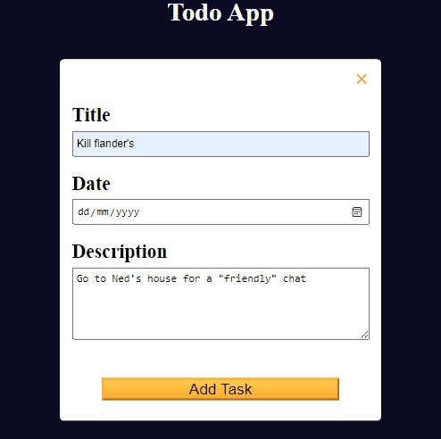
   </details>

* I want the tasks to have an `Edit` and `Delete` button:
   ```js
   tasksContainer.innerHTML += `
      <div class="task" id="${id}">
         <p><strong>Title:</strong>${title}</p>
         <p><strong>Date:</strong> ${date}</p>
         <p><strong>Description:</strong> ${description}</p>
         <button type="button" class="btn">Edit</button>
         <button type="button" class="btn">Delete</button>
      </div>
   `
   ```


## 🟥 Clearing Form to Add New Task
* There is an issue in which when you attempt to add a new task, the fields contain the text from the last subbmitted task:

   <details>
      <summary>Issue GIF</summary>
   
   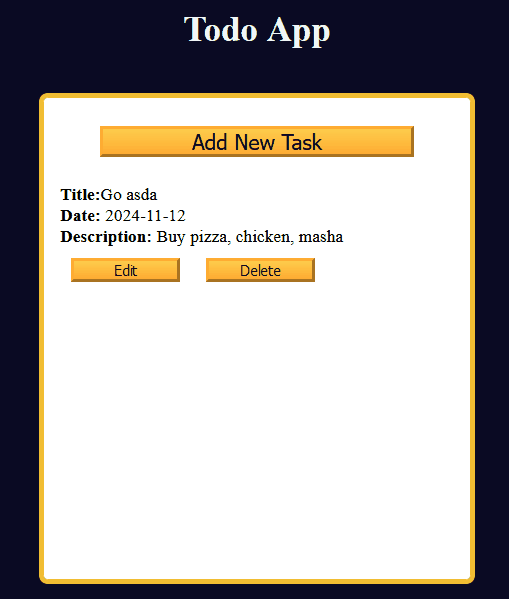
   </details>

* I create a reset function to clear this text:
   ```js
   const reset = () => {
      titleInput.value = "";
      dateInput.value = "";
      descriptionInput.value = "";
      taskForm.classList.toggle("hidden");
      currentTask = {};
   }
   ```
* I add this `reset()` call to the end of the form submission event listener:
   ```js
   taskForm.addEventListener("submit", (e) => {
      // PRE-EXISTING CODE
      
      taskData.forEach(({id, title, date, description}) => {
         tasksContainer.innerHTML += `
            <div class="task" id="${id}">
                  <p><strong>Title:</strong>${title}</p>
                  <p><strong>Date:</strong> ${date}</p>
                  <p><strong>Description:</strong> ${description}</p>
                  <button type="button" class="btn">Edit</button>
                  <button type="button" class="btn">Delete</button>
            </div>
         `
      })

      reset()
   })
   ```

* I delete the event listener for the `Add Task` button, which now conflicts with the form submission:
   ```js
   // DELETED:
   addOrUpdateTaskBtn.addEventListener("click", () => {
      confirmCloseDialog.close();
      taskForm.classList.toggle("hidden");
   })
   ```

* I can now add tasks, and the form is always cleared when creating a task:
   <details>
      <summary>GIF</summary>

   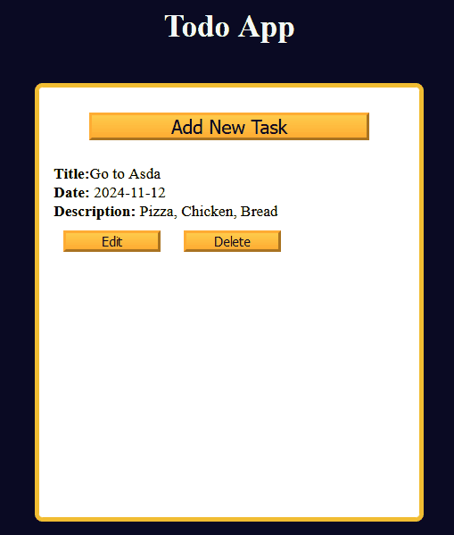
   </details>

* I update the event listener for the discard button to not toggle the modal, and instead use my reset function:
   ```js
   discardBtn.addEventListener("click", () => {
      confirmCloseDialog.close();
      //taskForm.classList.toggle("hidden");
      reset()
   });
   ```

## 🟥 Ask Confirmation to Discard If Inputs are Clear

* Currently, the app will always ask `Discard unsaved changes?` regardless of whether there is nothing on the form
* I update the event listener for the close task button:
   ```js
   closeTaskFormBtn.addEventListener("click", () => {
      const formInputsContainValues = titleInput.value || dateInput.value || descriptionInput.value;
      if (formInputsContainValues) {
         confirmCloseDialog.showModal();
      } else {
         reset()
      }
   });
   ```

   <details>
      <summary>GIF</summary>

   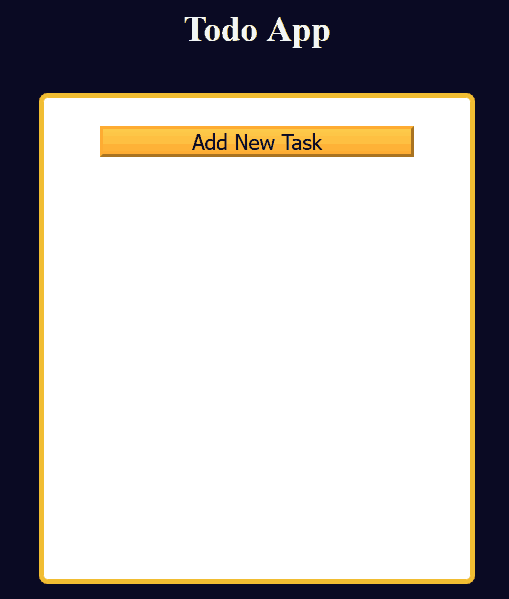   
   </details>

## 🟥 Refactoring

* The code for the submit event listener is pretty chunky:

   <details>
      <summary>Code</summary>

   ```js
   taskForm.addEventListener("submit", (e) => {
      e.preventDefault()
   
      const dataArrIndex = taskData.findIndex((item) =>
         item.id === currentTask.id)

      const taskObj = {
         id: `${titleInput.value.toLowerCase().split(" ").join("-")}-${Date.now()}`,
         title: titleInput.value,
         date: dateInput.value,
         description: descriptionInput.value
      }

      if (dataArrIndex === -1) {
         taskData.unshift(taskObj)
      }
      
      taskData.forEach(({id, title, date, description}) => {
         tasksContainer.innerHTML += `
            <div class="task" id="${id}">
               <p><strong>Title:</strong>${title}</p>
               <p><strong>Date:</strong> ${date}</p>
               <p><strong>Description:</strong> ${description}</p>
               <button type="button" class="btn">Edit</button>
               <button type="button" class="btn">Delete</button>
            </div>
         `
      })
      
      reset()
   })
   ```
   </details>

* We can enhance the readability and maintainability by refactoring the submit event listener to two seperate functions. The first function will be to add input values to `taskData`, and the second one is for adding the tasks into DOM.
* I move the logic for adding/updating task into this new function:
   ```js
   const addOrUpdateTask = () => {
      const dataArrIndex = taskData.findIndex((item) =>
         item.id === currentTask.id)

      const taskObj = {
         id: `${titleInput.value.toLowerCase().split(" ").join("-")}-${Date.now()}`,
         title: titleInput.value,
         date: dateInput.value,
         description: descriptionInput.value
      }

      if (dataArrIndex === -1) {
         taskData.unshift(taskObj)
      }
   }
   ```

* I move the logic for rendering the Todo list into this new function:
   ```js
   const updateTaskContainer = () => {
      taskData.forEach(({id, title, date, description}) => {
         tasksContainer.innerHTML += `
               <div class="task" id="${id}">
                  <p><strong>Title:</strong>${title}</p>
                  <p><strong>Date:</strong> ${date}</p>
                  <p><strong>Description:</strong> ${description}</p>
                  <button type="button" class="btn">Edit</button>
                  <button type="button" class="btn">Delete</button>
               </div>
         `
      })
   }
   ```

* I then call `updateTaskContainer()` from the bottom of my `addOrUpdateTask()` function, I also call the `reset()` which I delete from the submit event listener:
   ```js
   const addOrUpdateTask = () => {
      // PRE-EXISTING CODE

      if (dataArrIndex === -1) {
         taskData.unshift(taskObj)
      }

      updateTaskContainer()
      reset();
   }
   ```

* I finally call the above method in my submit event listener:
   ```js
   taskForm.addEventListener("submit", (e) => {
      e.preventDefault()

      addOrUpdateTask()
   })
   ```


## 🕷️ Fixing Bug - Duplicated Tasks
* Currently there is a bug in which existing tasks get duplicated when you add a new task:
   <details>
      <summary>Bug GIF</summary>

   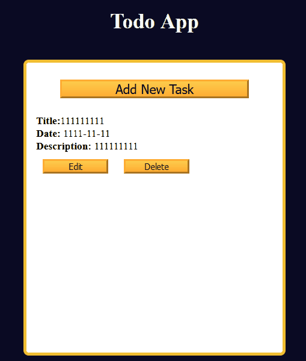   
   </details>

* This bug is due to `tasksContainer` innerHTML containing the HTML for existings before the forEach then adds HTML for all the tasks. This is fixed by clearing the HTML before creating the HTML for all tasks:
   ```js
   const updateTaskContainer = () => {
      tasksContainer.innerHTML = "";

      taskData.forEach(
         /* CODE HERE */
      )
   }
   ```
* The bug is now fixed:
   <details>
      <summary>Fixed GIF</summary>

   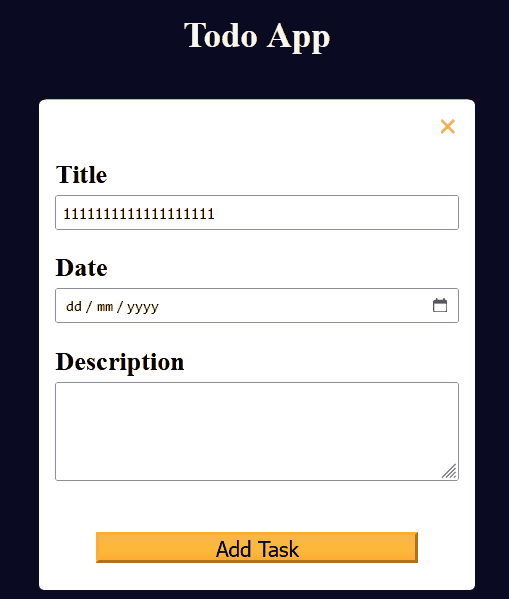   
   </details>

## 🟥 Using onlclick
* I want to trigger a function when the Edit/Delete buttons are clicked
* We can add a `onclick` attribute to the buttons💡
* I call some dummy functions on my edit and delete buttons, I pass the dummy functions a parameter of `this` - this refers to the context of the button being clicked.
* I add the onclick to the buttons being rendere in the `updateTaskContainer` function:
   ```js
   <div class="task" id="${id}">
      <p><strong>Title:</strong>${title}</p>
      <p><strong>Date:</strong> ${date}</p>
      <p><strong>Description:</strong> ${description}</p>
      <button type="button" class="btn" onclick="editTask(this)">Edit</button>
      <button type="button" class="btn" onclick="deleteTask(this)">Delete</button>
   </div>
   ```

## 🟥 Deleting a Task

* I define my `deleteTask` function with a parameter of `buttonEl` as:
   ```js
   const deleteTask = (buttonEl) => {
   const dataArrIndex = taskData.findIndex((item) => item.id === buttonEl.parentElement.id)
   }
   ```
* I now need to delete the task from taskData using `dataArrIndex`
* The `Arrays.splice()` method removes, replaces or adds elements at the given index - while also returning the removed elements. 
* This method takes 3 arguments: start index, number of elements to remove, optional replacement element
   <details>
   <summary>How to use splice()</summary>

   ```js
   const fruits = ["mango", "strawberry", "cherry", "banana"]
   fruits.splice(0,1); // ["mango"] 
   console.log(fruits) // ["strawberry", "cherry", "banana"]
   ```
   </details>


* I use the splice method to remove the todo task
   ```js
   const deleteTask = (buttonEl) => {
      const dataArrIndex = taskData.findIndex(
         (item) => item.id === buttonEl.parentElement.id
      );
      taskData.splice(dataArrIndex, 1)
   }
   ```
* I also call the remove() method on the parentElement of `buttonEl`:
   ```js
   const deleteTask = (buttonEl) => {
      const dataArrIndex = taskData.findIndex(
         (item) => item.id === buttonEl.parentElement.id
      );
      buttonEl.parentElement.remove()
      taskData.splice(dataArrIndex, 1)
   }
   ```

* The delete button now works!
   <details>
      <summary>GIF</summary>

   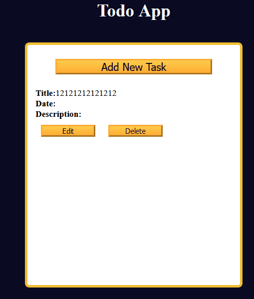   
   </details>

## 🟥 Editing a Task
* Again, I find the index of the element in the taskData array:
   ```js
   const editTask = (buttonEl) => {
   const dataArrIndex = taskData.findIndex((item) => 
      item.id === buttonEl.parentElement.id);

      currentTask = taskData[dataArrIndex];
   }
   ```
* I display the form modal, change the text of `Add Task` to `Update Task`, and set the values of the input fields:
```js
titleInput.value = currentTask.title;
dateInput.value = currentTask.date;
descriptionInput.value = currentTask.description;

addOrUpdateTaskBtn.innerText = "Update Task";

taskForm.classList.toggle("hidden");  
```

* Currently the `addOrUpdateTask` function can only delete a task. We need to add an else clause to the following if clause
   ```js
   if (dataArrIndex === -1) {
      taskData.unshift(taskObj);
   }
   ```
* So I add an else clause to update the `taskData` array to the constructed `taskObj`:
   ```js
   if (dataArrIndex === -1) {
      taskData.unshift(taskObj);
   } else {
      taskData[dataArrIndex] = taskObj
   }
   ```
* The editing now works🎉
   <details>
      <summary>GIF</summary>

   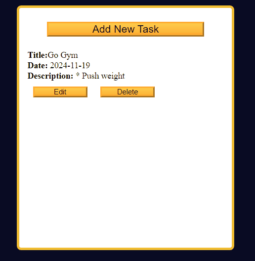   
   </details>


## 🟥 Showing Cancel/Discard Modal Only Conditionally upon Change
* If a user clicks on edit task, and then the red cross, they will be asked to cancel or discard changes, regardless of whether they made changes😔
   <details>
   <summary>Issue</summary>

   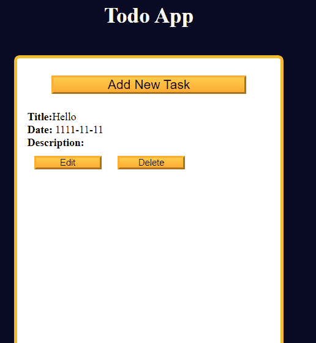   
   </details>
* We want the cancel/discard modal to only show if there are changes✅
* In the event listener for the closeTaskFormBtn, I create a variable to check if there are any changes:
   ```js
   closeTaskFormBtn.addEventListener("click", () => {
      const formInputsContainValues = titleInput.value || dateInput.value || descriptionInput.value;
      const formInputValuesUpdated = titleInput.value != currentTask.title || dateInput.value != currentTask.date || descriptionInput.value != currentTask.description
      /* REST OF CODE*/
   });
   ```
* I update the if block to show the confirm close modal from:
   ```js
   if (formInputsContainValues) {
      confirmCloseDialog.showModal();
   } else {
      reset();
   }
   ```
* to:
   ```js
   if (formInputsContainValues && formInputValuesUpdated) {
      confirmCloseDialog.showModal();
   } else {
      reset();
   }
   ```
* The issue is now fixed🎉
   <details>
   <summary>Issue Fixed GIF</summary>

   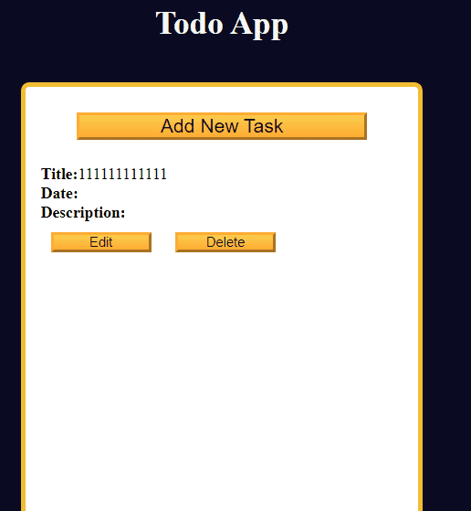   
   </details>

## 🟥 LocalStorage
* The `LocalStorage` class offers methods for saving, retrieving and deleting items in local storage - of any JavaScript data type.
* The `setItem()`/`getItem()` methods are used to save/retrieve items 💾
* You can delete items using `removeItem()`, or delete all items using `clear()`


* To understand localStorage better, I write the following code in my javaScript, and look at the data from within my browsers console:
   <details>
   <summary>Understanding Local Storage and Viewing in Browser</summary>

   ```js
   const myTaskArr = = [
      { task: "Walk the Dog", date: "22-04-2022" },
      { task: "Read some books", date: "02-11-2023" },
      { task: "Watch football", date: "10-08-2021" },
   ];
   localStorage.setItem("data", myTaskArr);
   ```
      
   * I then open my devtools, and click on the `Application` tab:
            
      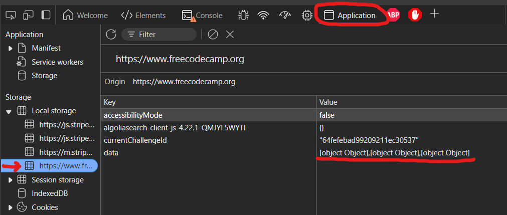

   * Clicking on the Freecamp link in the Local storage dropdown, shows all the data stored locally. My data gets printed as a list of `[object Object]`
   * I fix this by using `JSON.stringify`:
   ```js
   localStorage.setItem("data", JSON.stringify(myTaskArr));
   ```
   * This now prints the storage as:
   ```json
   [
      {
         "task": "Walk the Dog",
         "date": "22-04-2022"
      },
      {
         "task": "Read some books",
         "date": "02-11-2023"
      },
      {
         "task": "Watch football",
         "date": "10-08-2021"
      }
   ]
   ```
   * I then obtain the this data, and print it in my console:
   ```js
   const getTaskArr = localStorage.getItem("data")
   console.log(getTaskArr); // this returns a JSON string
   ```
   * I can obtain the original data type by parsing it:
   ```js
   const getTaskArrObj = JSON.parse(localStorage.getItem("data"))
   /*[ { task: 'Walk the Dog', date: '22-04-2022' },
  { task: 'Read some books', date: '02-11-2023' },
  { task: 'Watch football', date: '10-08-2021' } ] */
   ```
   * I delete the `data` item from my local storage:
   ```js
   localStorage.removeItem("data")
   localStorage.getItem("data")  // null
   ```
   * Alternatively, I can clear all data:
   ```js
   localStorage.clear();
   ```

   </details>

* I update my `addOrUpdateTask()` function to save the tasks:
```js
const addOrUpdateTask = () => {
   // EXISTING CODE HERE

   localStorage.setItem("data", JSON.stringify(taskData))

   updateTaskContainer()
   reset()
}
```
* I then update my `deleteTask` function, to save the taskData to local storage again, after the item has been removed:
   ```js
   const deleteTask = (buttonEl) => {
      const dataArrIndex = taskData.findIndex(
         (item) => item.id === buttonEl.parentElement.id
      );
      buttonEl.parentElement.remove()
      taskData.splice(dataArrIndex, 1)
      localStorage.setItem("data", JSON.stringify(taskData))
   }
   ```
* In order for my tasks to be loaded from local storage on page load, I update the initialisation of `taskData` from an empty array to:
   ```js
   const taskData = JSON.parse(localStorage.getItem("data")) || []
   ```

* When a task is saved, the todo tasks from local storage, but they won't load on first page load, this is because the `updateTaskContainer()` funciton is only called after editing/creating a task.
* I fix this with the following line:
   ```js
   if (taskData.length) {
      updateTaskContainer()
   }
   ```

## 🕷️ Fixing Bug 2 - Add Task Button Text Incorrect
* If you create a task and save it, edit any task and save it, and create a new task, the `Add Task` button on the form modal say `Update Task` when it should be `Add Task`:
   <details>
   <summary>Issue 2 GIF</summary>

   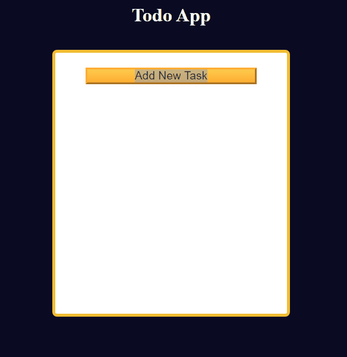   
   </details>
* This is because the button has a value of "Add Task" on page load, and editing updates it to "Update Task", and its never reverted back
* I fix this by setting the innerText of the button in the reset() function:
   ```js
   const reset = () => {
      addOrUpdateTaskBtn.innerText = "Add Task"

      // REST OF FUNCTION
   }
   ```

## 🕷️ Fixing Bug 3 - Creating Tasks Without Title
* My check for task title only checks if its not blank or null, meaning you can create tasks with blank titles
* I rectify this by trimming the title before checking if its blank or null:
```js
const addOrUpdateTask = () => {
   if (!titleInput.value.trim()) {
      alert("Please provide a title")
      return
   }
   // REST OF FUNCTION  
}
```

## 🕷️ Fixing Bug 4 - Special Character Break Application
* If you add a quote inside the title or description, the application breaks:
   <details>
   <summary>Issue 4 GIF</summary>

   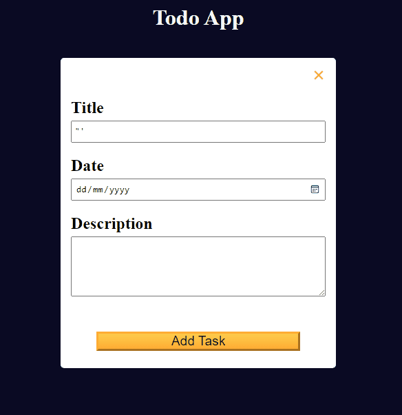   
   </details>
* I rectify this by creating a function to remove special characters quotes and underscores:
```js
const removeSpecialChars = (string) => {
   return string.replaceAll(/["'_]/g, "")
}
```
* I then call this function in my `addOrUpdateTask()` function for title, date, and id on the constructed `taskObj`:
```js
const taskObj = {
   id: `${removeSpecialChars(titleInput.value).toLowerCase().split(" ").join("-")}-${Date.now()}`,
   title: removeSpecialChars(titleInput.value),
   date: dateInput.value,
   description: removeSpecialChars(descriptionInput.value),
};
```

I have now completed this tutorial!🥳