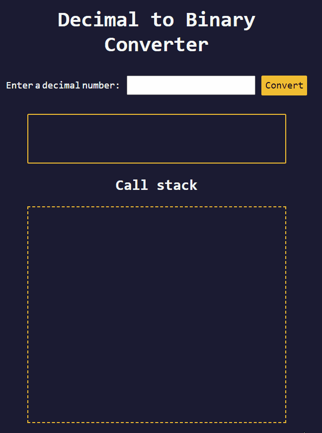
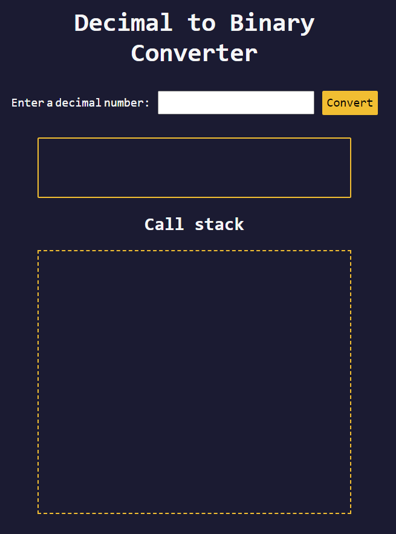
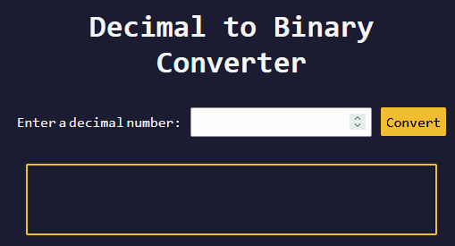
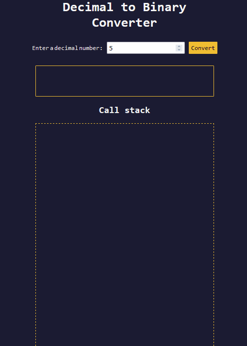
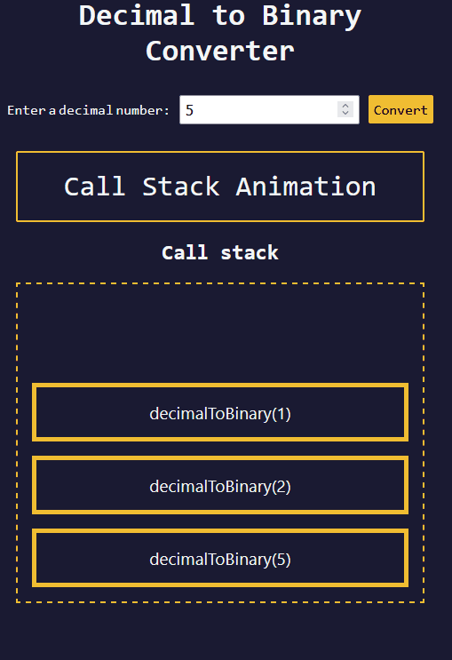
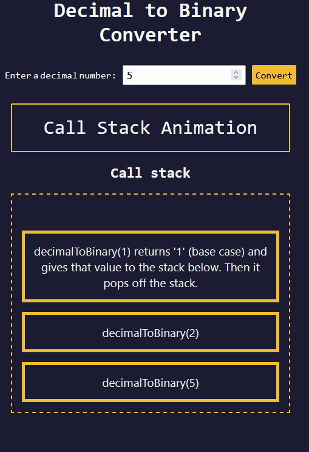

# 🧠 2D - Learn Recursion by Building a Decimal to Binary Converter
* In this project, I will learn about recursion by building an app. I will also learn about the Stack data stucture, and build a visual representation of recursion using an animation

* Here is a preview of what I will build:
   <details>

   
   </details>


## 👨‍🍳 Final Product 👨‍🍳
* You can try out the application I built in this tutorial [here](https://htmlpreview.github.io/?https://github.com/shivkumar98/FreeCodeCamp-Projects/blob/main/05-javascript-a-ds-new/2-advanced-javascript/2d-learn-recursion-by-building-binary-converter/code/index.html)


## 📝 Summary Notes 📝
* We can intercept the key pressed by a user by listening to the `keydown` event, and you can determine the key pressed, by checking `e.key` (e being the event)
* The `parseInt(String)` function returns a decimal representation of the argument string. It will return `NaN` if it is not a valid string representation of a number
* The stack is a LIFO data structure, and can be used to understand how recursive code behaves. In recursion, elements are stacked and are executed in the reverse order in which they are added to the stack (LIFO)
* The `setTimeout(Function, Timeout)` function let's you execute a function (first parameter), after a given delay (second parameter)
* The String class lets you convert a number to a string. E.g. `String(5) = "5"`
## 🛠️ Project Setup 🛠️

* I have been provided the [HTML](code/index.html) and [CSS](code/styles.css)
* This is what the page looks like:
   <details>

   
   </details>

## 🟥 1. Making the form Functional
* I set up the following constants:
   ```js
   const numberInput = document.getElementById("number-input")
   const convertBtn = document.getElementById("convert-btn")
   const result = document.getElementById("result")
   ```
* I create a function which will execute when user clicks the Convert button, for now I will print what is in the input field:

   ```js
   const checkUserInput = () => {
      console.log(numberInput.value)
   }

   convertBtn.addEventListener("click", checkUserInput);
   ```
* I also want to trigger the `checkUserInput()` whenever the user presses enter
* I use the ⌨️`keydown`⌨️ event which lets me check what key the user has pressed:
   ```js
   numberInput.addEventListener("keydown", (e)=>{})
   ```
* I can determine key the user has pressed❗If I print the `e` parameter in the console, I would see: `{ isTrusted: [Getter] }`. I can obtain the key using the `e.key` property
* I check that the key is "enter":
   ```js
   numberInput.addEventListener("keydown", (e)=>{
      if (e.key === "Enter") {
         checkUserInput()
      }
   })
   ```
* I update the implementation of checkUserInput(), to check that the input is not blank:
   ```js
   const checkUserInput = () => {
      if (!numberInput.value) {
         
      }
   }
   ```
### ⭐ `1.1` parseInt() Function ⭐

* There `parseInt()` function converts a string to a number:
   ```js
   parseInt('123') // 123
   parseInt('aaa') // NaN
   ```
* I update the if check to see if the parsed input is NaN:
   ```js
   if (!numberInput.value || isNaN(parseInt(numberInput.value))) {
         
   }
   ```

* I add a third condition to check if number is less than zero, and then alert the user:
   ```js
   if (!numberInput.value || isNaN(parseInt(numberInput.value)) || parseInt(numberInput.value)<0) {
      alert("Please provide a decimal number greater than or equal to 0");
      return;
   }
   ```

## 🟥 2. Iteration 1: Without Recursion

### ⭐ `2.1` Using No Recursion ⭐
* I create a function for the conversion to binary:
   ```js
   const decimalToBinary = (input) => {}
   ```

* I call the above in my checkUserInput function, and clear the input of the number input:
   ```js
   const checkUserInput = () => {
      /* if (!numberInput.value ...
         REST OF CODE
      */

      decimalToBinary(parseInt(numberInput.value))
      numberInput.value = ''
   }
   ```

* I define some arrays in my decimalToBinary() function:
   ```js
   const decimalToBinary() = () => {
      const inputs = []
      const quotients = []
      const remainders = []
      return "01110110";
   }
   ```

* I need to keep dividing the input by 2 to work out the binary representation:
   ```js
   while (input < 0) {
      const quotient = Math.floor(input / 2)
      input = quotient
   }
   ```
* I create a `remainder` variable to store the remainder of the halfing (can be either 0 or 1):
   ```js
   while (input < 0) {
      const quotient = Math.floor(input / 2)
      const remainder = input % 2
      input = quotient
   }
   ```
* I push the above variables, and the input (before reassignment) to the arrays:
   ```js
   while (input < 0) {
      const quotient = Math.floor(input / 2)
      const remainder = input % 2

      inputs.push(input)
      quotients.push(quotient)
      remainders.push(remainder)

      input = quotient
   }
   ```

* After the while-loop, I log the following:
   ```js
   console.log("Inputs: ", inputs);
   console.log("Quotients: ", quotients)
   console.log("Remainders: ", remainders)
   ```
* If I enter 6 and convert, I see the following in the console:
   ```c
   Inputs:  [ 6, 3, 1 ]
   Quotients:  [ 3, 1, 0 ]
   Remainders:  [ 0, 1, 1 ]
   ```
* The remainders reversed, is the binary representation of 6: `110`
* I set the inner text of the result div to the remainders reverse:
   ```js
      result.innerText = remainders.reverse().join("")
   ```

* Here is the app working:

   <details>
   <summary>GIF</summary>

   
   </details>

### ⭐ `2.2` Fixing Bug 1: No Result for 0 ⭐
* Trying to convert 0 to binary does not work currently, since the while loop checks if input is greater than zero, nothing is added to the arrays
* So nothing is printed to the results div!
* I fix this, by manually setting the result to `"0"`:
   ```js
   const decimalToBinary = (input) => {
      const inputs = [];
      const quotients = [];
      const remainders = [];

      if (input === 0) {
         result.innerText = "0";
         return;
      }
   }
   ```

* This is the first iteration of the `decimalToBinary()` function:
  <details>
  <summary>Without recursion decimalToBinary()</summary>

   ```js
   const decimalToBinary = (input) => {
      const inputs = []
      const quotients = []
      const remainders = []
      if (input === 0) {
         result.innerText = "0";
         return;
      }
      while (input > 0) {
         const quotient = Math.floor(input / 2)
         const remainder = input % 2
         inputs.push(input)
         quotients.push(quotient)
         remainders.push(remainder)
         input = quotient
      }
      console.log("Inputs: ", inputs);
      console.log("Quotients: ", quotients);
      console.log("Remainders: ", remainders);
      result.innerText = remainders.reverse().join("")
   }
   ```
   </details>

### ⭐ `2.3` Improving `decimalToBinary()` Function ⭐s
* We can make the function more efficient by not tracking the inputs and quotient
* I redefine my `decimalToBinary()` function as:
   ```js
   const decimalToBinary = (input) => {
      let binary = ""
      while (input > 0) {
         binary = (input % 2) + binary;
         input = Math.floor(input / 2);
      }
      result.innerText = binary
   }
   ```

* I again check if the input is 0 so that it sets the result to `"0"`:
   ```js
   const decimalToBinary = (input) => {
      let binary = ""
      if (input === 0) {
         binary = "0"
      }

      while (input > 0) {
         binary = (input % 2) + binary;
         input = Math.floor(input / 2);
      }
      result.innerText = binary
   }
   ```

## 🟥 3. Understanding Recursion

###  ⭐ `3.1` Recursion ⭐
* I will be learning about the Call Stack data structure, and convert my `decimalToBinary()` function to use recursion.
* I create a function called `a()`, which calls a function `b()`, which calls a function `c()`:
   ```js
   const a = () => {
      return "freeCodeCamp " + b()
   }
   const b = () => {
      return "is " + c();
   }
   const c = () => {
      return "awesome!"
   }
   ```
* If I log this:
   ```js
   console.log(a()) // freeCodeCamp is awesome!
   ```

### ⭐ `3.2` Call Stack ⭐
* A stack 📚 is a LIFO data structure. Elements can be pushed to top of stack, and popped off the top of stack
* The ***call stack*** is a collection of function calls stored in a stack structure. When you call a function, it is added to top of stack, and when it returns it removes it from top of stack.
* I will see this by creating a mock call stack.
* I create a `callStack` array:
   ```js
   const callStack = [
      'a(): returns "freeCodeCamp " + b()'
   ]
   ```
* Since a() calls b(), I add the string `"b(): returns 'is ' + c()"` to the top of stack:
   ```js
   const callStack = [
      'a(): returns "freeCodeCamp " + b()',
      "b(): returns 'is ' + c()"
   ]
   ```
* Since b() calls c(), I add the string `"c(): returns 'awesome!'"`:
   ```js
   const callStack = [
      'a(): returns "freeCodeCamp " + b()',
      'b(): returns "is " + c()',
      "c(): returns 'awesome!'"
   ];
   ```
* If we imagine what this this is a stack, the top of the stack returns `"awesome!"`, it is popped off:
   ```js
   const callStack = [
      'a(): returns "freeCodeCamp " + b()',
      'b(): returns "is " + c()'
   ];
   ```
* Now the top of the stack gets evaluated as `"is " + "awesome!"`:
   ```js
   const callStack = [
      'a(): returns "freeCodeCamp " + b()',
      "b(): returns 'is ' + 'awesome!'"
   ]
   ```
* Now `b()` gets executed, and its popped off the stack:
   ```js
   const callStack = [
      "a(): returns 'freeCodeCamp ' + 'is awesome!'"
   ]
   ```
* Finally, the last element is popped off, so a() returns: `freeCodeCamp is awesome!`

### ⭐ `3.3` Countdown Using Recursion ⭐
* I will create a function that will count down to zero from a given number:
   ```js
   const countdown = (number) => {
      console.log(number)
   };
   ```
* I add the base case when the number is 0:
   ```js
   const countdown = (number) => {
      console.log(number)
      if (number === 0) {
         return
      } else {}
   };
   ```
* To write the recursive case, I need to get closer to base case of 0, so I reduce the number by 1 and call the function again
   ```js
   const countdown = (number) => {
      console.log(number)
      if (number === 0) {
         return
      } else {
         countdown(number-1);
      }
   };
   ```
* If I call `countdown(3)`, I see the following logged:
   ```c
   3
   2
   1
   0
   ```

### ⭐ `3.4` Understand Call Stack With Recursion ⭐

* To understand how a call stack works, I modify my countdown function to:
   ```js
   const countDownAndUp = (number) => {
      console.log(number);
      if (number === 0) {
         console.log("Reached base case");
         return;
      } else {
         countDownAndUp(number - 1);
         console.log(number);
      }
   };
   ```
* If I call `countDownAndUp(3)`, I see the following logged:
   ```m
   3
   2
   1
   0
   Reached base case
   1
   2
   3
   ```
* On first iteration: `countDownAndUp(3)`, number = 3, so its logged, then `countDownAndUp(2)` is called, and the logging of number is paused
* On second iteration: `countDownAndUp(2)`, number = 2, so its logged, then `countDownAndUp(1)` is called, and the logging of number is paused
* On third iteration: `countDownAndUp(1)`, number = 1, so its logged, then `countDownAndUp(0)` is called, and the logging of number is paused
* On fourth iteration: `Reached base case is logged`
* `CountDownAndUp(1)` was the last recursive call, so it completes the else block to print `1`
* `CountDownAndUp(2)` then resumes and completes the else block to print `2`
* `countDownAndUp(3)` then resumes and completes the else block to print `3`

## 🟥 4. Iteration 2: With Recursion

### ⭐ `4.1` Using Recursion ⭐
* Here is the current implementation of `decimalToBinary()`:
  <details>
  <summary>Without recursion decimalToBinary()</summary>

   ```js
   const decimalToBinary = (input) => {
      let binary = ""
      if (input === 0) {
         binary = "0"
      }
      while (input > 0) {
         binary = (input % 2) + binary;
         input = Math.floor(input / 2);
      }
      result.innerText = binary
   }
   ```
   </details>

* I clear out the `decimalToBinary()` function and write the base case of the recursive call:
   ```js
   const decimalToBinary = (input) => {
      if (input === 0) {
         return "";
      }
   };
   ```
* I need to halve my input, and append it to the remainder of `input ÷ 2`, so I add the following recursion case:
   ```js
   const decimalToBinary = (input) => {
      if (input === 0) {
         return "";
      } else {
         return decimalToBinary(Math.floor(input / 2)) + (input % 2);
      }
   }
   ```
* I still need to set the text of the `result` div, I do this in the `checkUserInput()` function:
   ```js
   const checkUserInput = () => {
      // EXISTING CODE

      result.textContent = decimalToBinary(parseInt(numberInput.value))
      numberInput.value = ''
   }
   ```

### ⭐ `4.2` Fixing Bug 1: No Result for 0 ⭐
* The app works! But no result shows if input is 0!
* I fix this by fixing my base case and setting the result to "0":
   ```js
   if (input === 0) {
      return "0";
   }
   ```
### ⭐ `4.3` Fixing Bug 2: Formatting for 1 ⭐
* If I enter 1 into the input, the result is `01`!
* I add an else clause for this:
   ```js
   if (input === 0) {
      return "0";
   } else if (input === 1) {
      return "1";
   }
   ```

* I can simplify these two conditions by returning the String representation of 0 and 1, I can achieve this using the `String` class!
   ```js
   if (input === 0 || input === 1) {
      return String(input);
   } else {
      return decimalToBinary(Math.floor(input / 2)) + (input % 2);
   }
   ```

## 🟥 5. Making Stack Animation For 5
* I want to show an animation of how `5` is converted to it's binary input using an animation
* I create a new function to show the animation:
   ```js
   const showAnimation = () => {}
   ```
* And then I call this function and return early, in checkUserInput, when input is 5:
   ```js
   const checkUserInput = () => {
      // CHECK USER INPUT LOGIC

   if (parseInt(numberInput.value) === 5) {
      showAnimation();
      return; 
   }
   // REST OF CODE
   };
   ```

### ⭐ `5.1` Refactoring checkUserInput() ⭐
* My `checkUserInput` function has loads of duplication with parsing the user input:
   <details>
   <summary>checkUserInput()</summary>

   ```js
   const checkUserInput = () => {
      if (!numberInput.value || isNaN(parseInt(numberInput.value)) || parseInt(numberInput.value)<0) {
         alert("Please provide a decimal number greater than or equal to 0");
         return;
      }

      if (parseInt(numberInput.value) === 5) {
         showAnimation();
         return; 
      }

      result.textContent = decimalToBinary(parseInt(numberInput.value))
      numberInput.value = ''
   }
   ```
   </details>
* I replace the duplication with a locally declared variable `inputInt` in the function:
   ```js
   const checkUserInput = () => {
      const inputInt = parseInt(numberInput.value);
      if (!numberInput.value || isNaN(inputInt) || inputInt<0) {
         alert("Please provide a decimal number greater than or equal to 0");
         return;
      }

      if (inputInt === 5) {
         showAnimation();
         return; 
      }

      result.textContent = decimalToBinary(inputInt)
      numberInput.value = ''
   }
   ```

### ⭐ `5.2` setTimeout() Function ⭐
* I want to remove/add elements to DOM after a set amount of time has passed, I can achieve this using `setTimeout()` function:
   <details>
   <summary>setTimeout() Examples</summary>

   ```js
   setTimeout(() => {
      console.log("Hello, world!");
   }, 3000); // prints "Hello, world!" after 3 seconds
   ```
   </details

* I use timeOut to log `free` `code` `camp`:
   ```js
   const showAnimation = () => {
      setTimeout(() => {
         console.log("free");
      }, 500);
      setTimeout(() => {
         console.log("Code");
      }, 1000);
      setTimeout(() => {
         console.log("Camp");
      }, 1500);
   };
   ```

### ⭐ `5.3` Animating Stacking of Data ⭐

* I create an array of objects to store data for each frame of the animation:
   ```js
   const animationData = []
   ```
* I create an object for the first frame of my animation, with two keys: `inputVal` and `addElDelay` (the delay of input being processed):
   ```js
   const animationData = [
      {
         inputVal: 5,
         addElDelay: 1000
      }
   ]
   ```
* I treat this array like a stack, so I add the second element to the array which represents the halving of five:
   ```js
   const animationData = [
      {
         inputVal: 5,
         addElDelay: 1000
      },
      {
         inputVal: 2,
         addElDelay: 1500
      }
   ]
   ```
* I add a third element which represents the halving of two:
   ```js
   const animationData = [
      {
         inputVal: 5,
         addElDelay: 1000
      },
      {
         inputVal: 2,
         addElDelay: 1500
      },
      {
         inputVal: 1,
         addElDelay: 2000
      }
   ]
   ```
* I declare a variable for `animation-container`:
   ```js
   const animationContainer = document.getElementById("animation-container")
   ```
* I clear out the logging of `free code camp` in `showAnimation`, and I first set the result div to say `Call Stack Animation`:
   ```js
   const showAnimation = () => {
      result.innerText = "Call Stack Animation"
   };
   ```
* I run a forEach loop for each element of the array:
   ```js
   const showAnimation = () => {
      result.innerText = "Call Stack Animation"
      animationData.forEach(obj => {

      })
   }
   ```
* In my forEach loop, I call the setTimeout function:
   ```js
   animationData.forEach((obj) => {
      setTimeout(() => {
      }, obj.addElDelay);
   });
   ```
* For the function in the timeOut, I add to the `animationContainer`'s HTML with a `<p>` element with an id of the the number of the animationData:
   ```js
   setTimeout(() => {
      animationContainer.innerHTML += `
         <p id="${obj.inputVal}" class="animation-frame"></p>
      `
   }, obj.addElDelay)
   ```
* And then I set the text to the binary representation of the inputVal of obj:
   ```js
   animationContainer.innerHTML += `
      <p id="${obj.inputVal}" class="animation-frame">decimalToBinary(${obj.inputVal})</p>
   `
   ```
* Now when I when I enter `5` and click Convert, I see three stack elements shown in the Call Stack:

   <details>
   <summary>GIF</summary>

   
   </details>

### ⭐ `5.4` Animating Popping of Elements ⭐

* I now need to update and remove the paragraphs which are being appended. 
* I add `msg` , `showMsgDelay`, `removeElDelay` properties to the top element of my stack (decimalToBinary(1))
   ```js
   const animationData = [
      // TOP ELEMENT:
      {
         inputVal: 1,
         addElDelay: 2000,
         msg: "decimalToBinary(1) returns '1' (base case) and gives that value to the stack below. Then it pops off the stack.",
         showMsgDelay: 5000,
         removeElDelay: 10000
      }
   ]
   ```
* I also add the same properties to the middle element (decimalToBinary(2)):
   ```js
   const animationData = [
      // MIDDLE ELEMENT:
      {
         inputVal: 2,
         addElDelay: 1500,
         msg: "decimalToBinary(2) returns '1' + 0 (2 % 2) and gives that value to the stack below. Then it pops off the stack.",
         showMsgDelay: 10000,
         removeElDelay: 15000
      }
   ]
   ```
* And the same for the bottom element (decimalToBinary(5)):
   ```js
   const animationData = [
      // BOTTOM ELEMENT:
      {
         inputVal: 5,
         addElDelay: 1000,
         msg: "decimalToBinary(5) returns '10' + 1 (5 % 2). Then it pops off the stack.",
         showMsgDelay: 15000,
         removeElDelay: 20000
      }
   ]
   ```

* I need to update the `<p>` elements to have the text from the `msg` property.
* Within the forEach block on animation data, I call a new `setTimeout()` function:
   ```js
   animationData.forEach((obj) => {
      // FIRST SETTIMEOUT HERE

      setTimeout(()=> {

      }, obj.showMsgDelay)

   });
   ```
* Using the `inputVal` id for the `<p>` elements, I set the textCointent to the msg property of the current object:
   ```js
   setTimeout(()=> {
      document.getElementById(obj.inputVal).textContent = obj.msg
   }, obj.showMsgDelay)
   ```
* Now the stack gets converted from top to bottom to the corresponding `msg` property:
   
   <details>
   <summary>GIF</summary>

   
   </details>

* I want to now remove the `<p>` elements from the animation container.
* I add a third `setTimeout()` call to the forEach block:
   ```js
   animationData.forEach((obj) => {
      // FIRST TWO SETTIMEOUT CALLS HERE

      setTimeout(()=> {

      }, obj.removeElDelay)
   });  
   ```
* I again target the `<p>` elements with `inputVal` id, and call the DOM `.remove()` method:
   ```js
   setTimeout(()=> {
      document.getElementById(obj.inputVal).remove();
   }, obj.removeElDelay)
   ```
* Now when the `msg` properties are shown, the stack element will "pop":

   <details>
   <summary>GIF</summary>

   
   </details>

### ⭐ `5.5` Displaying Binary Result of Five ⭐
* Now that the animation is complete, we want to display the binary form in the result div.
* I set the textContent of `result` after animation is completed:
   ```js
   animationData.forEach((obj) => {
      // FIRST THREE SETTIMEOUT

      setTimeout(() => {
         result.textContent = decimalToBinary(5); 
      }, 20000);  
   });
   ```

* Finally this project is complete!!!🎉🎉🎉🎉