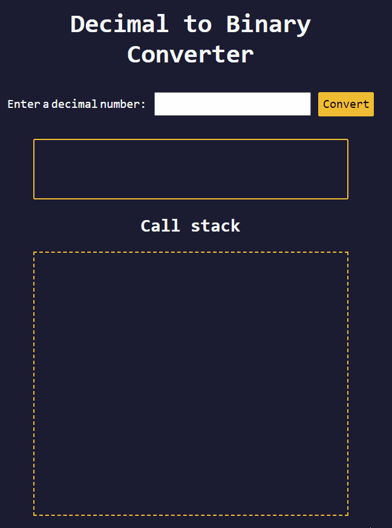
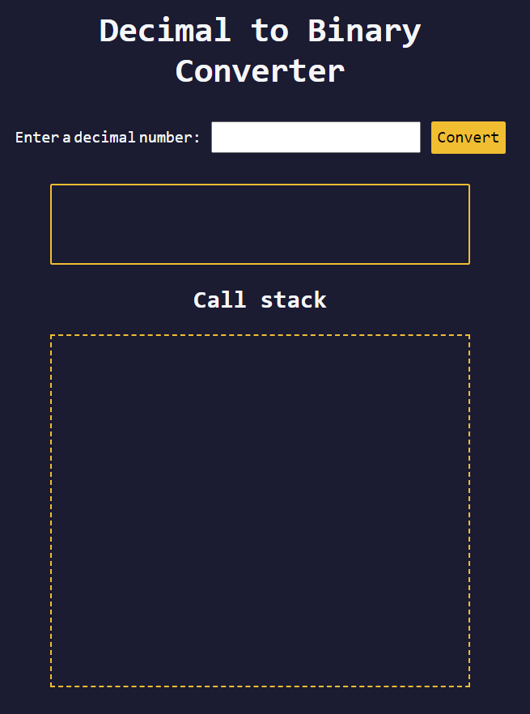
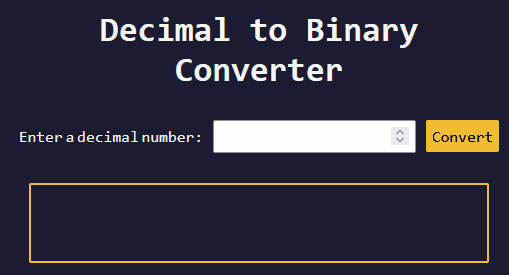

# 🧠 2D - Learn Recusrsion by Building a Decimal to Binary Converter
* In this project, I will learn about recursion by building an app. I will also learn about the Stack data stucture, and build a visual representation of recursion using an animation

* Here is a preview of what I will build:
   <details>

   
   </details>


## 👨‍🍳 Final Product TODO 👨‍🍳
## 📝 Summary Notes TODO 📝

## 🛠️ Project Setup 🛠️

* I have been provided the [HTML](code/index.html) and [CSS](code/styles.css)
* This is what the page looks like:
   <details>

   
   </details>

## 🟥 Without Recursion
* I set up the following constants:
   ```js
   const numberInput = document.getElementById("number-input")
   const convertBtn = document.getElementById("convert-btn")
   const result = document.getElementById("result")
   ```
* I create a function which will execute when user clicks the Convert button, for now I will print what is in the input field:

   ```js
   const checkUserInput = () => {
      console.log(numberInput.value)
   }

   convertBtn.addEventListener("click", checkUserInput);
   ```
* I also want to trigger the `checkUserInput()` whenever the user presses enter
* I use the ⌨️`keydown`⌨️ event which lets me check what key the user has pressed:
   ```js
   numberInput.addEventListener("keydown", (e)=>{})
   ```
* I can determine key the user has pressed❗If I print the `e` parameter in the console, I would see: `{ isTrusted: [Getter] }`. I can obtain the key using the `e.key` property
* I check that the key is "enter":
   ```js
   numberInput.addEventListener("keydown", (e)=>{
      if (e.key === "Enter") {
         checkUserInput()
      }
   })
   ```
* I update the implementation of checkUserInput(), to check that the input is not blank:
   ```js
   const checkUserInput = () => {
      if (!numberInput.value) {
         
      }
   }
   ```
* There `parseInt()` function converts a string to a number:
   ```js
   parseInt('123') // 123
   parseInt('aaa') // NaN
   ```
* I update the if check to see if the parsed input is NaN:
   ```js
   if (!numberInput.value || isNaN(parseInt(numberInput.value))) {
         
   }
   ```

* I add a third condition to check if number is less than zero, and then alert the user:
   ```js
   if (!numberInput.value || isNaN(parseInt(numberInput.value)) || parseInt(numberInput.value)<0) {
      alert("Please provide a decimal number greater than or equal to 0");
      return;
   }
   ```

## 🟥 Iteration 1: Without Recursion

* I create a function for the conversion to binary:
   ```js
   const decimalToBinary = (input) => {}
   ```

* I call the above in my checkUserInput function, and clear the input of the number input:
   ```js
   const checkUserInput = () => {
      /* if (!numberInput.value ...
         REST OF CODE
      */

      decimalToBinary(parseInt(numberInput.value))
      numberInput.value = ''
   }
   ```

* I define some arrays in my decimalToBinary() function:
   ```js
   const decimalToBinary() = () => {
      const inputs = []
      const quotients = []
      const remainders = []
      return "01110110";
   }
   ```

* I need to keep dividing the input by 2 to work out the binary representation:
   ```js
   while (input < 0) {
      const quotient = Math.floor(input / 2)
      input = quotient
   }
   ```
* I create a `remainder` variable to store the remainder of the halfing (can be either 0 or 1):
   ```js
   while (input < 0) {
      const quotient = Math.floor(input / 2)
      const remainder = input % 2
      input = quotient
   }
   ```
* I push the above variables, and the input (before reassignment) to the arrays:
   ```js
   while (input < 0) {
      const quotient = Math.floor(input / 2)
      const remainder = input % 2

      inputs.push(input)
      quotients.push(quotient)
      remainders.push(remainder)

      input = quotient
   }
   ```

* After the while-loop, I log the following:
   ```js
   console.log("Inputs: ", inputs);
   console.log("Quotients: ", quotients)
   console.log("Remainders: ", remainders)
   ```
* If I enter 6 and convert, I see the following in the console:
   ```c
   Inputs:  [ 6, 3, 1 ]
   Quotients:  [ 3, 1, 0 ]
   Remainders:  [ 0, 1, 1 ]
   ```
* The remainders reversed, is the binary representation of 6: `110`
* I set the inner text of the result div to the remainders reverse:
   ```js
      result.innerText = remainders.reverse().join("")
   ```

* Here is the app working:

   <details>
   <summary>GIF</summary>

   
   </details>

### 🕷️ Fixing Bug 1 🕷️
* Trying to convert 0 to binary does not work currently, since the while loop checks if input is greater than zero, nothing is added to the arrays
* So nothing is printed to the results div!
* I fix this, by manually setting the result to `"0"`:
   ```js
   const decimalToBinary = (input) => {
      const inputs = [];
      const quotients = [];
      const remainders = [];

      if (input === 0) {
         result.innerText = "0";
         return;
      }
   }
   ```

* This is the first iteration of the `decimalToBinary()` function:
   ```js
   const decimalToBinary = (input) => {
      const inputs = []
      const quotients = []
      const remainders = []
      if (input === 0) {
         result.innerText = "0";
         return;
      }
      while (input > 0) {
         const quotient = Math.floor(input / 2)
         const remainder = input % 2
         inputs.push(input)
         quotients.push(quotient)
         remainders.push(remainder)
         input = quotient
      }
      console.log("Inputs: ", inputs);
      console.log("Quotients: ", quotients);
      console.log("Remainders: ", remainders);
      result.innerText = remainders.reverse().join("")
   }
   ```

### 📍 Improving `decimalToBinary()` Function
* We can make the function more efficient by not tracking the inputs and quotient
* I redefine my `decimalToBinary()` function as:
   ```js
   const decimalToBinary = (input) => {
      let binary = ""
      while (input > 0) {
         binary = (input % 2) + binary;
         input = Math.floor(input / 2);
      }
      result.innerText = binary
   }
   ```

* I again check if the input is 0 so that it sets the result to `"0"`:
   ```js
   const decimalToBinary = (input) => {
      let binary = ""
      if (input === 0) {
         binary = "0"
      }

      while (input > 0) {
         binary = (input % 2) + binary;
         input = Math.floor(input / 2);
      }
      result.innerText = binary
   }
   ```

## 🟥 Iteration 2: WITH Recursion

### 📍 Recursion
* I will be learning about the Call Stack data structure, and convert my `decimalToBinary()` function to use recursion.
* I create a function called `a()`, which calls a function `b()`, which calls a function `c()`:
   ```js
   const a = () => {
      return "freeCodeCamp " + b()
   }
   const b = () => {
      return "is " + c();
   }
   const c = () => {
      return "awesome!"
   }
   ```
* If I log this:
   ```js
   console.log(a()) // freeCodeCamp is awesome!
   ```

### 📍 Call Stack
* A stack 📚 is a LIFO data structure. Elements can be pushed to top of stack, and popped off the top of stack
* The ***call stack*** is a collection of function calls stored in a stack structure. When you call a function, it is added to top of stack, and when it returns it removes it from top of stack.
* I will see this by creating a mock call stack.
* I create a `callStack` array:
   ```js
   const callStack = [
      'a(): returns "freeCodeCamp " + b()'
   ]
   ```
* Since a() calls b(), I add the string `"b(): returns 'is ' + c()"` to the top of stack:
   ```js
   const callStack = [
      'a(): returns "freeCodeCamp " + b()',
      "b(): returns 'is ' + c()"
   ]
   ```
* Since b() calls c(), I add the string `"c(): returns 'awesome!'"`:
   ```js
   const callStack = [
      'a(): returns "freeCodeCamp " + b()',
      'b(): returns "is " + c()',
      "c(): returns 'awesome!'"
   ];
   ```
* If we imagine what this this is a stack, the top of the stack returns `"awesome!"`, it is popped off:
   ```js
   const callStack = [
      'a(): returns "freeCodeCamp " + b()',
      'b(): returns "is " + c()'
   ];
   ```
* Now the top of the stack gets evaluated as `"is " + "awesome!"`:
   ```js
   const callStack = [
      'a(): returns "freeCodeCamp " + b()',
      "b(): returns 'is ' + 'awesome!'"
   ]
   ```
* Now `b()` gets executed, and its popped off the stack:
   ```js
   const callStack = [
      "a(): returns 'freeCodeCamp ' + 'is awesome!'"
   ]
   ```
* Finally, the last element is popped off, so a() returns: `freeCodeCamp is awesome!`

### 📍 Countdown Using Recursion
* I will create a function that will count down to zero from a given number:
   ```js
   const countdown = (number) => {
      console.log(number)
   };
   ```
* I add the base case when the number is 0:
   ```js
   const countdown = (number) => {
      console.log(number)
      if (number === 0) {
         return
      } else {}
   };
   ```
* To write the recursive case, I need to get closer to base case of 0, so I reduce the number by 1 and call the function again
   ```js
   const countdown = (number) => {
      console.log(number)
      if (number === 0) {
         return
      } else {
         countdown(number-1);
      }
   };
   ```
* If I call `countdown(3)`, I see the following logged:
   ```c
   3
   2
   1
   0
   ```