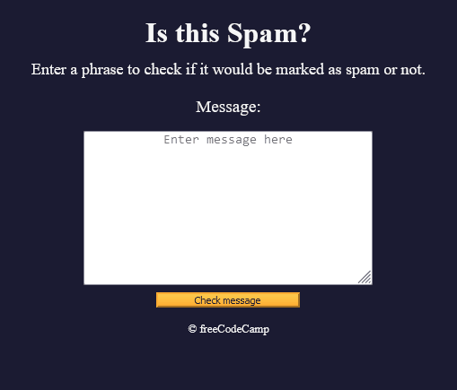
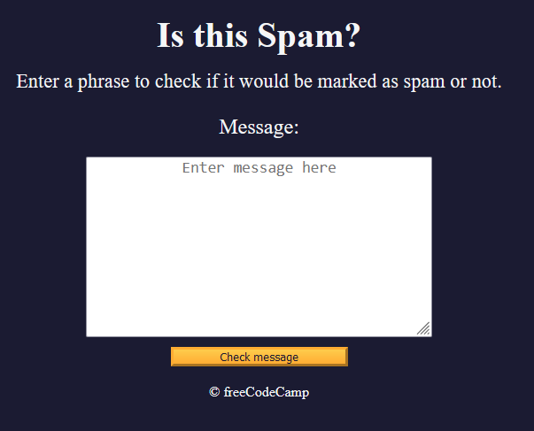
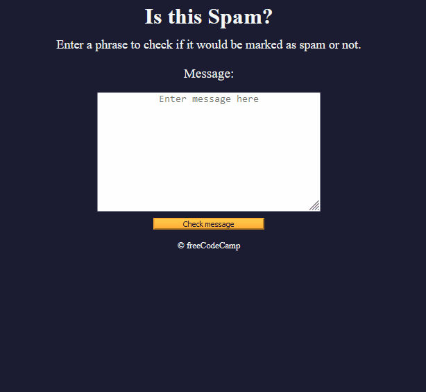

# 🧠 3A - Learn Regular Expressions by Building a Spam Filter
* I will build a spam filter app to learn about capture groups, positive and negative lookaheads, and other text matching techniques

* Here is a preview of what I will build:
   <details>

   
   </details>


## 👨‍🍳 Final Product 👨‍🍳
* You can try out the application I built in this tutorial [here](https://htmlpreview.github.io/?https://github.com/shivkumar98/FreeCodeCamp-Projects/blob/main/05-javascript-a-ds-new/3-functional-programming/3a-learn-regex-building-spam-filter/code/index.html)


## 📝 Summary Notes 📝
* The Arrays class has a `.some()` method which accepts a callback. It returns true/false if there is SOME element in the array which returns true for callback
* You can test if a string has a match on a regex variable using `.test()`
  
   <details>
   <summary>Example</summary>

   ```js
   const regex = /hi|hello/i;
   const isMatch = regex.test("hello"); // true
   ```
   </details>
* The `|` is used as a conditional OR to match multiple strings: `/hello|hi/`
* **Character classes** are used to match a single character to one element of the class. `/[aeiou]/`
* You can specify a range for a character class: `[0-9] [a-z]`
* There is a whitespace class for capturing a space/tab/enter: `\s` 
* Quantifiers let you check if a character occurs multiple times:
  * `+` quanitifier - occurs at least once
  * `*` quantifier - occurs 0 or atleast once
  * `?` quantifier - occurs 0 or once (optional)
* You can use a **capture group** to find repetition of a particular pattern, you declare a group with `()`
   <details>
   <summary>Example</summary>

   ```js
   const regex = /(hundred|thousand|million|billion)?/;
   ```
   </details>
* If you do not want re-use a capture you can make it non-capture group using `(?:)`
   


## 🛠️ Project Setup 🛠️

* I have been provided the [HTML](code/index.html) and [CSS](code/styles.css)
* This is what the page looks like:
   <details>

   
   </details>

## 🟥 Setting Up Variables and Event Listeners
* I create constants for elements fromt he HTML document:
   ```js
   const messageInput = document.getElementById("message-input");
   const result = document.getElementById("result");
   const checkMessageButton = document.getElementById("check-message-btn");
   ```

* I add an event listener for when the input is blank, and user clicks `Check message` button:
   ```js
   checkMessageButton.addEventListener("click", () => {
   if (messageInput.value === "")  {
      alert("Please enter a message.")
      return
   }
   });
   ```
* I set up my `isSpam()` function which will take in the message input when button is clicked:
   ```js
   const isSpam = (msg) => false;
   ```
* I then update the event listener to set the text content depending on if `isSpam()` returns true/false AND clear out the input:
   ```js
   checkMessageButton.addEventListener("click", () => {
      // EXISTING CODE HERE
      result.textContent = isSpam(messageInput.value) ? "Oh no! This looks like a spam message." : "This message does not seem to contain any spam."
      messageInput.value = ""
   });
   ```

## 🟥 Implementing isSpam()

### ⭐ Filtering out Help ⭐

* I declare a `helpRegex` to filter out `please help` (ignoring case):
   ```js
   const helpRegex = /please help/i
   ```
* I call the `.match()` method using the above regex in my `.isSpam()` function:
   ```js
   const isSpam = (msg) => msg.match(helpRegex);
   ```
* My function is working as expected:
   <details>

   
   </details>

* We can check if a string matches a regex pattern, by calling `.test(String)` on the regex
* I reefactor the `isSpam()` message:
   ```js
   const isSpam = (msg) => helpRegex.test(msg)
   ```

### ⭐ Regex: Alternate Sequence ⭐
* I can code a matcher which will match two different strings using ***alternate sequence*** `|`
* I use alternate sequence to match `pleas help` or `assist me`:
   ```js
   const helpRegex = /please help|assist me/i;
   ```

### ⭐ Arrays `.some()` Method ⭐
* I want to add more things my `isSpam()` function will filter for
* I create a `denyList` array which contains my regexes:
   ```js
   const denyList = [helpRegex];
   ```
* The `.some()` method returns true if one element from an array returns true for a predicate💡
* I update my `isSpam` function to use this:
   ```js
   const isSpam = (msg) => denyList.some(regex => regex.test(msg))
   ```

### ⭐ Filtering out Money ⭐
* I want to now filter out text which specifies money like `12 hundred dollars` or `million D0Llars`
* I first create regex for text which looks for `dollars:
   ```js
   const dollarRegex = /dollars/i
   ```
* And I update my denyList:
   ```js
   const denyList = [helpRegex, dollarRegex];
   ```

### ⭐ Filtering out Money ⭐
* A **character class** is a match of ANY single character enclosed in square brackets 
  * e.g. `[aeiou]` is a match of a, e, i, o or u
  * e.g. 2 `[a-z]` is a match of a letter between a and z
* I update my regfex to check for digit before word of `dollars`
   ```js
   const dollarRegex = /[0-9] dollars/i;
   ```
* **Quantifiers** check if a character/class are repeated several times. 
  * `+` checks for one or more times
  * `*` checks for 0 or more times.
  * `?` checks for 0 or 1 times (i.e. optional)
*  I update my refgex to see if a digit occurs once or more times:
   ```js
   const dollarRegex = /[0-9]+ dollars/i;
   ```
* The `|` is used as an OR condition. I want to check if hundred, thousand, million or billion occurs between digit and `dollars`:
   ```js
   const dollarRegex = /[0-9]+ hundred|thousand|million|billion dollars/i;
   ``` 
 
### ⭐ Capture Group ⭐
* A capture group lets you define and "save" part of an expression so it can be used for later. This is useful when you want to check if a certain pattern is being repeated
* E.g. suppose I wanted to check if a string contained this pattern: letter, number, letter, number, letter, number then I COULD use the following regex: `/[a-z]\d[a-z]\d[a-z]\d/i`
  * But a better way would be to use `/([a-z]\d){3}/i`
* I use a capture group to put the hundred, thousand... into a group:
   ```js
   const dollarRegex = /[0-9]+ (hundred|thousand|million|billion) dollars/i;
   ```
* I make the catured group, optional:
   ```js
   const dollarRegex = /[0-9]+ (hundred|thousand|million|billion)? dollars/i;
   ```

### ⭐ White Space ⭐
* the `\s` is a whitespace class which represents space, tas, carriage return characters
* I replaced the first literal space with this class with the `*` quantifier (0 or more times), and second with `+` quanitifier (1 or more times)
   ```js
   const dollarRegex = /[0-9]+\s*(hundred|thousand|million|billion)?\s+dollars/i;
   ```

### ⭐ Non-Capture Group ⭐
* Since we are not using the Capture Group for anything we can declare it as a non-capture group using `?:`:
   ```js
   const dollarRegex = /[0-9]+\s*(?:hundred|thousand|million|billion)?\s+dollars/i;
   ```

### ⭐ Filtering out Free Money ⭐
* I declare a new regex to capture strings like `free money`
* I declare a new constant which I reference in my `denyList`:
   ```js
   const freeRegex = /free money/i;
   const denyList = [helpRegex, dollarRegex, freeRegex];
   ```
* I replace the hardcoded `e` and `o` character with character classes:
   ```js
   const freeRegex = /fr[e3][e3] m[o0]n[e3]y/i;
   ```
* I do NOT want my filter to detect text like `hands-free money`, so I add white space before and after the text:
   ```js
   const freeRegex = /\sfr[e3][e3] m[o0]n[e3]y\s/i;
   ```
### ⭐ ^ and $ Anchors ⭐
* Now my regex will not catch `free money`, I need to check for whitespace and start/end of string
* The `^` anchor is to check if the patters is at the START of a string 💡
* The `$` anchor is to check if pattern ends at the END of a string
* I use a non-capture group which checks for whitespace OR beginning of text:
   ```js
   const freeRegex = /(?:\s|^)fr[e3][e3] m[o0]n[e3]y\s/i;
   ```
* I also need to check for end of string:
   ```js
   const freeRegex = /(?:^|\s)fr[e3][e3] m[o0]n[e3]y(?:\s|$)/i;
   ```
* Now my filter WILL detect `free money` 🎉🎉🎉

### ⭐ Filtering out Stock Alert ⭐
* I want to filter for spam which contains strings like `stock alert`
* I declare a new constant and add it to my `denyList` array:
   ```js
   const stockRegex = /st[o0]ck al[e3]rt/i;

   const denyList = [helpRegex, dollarRegex, freeRegex, stockRegex];
   ```
* I add character classes in place of s and t:
   ```js
   const stockRegex = /[s5][t7][o0]ck al[e3]r[t7]/i;
   ```
* I add a character class in place of a:
   ```js
   const stockRegex = /[s5][t7][o0]ck [a@4]l[e3]r[t7]/i;
   ```
* I add a character class in place of c:
   ```js
   const stockRegex = /[s5][t7][o0][c{[(]k [a@4]l[e3]r[t7]/i;
   ```
* And finally, I'll check for start/end and whitespace:
   ```js
   const stockRegex = /(?:^|\s)[s5][t7][o0][c{[(]k [a@4]l[e3]r[t7](?:$|\s)/i;
   ```

### ⭐ Filtering out Dear Friend⭐
* I also want to filter for phrases like `dear friend`, so I declare a new regex constant:
   ```js
   const dearRegex = /dear friend/i

   const denyList = [helpRegex, dollarRegex, freeRegex, stockRegex, dearRegex];
   ```
* I replace the vowels with character classes, and check for start/end:
   ```js
   const dearRegex = /(?:^|\s)d[e3][a4@]r fr[i|1][e3]nd(?:$|\s)/i;
   ```

* The project is now complete!🎉🎉🎉