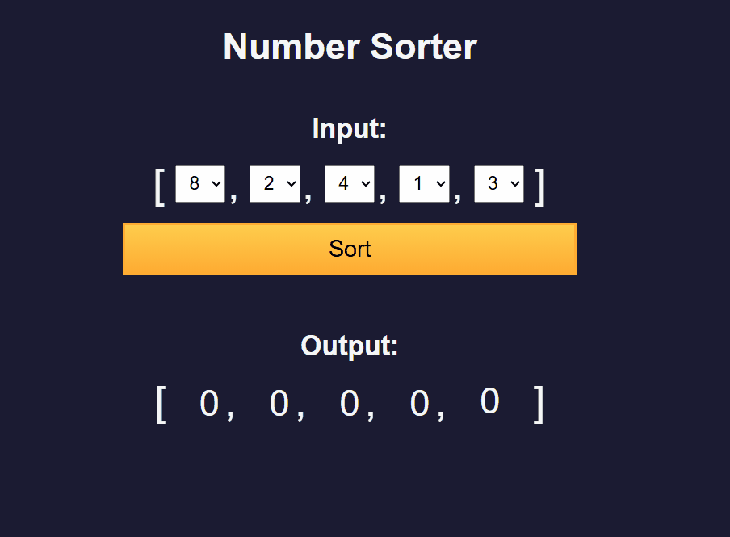
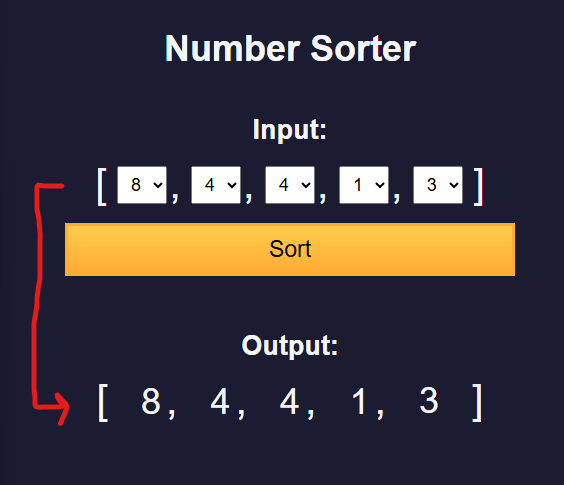
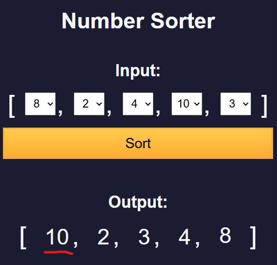

# 🧠 3B - Learn Basic Algorithmic Thinking by Building a Spam Number Sorter

* Here is a preview of what I will build:
   <details>

   
   </details>

## 👨‍🍳 Final Product 👨‍🍳
* You can try out the application I built in this tutorial via this [link](https://htmlpreview.github.io/?https://github.com/shivkumar98/FreeCodeCamp-Projects/blob/main/05-javascript-a-ds-new/3-functional-programming/3b-learn-algo-thinking-building-number-sorter/code/index.html)

## 📝 Summary Notes 📝
* If you need to obtain a set of elements from the DOM, you can use `document.getElementsByClassName()` which returns a *HTMLCollection* which is an array-like structure
* This can be converted to a regular array using spread operator:
   ```js
   [...document.getElementsByClassName("class-name")]
   ```
* **Bubble sort** is the simplest sorting algorithm, it compares adjacent pairs of elements starting from index 0 and 1, swapping the elements if the element to right is smaller than element to left
* **Selection sort** starts from the left, and seeks the lowest element to the right and swaps the element with the current element
* **Insertion sort** makes a portion of the array sorted, one element at a time until the last element is reached

## 🛠️ Project Setup 🛠️

* I have been provided the [HTML](code/index.html) and [CSS](code/styles.css)

## 🟥 Obtaining the Elements in Dropdown
* I declare a constant for the sort button:
   ```js
   const sortButton = document.getElementById("sort");
   ```
* I create a function which will be called when the `Sort` button is clicked:
   ```js
   const sortInputArray = (event) => {
   event.preventDefault();
   }
   ```
* I add an event listener for the sort button:
   ```js
   sortButton.addEventListener("click", sortInputArray)
   ```
* I need to obtain the values of the 5 dropdowns, instead of using `document.getElementById()` I use `document.getElementsByClassName()` to get all the elements:
   ```js
   const sortInputArray = (event) => {
      event.preventDefault();
      const inputValues = document.getElementsByClassName("values-dropdown");
   }
   ```
* The type returned is HTMLCollection - which is an array like object of all the elements
* I convert this to an array using spread operator:
   ```js
   const inputValues = [...document.getElementsByClassName("values-dropdown")]
   ```
* This returns the HTML element, I now need to map these to the value of the dropdown:
   ```js
   const inputValues = [...document.getElementsByClassName("values-dropdown")].map((dropdown) => dropdown.value);
   // ['8', '2', '4', '1', '3']
   ```
* I want to convert these strings into numbers, so I call the `Number()` function
   ```js
   const inputValues = [...document.getElementsByClassName("values-dropdown")]
      .map((dropdown) => Number(dropdown.value));
   // [8, 2, 4, 1, 3]
   ```

## 🟥 Updating the UI After Clicking Sort
* I create a function to update the display with sorted numbers:
   ```js
   const updateUI = (array = []) => {
   
   }
   ```
* I call the `forEach()` function on the array which takes a callback function with parameters representing the element and index, I use the index to obtain the output element and represent it with a variable:
   ```js
   const updateUI = (array = []) => {
   array.forEach((num, i) => {
      const outputValueNode = document.getElementById(`output-value-${i}`)
   })
   }
   ```
* I update the innerText of the output element to the element from the forEach loop:
   ```js
   const updateUI = (array = []) => {
   array.forEach((num, i) => {
         const outputValueNode = document.getElementById(`output-value-${i}`);
         outputValueNode.innerText = num
   })
   }
   ```
* I now call the `updateUI()` function from within the function that is called when sort button is clicked:
   ```js
   const sortInputArray = (event) => {
      event.preventDefault();
      const inputValues = [...document.getElementsByClassName("values-dropdown")]
         .map((dropdown) => Number(dropdown.value));    
      updateUI(inputValues)
   }
   ```
* Now  when I click the sort button, the elements in the dropdown get copied to the output:
   


## 🟥 Bubble Sort 🫧
* The first sorting algorithm I will learn is bubble sort
  * With bubble sort, we start from the start of the array and compare the first two elements and swap the element if the first element is greater than second
  * We then move to the second and third elements and repeat
  * When we reach the end of the array, we check if all the elemts are sorted and repeat from first step
  * Here is the algorithm for the sorting:
      ```
      for i 0 to length(A)-1
         for j 0 to length(A)-2
            if A[j] > A[j+1]
               swap A[j] with A[j+1]
      ```
* I declare a `bubbleSort` function with a for loop:
   ```js
   const bubbleSort = (array) => {
      for (let i=0;i<array.length;i++) {
      
      }
   }
   ```
* I nest another loop which loops through all elements EXCEPT the last one, and I print the array and the values in index `j` and `j+1`
   ```js
   const bubbleSort = (array) => {
      for (let i=0;i<array.length;i++) {
         for (let j=0;j<array.length-1;j++) {
            console.log(array, array[j], array[j+1]);
         }
      }
   }
   ```
* To test my bubbleSort function, I call it in the `sortInputArray()` function:
   ```js
   const sortInputArray = (event) => {
      /* EXISTING CODE HERE */
      
      const sortedValues = bubbleSort(inputValues)
      updateUI(sortedValues);
   }
   ```
* Now when I click sort, I see the bubble sort in action:
   ```c
   [8,2,4,1,3] 8 2
   [8,2,4,1,3] 2 4
   [8,2,4,1,3] 4 1
   [8,2,4,1,3] 1 3
   [8,2,4,1,3] 8 2
   [8,2,4,1,3] 2 4
   [8,2,4,1,3] 4 1 
   [8,2,4,1,3] 1 3
   [8,2,4,1,3] 8 2
   [8,2,4,1,3] 2 4
   [8,2,4,1,3] 4 1 
   [8,2,4,1,3] 1 3
   [8,2,4,1,3] 8 2
   [8,2,4,1,3] 2 4
   [8,2,4,1,3] 4 1 
   [8,2,4,1,3] 1 3
   ```
* In my inner loop, I compare the elements with index `j` and `j+1`:
   ```js
   for (let j=0;j<array.length;j++) {
      if (array[j]>array[j+1]) {
         const temp = array[j]
         array[j] = array[j+1]
         array[j+1] = temp
      }
   }
   ```
* After the outer loop is finished, I return the sorted array:
   ```js
   return array;
   ```
* This is the final implementation of `bubbleSort()`:
<details>
   <summary>bubbleSort() implementation</summary>

   ```js
   const bubbleSort = (array) => {
      for (let i=0;i<array.length;i++) {
         for (let j=0;j<array.length-1;j++) {
            if (array[j]>array[j+1]) {
               const temp = array[j]
               array[j] = array[j+1]
               array[j+1] = temp
            }
         }
      }
      return array;
   }
   ```
</details>

## 🟥 Selection Sort 🖱️
* I will now implement selection sort 
* The selection sorting algorithm runs element by element starting with the first element, it seeks the lowest element in the array to the right and swaps the current element with the lowest. It then proceeds with the next element on the right and repeats the cycle looking for the smallest element in remainder of array
* Here is the pseudo code:
   ```c
   for i from 0 to (A.length-1) {
      min_index = i; // assume current position has min val
      for j from i+1 to (A.length-1) {
         if (A[j] < A[min_index])
            min_index = j
      }
      swap(A[i], A[j]) // swap the element with lowest value
   }
   ```
* I start with the implementation by declaring a function:
   ```js
   const selectionSort = (array) => {   
   }
   ```
* And I update the call to `bubbleSort` to `selectionSort` in my `sortInputArray()` function:
   ```js
   const sortedValues = selectionSort(inputValues);
   ```
* I create a for loop:
   ```js
   const selectionSort = (array) => {
      for (let i = 0; i < array.length; i++) {

      }
   }
   ```
* Selection sort relies on tracking the index of the smallest value in the array
* I declare and initialise a `minIndex` variable to `i` - this is so if the lowest element is the current value, it is swapped with itseld and not moved
* I will reassign the value of `minIndex` as iterate throguh the array
* I create another for loop:
   ```js
   const selectionSort = (array) => {
      for (let i = 0; i < array.length; i++) {
         let minIndex = i;
         for (let j=i+1; j <array.length; j++) {

         }
      }
   }
   ```
* In the nested for loop, I log out the array, check if the value at j is lower than the value at minIndex:
   ```js
   for (let j = i + 1; j < array.length; j++) {
      console.log(array, array[j], array[minIndex])
      if (array[j] < array[minIndex]) {
         console.log("array[j] is lower than array[minIndex]");
         minIndex = j;
      }
   }
   ```
* This prints the following:
   ```c
   [8, 2, 4, 1, 3] 2 8 // i = 0; minIndex = 0
   "array[j] is lower than array[minIndex]" // minIndex is now 1
   [8, 2, 4, 1, 3] 4 2
   [8, 2, 4, 1, 3] 1 2
   "array[j] is lower than array[minIndex]" // minIndex is now 3
   [8, 2, 4, 1, 3] 3 1
   [8, 2, 4, 1, 3] 4 2  // i = 1; minIndex = 1
   [8, 2, 4, 1, 3] 1 2
   "array[j] is lower than array[minIndex]" // minIndex is now 3
   [8, 2, 4, 1, 3] 3 1
   [8, 2, 4, 1, 3] 1 4 // i = 2; minIndex = 2
   "array[j] is lower than array[minIndex]" // minIndex is now 3
   [8, 2, 4, 1, 3] 3 1
   [8, 2, 4, 1, 3] 3 1 // i = 3; minIndex = 3
   ```
* I now do the swapping after the minIndex is found after the nested loop:
   ```js
   const selectionSort = (array) => {
      for (let i = 0; i < array.length; i++) {
         let minIndex = i;
         for (let j=i+1; j <array.length; j++) {
            console.log(array, array[j], array[minIndex])
            if (array[j] < array[minIndex]) {
               console.log("array[j] is lower than array[minIndex]");
               minIndex = j;
            }
         }
         const temp = array[i];
         array[i] = array[minIndex];
         array[minIndex] = temp;
      }
   }
   ```
* This prints the following into the console:
   ```c
   [8, 2, 4, 1, 3] 2 8
   "array[j] is lower than array[minIndex]"
   [8, 2, 4, 1, 3] 4 2
   [8, 2, 4, 1, 3] 1 2
   "array[j] is lower than array[minIndex]"
   [8, 2, 4, 1, 3] 3 1
   [1, 2, 4, 8, 3] 4 2
   [1, 2, 4, 8, 3] 8 2
   [1, 2, 4, 8, 3] 3 2
   [1, 2, 4, 8, 3] 8 4
   [1, 2, 4, 8, 3] 3 4
   "array[j] is lower than array[minIndex]"
   [1, 2, 3, 8, 4] 4 8
   "array[j] is lower than array[minIndex]"
   ```
* Finally I return the sorted array:
   ```js
   const selectionSort = (array) => {
      for (let i = 0; i < array.length; i++) {
         let minIndex = i;
         for (let j=i+1; j <array.length; j++) {
            console.log(array, array[j], array[minIndex])
            if (array[j] < array[minIndex]) {
               console.log("array[j] is lower than array[minIndex]");
               minIndex = j;
            }
         }
         const temp = array[i];
         array[i] = array[minIndex];
         array[minIndex] = temp;
      }
      return array
   }
   ```
* Now when I click the `Sort` button, the output is updated!
* I delete the console logs, this is the final form of selection sort:
   ```js
   const selectionSort = (array) => {
      for (let i = 0; i < array.length; i++) {
         let minIndex = i;
         for (let j=i+1; j <array.length; j++) {
            if (array[j] < array[minIndex]) {
                  minIndex = j;
            }
         }
         const temp = array[i];
         array[i] = array[minIndex];
         array[minIndex] = temp;
      }
      return array
   }
   ```

## 🟥 Insertion Sort ⬇️
* Insertion Sort starts from left to right, and ensures that all elements within one cycle are sorted
* Here is a manual run through of this algorithm:
   ```c
   arr = [23, 1, 10, 5, 2]
   // current element is considered sorted as it is only element

   /* FIRST PASS
   - compare 1 with 23
   - 1 is less than 23 */
   arr = [1, 23, 10, 5, 2]

   /* SECOND PASS
   - compare 10 with 1 and 23
   - 10 is greater than 1 and less than 23, so it is inserted in between */
   arr = [1, 10, 23, 5, 2]

   /* THIRD PASS
   - compare 5 with 1, 10 and 23
   - 5 is greated than 1 and less than 10, so it is inserted in between */
   arr = [1, 5, 10, 23, 2]

   /* FOURTH PASS
   - compare 2 with 1, 5, 10, 23
   - 2 is >1 and <5, so it is inserted in between */

   arr = [1, 2, 5, 10, 23]
   ```
* I declare an insertionSort variable:
   ```js
   const insertionSort = (array) => {
   }
   ```
* I update the call of selectionSort:
   ```js
   const sortedValues = insertionSort(inputValues);
   ```
* I initialise a for loop which starts at index 1, obtain the current value and declare a j index:
   ```js
   const insertionSort = (array) => {
      for (let i=1; i < array.length; i++) {
         const currValue = array[i]
         let j = i-1
      }
   }
   ```
* I create a while loop which decrements j when `array[j] > currValue` (i.e. smaller value is not found):
   ```js
   for (let i=1; i < array.length; i++) {
      const currValue = array[i]
      let j = i-1
      while (j>=0 && array[j] > currValue) {
         j--;
      }
   }
   ```
* On each iteration, I need to move the element at j to the right:
   ```js
   for (let i = 1; i < array.length; i++) {
      const currValue = array[i];
      let j = i-1;

      while (j >= 0 && array[j] > currValue) {
         array[j+1] = array[j]
         j--;
      }
   }
   ```
* I then assign currValue to j+1 after the while loop:
   ```js
   for (let i = 1; i < array.length; i++) {
      const currValue = array[i];
      let j = i-1;

      while (j >= 0 && array[j] > currValue) {
         array[j+1] = array[j];
         j--;
      }
      array[j+1] = currValue
   }
   ```
* Finally I return the sorted array, here is the final form of `insertionSort()`:
   ```js
   const insertionSort = (array) => {
      for (let i=1; i < array.length; i++) {
         const currValue = array[i]
         let j = i-1
         while (j>=0 && array[j] > currValue) {
            array[j+1] = array[j];
            j--;
         }
         array[j+1] = currValue
      }
      return array
   }
   ```
* Now when I click the Sort button, the output is updated with the sorted list 🥳

## 🟥 Built-In Sort Method
* There is a built in sort method for arrays
* I update the call to `insertionSort()` on the input array:
   ```js
   const sortedValues = inputValues.sort();
   ```
* The above code does have a bug, if I modify the dropdown so user can enter `10`, then when clicking the sort button 10 appears as the first element:

* This a result of the `.sort()` method converting number values to strings, and then getting sorted alphabetically
* We can override this behaviour by providing a call back which returns a number - for now I pass an empty callback:
   ```js
   const sortedValues = inputValues.sort((a, b) => {

   });
   ```
* The sorting of a and b is determined by the size of the return:
   - If negative => a comes before b
   - If positive => a comes after b
   - If zero => no change required
* So I want a to come before b, so if b is greater than a, then `a-b` is negative
   ```js
   const sortedValues = inputValues.sort((a, b) => {
      return a-b
   });
   ```
* I am now finished with this tutorial 🥳🥳🥳