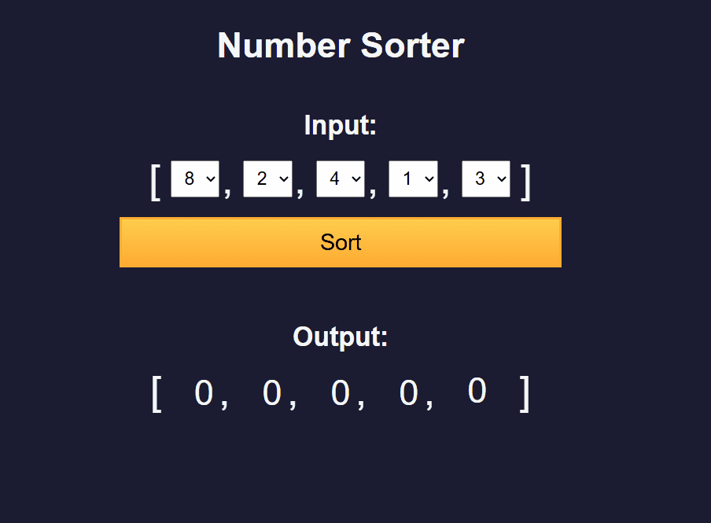
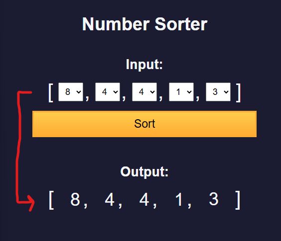

# 🧠 3B - Learn Basic Algorithmic Thinking by Building a Spam Number Sorter

* Here is a preview of what I will build:
   <details>

   
   </details>

## 🛠️ Project Setup 🛠️

* I have been provided the [HTML](code/index.html) and [CSS](code/styles.css)

## 🟥 Obtaining the Elements in Dropdown
* I declare a constant for the sort buttonL
   ```js
   const sortButton = document.getElementById("sort");
   ```
* I create a function which will be called when the `Sort` button is clicked:
   ```js
   const sortInputArray = (event) => {
   event.preventDefault();
   }
   ```
* I add an event listener for the sort button:
   ```js
   sortButton.addEventListener("click", sortInputArray)
   ```
* I need to obtain the values of the 5 dropdowns, instead of using `document.getElementById()` I use `document.getElementsByClassName()` to get all the elements:
   ```js
   const sortInputArray = (event) => {
      event.preventDefault();
      const inputValues = document.getElementsByClassName("values-dropdown");
   }
   ```
* The type returned is HTMLCollection - which is an array like object of all the elements
* I convert this to an array using spread operator:
   ```js
   const inputValues = [...document.getElementsByClassName("values-dropdown")]
   ```
* This returns the HTML element, I now need to map these to the value of the dropdown:
   ```js
   const inputValues = [...document.getElementsByClassName("values-dropdown")].map((dropdown) => dropdown.value);
   // ['8', '2', '4', '1', '3']
   ```
* I want to convert these strings into numbers, so I call the `Number()` function
   ```js
   const inputValues = [...document.getElementsByClassName("values-dropdown")]
      .map((dropdown) => Number(dropdown.value));
   // [8, 2, 4, 1, 3]
   ```

## 🟥 Updating the UI After Clicking Sort
* I create a function to update the display with sorted numbers:
   ```js
   const updateUI = (array = []) => {
   
   }
   ```
* I call the `forEach()` function on the array which takes a callback function with parameters representing the element and index, I use the index to obtain the output element and represent it with a variable:
   ```js
   const updateUI = (array = []) => {
   array.forEach((num, i) => {
      const outputValueNode = document.getElementById(`output-value-${i}`)
   })
   }
   ```
* I update the innerText of the output element to the element from the forEach loop:
   ```js
   const updateUI = (array = []) => {
   array.forEach((num, i) => {
         const outputValueNode = document.getElementById(`output-value-${i}`);
         outputValueNode.innerText = num
   })
   }
   ```
* I now call the `updateUI()` function from within the function that is called when sort button is clicked:
   ```js
   const sortInputArray = (event) => {
      event.preventDefault();
      const inputValues = [...document.getElementsByClassName("values-dropdown")]
         .map((dropdown) => Number(dropdown.value));    
      updateUI(inputValues)
   }
   ```
* Now  when I click the sort button, the elements in the dropdown get copied to the output:
   