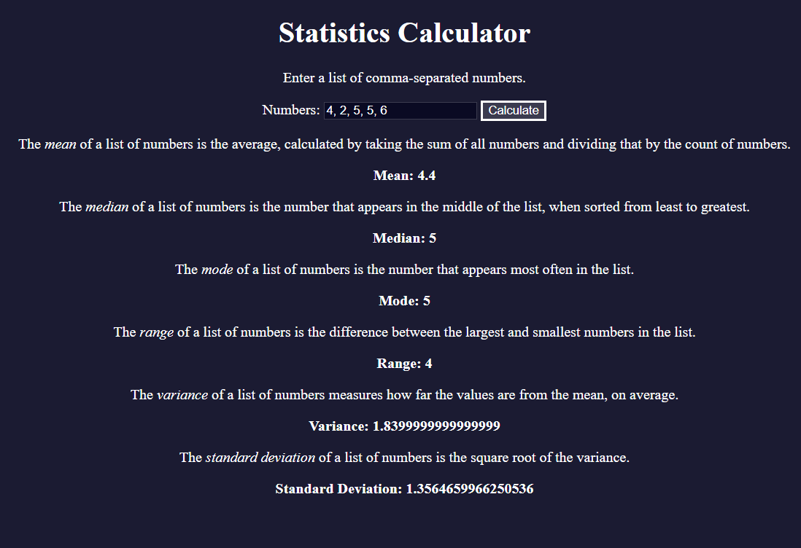
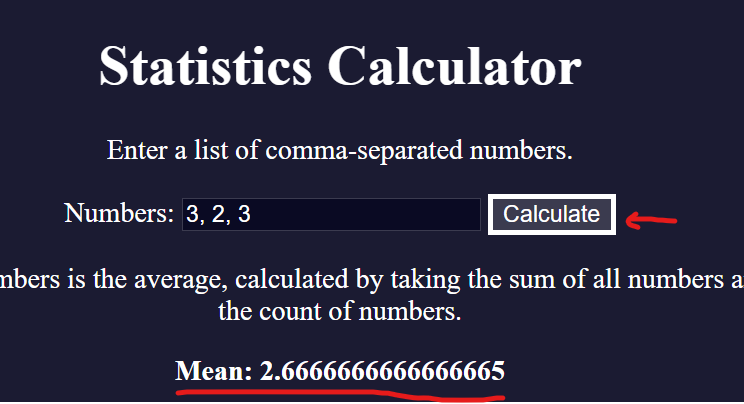
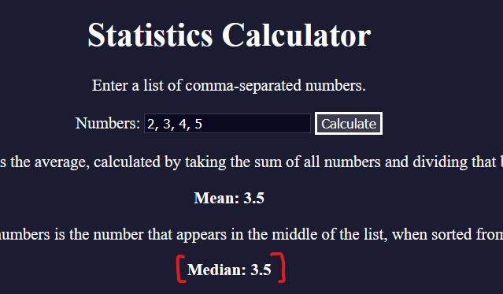
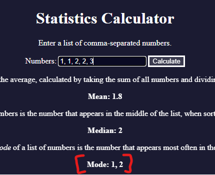
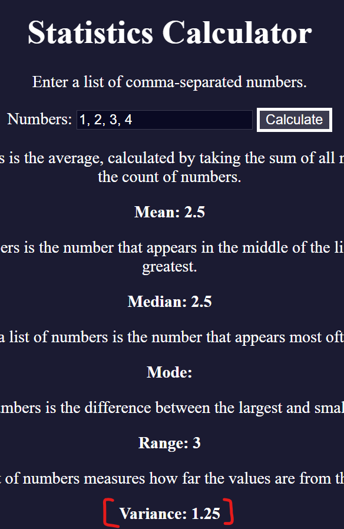

# 🧠 3C - Learn Basic Algorithmic Thinking by Building a Spam Number Sorter
* In this project, I'll expand my JS skills by getting comfortable with methods like `map()`, `reduce()`, and `filter()`
* I will practice method chaining and DOM manipulation by performing statistical calculations like mean, median, mode, variance, and standard deviation
* Here is a preview of what I will build:
   <details>

   
   </details>

## 👨‍🍳 Final Product 👨‍🍳
* You can try out the application I built in this tutorial via this [link](https://htmlpreview.github.io/?https://github.com/shivkumar98/FreeCodeCamp-Projects/blob/main/05-javascript-a-ds-new/3-functional-programming/3c-learn-array-methods-building-stats-calc/code/index.html)

## 📝 Summary Notes 📝
* The value obtained from an input element is ALWAYS a string 💡
* There is a `isNaN()` method which enables you to check if a number is not a number:
   ```js
   isNaN(Number("not a number")) // false
   ```
* The `.reduce()` method takes an array and applies a callback method to condense into a single value, it's second parameter is used to initialise the value and should be set to avoid incorrect values from being generated 💡
* I can prevent a form from submitting by returning false on the `onsubmit` attribute of a HTML form element 💡
   ```html
   <form onsubmit="calculate(); return false">
   ```
* You can provide a callback to `.sort()` which takes two elements (a,b) and sorts a before b if return is <0, sorts b before a if return is >0, and makes no change if return == 0 💡
  ```js
  array.sort((a,b)=>a-b) // ascending order
  ```
* The `.sort()` method MUTATES the original array - we do not want to have side effects, so we shall use `.toSorted()` which does not mutate original array 💡
* You can obtain the values of an object by passing it to the `Object.values()` method:
   ```js
   const object = {1:"Shiv is cool",2:"Shiv is not cool"}
   Object.values(object); // [ 'Shiv is cool', 'Shiv is not cool' ]
   ```
* You can extract the keys of an object using `Object.keys(object)` 💡
   ```js
   const counts = {2: 1, 64: 1; 128: 4}
   Object.keys(counts); // [2, 64, 128]
   ```
* The Math.min() and Math.max() functions will not return the lowest/highest element of an array, it will return `NaN`, to obtain the lowest/highest element you need to spread the array 💡
   ```js
   Math.min([1,2,3]); // NaN
   Math.min(...[1,2,3]); // 1
   ```

## 🛠️ 1. Project Setup 🛠️

* I have been provided the [HTML](code/index.html) and [CSS](code/styles.css)

## 🟥 2. Obtaining Numbers from Input
* I initialise my [JavaScript file](code/script.js) by declaring a `calculate` function:
   ```js
   const calculate = () => {

   }
   ```
* I need to obtain the values in the `id=numbers` input field, instead of using conventional document.findById(), I use the querySelector and  obtain it's `value` property:
   ```js
   const calculate = () => {
   const value = document.querySelector("#numbers").value    
   }
   ```
* I use this variable to obtain an array of the numbers, I use regex to split based on whitespace and a comma:
   ```js
   const value = document.querySelector("#numbers").value    
   const array = value.split(/,\s*/g)
   ```
* The value from an input element is ALWAYS a string 💡
* So I convert my array to numbers:
   ```js
   const value = document.querySelector("#numbers").value;
   const array = value.split(/,\s*/g);
   const numbers = array.map(el => Number(el));
   ```
* Since the user can enter any string, the number array may contain `NaN` - I filter these out:
   ```js
   const value = document.querySelector("#numbers").value;
   const array = value.split(/,\s*/g);
   const numbers = array.map(el => Number(el));
   const filtered = numbers.filter(el => !isNaN(el));
   ```
* I chain the above filtering to the mapping, and my `calculate()` function is complete:
   ```js
   const calculate = () => {
      const value = document.querySelector("#numbers").value;
      const array = value.split(/,\s*/g);
      const numbers = array.map(el => Number(el)).filter(el => !isNaN(el));
   }
   ```

## 🟥 3. Calculating Mean
* I will calculate the mean of an array of numbers by using the `.reduce()` method
* The `.reduce()` method takes an array and applies a callback method to condense into a single value, it's second parameter is used to initialise the value and should be set to avoid incorrect values from being generated 💡
* I declare a getMean function:
   ```js
   const getMean = (array) => 
      array.reduce((acc, el) => acc + el, 0) / array.length;
   ```
* I use the above function in my `calculate()` function, so I can display to DOM:
   ```js
   const calculate = () => {
      // EXISTING CODE
      const mean = getMean(numbers);
      document.querySelector("#mean").textContent = mean
   }
   ```
* When I attempt to test the code by entering numbers and clicking `Calculate` button, the page submits - meaning I do not see the Mean being calculated
* This is due to the form in the HTML calling the calculate function:
   ```html
   <form onsubmit="calculate();">
      <label for="numbers">Numbers:</label>
      <input type="text" name="numbers" id="numbers" />
      <button type="submit">Calculate</button>
   </form>
   ```
* I can prevent a form from submitting by returning false on the `onsubmit` attribute of a HTML form element 💡
   ```html
   <form onsubmit="calculate(); return false">
      <label for="numbers">Numbers:</label>
      <input type="text" name="numbers" id="numbers" />
      <button type="submit">Calculate</button>
   </form>
   ```
* Now when I click the calculate button, the mean is displayed on screen:
  
   

## 🟥 4. Calculating Median
* I declare a function for calculating the median, this calculation depends on whether the length of that array is odd or even
* I first need to sort the array from smallest to largest
* The `.sort()` method converts elements of an array to a string and then sorts alphabetically if no callback is provided 💡
* You can provide a callback to `.sort()` which takes two elements (a,b) and sorts a before b if return is <0, sorts b before a if return is >0, and makes no change if return == 0 💡
  * E.g you can sort an array in ascending order:
      ```js
      array.sort((a,b)=>a-b)
      ```
* I create a sorted variable in my `getMedian()` function:
   ```js
   const getMedian = (array) => {
   const sorted = array.sort((a, b) => a - b);
   }
   ```
* The `.sort()` method MUTATES the original array - we do not want to have side effects, so we shall use `.toSorted()` which does not mutate original array 💡
* I change the sort to toSorted:
   ```js
   const getMedian = (array) => {
      const sorted = array.toSorted((a,b)=>a-b)
   }
   ```
* There median of a set is dependent on whether the size is odd or even - if odd, this is the middle number, if even it's the mean of two middle numbers:
   ```js
   const getMedian = (array) => {
      const sorted = array.toSorted((a, b) => a - b);
      if (sorted.length % 2 === 1) {
         return sorted[Math.floor(sorted.length/2)]
      } else {
         return getMean([
            sorted[sorted.length/2],
            sorted[(sorted.length/2)-1]
         ])
      }
   }
   ```
* I update the `calculate()` function:
   ```js
   const mean = getMean(numbers);
   const median = getMedian(numbers);

   document.querySelector("#mean").textContent = mean;
   document.querySelector("#median").textContent = median
   ```
* Now the median is calculated in my app:
  
   


## 🟥 5. Calculating Mode
* I constrcut my `getMode()` function by initialising an object literal which I will use to count the number of occurence of distinct elements:
   ```js
   const getMode = (array) => {
      const counts = {}
   }
   ```
* I run a forEach loop which initialises the count of an element at 1, or increments if it already exists:
   ```js
   const getMode = (array) => {
      const counts = {};
      array.forEach(el => {
         if (counts[el]) {
            counts[el] += 1;
         } else {
            counts[el] = 1;
         }
      });
      return counts;
   }
   ```
* I use the ternary operator to simply above
   ```js
   const getMode = (array) => {
      const counts = {};
      array.forEach(el => {
         counts[el] = counts[el] ? counts[el]+1 : 1   
      });
      return counts;
   }
   ```
* I need to actually return the mode now
 
### 🔴 5.1 Edge Case 1: Every Value Appears Same Number of Times
* I can check if all the values of the `counts` object are the same by utilising the `Set` datastructure which does not allow duplicates
* I can obtain the values of an object by passing it to the `Object.values()` method:
   ```js
   const object = {1:"Shiv is cool",2:"Shiv is not cool"}
   Object.values(object); // [ 'Shiv is cool', 'Shiv is not cool' ]
   ```
* I construct the set using the values from the `counts` object, and return null if there is only 1:
   ```js
   const getMode = (array) => {
      const counts = {};
      array.forEach(el => counts[el] = counts[el] ? counts[el] + 1 : 1);
      if (new Set(Object.values(counts)).size === 1) {
         return null
      }
   }
   ```

### 🔴 5.2 Returning Highest Element
* I need to extract the key of my `counts` object which has the largest count
* You can extract the keys of an object using `Object.keys(object)` 💡
   ```js
   const counts = {2: 1, 64: 1; 128: 4}
   Object.keys(counts); // [2, 64, 128]
   ```
* In my `getMode()` function, I declare a highest variable which gets the keys of counts, sorts it in descending order by the values in counts:
   ```js
   const getMode = (array) => {
      // EXISTING CODE

      const highest = Object.keys(counts)
         .sort((a,b) => counts[b]-counts[a])
         [0]
   }
   ```

### 🔴 5.3 Edge Case 2: There are multiple values which are Mode
* The mode isn't necessarily a single value, if multiple values have the same highest frequency, they are all considered the mode
* I check if there are other elements which have the same highest frequency:
   ```js
   const getMode = (array) => {
      // EXISTING CODE

      const highest = Object.keys(counts)
         .sort((a,b) => counts[b]-counts[a])
         [0]
      const mode = Object.keys(counts)
         .filter(el => counts[el]===counts[highest])
   }
   ```
* Finally, I return the mode concatenated by a comma and space. Here is the final implementation of `getMode()`:
   <details>
   <summary>Final Implementation of getMode()</summary>
   
   ```js
   const getMode = (array) => {
      const counts = {};
      array.forEach(el => counts[el] = counts[el] ? counts[el] + 1 : 1);
      if (new Set(Object.values(counts)).size === 1) {
         return null
      }
      const highest = Object.keys(counts)
         .sort((a,b) => counts[b]-counts[a]
      )[0]
      const mode = Object.keys(counts)
         .filter((el) => counts[el] === counts[highest]);
      
      return mode.join(", ")
   }
   ```
   </details>

* I now utilise the above method in my `calculate()` function:
   ```js
   const mean = getMean(numbers);
   const median = getMedian(numbers);
   const mode = getMode(numbers);

   document.querySelector("#mean").textContent = mean;
   document.querySelector("#median").textContent = median;
   document.querySelector("#mode").textContent = mode;
   ```
* Now the mode is successfully displayed
   

## 🟥 6. Calculating Mode
* The Math.min() and Math.max() functions will not return the lowest/highest element of an array, it will return `NaN`, to obtain the lowest/highest element you need to spread the array 💡
   ```js
   Math.min([1,2,3]); // NaN
   Math.min(...[1,2,3]); // 1
   ```
* I create my getRange() function as:
   ```js
   const getRange = (array) => {
   return Math.max(...array) - Math.min(...array)
   }
   ```
* And update the calculate function:
   ```js
   const mean = getMean(numbers);
   const median = getMedian(numbers);
   const mode = getMode(numbers);
   const range = getRange(numbers);

   document.querySelector("#mean").textContent = mean;
   document.querySelector("#median").textContent = median;
   document.querySelector("#mode").textContent = mode;
   document.querySelector("#range").textContent = range;
   ```

## 🟥 7. Calculating Variance
* The variance is the average difference from the mean
* I declare my `getVariance()` function and a variable to get the mean:
   ```js
   const getVariance = (array) => {
   const mean = getMean(array);
   }
   ```
* I obtain the squared differences from the means, and sum it
   ```js
   const getVariance = (array) => {
      const mean = getMean(array);
      const differences = array.map(el => el-mean);
      const squaredDifferences = differences.map(el => el ** 2);
      const sumSquaredDifferences = squaredDifferences.reduce((acc, el) => acc + el, 0);
   }
   ```
* I obtain the variance by dividing by the number of elements:
   ```js
   const getVariance = (array) => {
      const mean = getMean(array);
      const variance = array.reduce((acc,el) => {
         const difference = el - mean;
         const squared = difference ** 2;
         return acc + squared;
      }, 0) / array.length
      return variance
   }
   ```
* I update the calculate function:
   ```js
   const variance = getVariance(numbers);
   document.querySelector("#variance").textContent = variance;
   ```
* Now the variance is calculated:

   

## 🟥 8. Calculating Standard Deviation
* The standard deviation is just square root of the variance:
   ```js
   const getStandardDeviation = (array) => {
      const variance = getVariance(array);
      const standardDeviation = Math.sqrt(variance);
      return standardDeviation;
   }
   ```
* I update the `calculate()` function to include the following two lines:
   ```js
   const standardDeviation = getStandardDeviation(numbers);
   document.querySelector("#standardDeviation").textContent = standardDeviation;
   ```

* This project is now complete! 🎉🎉🎉