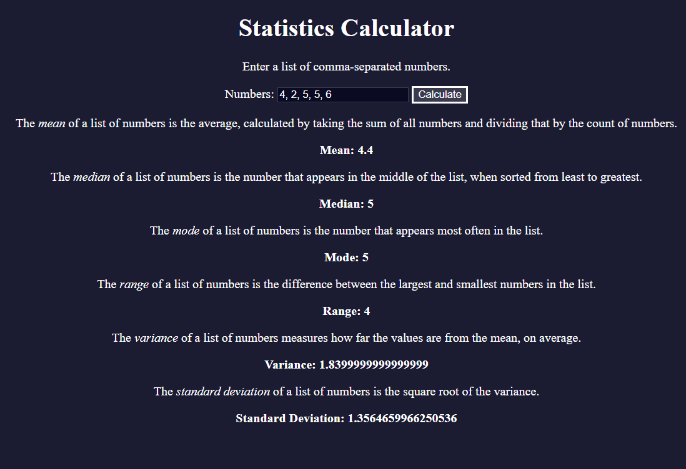
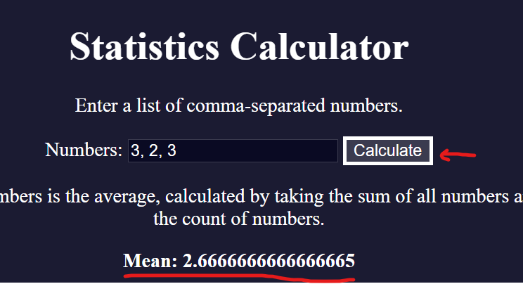
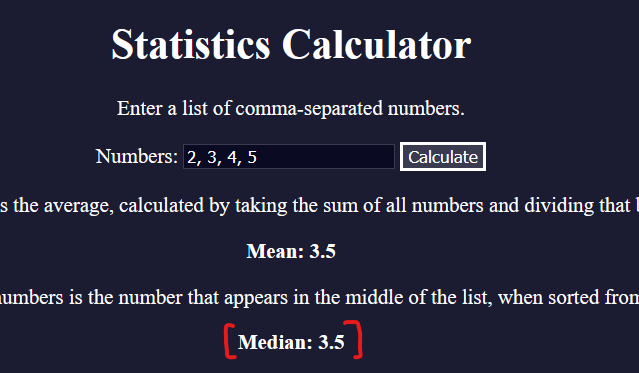

# 🧠 3C - Learn Basic Algorithmic Thinking by Building a Spam Number Sorter
* In this project, I'll expand my JS skills by getting comfortable with methods like `map()`, `reduce()`, and `filter()`
* I will practice method chaining and DOM manipulation by performing statistical calculations like mean, median, mode, variance, and standard deviation
* Here is a preview of what I will build:
   <details>

   
   </details>

## 👨‍🍳 Final Product TODOOOOOOOOO👨‍🍳
* You can try out the application I built in this tutorial via this [link](TODOOOOOOO)

## 📝 Summary Notes TODOOOOOOOOOOOOOO 📝
* The value obtained from an input element is ALWAYS a string 💡
* There is a `isNaN()` method which enables you to check if a number is not a number:
   ```js
   isNaN(Number("not a number")) // false
   ```
* The `.reduce()` method takes an array and applies a callback method to condense into a single value, it's second parameter is used to initialise the value and should be set to avoid incorrect values from being generated 💡
* I can prevent a form from submitting by returning false on the `onsubmit` attribute of a HTML form element 💡
   ```html
   <form onsubmit="calculate(); return false">
   ```
* You can provide a callback to `.sort()` which takes two elements (a,b) and sorts a before b if return is <0, sorts b before a if return is >0, and makes no change if return == 0 💡
  ```js
  array.sort((a,b)=>a-b) // ascending order
  ```
* The `.sort()` method MUTATES the original array - we do not want to have side effects, so we shall use `.toSorted()` which does not mutate original array 💡

## 🛠️ Project Setup 🛠️

* I have been provided the [HTML](code/index.html) and [CSS](code/styles.css)

## 🟥 Obtaining Numbers from Input
* I initialise my [JavaScript file](code/script.js) by declaring a `calculate` function:
   ```js
   const calculate = () => {

   }
   ```
* I need to obtain the values in the `id=numbers` input field, instead of using conventional document.findById(), I use the querySelector and  obtain it's `value` property:
   ```js
   const calculate = () => {
   const value = document.querySelector("#numbers").value    
   }
   ```
* I use this variable to obtain an array of the numbers, I use regex to split based on whitespace and a comma:
   ```js
   const value = document.querySelector("#numbers").value    
   const array = value.split(/,\s*/g)
   ```
* The value from an input element is ALWAYS a string 💡
* So I convert my array to numbers:
   ```js
   const value = document.querySelector("#numbers").value;
   const array = value.split(/,\s*/g);
   const numbers = array.map(el => Number(el));
   ```
* Since the user can enter any string, the number array may contain `NaN` - I filter these out:
   ```js
   const value = document.querySelector("#numbers").value;
   const array = value.split(/,\s*/g);
   const numbers = array.map(el => Number(el));
   const filtered = numbers.filter(el => !isNaN(el));
   ```
* I chain the above filtering to the mapping, and my `calculate()` function is complete:
   ```js
   const calculate = () => {
      const value = document.querySelector("#numbers").value;
      const array = value.split(/,\s*/g);
      const numbers = array.map(el => Number(el)).filter(el => !isNaN(el));
   }
   ```

## 🟥 Calculating Mean
* I will calculate the mean of an array of numbers by using the `.reduce()` method
* The `.reduce()` method takes an array and applies a callback method to condense into a single value, it's second parameter is used to initialise the value and should be set to avoid incorrect values from being generated 💡
* I declare a getMean function:
   ```js
   const getMean = (array) => 
      array.reduce((acc, el) => acc + el, 0) / array.length;
   ```
* I use the above function in my `calculate()` function, so I can display to DOM:
   ```js
   const calculate = () => {
      // EXISTING CODE
      const mean = getMean(numbers);
      document.querySelector("#mean").textContent = mean
   }
   ```
* When I attempt to test the code by entering numbers and clicking `Calculate` button, the page submits - meaning I do not see the Mean being calculated
* This is due to the form in the HTML calling the calculate function:
   ```html
   <form onsubmit="calculate();">
      <label for="numbers">Numbers:</label>
      <input type="text" name="numbers" id="numbers" />
      <button type="submit">Calculate</button>
   </form>
   ```
* I can prevent a form from submitting by returning false on the `onsubmit` attribute of a HTML form element 💡
   ```html
   <form onsubmit="calculate(); return false">
      <label for="numbers">Numbers:</label>
      <input type="text" name="numbers" id="numbers" />
      <button type="submit">Calculate</button>
   </form>
   ```
* Now when I click the calculate button, the mean is displayed on screen:
  
   

## 🟥 Calculating Median
* I declare a function for calculating the median, this calculation depends on whether the length of that array is odd or even
* I first need to sort the array from smallest to largest
* The `.sort()` method converts elements of an array to a string and then sorts alphabetically if no callback is provided 💡
* You can provide a callback to `.sort()` which takes two elements (a,b) and sorts a before b if return is <0, sorts b before a if return is >0, and makes no change if return == 0 💡
  * E.g you can sort an array in ascending order:
      ```js
      array.sort((a,b)=>a-b)
      ```
* I create a sorted variable in my `getMedian()` function:
   ```js
   const getMedian = (array) => {
   const sorted = array.sort((a, b) => a - b);
   }
   ```
* The `.sort()` method MUTATES the original array - we do not want to have side effects, so we shall use `.toSorted()` which does not mutate original array 💡
* I change the sort to toSorted:
   ```js
   const getMedian = (array) => {
      const sorted = array.toSorted((a,b)=>a-b)
   }
   ```
* There median of a set is dependent on whether the size is odd or even - if odd, this is the middle number, if even it's the mean of two middle numbers:
   ```js
   const getMedian = (array) => {
      const sorted = array.toSorted((a, b) => a - b);
      if (sorted.length % 2 === 1) {
         return sorted[Math.floor(sorted.length/2)]
      } else {
         return getMean([
            sorted[sorted.length/2],
            sorted[(sorted.length/2)-1]
         ])
      }
   }
   ```
* I update the `calculate()` function:
   ```js
   const mean = getMean(numbers);
   const median = getMedian(numbers);

   document.querySelector("#mean").textContent = mean;
   document.querySelector("#median").textContent = median
   ```
* Now the median is calculated in my app:
  
   